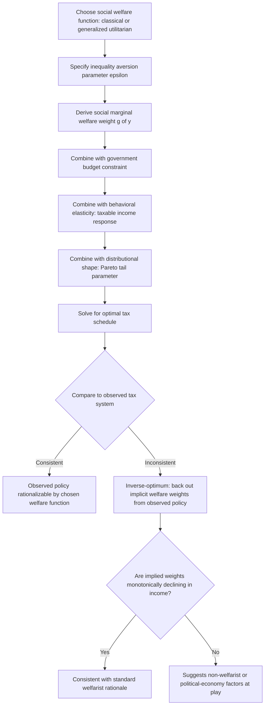

## Utilitarianism and Social Welfare Maximization

### Overview and Conceptual Framework

Utilitarianism supplies the foundational normative framework underlying the standard optimal-taxation and public-expenditure literature in public economics. It holds that social welfare should be evaluated as an aggregation of individual utilities, and that the just or optimal policy is the one that maximizes this aggregate. Nearly all of modern optimal tax theory — from Ramsey (1927) commodity taxation through Mirrlees (1971) nonlinear income taxation — is built on some form of utilitarian (or generalized-utilitarian) social welfare function, making this item foundational to the equity side of virtually every subsequent topic in the course.

### The Classical Utilitarian Social Welfare Function

The simplest and historically original formulation, associated with Jeremy Bentham and later formalized by economists, is **classical (additive) utilitarianism**:

$$SWF = \sum_{i=1}^{n} U_i(y_i)$$

where $U_i(\cdot)$ is individual $i$'s utility as a function of their income (or consumption) $y_i$, and social welfare is simply the unweighted sum of individual utilities.

**Key Points**

- Classical utilitarianism requires two strong assumptions to be operationally meaningful: **cardinal utility** (utility can be measured on a scale where differences are meaningful, not merely ordinal rankings) and **interpersonal comparability** (one individual's utility units can be meaningfully compared to and summed with another's) — both assumptions were the target of sustained critique during the "ordinalist revolution" in economics (associated with Robbins, Pareto, and others in the 1930s), which argued that utility is fundamentally a subjective, non-comparable, ordinal concept and that summing utilities across individuals is scientifically meaningless
- Despite this critique, cardinal, interpersonally comparable utilitarian welfare functions were **revived and formalized for applied policy analysis**, particularly through the work of Mirrlees, Atkinson, and others in the optimal-taxation tradition beginning in the 1970s, on the pragmatic grounds that some cardinalization is necessary to make any equity-efficiency tradeoff analytically tractable, and that the resulting policy prescriptions can be evaluated for their sensitivity to the specific cardinalization chosen (see the discussion of the inequality-aversion parameter below)
- If all individuals share an **identical, concave utility function** $U(\cdot)$ (a standard simplifying assumption in applied optimal-tax models), classical utilitarianism implies that, absent any efficiency costs to redistribution (no behavioral responses, no deadweight loss), the socially optimal allocation of a fixed total income $Y$ is **complete equalization**: $y_i = Y/n$ for all $i$ — this follows directly from the diminishing marginal utility of income under concavity, since transferring income from a richer to a poorer individual raises the poorer person's utility by more than it lowers the richer person's utility, and this remains true until incomes are fully equalized
- This "complete equalization" result is the theoretical starting point for the entire optimal-taxation literature's central tension: **real-world redistribution is not costless** because taxation distorts labor supply and other behavioral margins (as captured by the elasticity of taxable income, discussed elsewhere in this course), so the classical utilitarian prescription of full equalization is tempered in practice by the efficiency costs of achieving it — this is precisely the equity-efficiency tradeoff formalized in the Mirrlees optimal income tax model

### The Social Marginal Utility of Income and the Basis for Progressivity

**Key Points**

- The classical utilitarian framework's normative force for progressive taxation rests entirely on the assumption of **diminishing marginal utility of income** ($U'' < 0$): if an additional dollar of income generates less utility for a rich person than for a poor person, then utilitarian social welfare is increased by transfers from rich to poor, holding the total sum of income fixed
- The **social marginal utility of income** for individual $i$, denoted $g_i = U_i'(y_i)$ (or, in generalized welfarist frameworks, a welfare-weighted version of this), is the key sufficient statistic connecting individual utility to the social welfare implications of redistributive policy — in applied optimal-tax formulas (e.g., the optimal top tax rate formula), $g_i$ enters directly as the term capturing how much society values an additional dollar in the hands of individual $i$, and the entire structure of optimal marginal tax rates across the income distribution can be expressed as a function of these social marginal utility weights combined with behavioral elasticities and the shape of the income distribution
- Under classical utilitarianism, $g_i$ is fully determined by $U_i'(y_i)$ alone (with no separate distributional weighting beyond what diminishing marginal utility itself implies) — this is a specific, relatively "weak" form of redistributive preference within the broader welfarist family, since it applies no *additional* social preference for equality beyond what is already implied by individuals' own diminishing marginal utility

### Generalized (Weighted) Utilitarianism and the Atkinson Social Welfare Framework

To allow social welfare judgments that go beyond what diminishing marginal utility alone implies, the literature generalizes classical utilitarianism into a broader **welfarist** family:

$$SWF = \sum_{i=1}^n \Psi(U_i(y_i))$$

or, in the widely used **isoelastic (constant relative inequality aversion) form** directly applied to income:

$$SWF = \sum_{i=1}^n \frac{y_i^{1-\epsilon}}{1-\epsilon}, \quad \epsilon \geq 0 \; (\epsilon \neq 1)$$

where $\Psi(\cdot)$ (or the exponent $1-\epsilon$) is a concave transformation applied on top of individual utility, and $\epsilon$ is the **coefficient of relative inequality aversion**, directly parallel to the parameter of the same name in the Atkinson inequality index discussed elsewhere in this course.

**Key Points**

- **$\epsilon = 0$** recovers a form of utilitarianism with no additional inequality aversion beyond diminishing marginal utility (society is indifferent to how a fixed sum of utility, or under further simplifying assumptions, income, is distributed, so long as the sum is maximized); **as $\epsilon \to \infty$**, this generalized welfare function converges to the **Rawlsian maximin criterion**, under which social welfare is determined entirely by the position of the worst-off individual, with no weight placed on anyone else's outcome once the minimum has been identified
- This continuum directly parallels — and is mathematically closely connected to — the Atkinson inequality index's own inequality-aversion parameter, illustrating that a chosen social welfare function and a chosen inequality index are, in the isoelastic case, **two sides of the same underlying normative judgment**: the Atkinson index measures the welfare loss from a given distribution's inequality using exactly the same $\epsilon$-parameterized concavity that a generalized-utilitarian social planner would use to evaluate policy
- The choice of $\epsilon$ in applied optimal-tax modeling is a **calibrated, not derived, parameter** — different studies use different values (commonly ranging from around 1 to 3, occasionally higher) reflecting different assumed degrees of society's aversion to inequality, and reported optimal tax rate schedules are typically presented as sensitive to this choice, with **higher $\epsilon$ generally implying higher optimal marginal tax rates**, particularly at the top of the income distribution, since a higher inequality-aversion parameter places more relative weight on the marginal utility gains to lower-income individuals from redistribution
- This calibration dependency is a recurring point of methodological caution in the literature: because $\epsilon$ (or an equivalent social-welfare-weight assumption) is not empirically estimated from individual behavior but rather represents an **ethical/political judgment** external to economic data, optimal-tax results derived under any specific value of $\epsilon$ should be understood as conditional on that value, and presenting results across a range of $\epsilon$ values (or, alternatively, the "inverse-optimum" approach discussed below) is considered good applied practice

**Illustration: Social Welfare Weight as a Function of Inequality Aversion (svg_diagram)**

<svg xmlns="http://www.w3.org/2000/svg" viewBox="0 0 720 380">
<text x="360" y="25" font-size="16" font-weight="bold" text-anchor="middle" fill="#1a1a1a">Social Marginal Welfare Weight g(y) (svg_diagram)</text>
<line x1="90" y1="320" x2="650" y2="320" stroke="#333" stroke-width="2" />
<line x1="90" y1="60" x2="90" y2="320" stroke="#333" stroke-width="2" />
<text x="370" y="350" font-size="13" text-anchor="middle" fill="#333">Income (y)</text>
<text x="40" y="190" font-size="13" text-anchor="middle" fill="#333" transform="rotate(-90 40 190)">Welfare Weight g(y)</text>
<line x1="90" y1="200" x2="650" y2="200" stroke="#666" stroke-width="2" />
<text x="550" y="195" font-size="12" fill="#666">epsilon = 0: flat, no aversion</text>
<path d="M 90 100 Q 250 180 400 210 Q 550 230 650 245" fill="none" stroke="#1e88e5" stroke-width="3" />
<text x="450" y="150" font-size="12" fill="#1e88e5">epsilon = 1-2: moderate aversion</text>
<path d="M 90 65 Q 150 200 250 280 Q 400 305 650 312" fill="none" stroke="#c62828" stroke-width="3" />
<text x="150" y="90" font-size="12" fill="#c62828">epsilon large: near-Rawlsian</text>
</svg>

### Utilitarianism, Behavioral Responses, and Optimal Taxation

**Key Points**

- Utilitarian (or generalized-welfarist) social welfare functions are combined with a **government budget constraint and behavioral response functions** (labor supply elasticities, taxable income elasticities) to derive optimal tax formulas — the Mirrlees (1971) nonlinear income tax model and its many extensions solve for the tax schedule that maximizes the chosen social welfare function subject to individuals optimally responding to the tax schedule and the government needing to raise a given revenue requirement
- The resulting **optimal top marginal tax rate formula** (Saez 2001 and related work) takes the general form:

$$\tau^* = \frac{1 - g}{1 - g + a \cdot e}$$

where $g$ is the (marginal, welfare-weighted) social marginal utility of income to top earners relative to the government's value of revenue, $a$ is a parameter of the Pareto tail of the income distribution, and $e$ is the elasticity of taxable income — here, **$g$ is precisely the utilitarian welfare-weighting concept discussed above**, entering the formula as a sufficient statistic: a lower $g$ (society places less marginal welfare value on income in the hands of top earners, i.e., higher inequality aversion or sufficiently concave utility) mechanically implies a higher optimal top tax rate, holding the behavioral elasticity and distributional shape parameter fixed

- This formula illustrates the general structural role utilitarianism plays throughout applied optimal-tax theory: **the ethical/welfare-function input ($g$, or equivalently $\epsilon$) and the empirical/behavioral input ($e$, the elasticity) enter the optimal-policy formula as separable, multiplicatively interacting sufficient statistics** — a design feature of the "sufficient statistics" approach to optimal taxation that deliberately isolates the value-laden welfare judgment from the empirically estimable behavioral parameter, allowing researchers to debate or vary each independently

### Major Critiques of Utilitarianism as a Basis for Distributive Justice

**Key Points**

- **The interpersonal comparability problem**: as noted above, utilitarianism requires comparing utility across individuals, a requirement many philosophers and economists (following the ordinalist tradition) regard as either scientifically meaningless or requiring an ethical assumption that is itself unjustified by economic theory alone — applied welfare economics typically sidesteps this by adopting an explicit ethical stance (e.g., assuming identical utility functions across individuals, which sidesteps interpersonal comparison of utility *functions* while still requiring comparison of utility *levels*) rather than resolving the underlying philosophical objection
- **Utility monster / aggregation critique**: pure utilitarianism, because it only cares about the sum of utility, is vulnerable to the theoretical possibility of an individual who derives disproportionately large utility from resources (a so-called "utility monster") — a purely additive utilitarian criterion would direct society to funnel resources toward such an individual even at great cost to everyone else, a conclusion widely regarded as normatively unacceptable and often cited as a motivation for generalized (concave-transformed) rather than classical utilitarianism, or for entirely non-utilitarian frameworks (Rawlsian, capability-based) discussed in companion items in this chapter
- **Indifference to the pattern of distribution given a fixed total**: classical utilitarianism, absent diminishing marginal utility, is indifferent between any distribution of a fixed total utility sum — this is a specific instance of the broader philosophical objection (associated with Rawls and others) that utilitarianism, by focusing solely on the aggregate, fails to respect the "separateness of persons" and can in principle justify significant sacrifices by some individuals for larger aggregate gains to others, a critique that directly motivates the Rawlsian and other non-aggregative alternative frameworks covered elsewhere in this chapter
- **Empirical and ethical tractability of the inequality-aversion parameter**: because $\epsilon$ (or $g$) is a calibrated rather than estimated quantity, critics note that a wide range of policy conclusions can be generated simply by choosing different values of this parameter, raising the concern that optimal-tax results may convey a misleading impression of scientific precision when the underlying ethical input is, in fact, a value judgment external to the economic model

### The Inverse-Optimum Approach

**Key Points**

- A methodologically important response to the calibration-dependency critique is the **inverse-optimum approach** (associated with Bourguignon and Spadaro, and subsequently applied by Lockwood and Weinzierl, Hendren, and others): rather than *assuming* a value of $\epsilon$ (or a welfare-weight schedule) and solving forward for the optimal tax schedule, this approach takes the **actual, observed tax-and-transfer schedule of a country as given** and solves *backward* for the implicit social welfare weights that would rationalize that schedule as optimal, given estimated behavioral elasticities and the observed income distribution
- This method allows researchers to assess whether a country's actual tax system is consistent with **any** standard welfarist social welfare function (e.g., checking whether the inferred welfare weights are monotonically declining in income, as any reasonable utilitarian or generalized-utilitarian function would require) — several applications of this method have found that observed tax systems in some countries imply **non-monotonic** or even **negative** implicit welfare weights at some income ranges (e.g., in phase-out regions of means-tested transfer programs, where effective marginal tax rates are very high), a finding interpreted as evidence that observed policy is not fully rationalizable by a coherent utilitarian welfare function, and may instead reflect political-economy constraints, non-welfarist objectives, or simply policy inconsistency [Unverified — the specific magnitude and location of any non-monotonicity found varies substantially by country and study, and remains an active area of applied research]

### Relationship to Other Frameworks in This Chapter

**Key Points**

- Utilitarianism (particularly in its generalized, $\epsilon$-parameterized form) functions as the **baseline welfarist framework** against which the alternative distributive-justice theories covered elsewhere in this chapter — Rawlsian maximin/difference-principle theory, Nozickian entitlement/libertarian theory, and capability-based approaches (Sen, Nussbaum) — are typically contrasted, since each of those alternatives can be understood, at least in part, as a specific response to one of the critiques of utilitarianism outlined above (Rawlsian maximin directly addresses the "separateness of persons" and aggregation critique by taking $\epsilon \to \infty$; libertarian entitlement theory rejects welfarism/outcome-based evaluation entirely in favor of a procedural criterion; capability approaches reject the reduction of wellbeing to a single cardinal utility or income metric)
- The **social marginal welfare weight** concept introduced in this item is the direct analytical bridge connecting abstract distributive-justice theory to applied optimal-tax formulas throughout the rest of this course: virtually every subsequent optimal-taxation topic (linear and nonlinear income taxation, commodity taxation, capital taxation) expresses its policy prescriptions in terms of a welfare-weight function $g(y)$ that is, in each case, a direct operationalization of some underlying social welfare function of the type introduced here

### Conceptual Workflow: From Social Welfare Function to Policy Prescription

**Related Topics**

- Lorenz Curve and Gini Coefficient (this chapter)
- Alternative Inequality Indices (this chapter)
- Rawlsian Justice and the Difference Principle
- Libertarian and Entitlement-Based Theories of Distributive Justice
- Capability Approach and Non-Welfarist Evaluation (Sen, Nussbaum)
- Optimal Nonlinear Income Taxation (Mirrlees Model)
- The Elasticity of Taxable Income and Optimal Top Tax Rate Formulas
- The Inverse-Optimum Approach to Recovering Implicit Social Welfare Weights