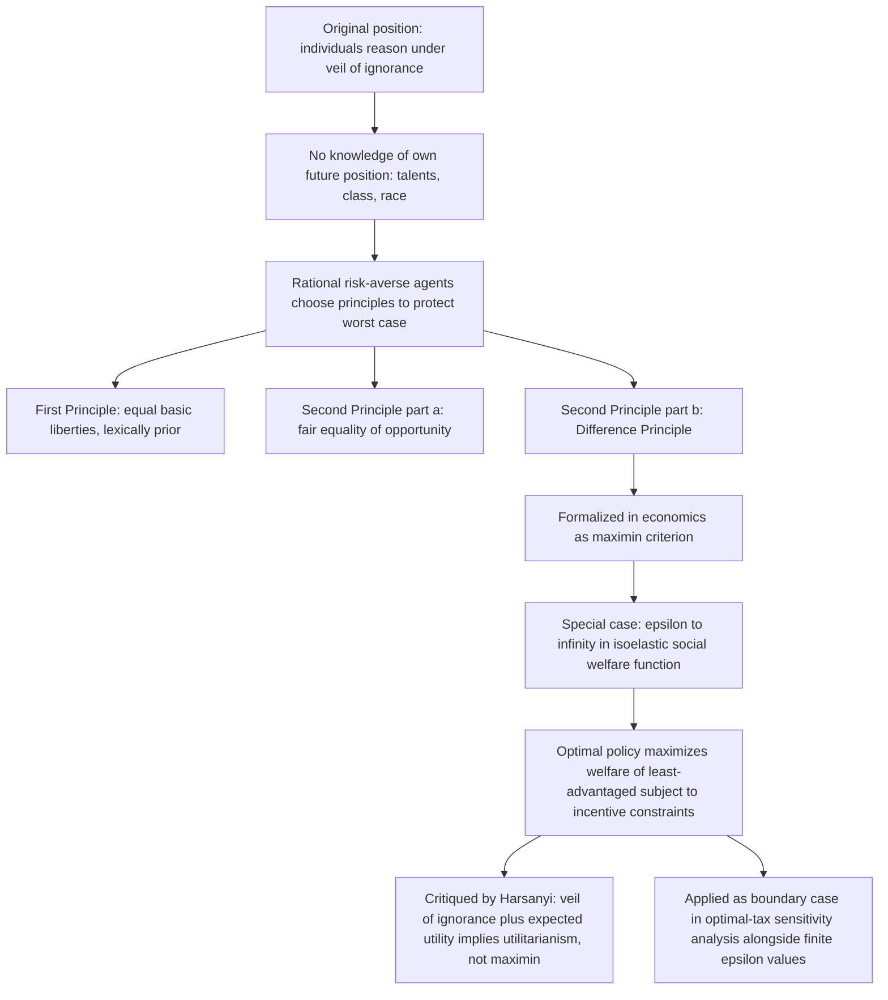

## Rawlsian Justice and the Maximin Criterion

### Overview and Conceptual Framework

Rawlsian justice, developed by philosopher John Rawls primarily in *A Theory of Justice* (1971), offers an alternative to utilitarian aggregation as a foundation for evaluating distributive arrangements. Rather than maximizing the sum (or weighted sum) of individual utilities, Rawls's framework asks what principles of justice free and rational individuals would choose to govern their society if they had to agree on those principles **without knowing their own future position** within it. This item covers the philosophical apparatus (the original position, the veil of ignorance, the two principles of justice) and its formalization in economics as the **maximin criterion**, which has become a standard benchmark — the limiting case of extreme inequality aversion — within the same generalized-welfarist framework covered under utilitarianism in this chapter.

### The Original Position and the Veil of Ignorance

**Key Points**

- Rawls's central thought experiment asks what principles of justice would be chosen by rational, self-interested individuals in a hypothetical **"original position"** — a state of deliberation prior to the establishment of any actual social arrangement, in which each individual reasons behind a **"veil of ignorance"**: they know general facts about society, economics, and human psychology, but do not know their own eventual place in the social order — not their class position, natural talents, race, gender, or even their own conception of the good life
- The veil of ignorance is designed to produce principles of justice that are **impartial by construction**, because no one can tailor the principles to favor their own particular (but as-yet-unknown) circumstances — this is Rawls's central methodological innovation, distinguishing his approach from both utilitarian aggregation (which requires interpersonal utility comparison and permits trade-offs between persons) and from purely procedural or libertarian theories (which do not evaluate outcomes at all)
- Rawls argues that individuals reasoning behind the veil, facing genuine uncertainty about their future position and unwilling to risk ending up in the worst-off position, would rationally adopt a **highly risk-averse decision rule** for evaluating alternative social arrangements — this rationale is the philosophical justification for the maximin criterion described below, though the claim that rational agents behind the veil would necessarily choose maximin (rather than, for example, maximizing expected utility under some assumed probability distribution over outcomes) has itself been extensively debated in the philosophical and economic literature

### The Two Principles of Justice

Rawls derives two lexically ordered principles that he argues would be chosen in the original position:

**Key Points**

- **The First Principle (Equal Basic Liberties)**: each person has an equal right to the most extensive scheme of basic liberties (political liberty, freedom of speech and conscience, freedom of the person, the right to hold property) compatible with a similar scheme of liberties for all — this principle takes **strict lexical priority** over the second principle, meaning basic liberties cannot be traded off against economic or social gains, no matter how large
- **The Second Principle**, itself divided into two parts:
  - **(a) Fair Equality of Opportunity**: offices and positions must be open to all under conditions of fair equality of opportunity — not merely formal (legal) equality of opportunity, but genuine equality, meaning individuals with similar talents and willingness to use them should have similar prospects of success regardless of their initial social class
  - **(b) The Difference Principle**: social and economic inequalities are to be arranged so that they are to the greatest benefit of the least-advantaged members of society
- The **lexical ordering** among these principles is a distinctive and consequential feature of Rawls's framework: the first principle (liberty) must be fully satisfied before the second principle applies, and within the second principle, fair equality of opportunity takes priority over the difference principle — this ordering reflects Rawls's view that certain liberties are so fundamental that no amount of economic gain (even gain that would benefit the worst-off) can justify their restriction, a structural feature that sharply distinguishes Rawlsian justice from a pure utilitarian or purely economic-maximin framework, which in their standard economic formalizations do not typically incorporate a comparable lexical priority for non-economic liberties

### The Difference Principle and the Maximin Criterion

The **difference principle** is the component of Rawlsian theory most directly formalized and applied within economics, typically operationalized as the **maximin criterion**: social states are ranked according to the welfare of the **worst-off** (least-advantaged) member of society, and the just arrangement is the one that maximizes this minimum level.

$$SWF_{Rawls} = \min_i \{ U_i \}$$

or, in an income-based formulation commonly used in applied public economics:

$$SWF_{Rawls} = \min_i \{ y_i \}$$

**Key Points**

- The maximin criterion is the **limiting case ($\epsilon \to \infty$) of the generalized (isoelastic) utilitarian social welfare function** introduced under "Utilitarianism and Social Welfare Maximization" in this chapter — as the inequality-aversion parameter grows without bound, all social welfare weight collapses onto the worst-off individual, and improvements to anyone else's position have zero effect on measured social welfare unless they also raise the position of the least-advantaged
- This connection means that, **within the applied optimal-taxation literature**, Rawlsian justice is frequently operationalized not as a wholly distinct framework but as a specific, extreme parameter value within the same welfarist sufficient-statistics apparatus used for utilitarian analysis — the optimal top tax rate formula $\tau^* = (1-g)/(1-g+a\cdot e)$ discussed under utilitarianism, for example, converges toward its revenue-maximizing (Laffer-curve-peak) rate as $g \to 0$ for top earners, which is precisely the outcome a Rawlsian social planner would choose for the top of the distribution: since the planner places zero direct weight on top-earner welfare (all weight is on the worst-off), the only reason to avoid taxing top earners at the revenue-maximizing rate is if doing so would, through some general-equilibrium or behavioral channel, reduce resources available for the worst-off
- Under the maximin criterion, the government's redistributive problem reduces to choosing the tax-and-transfer schedule that **maximizes the income (or consumption) of the least-advantaged individual**, subject to the economy's aggregate resource and incentive constraints — because the least-advantaged individual's income is generally funded through taxation of others, and taxation induces behavioral (labor supply) responses, the Rawlsian-optimal tax system does **not** imply unlimited or maximal taxation of higher earners: it implies taxing up to the point that **further taxation would reduce total revenue available for redistribution to the worst-off** (i.e., up to the peak of the "Laffer curve" specifically for the purpose of maximizing transfers to the bottom), a subtlety often misunderstood in informal characterizations of Rawlsian policy as advocating unlimited redistribution
- **Who counts as "the worst-off"** requires operational specification in applied use: Rawls's own theory defines the least-advantaged in terms of an index of **"primary goods"** (rights, liberties, opportunities, income, wealth, and the social bases of self-respect) rather than a narrower economic metric, but applied economic formalizations typically simplify this to a single-dimensional measure — most commonly pre-tax or post-tax income/consumption of the bottom of the distribution — a simplification that captures the formal maximin logic but sacrifices some of the richness of Rawls's original multidimensional "primary goods" concept

**Illustration: Maximin as the Limit of Inequality Aversion (svg_diagram)**

<svg xmlns="http://www.w3.org/2000/svg" viewBox="0 0 720 380">
<text x="360" y="25" font-size="16" font-weight="bold" text-anchor="middle" fill="#1a1a1a">Social Indifference Curves: Utilitarian to Rawlsian (svg_diagram)</text>
<line x1="90" y1="320" x2="650" y2="320" stroke="#333" stroke-width="2" />
<line x1="90" y1="320" x2="90" y2="60" stroke="#333" stroke-width="2" />
<text x="370" y="350" font-size="13" text-anchor="middle" fill="#333">Utility of Individual A</text>
<text x="45" y="190" font-size="13" text-anchor="middle" fill="#333" transform="rotate(-90 45 190)">Utility of Individual B</text>
<line x1="130" y1="280" x2="610" y2="100" stroke="#1e88e5" stroke-width="3" />
<text x="500" y="130" font-size="12" fill="#1e88e5">epsilon = 0: linear (classical utilitarian)</text>
<path d="M 150 290 Q 250 200 350 170 Q 450 150 590 110" fill="none" stroke="#43a047" stroke-width="3" />
<text x="400" y="200" font-size="12" fill="#43a047">moderate epsilon: convex</text>
<path d="M 200 300 L 200 130 L 600 130" fill="none" stroke="#c62828" stroke-width="3" />
<text x="230" y="120" font-size="12" fill="#c62828">epsilon to infinity: right-angle (Rawlsian maximin)</text>
</svg>

### Major Critiques and Debates

**Key Points**

- **Extreme risk aversion / decision-theoretic critique**: economists including Harsanyi (whose own veil-of-ignorance-style argument, notably, derives *utilitarianism* rather than maximin from behind a veil of ignorance under expected-utility maximization with equal probability of occupying any position) have argued that maximin represents an implausibly extreme degree of risk aversion — a rational individual behind the veil of ignorance, reasoning under expected-utility maximization with some (even unknown but non-degenerate) probability distribution over possible positions, would generally not choose to maximize the minimum outcome alone but would instead weigh the minimum against the full distribution of possible outcomes, arriving at something closer to a utilitarian or intermediate criterion — this **Rawls-versus-Harsanyi debate** over what rational agents would choose behind a veil of ignorance is one of the most cited exchanges in the economics-and-philosophy literature on distributive justice
- **Insensitivity to gains above the minimum**: because the strict maximin criterion places zero social welfare weight on anyone other than the least-advantaged, it is indifferent between two social states that differ enormously in the welfare of everyone above the minimum, so long as the minimum itself is unchanged — critics regard this indifference to large welfare gains for the majority (when the position of the worst-off is unaffected) as counterintuitive and difficult to reconcile with ordinary moral judgment, a mirror-image critique to the "utility monster" objection leveled against classical utilitarianism
- **Practical versus lexical maximin**: some economic applications use a "leximin" (lexical maximin) refinement, which, after maximizing the position of the worst-off, applies the same criterion recursively to the second-worst-off, and so on — this addresses the strict maximin's indifference to distribution among all non-minimum individuals, but adds computational and conceptual complexity, and is used more often in theoretical welfare economics than in applied optimal-tax calibration
- **The "primary goods" metric versus a purely economic (income) metric**: applying maximin strictly to income or consumption, as most economic formalizations do, arguably deviates from Rawls's own broader "primary goods" framework, which was explicitly designed to avoid reliance on a single cardinal utility or resource metric — this tension is part of a broader family of critiques (shared with the capability-approach literature covered elsewhere in this chapter) arguing that income-based operationalizations of Rawlsian justice understate the multidimensional nature of advantage and disadvantage that Rawls's original theory intended to capture
- **Incentive and dynamic critiques**: because the difference principle permits inequality only insofar as it benefits the least-advantaged, critics have raised the concern that under some empirical conditions (e.g., if incentive-driven inequality is a necessary condition for economic growth that eventually benefits everyone, including the worst-off, but only with a substantial lag), a strict period-by-period application of the difference principle could produce different prescriptions than a dynamic, growth-inclusive application — Rawls's own theory is primarily concerned with the basic structure of a stable society over time rather than a single-period allocation problem, and applied economic maximin models vary in whether and how they incorporate this dynamic dimension [Unverified — the practical resolution of static versus dynamic applications of the difference principle is not settled and depends on modeling choices specific to each application]

### Relationship to Other Frameworks in This Chapter

**Key Points**

- Rawlsian maximin and classical/generalized utilitarianism (covered in the preceding item) are best understood as occupying **two ends of a single formal continuum** within the welfarist, isoelastic social-welfare-function family — this is a distinctively economic way of relating the two theories that somewhat flattens Rawls's own philosophical framework (which includes the lexically prior liberty principle and the "primary goods" metric, both largely absent from the narrow economic maximin formalization), but it is the standard bridge used in applied public economics to connect philosophical distributive-justice theory to the optimal-taxation "sufficient statistics" apparatus
- Compared to **libertarian/entitlement theories** (covered elsewhere in this chapter), Rawlsian justice shares the feature of taking rights and liberties seriously (via the lexically prior first principle) but diverges sharply on economic outcomes: libertarian theory typically evaluates the *justice of a distribution* by reference to the *process* that generated it (voluntary exchange, absence of force or fraud) rather than by reference to the *pattern* of the resulting distribution itself, whereas Rawlsian justice (like utilitarianism) is fundamentally a **patterned, outcome-based** theory that evaluates distributions by their resulting welfare pattern regardless of the process that produced them — this process-versus-pattern distinction is a central organizing axis for comparing the distributive-justice theories covered across this chapter
- Compared to the **capability approach** (Sen, Nussbaum, covered elsewhere in this chapter), Rawlsian theory is often treated as an intellectual precursor: Sen's capability approach was explicitly developed partly in response to perceived limitations of Rawls's "primary goods" metric, arguing that primary goods (a fixed bundle of resources) fail to account for interpersonal variation in the ability to convert resources into genuine wellbeing or freedom (e.g., a disabled person may need more resources to achieve the same functioning as a non-disabled person) — this critique parallels, but is philosophically distinct from, the economic critique that income-based operationalizations of maximin understate multidimensional disadvantage

### Applied Use in Optimal Tax and Transfer Design

**Key Points**

- In practice, applied optimal-tax studies rarely use pure ($\epsilon \to \infty$) maximin as their primary calibration, since it generates policy prescriptions (e.g., taxing all income above the revenue-maximizing point for the bottom irrespective of effects on anyone else) that most researchers regard as an extreme benchmark rather than a realistic social preference — instead, maximin is typically reported as **one boundary case in a sensitivity analysis**, alongside a range of finite $\epsilon$ values, to illustrate how optimal policy prescriptions shift as the assumed degree of inequality aversion increases toward this limit
- The **inverse-optimum approach** discussed under utilitarianism in this chapter can equally be applied to test whether an observed tax system's implicit welfare weights are consistent with an (even approximately) Rawlsian orientation — studies applying this method sometimes find that the *very bottom* of the income distribution receives implicit welfare weights consistent with strong (near-Rawlsian) priority, while middle and upper-middle portions of observed schedules deviate from what a coherent single-parameter welfarist function (utilitarian or Rawlsian) would predict, again illustrating the value of the inverse-optimum method as a diagnostic for the internal consistency of real-world redistributive policy
- The difference principle's requirement that inequality be justified **only insofar as it benefits the least-advantaged** provides a distinct normative test for evaluating specific tax provisions (e.g., preferential capital-gains rates, R&D tax credits) that is narrower than a general efficiency justification: a Rawlsian standard would require demonstrating not merely that such a provision improves aggregate efficiency, but that its efficiency gains are channeled — through growth, wage effects, or fiscal capacity — to improve outcomes specifically for the worst-off, a considerably more demanding empirical and normative bar than a standard cost-benefit or aggregate-welfare justification

### Conceptual Summary Diagram

**Related Topics**

- Utilitarianism and Social Welfare Maximization (this chapter)
- Libertarian and Entitlement-Based Theories of Distributive Justice
- Capability Approach and Non-Welfarist Evaluation (Sen, Nussbaum)
- Optimal Nonlinear Income Taxation (Mirrlees Model)
- The Harsanyi-Rawls Debate: Expected Utility versus Maximin Behind the Veil of Ignorance
- The Inverse-Optimum Approach to Recovering Implicit Social Welfare Weights
- Fair Equality of Opportunity and Its Relationship to Intergenerational Mobility
- Primary Goods versus Capabilities as Metrics of Advantage