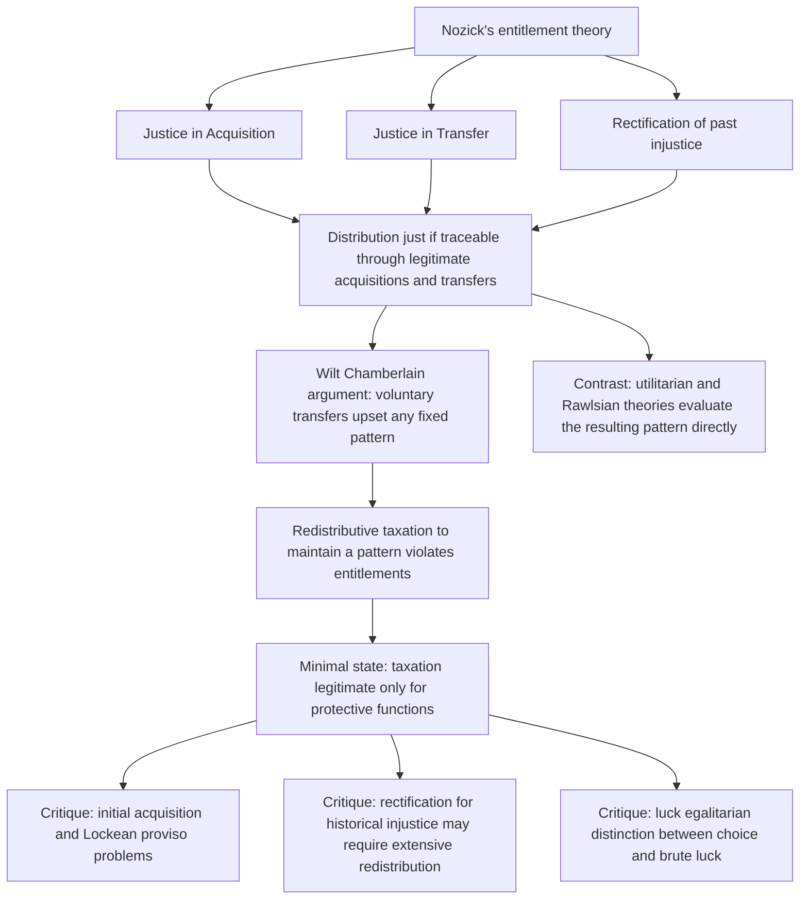

## Libertarian Perspectives on Redistribution

### Overview and Conceptual Framework

Libertarian theories of distributive justice reject the fundamental premise shared by both utilitarianism and Rawlsian justice — that a distribution's justice should be evaluated by reference to its **outcome pattern** (who ends up with how much). Instead, libertarian theory evaluates the justice of a distribution by reference to the **process** that produced it: a distribution is just if it arose through legitimate means (voluntary exchange, labor, gift, inheritance) from a just starting position, regardless of how unequal the resulting pattern is. This item covers the philosophical foundations of this view (principally Robert Nozick's entitlement theory), its implications for taxation and redistribution, and the major critiques leveled against it — completing the chapter's central organizing contrast between patterned (utilitarian, Rawlsian) and unpatterned/historical (libertarian) theories of justice.

### Nozick's Entitlement Theory

The canonical formulation is Robert Nozick's **entitlement theory**, developed in *Anarchy, State, and Utopia* (1974) as a direct response to Rawls. Nozick argues that a distribution is just if and only if it satisfies three principles governing the **history** by which holdings came to be held, rather than any property of the resulting pattern itself:

**Key Points**

- **The Principle of Justice in Acquisition**: governs how previously unowned resources may be legitimately appropriated as private property — Nozick draws on a modified Lockean framework, including a version of the **Lockean proviso** (acquisition is legitimate provided it does not worsen the position of others who no longer have access to the resource), though Nozick's specific formulation and application of the proviso has been extensively debated
- **The Principle of Justice in Transfer**: governs how holdings may be legitimately transferred from one person to another — voluntary exchange, gift, and bequest are legitimate means of transfer; force, fraud, and theft are not
- **The Principle of Rectification**: governs how to correct violations of the first two principles (addressing historical injustices such as theft, fraud, or coercive acquisition), a principle Nozick acknowledges is the least fully developed part of his theory and raises significant practical difficulty when applied to real-world histories involving conquest, slavery, and other historical injustices whose effects persist but whose precise rectification is empirically and normatively contested
- A distribution is just, under this framework, **if and only if every holding within it can be traced back through a chain of legitimate acquisitions and transfers** — critically, this means **justice is entirely a property of the historical process, not of the resulting pattern**: any distribution, however unequal, is just provided it arose through this legitimate historical chain, and conversely any distribution, however equal, is unjust if it was imposed through illegitimate means (e.g., forced redistribution)

### The Wilt Chamberlain Argument

Nozick's most influential argument against **"patterned" theories of distributive justice** (which includes both utilitarianism and Rawlsian justice, despite their considerable differences from each other) is the **Wilt Chamberlain thought experiment**:

**Key Points**

- Nozick asks the reader to imagine that some initial distribution $D_1$ is achieved, satisfying whatever patterned principle of justice one favors (e.g., a Rawlsian-just or perfectly equal distribution). A famous basketball player, Wilt Chamberlain, then signs a contract under which each spectator voluntarily pays 25 cents specifically to watch him play, over and above the price of admission. A million spectators do so, and Chamberlain ends up with a large sum of money, producing a new distribution $D_2$ that is significantly more unequal than $D_1$
- Nozick's argument is that **$D_2$ is just**, because it arose entirely from a sequence of voluntary transfers from $D_1$ (each spectator voluntarily transferred 25 cents they were entitled to), and no one has grounds to complain, since each individual transfer was itself just and consensual — therefore, Nozick concludes, **"liberty upsets patterns"**: any attempt to maintain a specific patterned distribution over time (rather than merely at a single moment) requires continuous interference with individuals' free choices about what to do with resources they are already entitled to, since free individuals will, through ordinary voluntary activity, continually generate new and different distributions
- The argument's central implication for taxation is direct: **any taxation aimed at maintaining or restoring a specific patterned distribution (redistributive taxation in the ordinary sense) constitutes an ongoing interference with legitimate, voluntary transfers between individuals who are entitled to their holdings** — this is the philosophical basis for Nozick's famous characterization of taxation of earnings from labor as **"on a par with forced labor"**, since (in his view) it appropriates the fruits of a person's labor-time without their consent, in the same category as compelling a certain number of hours of labor directly
- Critics have raised several objections to the Wilt Chamberlain argument specifically: that it assumes away background conditions (e.g., whether the initial distribution $D_1$'s legitimacy, and the legitimacy of the broader system of property rights and contract enforcement within which the transfers occur, can themselves be taken for granted); that it does not address cases where the aggregation of many individually voluntary transactions produces morally significant *emergent* effects (e.g., market power, systemic risk, or externalities) not visible in any single transaction; and that real-world initial distributions rarely satisfy the assumption of a prior just baseline the argument requires, given that most historical property distributions involve some degree of the very acquisitive or transfer injustices the rectification principle is meant to address

### Historical (Process-Based) versus End-State (Pattern-Based) Theories of Justice

**Key Points**

- Nozick's broader taxonomic contribution is to classify theories of distributive justice into two categories: **end-result (or end-state) principles**, which evaluate a distribution solely by some structural feature of the resulting pattern (e.g., "the distribution should be equal," "the distribution should maximize the position of the worst-off," "the distribution should maximize aggregate utility"), and **historical principles**, which evaluate a distribution by reference to how it came about
- Within historical principles, Nozick further distinguishes **patterned historical principles** (e.g., "distribute according to moral desert" or "distribute according to contribution," which still require checking the resulting distribution against some pattern, just one that also references history) from his own **unpatterned historical (entitlement) principle**, which requires no reference to any pattern whatsoever — only to the legitimacy of the process
- This taxonomy directly frames the chapter's broader comparison: **utilitarianism and Rawlsian justice, despite their sharp disagreement over aggregation versus the worst-off, are both end-result/patterned theories** in Nozick's classification, since both evaluate distributions by a structural feature of the outcome (the sum of utility, or the position of the minimum) — the entitlement theory's fundamental challenge to both is not a disagreement about *which* pattern is best, but a rejection of pattern-based evaluation as the correct framework for distributive justice altogether

**Illustration: Process-Based versus Pattern-Based Evaluation (svg_diagram)**

<svg xmlns="http://www.w3.org/2000/svg" viewBox="0 0 720 360">
<text x="360" y="25" font-size="16" font-weight="bold" text-anchor="middle" fill="#1a1a1a">Two Routes to Evaluating a Distribution (svg_diagram)</text>
<rect x="60" y="60" width="260" height="90" rx="8" fill="#e3f2fd" stroke="#1e88e5" stroke-width="2" />
<text x="190" y="90" font-size="13" text-anchor="middle" fill="#1e88e5" font-weight="bold">Pattern-Based (End-State)</text>
<text x="190" y="115" font-size="12" text-anchor="middle" fill="#333">Utilitarianism, Rawlsian maximin</text>
<text x="190" y="135" font-size="12" text-anchor="middle" fill="#333">Judge the resulting distribution directly</text>
<rect x="400" y="60" width="260" height="90" rx="8" fill="#fce4ec" stroke="#c62828" stroke-width="2" />
<text x="530" y="90" font-size="13" text-anchor="middle" fill="#c62828" font-weight="bold">Process-Based (Historical)</text>
<text x="530" y="115" font-size="12" text-anchor="middle" fill="#333">Nozick's entitlement theory</text>
<text x="530" y="135" font-size="12" text-anchor="middle" fill="#333">Judge the process that produced it</text>
<line x1="190" y1="150" x2="190" y2="220" stroke="#1e88e5" stroke-width="2" />
<text x="190" y="240" font-size="12" text-anchor="middle" fill="#333">Redistribution to restore</text>
<text x="190" y="255" font-size="12" text-anchor="middle" fill="#333">a favored pattern is justified</text>
<line x1="530" y1="150" x2="530" y2="220" stroke="#c62828" stroke-width="2" />
<text x="530" y="240" font-size="12" text-anchor="middle" fill="#333">Redistribution justified only to</text>
<text x="530" y="255" font-size="12" text-anchor="middle" fill="#333">rectify illegitimate acquisition/transfer</text>

<text x="360" y="310" font-size="12" text-anchor="middle" fill="#666" font-style="italic">"Liberty upsets patterns" — Nozick's central challenge to patterned theories</text>

</svg>

### The Minimal State and the Scope of Legitimate Government

**Key Points**

- Nozick's entitlement theory leads him to argue for the **"minimal state"** (or "night-watchman state"): a government limited to the narrow functions of protecting individuals against force, theft, and fraud, and enforcing contracts — any state that goes beyond these minimal functions to engage in redistributive taxation, Nozick argues, necessarily **violates the rights of those from whom resources are taken**, regardless of the redistributive purpose
- Nozick's argument for the minimal state's legitimacy proceeds through an "invisible hand" account of the state's emergence from a state of nature via voluntary protective associations, intended to establish that a minimal state can arise without violating anyone's rights in the process — this account is a distinctive part of Nozick's overall project (establishing that *some* state, but no more than a minimal one, can be justified) and is separate from, though foundational to, his entitlement theory's implications for taxation
- Other libertarian traditions **beyond Nozick's specific framework** — including classical liberal economists such as Hayek and Friedman, and the broader Austrian and public-choice traditions — offer related but analytically distinct arguments against extensive redistribution, often grounded less in strict rights-based entitlement theory and more in **epistemic and incentive-based critiques**: Hayek's emphasis on the dispersed, tacit nature of economic knowledge and the informational limits facing any central authority attempting to engineer a "just" distribution; and public-choice-tradition concerns about the incentive and rent-seeking distortions introduced by discretionary redistributive authority — these arguments provide independent, non-entitlement-based support for limited-government conclusions that often converge with Nozick's rights-based conclusions but rest on different (more consequentialist, less strictly deontological) foundations

### Implications for Tax Policy

**Key Points**

- Within a strict Nozickian framework, **taxation is legitimate only to fund the minimal state's protective functions** (courts, police, national defense, contract enforcement) — taxation for purposes of redistribution, social insurance, or public goods beyond this minimal scope is regarded as a rights violation regardless of its scale or its beneficiaries' need, a position considerably more restrictive than even the most efficiency-focused mainstream public economics frameworks, which typically accept a broader role for the state in correcting market failures (externalities, public goods, information asymmetries) as well as some redistributive role
- This creates a sharp methodological contrast with the welfarist optimal-tax framework covered under utilitarianism and Rawlsian justice in this chapter: those frameworks treat the **level and structure of taxation as an optimization problem** (balancing equity gains against efficiency costs, parameterized by an inequality-aversion parameter), whereas the strict entitlement-theory framework treats most taxation as **categorically illegitimate** regardless of its efficiency properties — the entitlement theory does not offer a "more versus less" optimization margin in the way welfarist theories do; the legitimate scope of taxation is instead a binary question of whether a given tax purpose falls within the minimal state's protective function
- In practice, most contemporary economic and political engagement with libertarian ideas operates with a **less absolute version** of the entitlement-theory conclusion — accepting some role for taxation beyond the strict minimal state (e.g., for genuine public goods with well-defined non-rivalrous, non-excludable characteristics, or for a limited social safety net justified on grounds distinct from patterned redistribution, such as social-insurance or public-health rationales) while retaining a strong presumption against redistributive taxation aimed at achieving a specific patterned outcome — this "classical liberal" or "minimal-state-plus" position is analytically distinct from, though influenced by, Nozick's strict entitlement theory, and is the more common form in which libertarian-influenced tax-policy arguments appear in applied public economics and policy debate
- The entitlement theory's rejection of patterned redistribution also implies a distinctive stance on **inheritance and estate taxation**: since bequest is treated as a legitimate transfer under the second principle (justice in transfer), taxing inheritance is, from a strict entitlement-theory perspective, no more justified than taxing any other voluntary transfer — this stands in direct contrast to the mobility and multigenerational-persistence literature covered elsewhere in this chapter, which offers an efficiency-and-equity rationale for estate taxation precisely because it interrupts persistent, pattern-reinforcing intergenerational transmission of advantage, illustrating a clean point of direct theoretical conflict between the entitlement-theory and welfarist/mobility-based perspectives

### Major Critiques of Libertarian Entitlement Theory

**Key Points**

- **The self-ownership and initial-acquisition problem**: Nozick's framework depends heavily on the legitimacy of *original* acquisition of previously unowned resources, but critics (including G.A. Cohen, one of the most systematic critics of Nozick from a broadly egalitarian perspective) have argued that the Lockean proviso governing legitimate acquisition is either too weak (permitting acquisitions that substantially worsen the position of the propertyless) or, if strengthened to adequately protect non-appropriators, undermines the possibility of any private property at all — this is widely regarded as one of the most serious internal difficulties in Nozick's own framework
- **The rectification problem in practice**: because Nozick's own theory requires that a distribution's justice be traced through a *historically accurate* chain of legitimate acquisitions and transfers, and because virtually all actual, real-world property holdings can be traced back through some historical chain involving conquest, slavery, colonial expropriation, or other clear violations of the acquisition and transfer principles, a fully consistent application of entitlement theory would seem to require **extensive rectificatory redistribution** to correct these historical injustices — a conclusion in evident tension with the strongly anti-redistributive political implications typically drawn from the theory, and one Nozick's own (admittedly underdeveloped) principle of rectification does not resolve with any precision
- **The "circumstances of justice" and cooperative-surplus critique**: critics associated with more communitarian or cooperative-surplus-based theories of property (including some strands of the public-goods and market-failure literature within economics itself) argue that market outcomes are never purely the product of isolated individual transactions but instead depend pervasively on collectively provided infrastructure, legal enforcement, public goods, and social cooperation — under this view, the surplus generated by a functioning market economy is not cleanly separable into individual desert-based entitlements in the way the entitlement theory assumes, undermining the sharp individual-transfer framing central to the Wilt Chamberlain argument
- **Luck egalitarian critique**: a distinct family of critiques (associated with philosophers such as Dworkin and, again, Cohen) accepts the libertarian emphasis on individual responsibility for *choices* but argues that entitlement theory fails to distinguish between inequalities arising from **differential effort/choice** (which luck egalitarians agree need not be corrected) and inequalities arising from **differential brute luck** (natural talent, family circumstances of birth, unpredictable misfortune), which luck egalitarians argue *should* be corrected even within a broadly choice-respecting framework — this line of critique has been influential in shaping a middle-ground position within political philosophy that shares libertarianism's respect for individual responsibility while rejecting its wholesale rejection of redistribution

### Relationship to Other Frameworks in This Chapter

**Key Points**

- Libertarian entitlement theory occupies a genuinely distinct methodological position relative to utilitarianism and Rawlsian justice (both covered elsewhere in this chapter): rather than offering a *different value* for the same type of welfarist optimization problem (as the utilitarian-to-Rawlsian continuum does via the inequality-aversion parameter $\epsilon$), it rejects the welfarist/patterned framework itself, meaning it cannot be represented as a point on the same isoelastic social-welfare-function continuum used to unify utilitarianism and maximin
- This makes libertarian theory the natural point of comparison for illustrating the **limits of the sufficient-statistics optimal-tax approach** that dominates the rest of this course: that approach presupposes a welfarist evaluation of outcomes and asks only how much redistribution is efficient given some assumed social welfare function — a strict entitlement theorist would reject the entire premise that redistributive taxation is a legitimate policy lever to be optimized in the first place, illustrating that the choice of underlying distributive-justice framework is not merely a parameter choice within a single model but can constitute a fundamentally different framing of what the tax policy problem even is
- Compared to the **capability approach** (covered elsewhere in this chapter), libertarian theory shares an emphasis on individual liberty and self-determination, but diverges sharply on whether unequal *capability* to convert resources into genuine functioning and freedom (a concern central to the capability approach) constitutes a legitimate basis for redistributive intervention — the entitlement theory's exclusive focus on the legitimacy of the acquisition/transfer process, independent of resulting capability or welfare outcomes, places it at the opposite methodological pole from the explicitly outcome-and-freedom-focused capability approach

### Conceptual Summary Diagram

**Related Topics**

- Utilitarianism and Social Welfare Maximization (this chapter)
- Rawlsian Justice and the Maximin Criterion (this chapter)
- Capability Approach and Non-Welfarist Evaluation (Sen, Nussbaum)
- Estate and Inheritance Taxation
- Intergenerational Mobility (Income Distribution and Inequality Measurement chapter)
- Public Choice Theory and the Political Economy of Redistribution
- Market Failure, Public Goods, and the Economic Rationale for State Intervention
- Luck Egalitarianism and the Choice-versus-Circumstance Distinction