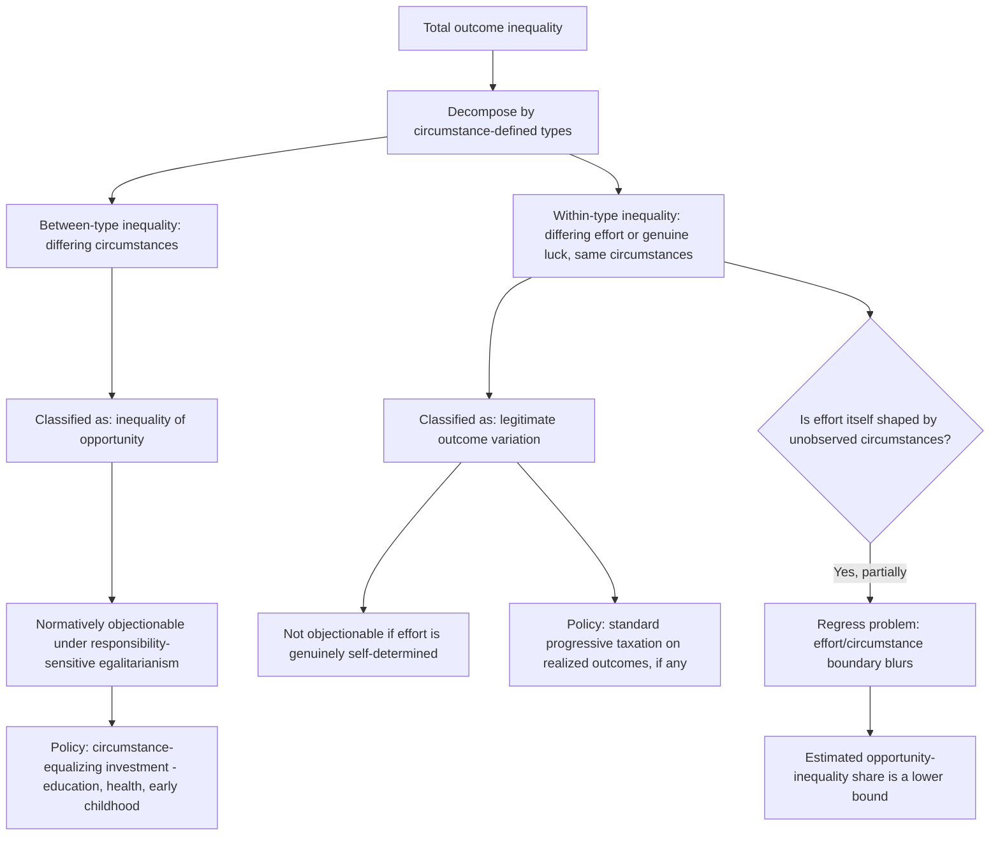

## Equality of Opportunity versus Equality of Outcome

### Overview and Conceptual Framework

The distinction between equality of opportunity and equality of outcome organizes a major normative fault line running through the distributive-justice theories covered elsewhere in this chapter. Rather than constituting a wholly separate theory alongside utilitarianism, Rawlsian justice, and libertarianism, this distinction functions as an **evaluative dimension** cutting across those theories: each offers, implicitly or explicitly, a position on whether justice requires equalizing the *results* individuals end up with, or only the *starting conditions and processes* from which individuals pursue their own results. This item formalizes the distinction, surveys its economic operationalization (particularly through the responsibility-sensitive egalitarianism literature), and connects it to the applied measurement and policy material covered elsewhere in the course.

### Defining the Two Concepts

**Key Points**

- **Equality of outcome** holds that justice requires equalizing (or at least reducing disparities in) the actual results individuals achieve — income, wealth, welfare, or some other final measure of wellbeing — largely irrespective of how those differences arose. In its purest form, this is the position implicit in classical utilitarianism's complete-equalization result (absent behavioral costs, discussed under "Utilitarianism and Social Welfare Maximization" in this chapter) and, to a lesser degree, in the Rawlsian difference principle, which tolerates outcome inequality only when it benefits the least-advantaged
- **Equality of opportunity** holds that justice requires only that individuals face **equal starting conditions and equal access to the means of achieving their goals** (education, legal rights, freedom from discrimination), after which resulting outcome differences — reflecting differences in effort, choice, or luck realized after a fair start — are not, by themselves, unjust. This is the more common normative default embedded in **formal** equality-of-opportunity provisions (anti-discrimination law, universal public education, open competition for positions) found across most political traditions, including many that otherwise reject strong outcome-equalizing redistribution
- **Formal versus substantive (fair) equality of opportunity**: a crucial distinction within the opportunity concept itself. **Formal equality of opportunity** requires only the absence of explicit legal or institutional barriers (e.g., positions are open to all applicants regardless of race or class, with no *de jure* discrimination). **Substantive** or **"fair" equality of opportunity** — the standard explicitly adopted by Rawls as the second principle's part (a), discussed under "Rawlsian Justice and the Maximin Criterion" in this chapter — requires further that individuals with similar native talent and willingness to exert effort have genuinely similar *prospects* of success, regardless of the social class into which they were born, which in practice requires substantial public investment (education, health, early-childhood support) to offset the disadvantages accruing to children born into less advantaged circumstances

### The Economic Formalization: Responsibility-Sensitive Egalitarianism

The most influential economic operationalization of the opportunity/outcome distinction is the **responsibility-sensitive egalitarian** framework, developed principally by **John Roemer** and related work by Marc Fleurbaey, building on philosophical foundations from Ronald Dworkin's distinction between "option luck" and "brute luck."

**Key Points**

- The framework partitions the determinants of an individual's outcome into two categories: **circumstances** ($C$) — factors outside an individual's control, such as parental education, family income, race, gender, birthplace, or innate ability — and **effort** ($E$) — factors within the individual's control, encompassing choices, work intensity, and other volitional decisions
- Outcome $y = f(C, E)$ is then decomposed so that **inequality attributable to differences in circumstances ($C$) is classified as "inequality of opportunity"** and is considered normatively objectionable (a target for redistributive correction), while **inequality attributable to differences in effort ($E$), among individuals facing the same circumstances**, is considered a legitimate/acceptable source of outcome inequality — this is the formal sense in which the framework is "responsibility-sensitive": individuals are held responsible for the outcome consequences of their own effort choices, but not for the outcome consequences of their circumstances
- **Dworkin's brute luck versus option luck distinction** provides the underlying philosophical rationale: **option luck** is the result of a deliberate, uncertain gamble an individual voluntarily chooses to take (e.g., an investment that turns out well or poorly) — differential outcomes from option luck are treated as within an individual's responsibility, since they result from a freely chosen risk; **brute luck** is luck that is not the result of a deliberate choice (e.g., being born with a particular level of innate talent, into a particular family, or with a particular genetic predisposition to illness) — differential outcomes from brute luck are treated as illegitimate sources of inequality warranting correction, since the individual bears no responsibility for them
- This framework directly generalizes the intergenerational-mobility literature covered elsewhere in this course: **rank-rank persistence in intergenerational mobility can be interpreted, in this framework, as an empirical measure of the share of outcome variation attributable to circumstances (parental background) rather than to the child's own effort**, providing a normative interpretation layered on top of the purely descriptive mobility statistics — a society with high intergenerational persistence is, under this lens, a society with a large "inequality of opportunity" component in its overall outcome inequality

### Measuring Inequality of Opportunity

**Key Points**

- The standard empirical approach (following Roemer, and operationalized in applied work by Ferreira, Peragine, Checchi, and others) partitions the population into **"types"** — groups of individuals sharing the same observed circumstances (e.g., defined by combinations of parental education, parental occupation, region of birth, gender) — and then decomposes total outcome inequality into a **between-type component** (variation in mean outcomes across types, attributed to inequality of opportunity, since types are defined purely by circumstance) and a **within-type component** (variation among individuals sharing identical circumstances, attributed to differential effort or genuine luck within a type, and therefore not counted as inequality of opportunity under this framework)
- This decomposition is formally very similar to the within-group/between-group decomposition used for the Generalized Entropy inequality indices discussed elsewhere in this course, but with the specific normative overlay that the **between-group (between-type) component is the object of concern**, rather than merely a neutral statistical decomposition — the share of total inequality attributable to the between-type component is often reported as an **"inequality of opportunity" share** or index (e.g., an opportunity-adjusted Gini or Theil measure), used to compare countries or track a country's opportunity-inequality over time separately from its total outcome inequality
- A well-documented **measurement limitation** is that this approach can only account for circumstances that are **observed and available in the data** — since researchers virtually never observe all relevant circumstances (including circumstances that are difficult to measure, such as genetic endowment or unobserved family dynamics), the estimated "inequality of opportunity" share is generally interpreted as a **lower bound** on the true share, since some inequality currently classified as arising from "effort" (the unexplained within-type residual) may in fact reflect unobserved circumstances not captured by the available data [Unverified — the magnitude of this downward bias varies substantially depending on data richness across studies and is not resolvable without richer circumstance data]
- Applied cross-country comparisons using this methodology generally find that a **substantial share of total income inequality — often estimated in the range of 20 to 50 percent depending on country and data availability — is attributable to circumstances rather than effort**, with this share tending to be higher in countries and regions with lower measured intergenerational mobility (a direct empirical link to the mobility literature) [Unverified — precise magnitudes vary considerably across studies, countries, and the specific set of circumstance variables used, and should be treated as illustrative rather than a single settled range]

**Illustration: Decomposing Outcome Inequality into Opportunity and Effort Components (svg_diagram)**

<svg xmlns="http://www.w3.org/2000/svg" viewBox="0 0 720 400">
<text x="360" y="25" font-size="16" font-weight="bold" text-anchor="middle" fill="#1a1a1a">Inequality of Opportunity Decomposition (svg_diagram)</text>

<text x="360" y="55" font-size="13" text-anchor="middle" fill="#333">Population grouped into "types" by circumstance</text>

<rect x="90" y="80" width="140" height="240" fill="#e3f2fd" stroke="#1e88e5" stroke-width="2" />
<text x="160" y="100" font-size="11" text-anchor="middle" fill="#1e88e5">Type A</text>
<text x="160" y="115" font-size="10" text-anchor="middle" fill="#333">(low parental</text>
<text x="160" y="128" font-size="10" text-anchor="middle" fill="#333">education)</text>
<circle cx="130" cy="270" r="8" fill="#90caf9" />
<circle cx="160" cy="250" r="8" fill="#90caf9" />
<circle cx="190" cy="290" r="8" fill="#90caf9" />
<circle cx="145" cy="220" r="8" fill="#90caf9" />
<text x="160" y="340" font-size="10" text-anchor="middle" fill="#666">within-type spread = effort/luck</text>
<rect x="290" y="80" width="140" height="240" fill="#fff3e0" stroke="#f57c00" stroke-width="2" />
<text x="360" y="100" font-size="11" text-anchor="middle" fill="#f57c00">Type B</text>
<text x="360" y="115" font-size="10" text-anchor="middle" fill="#333">(mid parental</text>
<text x="360" y="128" font-size="10" text-anchor="middle" fill="#333">education)</text>
<circle cx="330" cy="200" r="8" fill="#ffcc80" />
<circle cx="360" cy="180" r="8" fill="#ffcc80" />
<circle cx="390" cy="220" r="8" fill="#ffcc80" />
<circle cx="345" cy="160" r="8" fill="#ffcc80" />
<text x="360" y="340" font-size="10" text-anchor="middle" fill="#666">within-type spread = effort/luck</text>
<rect x="490" y="80" width="140" height="240" fill="#fce4ec" stroke="#c62828" stroke-width="2" />
<text x="560" y="100" font-size="11" text-anchor="middle" fill="#c62828">Type C</text>
<text x="560" y="115" font-size="10" text-anchor="middle" fill="#333">(high parental</text>
<text x="560" y="128" font-size="10" text-anchor="middle" fill="#333">education)</text>
<circle cx="530" cy="130" r="8" fill="#ef9a9a" />
<circle cx="560" cy="110" r="8" fill="#ef9a9a" />
<circle cx="590" cy="150" r="8" fill="#ef9a9a" />
<circle cx="545" cy="95" r="8" fill="#ef9a9a" />
<text x="560" y="340" font-size="10" text-anchor="middle" fill="#666">within-type spread = effort/luck</text>

<text x="360" y="375" font-size="12" text-anchor="middle" fill="#333" font-style="italic">Between-type mean differences = inequality of opportunity</text>

</svg>

### Policy Implications: Which Instruments Target Which Concept

**Key Points**

- A framework explicitly oriented toward **equality of opportunity rather than outcome** implies a distinct policy portfolio focused on **equalizing circumstances before market outcomes are realized**, rather than correcting outcomes after the fact — the paradigm instruments are investments in early-childhood development, universal and equitably funded public education, access to healthcare, anti-discrimination enforcement, and policies addressing childhood poverty and neighborhood disadvantage, connecting this item directly to the mobility-focused policy discussion under "Intergenerational Mobility" in this course
- By contrast, an **outcome-egalitarian framework** implies primary reliance on tax-and-transfer instruments applied to realized incomes — progressive income taxation, means-tested transfers, and universal basic income proposals — since these instruments operate directly on final outcomes regardless of the process (effort or circumstance) that produced them
- The responsibility-sensitive framework generates a **specific and distinct policy implication that neither pure outcome-egalitarianism nor pure opportunity-egalitarianism, taken to their extremes, would produce**: it implies that redistribution should be **targeted at the circumstance-driven component of inequality specifically**, while leaving effort-driven inequality among individuals with identical circumstances largely untouched — in principle this calls for a tax-and-transfer schedule that is **conditioned on observable circumstances** (e.g., transfers targeted by parental background or childhood disadvantage indicators, rather than a uniform schedule applied only to realized income) — a substantially more demanding informational and administrative requirement than either standard progressive income taxation (which does not condition on circumstance) or standard opportunity-focused early investment (which does not correct for effort-driven outcome differences later in life)
- This "circumstance-conditioned taxation" implication has been explored theoretically (e.g., in optimal-tax models incorporating a responsibility-sensitive social welfare function that assigns full weight to circumstance-driven inequality but zero or reduced weight to effort-driven inequality) but faces substantial **practical implementation challenges**: circumstances are costly and sometimes ethically fraught to verify, effort itself is rarely directly observable (economic models typically infer it only indirectly, e.g., via labor supply choices, which are themselves partly a function of unobserved preferences that may or may not be considered a "circumstance"), and conditioning tax liability explicitly on parental background or other circumstance variables raises separate concerns about fairness, stigma, and political feasibility that are largely absent from a uniform income-based tax schedule

### Philosophical Critiques and Complications

**Key Points**

- **The regress problem in defining "effort"**: a foundational difficulty for responsibility-sensitive egalitarianism is that an individual's effort itself is plausibly shaped by circumstances — a child's work ethic, discipline, and motivation are themselves substantially influenced by parental upbringing, neighborhood environment, and other factors outside the child's control, raising the question of whether "effort" can coherently be treated as a wholly separate, circumstance-free category at all, or whether a fully consistent application of the circumstance/effort distinction would (following the logic to its conclusion) eventually classify nearly all apparent effort differences as themselves circumstance-driven, collapsing the distinction back toward pure outcome egalitarianism — this is among the most cited internal philosophical difficulties with the framework
- **Genetic and biological endowments**: innate cognitive ability, health, and other biological endowments are unambiguously circumstances under the standard framework (an individual does not choose their genetic inheritance), yet they causally contribute to outcomes partly through channels that operate much like "effort" from an observer's perspective (e.g., higher innate ability enabling more effective study habits) — this blurring at the boundary between circumstance and effort is a recurring practical and conceptual difficulty in applying the framework to real data
- **Formal versus substantive opportunity in practice**: critics of a policy platform that emphasizes equality of opportunity while rejecting equality of outcome argue that, absent very substantial (and politically demanding) investment in substantively equalizing early-life circumstances, "equality of opportunity" as actually implemented in most political systems tends to collapse toward the weaker **formal** version (absence of explicit legal barriers) rather than the more demanding **substantive/fair** version Rawls specifies — under this critique, an opportunity-only framework that is not backed by the very extensive redistributive and public investment machinery needed to genuinely equalize starting circumstances risks becoming, in practice, a justification for tolerating substantial outcome inequality while doing comparatively little to correct the antecedent circumstance-driven inequality that a genuinely substantive opportunity standard would require addressing
- **The libertarian challenge from the other direction**: from the perspective of libertarian/entitlement theory (covered elsewhere in this chapter), even the *substantive* equality-of-opportunity standard is objectionable insofar as achieving it requires redistributive taxation to fund the necessary early-life investments — a strict entitlement theorist would object to compulsory taxation for equalizing children's circumstances on the same grounds used to object to outcome-equalizing redistribution, illustrating that the opportunity/outcome distinction, while useful for organizing debates among broadly egalitarian and welfarist positions, does not by itself resolve the more fundamental process-versus-pattern disagreement with libertarian theory

### Relationship to Other Frameworks and Topics in This Course

**Key Points**

- The equality-of-opportunity/equality-of-outcome distinction functions as a **cross-cutting dimension** rather than a fifth freestanding theory alongside utilitarianism, Rawlsian justice, and libertarianism: utilitarianism and Rawlsian maximin, as end-result/patterned theories, are naturally classified as outcome-oriented (though the Rawlsian *first-principle-plus-fair-equality-of-opportunity* structure incorporates a substantive opportunity requirement prior to the outcome-oriented difference principle); libertarian entitlement theory rejects patterned evaluation of either kind, endorsing only a procedural/formal notion of opportunity (equal formal freedom to enter transactions) without any substantive circumstance-equalizing component
- The responsibility-sensitive framework's between-type/within-type decomposition connects directly and technically to the **within-group/between-group decomposability property of the Generalized Entropy inequality indices** covered under "Alternative Inequality Indices" in this course, and its circumstance-based "type" partitioning is the direct conceptual ancestor of the geographic and demographic mobility decompositions covered under "Intergenerational Mobility" — this item is best understood as the normative/philosophical layer that gives explicit ethical interpretation to what those companion items treat primarily as positive/descriptive decomposition exercises
- In applied optimal-tax and welfare-program design, the opportunity/outcome distinction underlies ongoing debates over **means-tested versus universal program design**, **early-childhood versus later-life redistributive spending**, and the appropriate **balance between education/opportunity investment and direct income transfers** in a government's overall redistributive portfolio — a balance that, per the discussion above, cannot be resolved by appeal to the opportunity/outcome distinction alone, since the distinction itself is contested at both its philosophical foundations (the effort/circumstance regress problem) and its practical measurement (the unobserved-circumstances lower-bound problem)

### Conceptual Summary Diagram

**Related Topics**

- Utilitarianism and Social Welfare Maximization (this chapter)
- Rawlsian Justice and the Maximin Criterion (this chapter)
- Libertarian Perspectives on Redistribution (this chapter)
- Intergenerational Mobility (Income Distribution and Inequality Measurement chapter)
- Alternative Inequality Indices (Income Distribution and Inequality Measurement chapter)
- Dworkin's Resource Egalitarianism and the Brute Luck/Option Luck Distinction
- Means-Tested versus Universal Program Design in Social Policy
- Early Childhood Investment and Human Capital Policy