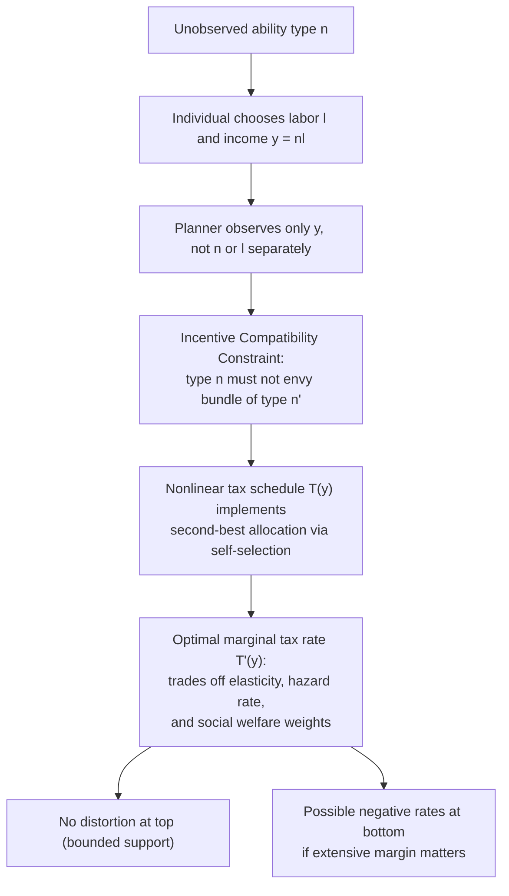

## Optimal Redistribution in the Mirrleesian Tradition

### Overview and Historical Origins

The Mirrleesian tradition originates from James Mirrlees's 1971 paper "An Exploration in the Theory of Optimum Income Taxation," which formalized the problem of designing a redistributive tax system when the government cannot directly observe individuals' underlying productivity (their wage rate or "type"), only their income. This informational constraint transforms redistribution from a straightforward social welfare maximization problem into a **mechanism design problem** under asymmetric information. Mirrlees received the 1996 Nobel Memorial Prize in Economic Sciences largely for this contribution. The framework has since become the dominant paradigm in the theory of optimal taxation, superseding earlier Ramsey-style commodity taxation approaches for questions of income redistribution specifically.

### The Core Informational Problem

The central friction in the Mirrleesian model is that the government wants to redistribute from high-ability to low-ability individuals, but ability (denoted $n$ or $w$, representing the wage rate per efficiency unit of labor) is private information. The government observes only income $y = wl$, where $l$ is labor supply. This creates an **adverse selection** problem: any tax schedule that tries to tax high earners more heavily risks distorting their labor supply decisions, because high-ability individuals could mimic low-ability individuals by working less and earning less, thereby escaping the tax burden intended for them.

This gives rise to the fundamental **equity-efficiency tradeoff**: redistribution requires taxing high earners to fund transfers to low earners, but doing so discourages labor supply and effort precisely among those whose output the tax system relies upon.

### Model Setup

**Primitives:**

- A continuum of individuals indexed by ability type $n \sim F(n)$ on support $[\underline{n}, \bar{n}]$
- Each individual chooses labor supply $l$ and consumption $c$
- Utility function $u(c, l)$, typically increasing in $c$, decreasing in $l$, often assumed additively separable: $u(c,l) = v(c) - h(l)$
- Income (before tax) is $y = nl$
- A tax/transfer schedule $T(y)$ determines after-tax consumption: $c = y - T(y)$

**Government objective:**

The government chooses $T(y)$ to maximize a social welfare function:

$$W = \int_{\underline{n}}^{\bar{n}} G(u(c(n), l(n))) \, dF(n)$$

where $G(\cdot)$ is a concave transformation capturing social inequality aversion (utilitarian if $G$ is linear, Rawlsian/maximin in the limiting case of infinite concavity).

**Resource constraint:**

$$\int_{\underline{n}}^{\bar{n}} T(y(n)) \, dF(n) \geq E$$

where $E$ is an exogenous revenue requirement (possibly zero or negative).

### The Incentive Compatibility Constraint

Because the planner cannot observe $n$ directly, any allocation $\{c(n), y(n)\}$ must be **incentive compatible**: no type $n$ should prefer the bundle intended for another type $n'$.

$$u\left(c(n), \frac{y(n)}{n}\right) \geq u\left(c(n'), \frac{y(n')}{n}\right) \quad \forall n, n'$$

This is the discrete/general statement of the **taxation principle**: instead of directly assigning $(c, y)$ pairs to types, the government can equivalently offer a single nonlinear budget schedule $c = y - T(y)$ and let each type self-select their preferred point. The revelation principle guarantees this is without loss of generality — the optimal direct mechanism can always be implemented by an indirect nonlinear tax schedule.

Using the **envelope theorem**, the incentive compatibility constraint (assuming single-crossing / Spence-Mirrlees condition holds) can be reduced to a local first-order condition plus a monotonicity condition, converting an infinite-dimensional constraint into a tractable differential equation:

$$\dot{u}(n) = -\frac{h'(l(n)) \, l(n)}{n}$$

(with sign conventions depending on the specific utility formulation), coupled with the requirement that $y(n)$ be non-decreasing in $n$.

### The Mirrlees Optimal Tax Formula

**Key Points**

- The optimal marginal tax rate at each income level balances the efficiency cost of distorting labor supply at that point against the equity gain from extracting revenue from all higher-ability types
- The formula is typically expressed as an integral condition rather than a closed form, since $T'(y)$ depends on the entire distribution above $y$
- A canonical version of the optimal marginal tax rate at income corresponding to skill $n$ is:

$$\frac{T'(y(n))}{1 - T'(y(n))} = \frac{1 + \frac{1}{\varepsilon}}{n f(n)} \left(1 - F(n)\right) \int_n^{\bar{n}} \left[1 - \frac{G'(u(m))\lambda_m}{\lambda}\right] dF(m) \Big/ (\cdots)$$

Simplified intuitions extracted from this class of formulas (following the modern "sufficient statistics" restatement, notably by Diamond (1998) and Saez (2001)):

$$T'(y) = \frac{1 - F(y)}{y f(y)} \cdot \frac{1}{\varepsilon} \cdot \left(1 - \bar{G}(y)\right)$$

where:

- $\varepsilon$ is the elasticity of labor supply (or taxable income) with respect to the net-of-tax rate
- $\frac{1-F(y)}{yf(y)}$ is the (inverse) **hazard rate** term, reflecting the local shape of the income distribution
- $\bar{G}(y)$ is the average social marginal welfare weight on individuals earning above $y$, normalized so that a weight of 1 represents the government's valuation of an additional dollar of public funds

**Interpretation:**

- Higher elasticity $\varepsilon$ → lower optimal marginal tax rate (more distortion per unit of revenue)
- A "thin" upper tail (few people earning much more than $y$) → less revenue gained from taxing at $y$, pushing rates down
- Lower social welfare weight on top earners (more redistributive government preferences) → higher marginal tax rates

### The Famous Zero Distortion Results

**No Distortion at the Top:**

Under standard assumptions (bounded skill distribution, single crossing, no bunching at the top), the optimal marginal tax rate on the **highest-ability individual** is zero: $T'(y(\bar{n})) = 0$. Intuition: since there is no one above the top earner to mimic, taxing the top earner's last dollar creates pure deadweight loss with no incentive-compatibility benefit — the government could lower that person's marginal rate to zero without inducing anyone else to change behavior, while still taxing their inframarginal income.

[Inference/Caveat] This result is highly sensitive to the assumption of a *bounded* skill distribution and no uncertainty about who the "top" is. With unbounded (e.g., Pareto-tailed) distributions, this zero-at-the-top result does not directly apply, and the asymptotic optimal top tax rate instead depends on the Pareto parameter of the income distribution (Saez, 2001; Diamond, 1998).

**No Distortion at the Bottom:**

Similarly, under the assumption that everyone works (no extensive margin/participation issues) and the lowest type is bounded below, the marginal tax rate at the very bottom of the distribution is also zero, though this result is more fragile and often overturned once **extensive margin (participation) responses** are introduced.

### Extensive vs. Intensive Margin

The original Mirrlees framework emphasizes the **intensive margin** — how much someone who is already working adjusts their hours/effort. A major extension, associated with Diamond (1980) and Saez (2002), incorporates the **extensive margin** — the decision of *whether to work at all*.

- When extensive margin responses dominate (e.g., among low-income populations), optimal policy can call for **negative marginal tax rates** at the bottom (i.e., an Earned Income Tax Credit-style wage subsidy), because encouraging labor force participation among low earners can be welfare-improving even at some intensive-margin cost.
- This helps rationalize real-world policies like the EITC in the U.S. or Working Tax Credits in the UK, which the pure intensive-margin Mirrlees model has difficulty explaining.

### The Saez (2001) Sufficient Statistics Reformulation

Emmanuel Saez's contribution reformulated the Mirrlees problem in terms of **empirically estimable sufficient statistics** rather than deep structural primitives, making the theory directly usable for policy calibration:

- The **elasticity of taxable income** $\varepsilon$ (estimated via natural experiments, tax reforms, bunching at kinks)
- The **shape of the income distribution**, particularly the Pareto parameter $\alpha = \frac{y f(y)}{1 - F(y)}$ for the upper tail
- Social marginal welfare weights $g(y)$, which can be treated as a normative parameter to be varied for sensitivity analysis, or inferred/calibrated to match desired progressivity properties

This reframing enabled the derivation of a widely cited approximate formula for the **optimal top marginal tax rate**:

$$\tau^* = \frac{1}{1 + a \cdot \varepsilon}$$

where $a$ is the Pareto parameter of the income distribution in the upper tail (typically estimated around 1.5–3 for many countries) and $\varepsilon$ is the elasticity of taxable income (commonly estimated in the 0.2–0.5 range in empirical work, though [Unverified] this varies substantially by country, time period, and estimation methodology).

### Diagrammatic Representation of the Mechanism

### Social Welfare Weights and Normative Choices

The Mirrleesian framework is normatively flexible: the social welfare function $G(\cdot)$ is a free parameter chosen by the analyst or policymaker.

- **Utilitarian** ($G$ linear in utility): weights individuals' utils equally; still generates redistribution because of diminishing marginal utility of consumption, but less aggressively than more inequality-averse criteria
- **Rawlsian/Maximin** (limiting case): the planner cares only about the worst-off individual, generating the most redistributive optimal schedule consistent with incentive constraints
- **Generalized weighted utilitarian**: allows the researcher to back out "implied" welfare weights from an observed or proposed tax system, a technique now common in the inverse-optimal-tax literature (e.g., Bourguignon and Spadaro, 2012)

### Simple Numerical Illustration

**Example**

Suppose two types: low ability $n_L = 1$ and high ability $n_H = 2$, each with population share $\frac{1}{2}$, and quasilinear utility $u = c - \frac{l^2}{2}$.

1. **First-best (observable types):** the planner sets $c_L, c_H$ and $l_L, l_H$ freely to equalize marginal utility of consumption across types (if utilitarian) subject only to the resource constraint. Optimal labor supply for each type satisfies $n = l$ (marginal disutility of labor equals wage), so $l_L = 1, l_H = 2$, with consumption redistributed lump-sum from H to L without any distortion to either type's labor supply.
2. **Second-best (unobservable types):** the planner must ensure the high type does not prefer the low type's bundle. This typically requires **distorting the high type's labor supply downward relative to first-best is not needed at the top under the standard result** (no distortion at the top applies to the highest type in a two-type model as well), but requires distorting the **low type's labor supply downward** relative to first best, in order to make the low-type bundle less attractive to the high type (reducing the high type's temptation to mimic, thereby relaxing the incentive constraint and allowing more redistribution). This is the two-type analogue of "no distortion at the top, distortion at the bottom."

### Relationship to Other Redistribution Frameworks

**Key Points**

- **Ramsey taxation** (commodity taxation under observable, differentiated goods) is a *complementary* but distinct framework; the Atkinson-Stiglitz theorem shows that under separability between consumption and leisure in utility and with an optimal nonlinear income tax already in place, differentiated commodity taxes are redundant for redistribution — income taxation alone suffices
- **Tagging** (Akerlof, 1978): if the government can observe additional characteristics correlated with ability (e.g., disability status, age) that cannot be manipulated, welfare can be improved by conditioning transfers on these tags in addition to income, relaxing the pure informational bottleneck at the heart of Mirrlees
- **Optimal capital taxation** (Chamley-Judd tradition) is a related but separate branch of the dynamic optimal taxation literature, though the New Dynamic Public Finance literature (Golosov, Kocherlakota, Tsyvinski, 2003) extends Mirrleesian mechanism design to dynamic/stochastic ability environments

### Empirical Implementation Challenges

- Estimating the elasticity of taxable income $\varepsilon$ is complicated by income shifting, tax avoidance, and heterogeneity across the income distribution; different natural experiments (e.g., the 1986 U.S. Tax Reform Act, Scandinavian tax reforms) yield different point estimates
- The upper-tail Pareto parameter must be estimated from actual income data, which can be sensitive to top-coding, measurement of capital income, and the treatment of realized versus accrued capital gains
- Behavioral responses may operate along margins other than hours worked — e.g., effort, career choice, tax avoidance/evasion, migration — which the canonical model does not fully capture [Behavioral claims about elasticity and taxpayer responses may vary substantially across contexts and are subject to ongoing empirical revision]

### Criticisms and Extensions

- **Single-dimensional heterogeneity**: the baseline model assumes ability is the only source of individual heterogeneity, which is a strong simplification; multidimensional screening models (e.g., incorporating heterogeneous preferences for leisure) are technically much harder and yield less clean characterizations
- **Perfect information about the distribution $F(n)$**: the planner is assumed to know the ability distribution exactly; robustness to misspecification is an active research area
- **Static framework**: the canonical model is static, ignoring life-cycle considerations, human capital investment, and dynamic ability evolution — addressed by the New Dynamic Public Finance literature
- **Behavioral/bounded rationality critiques**: [Speculation] some argue that real-world taxpayers may not respond to marginal tax rates in the fully rational, forward-looking manner assumed by the model, though this remains a topic of ongoing empirical and theoretical debate

### Policy Relevance

The Mirrleesian framework underlies major policy review efforts, most notably the **Mirrlees Review** (2010–2011, IFS, UK), a comprehensive assessment of the UK tax system explicitly grounded in optimal tax theory, covering income taxation, indirect taxation, corporate taxation, and the interaction between the tax and benefit systems.

**Related Topics**

- Atkinson-Stiglitz Theorem and the case against differentiated commodity taxation
- Ramsey Optimal Commodity Taxation
- Diamond-Mirrlees Production Efficiency Theorem
- New Dynamic Public Finance (Golosov-Kocherlakota-Tsyvinski framework)
- Tagging and the use of observable characteristics in redistribution (Akerlof)
- Extensive margin labor supply and the Earned Income Tax Credit
- Bunching estimators and identification of the elasticity of taxable income
- Social welfare functions and inequality aversion parameters (Atkinson index)
- Rawlsian vs. Utilitarian normative criteria in public economics
- Inverse optimal taxation and revealed social welfare weights