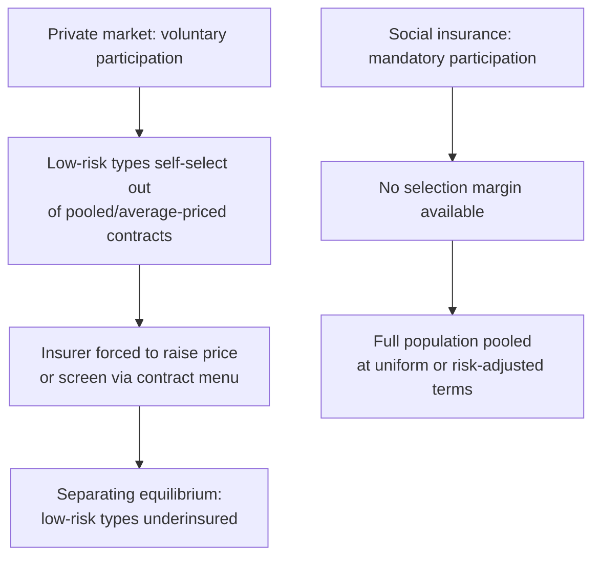

## Rationale for Social versus Private Insurance

### Overview

The question of why governments provide social insurance (public pensions, unemployment insurance, disability insurance, health insurance) rather than leaving insurance provision entirely to private markets is a central topic in public economics. The rationale rests on a combination of **market failure arguments** (adverse selection, moral hazard interactions, incomplete markets) and **paternalistic/redistributive arguments** (myopia, distributional goals, social solidarity). Private insurance markets, even when competitive, can fail to achieve efficient outcomes for reasons distinct from the usual public goods or externality arguments used to justify other government interventions.

### The Baseline Case for Private Insurance

Under the classical Arrow-Debreu framework extended to uncertainty (Arrow, 1963), competitive private insurance markets can achieve efficient risk-sharing when:

- Risks are independent across individuals (idiosyncratic, not aggregate)
- Insurers can verify and price risk accurately (no information asymmetry)
- Individuals are rational expected-utility maximizers who correctly perceive their risks
- There are no transaction costs or administrative loading beyond actuarially fair pricing

Under these conditions, risk-averse individuals purchase full insurance against idiosyncratic shocks, and the resulting allocation is Pareto efficient. **Social insurance rationale requires identifying which of these conditions is violated in practice.**

### Adverse Selection

**Key Points**

- Adverse selection arises when individuals have private information about their own risk type that insurers cannot observe or verify
- The classic result (Akerlof, 1970; Rothschild-Stiglitz, 1976) is that private insurance markets under adverse selection either fail to achieve a pooling equilibrium (unraveling toward only high-risk types remaining insured) or achieve only a **separating equilibrium** with distorted, inefficiently low coverage for low-risk types

**The Rothschild-Stiglitz mechanism:**

- Insurers cannot distinguish high-risk from low-risk individuals directly
- If insurers offer a single pooled contract priced at the average risk, low-risk individuals are overcharged relative to their true risk and have an incentive to exit or seek smaller contracts, while high-risk individuals are undercharged and remain
- This unraveling process can lead to the pooling equilibrium being unsustainable, with insurers instead forced to offer a menu of contracts that separates types via self-selection (e.g., a low-coverage, low-premium contract preferred by low-risk types and a high-coverage, high-premium contract preferred by high-risk types)
- The separating equilibrium is inefficient because low-risk types receive **less than full insurance** as a screening device, even though they would prefer (and could feasibly be offered, absent the informational constraint) full coverage
- [Inference/Caveat] In some parameter ranges, no pure-strategy equilibrium exists at all in the Rothschild-Stiglitz setting, a well-known technical fragility of the model that has motivated substantial follow-up literature (e.g., Wilson, 1977; Miyazaki, 1977; Spence, 1978)

**Social insurance response:** Mandatory, universal social insurance sidesteps adverse selection entirely by pooling the entire population (or large mandatory groups, e.g., all employees) regardless of individual risk type, since **participation is compulsory rather than voluntary**. This eliminates the self-selection margin that drives market unraveling.

### Moral Hazard and Its Interaction with Insurance Design

Moral hazard — the tendency of insured individuals to take less care or exert less effort to avoid the insured event, or to over-consume subsidized services (ex-post moral hazard, e.g., healthcare utilization) — exists in both private and social insurance and does not by itself justify social provision. However:

- Private insurers have stronger incentives and tools (experience rating, deductibles, co-pays, exclusions, policy cancellation) to mitigate moral hazard, which can actually make private contracts *more* efficient along this dimension in isolation
- [Inference] The optimal social insurance literature (Baily, 1978; Chetty, 2006) explicitly models the tradeoff between the **consumption-smoothing benefit** of insurance and the **moral hazard cost**, arriving at formulas for optimal benefit generosity (e.g., optimal unemployment insurance replacement rates) that balance the two — this is a design question *within* social insurance rather than a market-failure rationale for its existence per se

### Adverse Selection Death Spirals and Market Unraveling

A more extreme version of adverse selection is the **insurance death spiral**: as low-risk individuals exit a pool in response to rising average prices, the remaining pool's average risk rises further, prices rise again, more low-risk individuals exit, and the market can collapse entirely (zero private provision) even though efficient risk-pooling would benefit nearly everyone ex ante. This is frequently invoked to explain the near-complete absence of private markets for certain risks (e.g., long-term unemployment insurance, or pre-ACA individual health insurance markets with medical underwriting).

### Aggregate/Correlated Risk and Thin Markets

Private insurance relies on the **law of large numbers** to pool idiosyncratic risk. Some risks relevant to social insurance are **aggregate** (correlated across the population) rather than idiosyncratic:

- Macroeconomic recessions driving simultaneous unemployment claims
- Systemic health risks (pandemics)
- Longevity risk at a cohort level (if life expectancy trends shift for an entire generation, not just individuals)

Private insurers face capital constraints and solvency requirements that make insuring against aggregate/correlated shocks costly or infeasible without reinsurance markets that may themselves be thin or nonexistent (especially for very-long-horizon or very-large-scale risks). **Government, with its power to tax, spread risk across generations, and run deficits, can act as an insurer of last resort for aggregate risk in a way private insurers structurally cannot** — this is sometimes called the government's comparative advantage in **intergenerational risk-sharing** (Gordon and Varian, 1988; Shiller, 1993 on "macro markets").

### Absence of Markets for Uninsurable Long-Horizon Risks

Certain risks lack private markets altogether due to a combination of long horizons, extreme informational problems, and enforcement issues:

- **Human capital / wage risk insurance**: no private market exists for insuring against low future earnings potential due to talent or circumstance, largely because of severe moral hazard (verifying effort over a lifetime is essentially impossible) and adverse selection (individuals know more about their own prospects than any insurer could)
- **Longevity insurance / annuities**: private annuity markets exist but are famously "thin" relative to theoretical predictions — the **annuity puzzle** (Yaari, 1965; Modigliani, 1986) documents that far fewer people annuitize wealth voluntarily than full-insurance models predict, attributed to adverse selection (only the healthy/long-lived buy annuities, raising prices), bequest motives, and behavioral factors
- Social Security and public pension systems address this gap by **mandating** participation, again eliminating the adverse-selection-driven unraveling that plagues voluntary private annuity markets

### Behavioral and Paternalistic Rationales

**Key Points**

- Beyond pure market failure, social insurance is often justified on grounds that individuals may not act as fully rational, forward-looking expected-utility maximizers
- **Myopia/present bias**: individuals with hyperbolic discounting may systematically undersave for retirement or under-insure against future risks, even when actuarially fair private products are available (Laibson, 1997; O'Donoghue and Rabin, 1999)
- **Time-inconsistent preferences** can justify mandatory savings/insurance programs (e.g., mandatory public pensions) as a commitment device that overrides individuals' own short-run preferences in favor of their long-run interests
- [Speculation/Normative] Whether paternalistic overriding of individual choice is normatively justified is a matter of ongoing debate in welfare economics and political philosophy, distinct from the positive question of whether myopia empirically exists

### Redistribution and Social Solidarity

Social insurance programs typically bundle **insurance** with **redistribution** in ways private markets, by design, do not:

- Progressive benefit formulas (e.g., U.S. Social Security's benefit formula replaces a higher fraction of pre-retirement earnings for low earners than high earners) redistribute within the insurance pool from high-lifetime-earners to low-lifetime-earners
- Community rating in health insurance (charging the same premium regardless of health risk) is explicitly redistributive from healthy to sick individuals, which a competitive private market with risk-based pricing would not sustain absent mandates or subsidies
- This redistributive bundling reflects a **social solidarity** rationale: society may wish to insure against "bad luck" in ability, health endowment, or family circumstance — risks that are realized before any private insurance contract could ever be signed (the **veil of ignorance** framing, echoing Rawls (1971) and Harsanyi (1953))

### The Problem of Insuring Pre-Existing/Known Risk

A fundamental market failure distinct from adverse selection is that private insurance **cannot be purchased for risks already known to have been realized** — you cannot buy fire insurance after your house has already burned down, nor can someone born with a disability or low innate ability purchase insurance against that "risk" before birth. Social insurance, by mandating universal participation in intergenerational and cross-sectional risk pools, can effectively provide **ex-ante insurance against circumstances of birth** that no private market could ever offer, since the relevant "contracting" would need to occur before an individual's type is even determined (Harsanyi's original position / social contract framing).

### Administrative and Transaction Cost Efficiencies

- Social insurance programs financed through mandatory payroll taxation can achieve **near-universal coverage with very low marketing and underwriting costs**, since there is no need to screen applicants, advertise, or process individual risk assessments
- Empirically, administrative costs as a share of benefits paid tend to be lower in large public programs (e.g., Social Security, Medicare) than in comparable private insurance lines, though [Unverified] the magnitude of this gap and the extent to which it reflects genuine efficiency versus different benefit scope/generosity is contested in the health economics literature specifically

### Comparative Table: Private vs. Social Insurance Rationale

| Dimension | Private Insurance | Social Insurance |
| --- | --- | --- |
| Participation | Voluntary | Mandatory |
| Pricing | Risk-based (where feasible) | Often community-rated / earnings-based |
| Adverse selection | Vulnerable to unraveling | Eliminated via compulsion |
| Aggregate risk | Poorly handled (capital constraints) | Can spread via taxation, borrowing, intergenerational transfer |
| Redistribution | None (or limited, via cross-subsidy) | Often explicit and progressive |
| Administrative cost | Higher (underwriting, marketing) | Often lower (economies of scale, no screening) |
| Moral hazard mitigation tools | Deductibles, experience rating, exclusions | Benefit formulas, waiting periods, monitoring |

### Counterarguments and Limits of the Social Insurance Rationale

- **Government moral hazard/political economy risk**: social insurance programs are subject to their own distortions — political manipulation of benefit levels, time-inconsistency in government promises, and the risk that mandatory programs crowd out efficient private supplemental insurance
- **One-size-fits-all inefficiency**: mandatory pooling sacrifices the efficiency gains from risk-based pricing and personalized contract design that competitive markets, absent adverse selection, could in principle provide
- **Fiscal sustainability**: pay-as-you-go social insurance systems (e.g., most public pension systems) rely on demographic and political sustainability rather than pre-funded actuarial reserves, introducing solvency risks of a different character than those facing private insurers
- [Inference] The optimal policy design in practice often involves **hybrid systems** — mandatory baseline social insurance supplemented by voluntary private insurance on top (e.g., Medicare plus Medigap/Medicare Advantage in the U.S., or public pension systems supplemented by private pension accounts) — reflecting a recognition that neither pure private nor pure social provision dominates across all relevant margins

### Formal Illustration: Adverse Selection Undermining a Pooling Equilibrium

Consider two risk types, $H$ (high risk, probability of loss $p_H$) and $L$ (low risk, probability of loss $p_L < p_H$), with population shares $\theta$ and $1-\theta$ respectively, and a loss amount $D$ if the bad state occurs.

Actuarially fair pooled premium: $\pi_{pool} = [\theta p_H + (1-\theta)p_L] D$

- If $\pi_{pool}$ exceeds what low-risk types are willing to pay for full coverage (i.e., their own actuarially fair premium $p_L D$ plus their risk premium for full insurance), low-risk types will prefer either no insurance or a reduced-coverage contract, leaving only high-risk types in the pooled contract
- This is the "unraveling" logic: the equilibrium in a competitive private market, absent regulation, tends toward **separation** rather than efficient full pooling
- A mandatory social insurance program simply sets $\pi = \pi_{pool}$ (or a subsidized/tax-financed variant) for everyone, achieving the pooling allocation that the private market cannot sustain voluntarily

### Related Topics

- Adverse Selection and the Rothschild-Stiglitz Model
- Moral Hazard and Optimal Unemployment Insurance Design (Baily-Chetty framework)
- The Annuity Puzzle and Longevity Risk
- Intergenerational Risk-Sharing and Pay-As-You-Go Pension Systems
- Community Rating, Guaranteed Issue, and Health Insurance Mandates
- Behavioral Public Economics: Present Bias and Mandatory Savings
- Veil of Ignorance and Social Contract Theory (Rawls, Harsanyi)
- Optimal Social Insurance Benefit Generosity (Baily-Chetty Sufficient Statistics Approach)
- Political Economy of Public Pension Sustainability
- Comparative Health Insurance Systems (Single-Payer vs. Regulated Private Markets)