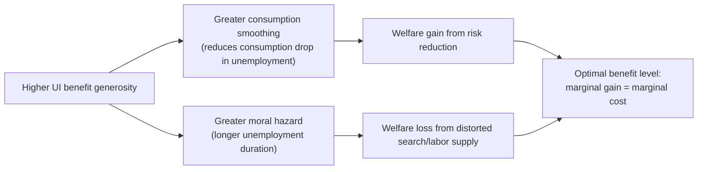

## Moral Hazard in Social Insurance

### Overview and Definition

Moral hazard refers to behavioral changes induced by insurance coverage that increase the frequency, duration, or cost of the insured event, arising because insurance severs the link between an individual's actions and the full financial consequences they bear. In social insurance contexts, moral hazard is not a reason to avoid insurance altogether — since insurance still provides valuable consumption smoothing against risk — but it is the central cost that must be weighed against the consumption-smoothing benefit when designing optimal benefit levels, eligibility rules, and monitoring systems.

### Ex-Ante versus Ex-Post Moral Hazard

**Key Points**

- **Ex-ante moral hazard**: insurance reduces the incentive to take precautionary action *before* the insured event occurs (e.g., reduced job search intensity while still employed but anticipating potential unemployment insurance; reduced preventive health behaviors when health insurance covers treatment costs)
- **Ex-post moral hazard**: insurance changes behavior *after* the insured event has occurred, primarily by increasing utilization or duration of the insured state (e.g., extending unemployment duration once receiving benefits; over-consuming medical care once insured and facing a low marginal price)
- Ex-post moral hazard is generally considered the more significant and more empirically documented channel in most social insurance programs, particularly unemployment insurance and health insurance

### Moral Hazard in Unemployment Insurance

The unemployment insurance (UI) literature is the most developed empirical setting for moral hazard analysis in social insurance.

**Channels of moral hazard:**

- Reduced job search effort while eligible for benefits
- Increased reservation wage, extending the duration of unemployment spells
- Potential effects on job match quality (ambiguous sign — some job search theory suggests UI can improve match quality by allowing more selective search, a potentially efficiency-enhancing side effect)

**Empirical regularities:**

- A robust finding across many studies is that unemployment duration is **increasing in benefit generosity** (both benefit level and potential duration), typically measured via the elasticity of unemployment duration with respect to the benefit replacement rate or maximum benefit duration
- **Spike at benefit exhaustion**: numerous studies (e.g., Card, Chetty, and Weber, 2007; Katz and Meyer, 1990) document a pronounced spike in the exit rate from unemployment right around the point benefits expire, widely interpreted as direct evidence of moral hazard (search intensity or reservation wage adjustments timed to benefit exhaustion) — though [Inference/Caveat] part of this spike may also reflect liquidity effects (running out of savings) rather than pure moral hazard, and disentangling the two channels has been a major focus of subsequent research (e.g., Chetty, 2008)

### The Chetty (2008) Liquidity vs. Moral Hazard Decomposition

A key methodological advance separates the overall behavioral response to UI generosity into two conceptually distinct components:

1. **Substitution/moral hazard effect**: the pure incentive effect of a lower cost of remaining unemployed, holding the marginal utility of consumption fixed
2. **Liquidity effect**: unemployed individuals who face borrowing constraints may accept jobs earlier than optimal simply because they run out of cash, not because they lack incentive to search longer; UI benefits relax this constraint, allowing *some* extension of unemployment duration that is welfare-improving (better job matches, less desperation-driven acceptance) rather than purely wasteful

**Policy implication:** [Inference] Because part of the observed duration response to UI generosity reflects liquidity relaxation rather than pure moral hazard, the *efficiency cost* of UI generosity is smaller than a naive interpretation of duration elasticities would suggest — this reframes optimal benefit design, since liquidity-driven responses can be welfare-enhancing while moral-hazard-driven responses are welfare-reducing, and the two require different policy responses (income-based UI generosity for liquidity-constrained groups versus tighter monitoring/job-search requirements to address pure incentive effects)

### The Baily-Chetty Formula for Optimal UI

The canonical optimal social insurance formula (Baily, 1978; extended by Chetty, 2006) characterizes the optimal replacement rate by equating the marginal benefit of consumption smoothing against the marginal cost of the behavioral distortion:

$$\frac{b^*}{1-b^*} \approx \frac{\Delta c / c}{\varepsilon}$$

Simplified intuition of the underlying tradeoff:

$$\text{Optimal generosity} \propto \frac{\text{Consumption drop during unemployment (risk aversion benefit)}}{\text{Elasticity of unemployment duration w.r.t. benefits (moral hazard cost)}}$$

- $\Delta c/c$ measures the proportional drop in consumption upon becoming unemployed (a **sufficient statistic** for the value of consumption smoothing, since it reflects how poorly self-insured individuals are against the shock)
- $\varepsilon$ is the elasticity of unemployment duration with respect to the benefit level (a **sufficient statistic** for the moral hazard cost)
- This formula requires **no structural estimation of underlying utility parameters** — only two empirically estimable moments — which is the major methodological contribution of the sufficient statistics approach, making the framework directly implementable with reduced-form empirical estimates rather than requiring a fully specified structural model

### Moral Hazard in Health Insurance

**Ex-post moral hazard in health insurance** manifests as increased utilization of medical services once insured, since the marginal price faced by the patient (co-pay/coinsurance) is typically well below the marginal social cost of care.

**Key empirical evidence:**

- The **RAND Health Insurance Experiment** (1970s–1980s) randomly assigned households to health insurance plans with different cost-sharing levels and found that higher cost-sharing (lower effective insurance generosity) reduced medical spending substantially, with limited detectable effect on health outcomes for the average enrollee, though effects were more consequential for low-income and initially sicker subgroups
- The **Oregon Health Insurance Experiment** (2008, exploiting a lottery for limited Medicaid slots) found that gaining Medicaid coverage significantly increased health care utilization and reduced financial strain, providing experimental evidence on both moral hazard (utilization increase) and the insurance value of coverage (financial protection)
- [Inference] These studies jointly inform the standard tradeoff in health insurance design between the moral hazard cost of low cost-sharing and the risk-protection/access benefit, analogous to the Baily-Chetty tradeoff in UI, though the health insurance literature also emphasizes the distinct problem that some ex-post moral hazard in health care (unlike UI) may represent genuinely valuable increased consumption of health care that was previously underconsumed due to liquidity constraints or underinsurance, complicating simple welfare interpretations of utilization increases

### Nonlinear Health Insurance Contracts as a Moral Hazard Response

Standard health insurance contract design mitigates moral hazard via:

- **Deductibles**: full out-of-pocket cost below a threshold, converting the price faced at the margin from zero (full insurance) back toward the true marginal cost for smaller, more discretionary expenditures
- **Coinsurance**: a fixed percentage of costs borne by the patient, preserving some price sensitivity across the utilization spectrum
- **Out-of-pocket maximums**: capping total patient liability to preserve catastrophic risk protection (the primary insurance value) even while imposing meaningful cost-sharing on routine, more elastic expenditures
- [Inference] The theoretically optimal contract shape (Arrow, 1963; Ehrlich and Becker, 1972) typically features **higher coinsurance for more price-elastic, discretionary care and lower coinsurance (near-full coverage) for less elastic, catastrophic care**, which broadly rationalizes the deductible-plus-cap structure common in observed health insurance design, though real-world contracts also reflect administrative simplicity and regulatory constraints not captured in the pure theory

### Moral Hazard in Disability Insurance

- Disability insurance (DI) moral hazard concerns are structurally similar to UI but complicated by the difficulty of verifying disability status, creating a **screening problem layered on top of the moral hazard problem**
- Benefit generosity and duration have been shown in several studies (e.g., using variation in DI award probability via randomly assigned examiners, or benefit formula discontinuities) to reduce labor force participation among marginal applicants, though the size of this effect and its welfare interpretation (given that some marginal applicants may have genuine, if hard-to-verify, work limitations) remains actively debated
- **Screening/verification mechanisms** — medical exams, waiting periods, appeals processes — serve as imperfect substitutes for the direct price mechanisms (deductibles, co-pays) used in health insurance, since disability, unlike routine health utilization, is a discrete and harder-to-partially-price state

### Moral Hazard and Optimal Monitoring/Conditionality

An alternative (or complementary) tool to reducing benefit generosity is **increasing monitoring and conditionality** of benefit receipt:

- **Job search requirements and monitoring** in UI systems (mandatory reporting of search activity, sanctions for insufficient search) aim to reduce moral hazard without reducing the benefit level itself, preserving consumption-smoothing value while directly targeting the behavioral margin of concern
- [Inference] The theoretical literature on optimal UI design (e.g., Wang and Williamson, 1996; Hopenhayn and Nicolini, 1997) frames monitoring and time-varying (declining) benefit profiles as **mechanism design solutions** analogous to the broader Mirrleesian approach — since job search effort is itself unobservable, tools that improve verifiability (mandatory reporting, benefit profiles that decline over the unemployment spell to preserve incentives) can improve on simple constant-benefit-level UI schemes
- Hopenhayn-Nicolini (1997) derive the theoretically optimal UI benefit path, which **declines over the unemployment spell** and can involve a **re-employment tax** (lower wages/taxes upon re-employment for those who take longer to find jobs), reflecting the accumulated moral hazard incentive problem over the spell

### Moral Hazard versus Adverse Selection: A Conceptual Distinction

**Key Points**

- **Adverse selection** is a *pre-contract* information asymmetry problem: the insured party knows their risk type before purchasing insurance
- **Moral hazard** is a *post-contract* incentive problem: insurance itself changes behavior after coverage begins, regardless of the individual's underlying type
- Both can coexist and interact: e.g., in health insurance, individuals who select more generous plans (adverse selection on plan choice) may also be exactly the individuals most likely to increase utilization in response to lower cost-sharing (moral hazard), a phenomenon sometimes termed **selection on moral hazard** (Einav, Finkelstein, and Cullen, 2010), which complicates simple empirical decomposition of the two effects using standard cross-sectional variation

### General Equilibrium and Externality Considerations

- [Inference] Some moral hazard responses generate externalities on the broader insurance pool or labor market: e.g., extended unemployment durations funded by payroll taxes on employed workers, or health care utilization increases that raise premiums for the broader risk pool — these interactions mean the socially optimal benefit level accounts not just for the direct moral hazard cost to the individual decision-maker but the pooled financing cost borne by all contributors
- Some research (e.g., Landais, Michaillat, and Saez, 2018) extends the optimal UI framework to account for **macroeconomic/general equilibrium effects**, arguing optimal UI generosity should be **countercyclical** — more generous during recessions when job-finding is harder and moral hazard costs (in terms of extending search) are lower relative to the consumption-smoothing benefit, and less generous during expansions

### Summary Table: Moral Hazard Mitigation Tools by Program Type

| Program | Primary Moral Hazard Channel | Common Mitigation Tools |
| --- | --- | --- |
| Unemployment Insurance | Reduced job search effort, extended duration | Benefit caps, declining benefit profiles, job search monitoring, waiting periods |
| Health Insurance | Increased utilization | Deductibles, coinsurance, out-of-pocket maximums, prior authorization |
| Disability Insurance | Reduced labor force participation among marginal cases | Medical screening, waiting periods, periodic reviews, appeals processes |
| Workers' Compensation | Extended recovery/claim duration | Experience rating of employer premiums, medical case management, benefit waiting periods |

### Related Topics

- Baily-Chetty Sufficient Statistics Approach to Optimal Social Insurance
- Liquidity Constraints versus Moral Hazard (Chetty 2008 Decomposition)
- The RAND and Oregon Health Insurance Experiments
- Hopenhayn-Nicolini Optimal Dynamic Unemployment Insurance
- Selection on Moral Hazard (Einav-Finkelstein-Cullen Framework)
- Optimal Health Insurance Contract Design (Deductibles, Coinsurance, Stop-Loss)
- Countercyclical Unemployment Insurance Policy
- Adverse Selection versus Moral Hazard: Conceptual and Empirical Distinctions
- Disability Insurance Screening and Examiner Leniency Designs
- Job Search Theory and Reservation Wage Models