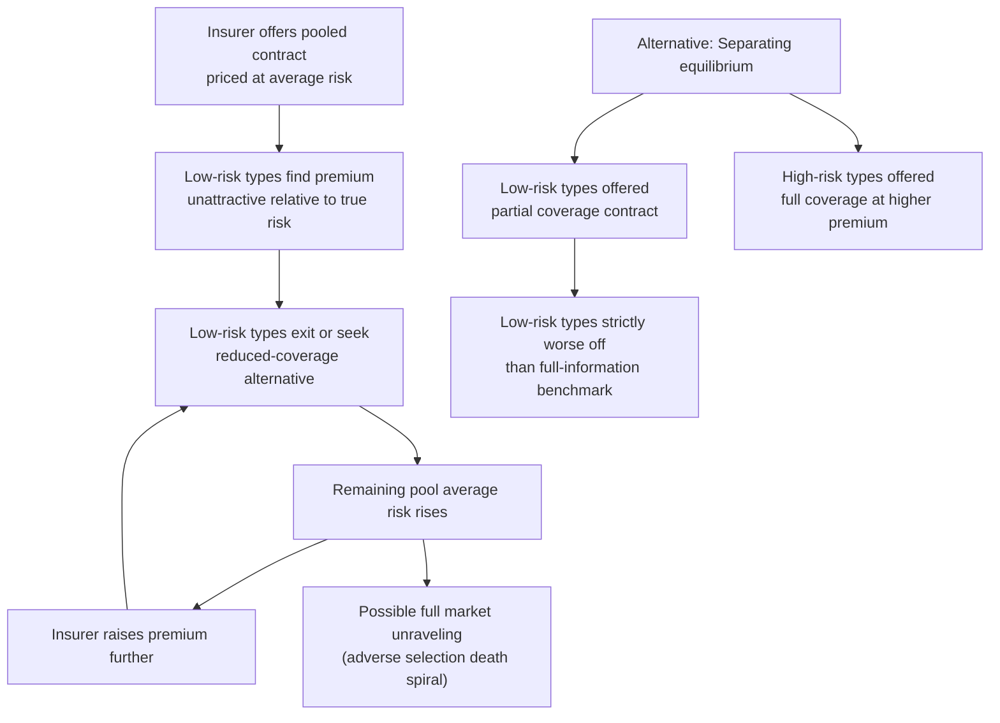

## Adverse Selection in Insurance Markets

### Overview and Definition

Adverse selection arises in insurance markets when individuals possess private information about their own risk type that insurers cannot fully observe or verify at the time of contracting. Because higher-risk individuals have a stronger incentive to purchase insurance (or to purchase more generous coverage) than lower-risk individuals, the composition of the insured pool becomes skewed toward higher risk relative to the underlying population — a selection effect that occurs *before* any contract is signed, distinguishing it conceptually from moral hazard, which is a post-contract behavioral response. Adverse selection was formally introduced to economics through Akerlof's (1970) "market for lemons" framework and extended specifically to insurance by Rothschild and Stiglitz (1976).

### The Akerlof "Lemons" Logic Applied to Insurance

- Suppose an insurer offers a single contract priced at the actuarially fair premium for the **average** risk in the population
- Low-risk individuals, who know they are unlikely to file a claim, view this premium as **overpriced relative to their true risk** and are more likely to decline coverage or seek a cheaper, less comprehensive alternative
- As low-risk individuals exit, the remaining pool's average risk rises, forcing the insurer to raise the premium to remain solvent
- This higher premium drives out the next-lowest-risk tier, further raising average pool risk — a self-reinforcing process termed the **adverse selection death spiral**
- In the extreme case, the market can **unravel completely**, with no mutually beneficial trade occurring even though efficient risk-pooling would make nearly everyone better off ex ante

### The Rothschild-Stiglitz Model

**Key Points**

- Two risk types, high ($p_H$) and low ($p_L < p_H$) probability of loss, with population shares known to the insurer but individual type known only to the individual
- Competitive insurers offer contracts (premium, coverage) pairs; zero-profit condition holds in equilibrium due to free entry
- **Pooling equilibrium** (single contract for both types) is generally **not sustainable** in this model: a deviating insurer can always offer a slightly more attractive contract targeted only at low-risk types (e.g., a lower-coverage, lower-premium option), which low-risk types prefer and high-risk types do not, "cream-skimming" the profitable low-risk customers and making the original pooling contract unprofitable
- The equilibrium that survives (when it exists) is a **separating equilibrium**: low-risk types receive a contract with **less than full coverage**, and high-risk types receive a contract with **full coverage** at their own actuarially fair (higher) premium
- Low-risk types are made *strictly worse off* than they would be under full information (they would prefer full coverage at their own fair premium but cannot obtain it, because offering full coverage to low-risk types at their fair price would also attract high-risk types, breaking the zero-profit constraint) — this **underinsurance of low-risk types is the central inefficiency** the model highlights, not merely a distributional side effect

**Existence problem:** [Inference/Caveat] A well-known technical weakness of the Rothschild-Stiglitz model is that a separating equilibrium can fail to exist for some parameter values (specifically when the share of high-risk types is small enough that a profitable pooling contract could attract both types and outcompete the separating menu), a gap addressed by subsequent refinements (Wilson, 1977, allowing insurers to anticipate and react to withdrawal of unprofitable contracts; Miyazaki, 1977; Spence, 1978, allowing cross-subsidization within an insurer's contract menu).

### Empirical Identification of Adverse Selection

**The Chiappori-Salanie (1997, 2000) Positive Correlation Test**

The canonical empirical test for adverse selection (and moral hazard combined, since standard cross-sectional data cannot cleanly separate them) checks for a **positive correlation between coverage choice and ex-post risk realization**, conditional on all variables observable to the insurer (used for pricing):

$$\text{Cov}(\text{Coverage}, \text{Claims} \mid X) > 0 \implies \text{evidence of asymmetric information}$$

- If individuals who select more coverage also experience more claims (after controlling for priced risk factors $X$), this is consistent with either adverse selection (riskier types selecting more coverage) or moral hazard (more coverage causing more claims) or both
- This test has been applied across auto insurance, health insurance, annuities, and long-term care insurance markets with **mixed results**: some markets show the predicted positive correlation (e.g., some long-term care insurance studies), while others show **no significant correlation or even negative correlation** ("advantageous selection") — for example, Finkelstein and McGarry (2006) find evidence in the long-term care insurance market that risk-averse individuals both buy more insurance *and* take more precautions (reducing risk), generating a negative correlation that can mask or offset standard adverse selection

### Advantageous Selection

[Inference] The discovery that some markets exhibit **advantageous selection** — where the same unobserved trait (e.g., risk aversion or health consciousness) drives both higher insurance demand and lower risk — significantly complicated the simple positive-correlation testing paradigm. This implies that the sign of the correlation between coverage and risk is not a fully general diagnostic for the presence or absence of asymmetric information, and that multiple unobserved dimensions of heterogeneity (risk type and risk preference, at minimum) may be simultaneously at play, a point formalized in multidimensional screening models (e.g., de Meza and Webb, 2001).

### Adverse Selection in Health Insurance Exchanges

Health insurance markets provide an especially well-studied setting due to the interaction between adverse selection and **regulatory design choices**:

- **Community rating** (premiums cannot vary by health status) without an individual mandate creates strong adverse selection incentives: healthy individuals may forgo coverage, leaving a sicker, more expensive risk pool
- The U.S. Affordable Care Act (ACA) individual mandate (in effect 2014–2018, with the federal penalty subsequently reduced to $0 starting 2019) was explicitly designed to counteract this by compelling broader participation, though [Unverified] the quantitative effectiveness of the mandate penalty in preventing adverse selection unraveling, versus other factors (subsidies, enrollment periods), remains debated in the empirical literature
- **Risk adjustment mechanisms** (transferring funds from insurers with healthier-than-average enrollees to those with sicker-than-average enrollees) are a common regulatory tool to reduce insurers' incentives to engage in risk selection (attracting healthy enrollees) rather than competing on efficiency and quality
- **Open enrollment periods and guaranteed issue** (insurers cannot deny coverage based on pre-existing conditions) limit the scope for insurers to screen out high-risk individuals, but by themselves can *increase* adverse selection pressure on the insured pool if not paired with a mandate or strong enrollment incentive

### Adverse Selection in Annuity Markets

The **annuity puzzle** is a well-documented empirical phenomenon: far fewer individuals voluntarily annuitize retirement wealth than standard life-cycle models with full-information insurance markets would predict (Yaari, 1965; Modigliani, 1986).

- Adverse selection is one leading explanation: since individuals privately know more about their own health/longevity prospects than insurers can fully verify, longer-lived individuals disproportionately select into annuitization, forcing insurers to price annuities based on the annuitant pool's (higher than population-average) life expectancy
- This makes annuities appear "unfair" from the perspective of an average-mortality individual, discouraging annuitization among all but the most confident-of-longevity individuals, reinforcing the adverse selection pattern
- [Inference] Other explanations for the annuity puzzle — bequest motives, pre-existing annuitization through Social Security/pensions, framing effects, and liquidity/precautionary savings needs — coexist with the adverse selection explanation, and the literature has not converged on precise decomposition of relative contributions

### Screening and Signaling as Market Responses

**Screening** (uninformed party, the insurer, designs a menu of contracts to induce self-selection) and **signaling** (informed party, the individual, takes a costly action to credibly reveal type) are the two classical mechanisms by which private markets partially mitigate adverse selection absent government intervention:

- **Screening via contract menus**: as in Rothschild-Stiglitz, deductible/premium combinations that separate types via self-selection
- **Screening via observable correlates**: insurers use any legally permissible observable characteristics correlated with risk (age, location, driving record, credit score in some jurisdictions, medical exam results in life/health insurance where permitted) to reduce residual private information
- **Signaling**: in principle, low-risk individuals could take costly actions to prove their type (e.g., voluntarily submitting to a medical exam, accepting a higher deductible with a large discount), though signaling equilibria face their own existence and equilibrium selection issues in game-theoretic treatments

### Government Policy Responses to Adverse Selection

**Key Points**

- **Mandatory universal social insurance**: eliminates the adverse selection problem by removing the voluntary participation margin entirely (see Social Insurance rationale), the most direct policy response
- **Regulation of private markets**: mandates (individual or employer), guaranteed issue, community rating, risk adjustment, and reinsurance/high-risk pools are regulatory tools designed to preserve a role for private insurance while mitigating adverse-selection-driven unraveling
- **Subsidies for participation**: means-tested premium subsidies (as in ACA marketplaces) can improve the risk pool by inducing marginal (often healthier, more price-sensitive) individuals to enroll who would otherwise opt out
- **Public reinsurance backstops**: government-funded reinsurance for very high-cost claims can reduce insurers' incentive to risk-select against expensive enrollees, indirectly mitigating adverse selection pressure on plan design

### Adverse Selection versus Moral Hazard: Empirical Disentanglement

Because standard insurance market data reflects both selection (who chooses coverage) and behavioral response (how coverage changes behavior), disentangling the two requires specific empirical strategies:

- **Exogenous variation in coverage** (e.g., randomized assignment, as in the RAND and Oregon health insurance experiments, or quasi-random price variation) can identify the pure moral hazard/causal effect of coverage on utilization, holding the risk-type composition of the treated group fixed by design
- **Structural models** (e.g., Einav, Finkelstein, and Cullen, 2010) explicitly estimate both a selection margin (how risk type correlates with coverage choice) and a causal/moral hazard margin (how coverage affects claims), allowing joint identification when suitable instruments or plan-choice variation are available
- [Inference] This decomposition matters for policy because the two problems call for different remedies: selection calls for pooling/mandate-style interventions, while moral hazard calls for cost-sharing design — conflating them risks misdiagnosing which policy lever is appropriate

### Adverse Selection and the Limits of Private Information Revelation

[Speculation] Advances in data availability (wearables, genetic testing, telematics in auto insurance, electronic health records) are gradually reducing the scope of private information asymmetry in some insurance lines by allowing insurers to observe risk-correlated behavior or characteristics more directly. Whether this trend meaningfully reduces adverse selection concerns over time, or instead raises new normative concerns about privacy and genetic discrimination (addressed in some jurisdictions via laws such as the U.S. Genetic Information Nondiscrimination Act), is an area of ongoing empirical and policy development rather than settled fact.

### Related Topics

- Rothschild-Stiglitz Separating Equilibrium and Its Existence Problems
- Chiappori-Salanie Positive Correlation Test
- Advantageous Selection (Finkelstein-McGarry Framework)
- Rationale for Social versus Private Insurance (Mandatory Pooling)
- Risk Adjustment and Community Rating in Health Insurance Exchanges
- The Annuity Puzzle and Longevity Risk Pooling
- Selection on Moral Hazard (Einav-Finkelstein-Cullen)
- Screening and Signaling Models of Asymmetric Information
- Genetic Information and Insurance Underwriting Regulation
- Wilson and Miyazaki-Spence Refinements to Rothschild-Stiglitz Equilibrium