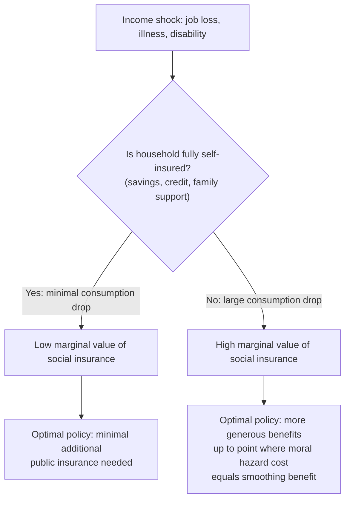

## Consumption Smoothing Objectives

### Overview and Conceptual Foundation

Consumption smoothing is the principal welfare rationale for social insurance: given that individuals are risk-averse and face imperfect access to private insurance and credit markets, social insurance programs generate welfare gains primarily by reducing fluctuations in consumption across states of the world (unemployment vs. employment, sick vs. healthy, retired vs. working) rather than by increasing expected income per se. This objective is distinct from, though often complementary to, redistributive objectives, and it provides the theoretical foundation for the Baily-Chetty sufficient statistics framework used to evaluate optimal social insurance generosity.

### Theoretical Basis: Expected Utility and Risk Aversion

Under standard expected utility theory with a concave (risk-averse) utility function $u(c)$, an individual facing income uncertainty values a certain, smoothed consumption path more than an uncertain path with the same expected value:

$$u(E[c]) > E[u(c)]$$

by Jensen's inequality (strict concavity). This gap — the individual's willingness to pay to avoid consumption risk — is the fundamental source of insurance value and is formally captured by the **risk premium** or **certainty equivalent** concept:

$$u(CE) = E[u(c)]$$

where $CE < E[c]$ is the certainty equivalent consumption level, and $E[c] - CE$ measures the individual's willingness to pay to eliminate the risk entirely.

### The Life-Cycle/Permanent Income Framework

Consumption smoothing objectives are grounded in the **life-cycle/permanent income hypothesis** (Modigliani-Brumberg, 1954; Friedman, 1957), which posits that rational, forward-looking individuals attempt to smooth consumption relative to *permanent* (lifetime) income rather than responding one-for-one to transitory income fluctuations. Social insurance is relevant precisely because:

- Individuals often **cannot fully self-insure** against income shocks through private saving and borrowing, due to borrowing constraints, limited access to credit, or insufficient buffer-stock savings
- Large, unpredictable shocks (job loss, disability, major illness) can exceed what most households have saved, leading to sharp consumption drops absent external insurance
- Private insurance markets for many of these risks are absent or incomplete (see adverse selection, moral market failure rationales), leaving social insurance as the primary available consumption-smoothing mechanism

### Empirical Measurement: The Consumption Drop as a Sufficient Statistic

**Key Points**

- The Baily-Chetty framework identifies the **proportional consumption drop upon entering the insured state** ($\Delta c/c$, e.g., the drop in consumption upon becoming unemployed) as a **sufficient statistic** for the value of insurance, since it directly reveals how poorly individuals are self-insured against the shock in the *status quo* (absent or with existing levels of social insurance)
- A **large consumption drop** upon job loss indicates substantial uninsured risk and a high marginal value of additional UI generosity; a **small consumption drop** (e.g., because households have substantial savings, additional earners, or informal insurance) indicates the marginal value of additional public insurance is lower
- This approach avoids the need to fully specify or estimate the underlying utility function's curvature — the observed consumption response itself summarizes the relevant risk-aversion-and-self-insurance information

**Empirical findings on the consumption drop in unemployment:**

- Gruber (1997) is a canonical study finding that unemployment insurance benefits **significantly reduce the consumption drop** associated with job loss in the United States, providing direct evidence that UI performs its intended consumption-smoothing function
- [Inference] Subsequent studies across other countries and other social insurance programs (e.g., disability insurance, health insurance) have applied similar consumption-drop methodologies, generally though not universally confirming a substantial insurance value from existing programs, with the magnitude varying by country, program generosity, and the availability of alternative buffers (family support, informal credit, other household earners)

### Formal Statement of the Optimal Insurance Tradeoff

$$\text{Optimal generosity} : \quad \underbrace{u'(c_{bad}) - u'(c_{good})}_{\text{marginal consumption smoothing benefit}} = \underbrace{\text{marginal moral hazard cost}}_{\text{behavioral distortion}}$$

More precisely, in the Baily-Chetty formulation, the optimal replacement rate $b^*$ satisfies (approximately, under specific functional form assumptions):

$$\frac{b^*}{1 - b^*} \approx \frac{\gamma \cdot (\Delta c/c)}{\varepsilon}$$

where $\gamma$ is a coefficient of relative risk aversion, $\Delta c/c$ is the observed consumption drop, and $\varepsilon$ is the elasticity of unemployment duration with respect to the benefit level. This formula makes explicit that **consumption smoothing benefits enter the numerator** (larger consumption drops justify more generous insurance) while **moral hazard costs enter the denominator** (larger behavioral elasticities call for less generous insurance).

### Consumption Smoothing versus Redistribution: A Conceptual Distinction

**Key Points**

- **Consumption smoothing** operates *within* an individual's own lifetime, transferring resources from good states to bad states for the *same person* — the relevant comparison is a person's own consumption in employment versus unemployment, health versus sickness
- **Redistribution** operates *across* individuals, transferring resources from higher-lifetime-income to lower-lifetime-income people
- A program can serve one objective without the other: e.g., a perfectly experience-rated, actuarially fair mandatory insurance scheme (each individual pays premiums exactly equal to their own expected payouts) achieves pure consumption smoothing with zero redistribution
- In practice, most real-world social insurance programs (Social Security, UI, health insurance) **bundle both objectives**: benefit formulas are often progressive (redistributive) while also responding to individual-specific shocks (smoothing), and empirically disentangling how much of observed program value reflects each objective is a distinct research question (e.g., Hendren and Sprung-Keyser, 2020, MVPF framework, implicitly separates insurance value from redistributive value in policy evaluation)

### Consumption Smoothing Across the Life Cycle: Retirement Programs

Public pension systems (e.g., Social Security) serve a consumption-smoothing role distinct from short-run shock insurance:

- They address the risk of **outliving one's savings** (longevity risk) — a risk that, as discussed in the annuity puzzle literature, private markets underprovide insurance against
- They address **myopia/undersaving risk** — even absent longevity risk per se, if individuals systematically undersave for retirement due to present bias, mandatory contribution systems enforce a smoother lifetime consumption path than voluntary private saving would generate
- They provide insurance against **investment/market risk** in defined-benefit-style public systems, and against **macroeconomic/labor market risk** realized late in a working career (e.g., involuntary early retirement due to job loss shortly before planned retirement)

### Health Insurance and Consumption Smoothing

Health insurance serves a consumption-smoothing role primarily against **large, unpredictable medical expenditure shocks**:

- The primary insurance value of health insurance, from a consumption-smoothing perspective, is protection against **catastrophic financial risk** (e.g., a major surgery or chronic illness diagnosis), not necessarily the routine, predictable component of medical spending
- This underlies the standard prescription (see Moral Hazard content) for health insurance contracts with meaningful cost-sharing on routine/discretionary care but strong catastrophic protection (out-of-pocket maximums) — the consumption-smoothing objective is most acute exactly where realized costs are large and unpredictable, and least acute where costs are small and routine
- [Inference] This is part of the rationale, alongside moral hazard concerns, for high-deductible health plan designs that some policymakers and economists advocate: they preserve the catastrophic consumption-smoothing function of insurance while limiting subsidization of low-value, low-risk routine care — though this design choice is contested, since deductibles can also cause underuse of high-value preventive or maintenance care among liquidity-constrained households, a tension noted in the health economics literature [Unverified precise magnitude of this offsetting effect across different populations]

### Buffer-Stock Saving as a Substitute and Complement

The precautionary/buffer-stock savings literature (Deaton, 1991; Carroll, 1997) is directly relevant to consumption smoothing objectives in social insurance design:

- Households with access to sufficient liquid savings can self-insure against moderate, transitory income shocks without relying on social insurance, reducing the marginal welfare value of public programs for these households
- Liquidity-constrained households (low savings, limited credit access) derive substantially more consumption-smoothing value from social insurance, since they lack the private buffer to smooth consumption otherwise
- This heterogeneity implies the **optimal generosity of social insurance may differ systematically across the wealth/liquidity distribution**, motivating some proposals for means-tested or wealth-tested benefit generosity (though this raises its own incentive concerns regarding pre-shock savings behavior — a form of ex-ante moral hazard, since generous means-tested benefits can reduce the incentive to accumulate precautionary savings in the first place)

### Interaction with the Chetty (2008) Liquidity Decomposition

As discussed in the Moral Hazard treatment, part of the observed behavioral response to social insurance generosity reflects **relaxation of borrowing constraints** rather than pure substitution/incentive effects. From the consumption smoothing perspective:

- This liquidity channel is itself a **direct manifestation of the consumption-smoothing objective being served** — social insurance benefits allow liquidity-constrained individuals to avoid excessively rapid re-employment or care-seeking behavior driven by cash-flow desperation rather than genuine preference
- [Inference] This reframes part of what looks like "moral hazard cost" in duration-elasticity estimates as actually reflecting the *consumption-smoothing benefit* operating through the liquidity channel, implying that some earlier interpretations overstating pure moral hazard costs (and thus understating optimal generosity) may have failed to separate these two conceptually distinct effects

### Measuring Consumption Smoothing Value: The Marginal Value of Public Funds (MVPF) Approach

The Hendren and Sprung-Keyser (2020) MVPF framework provides a unified way to compare consumption-smoothing (and other) benefits of social programs against their fiscal cost:

$$\text{MVPF} = \frac{\text{Willingness to pay for the program (including insurance value)}}{\text{Net government cost}}$$

- For social insurance programs, the willingness-to-pay component explicitly incorporates the **insurance/consumption-smoothing value** in addition to any direct transfer value, distinguishing it from pure cash transfer programs where willingness-to-pay approximately equals the transfer amount
- [Inference] This framework has been used to argue that certain social insurance programs with strong consumption-smoothing rationale (e.g., some disability and unemployment insurance expansions) can have very high MVPF, sometimes exceeding 1 (indicating the program's value to recipients, including insurance value, exceeds its net cost to government after accounting for behavioral/fiscal externality feedback), though estimates are program- and context-specific and should not be extrapolated without caution across very different populations or benefit levels

### Related Topics

- Baily-Chetty Sufficient Statistics Formula for Optimal Social Insurance
- Moral Hazard in Social Insurance and the Liquidity-Moral Hazard Decomposition (Chetty 2008)
- Permanent Income and Life-Cycle Consumption Models
- Precautionary Savings and Buffer-Stock Behavior (Deaton, Carroll)
- Marginal Value of Public Funds (MVPF) Framework (Hendren-Sprung-Keyser)
- Longevity Risk and the Rationale for Public Pension Systems
- Catastrophic versus Routine Health Care Cost-Sharing Design
- Consumption Smoothing versus Redistribution as Distinct Policy Objectives
- Gruber (1997) and Empirical Estimates of UI Consumption-Smoothing Value
- Means-Tested Benefit Design and Ex-Ante Moral Hazard on Savings