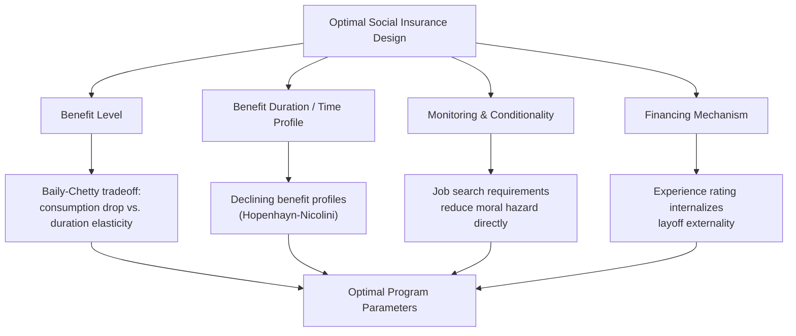

## Optimal Social Insurance Design

### Overview

Optimal social insurance design synthesizes the core tensions developed across the study of social insurance — consumption smoothing benefits, moral hazard costs, adverse selection, and redistribution — into a unified framework for setting program parameters: benefit levels, duration, eligibility rules, financing mechanisms, and conditionality requirements. The central methodological contribution is the **sufficient statistics approach** (Baily, 1978; Chetty, 2006), which allows optimal policy characterization using a small number of empirically estimable parameters rather than requiring a fully specified structural model of the economy.

### The Sufficient Statistics Methodology

**Key Points**

- Rather than estimating deep structural parameters (utility function curvature, full behavioral models), the sufficient statistics approach identifies a small set of **reduced-form, empirically estimable elasticities and moments** that, combined with a welfare-theoretic envelope condition, characterize the optimal policy to a first-order approximation
- This approach was pioneered in optimal taxation (Feldstein, 1999; Saez, 2001) and extended systematically to social insurance by Chetty (2006, 2008) and Chetty and Finkelstein (2013)
- The key advantage: sufficient statistics formulas are **robust to many structural modeling choices** (e.g., the specific functional form of the utility function or job search model) because they rely on envelope-theorem logic — at the optimum, first-order behavioral responses do not directly affect welfare, only the identified statistics matter

### General Structure of the Optimal Insurance Formula

The canonical Baily-Chetty condition equates, at the margin, the value of additional consumption smoothing against the cost of additional behavioral distortion:

\underbrace{E[u'(c_{bad})] - E[u'(c_{good})]}_{\text{Consumption-smoothing benefit of raising benefit level}} = \underbrace{\text{Fiscal externality from behavioral response}}_{\text{Moral hazard cost}}$MMM

Restated in the widely used elasticity form for unemployment insurance:

$$\frac{b^*}{1-b^*} = \frac{1}{\varepsilon} \cdot \left(\frac{c_e - c_u}{c_u}\right) \cdot \gamma$$

where $b^*$ is the optimal replacement rate, $\varepsilon$ is the elasticity of unemployment duration with respect to benefits, $(c_e - c_u)/c_u$ is the consumption drop upon unemployment, and $\gamma$ is a curvature/risk-aversion parameter. **Higher consumption drops and lower elasticities both push toward more generous optimal benefits.**

### Key Design Dimensions

**1. Benefit Level (Replacement Rate)**

- Determined by the core Baily-Chetty tradeoff above
- Empirically, most OECD unemployment insurance systems set replacement rates in the range of 40–70% of prior earnings, varying substantially by country and often declining over the benefit spell
- [Unverified] Precise optimal replacement rates depend sensitively on locally estimated elasticities and consumption drops, which vary by country, time period, and demographic group, so a single universally "optimal" number is not implied by the theory

**2. Benefit Duration and Time-Varying Profiles**

- The static Baily-Chetty framework can be extended dynamically: since moral hazard incentives accumulate over an unemployment spell (search effort responds throughout, not just at the outset), theoretically optimal benefit paths often **decline over the spell** rather than remaining flat
- Hopenhayn and Nicolini (1997) derive a fully dynamic optimal UI contract featuring declining benefits over time and, in some formulations, a **re-employment tax** (a wage tax that persists after re-employment, tied to how long the spell lasted) to preserve search incentives even after the unemployment spell ends, addressing the fact that job search effort remains only partially observable/verifiable throughout
- Empirical benefit exhaustion effects (documented spikes in job-finding at the point benefits run out) provide indirect evidence that benefit *duration* itself carries substantial moral hazard weight, independent of the benefit *level*

**3. Monitoring and Conditionality**

- Job search requirements, mandatory reporting, and sanctions for insufficient search effort function as a **complement or substitute for benefit level reductions**, targeting the moral hazard margin directly rather than reducing the consumption-smoothing benefit for compliant searchers
- [Inference] Optimal design, in principle, combines a benefit level informed by the smoothing-versus-hazard tradeoff *and* a monitoring intensity chosen to shift the elasticity $\varepsilon$ itself (making search less responsive to benefit generosity by directly incentivizing/enforcing effort), effectively allowing a more generous benefit level to be sustained at a given moral hazard cost — though monitoring itself carries administrative costs and potential false-positive sanctioning of genuine job seekers who face limited opportunities

**4. Experience Rating of Financing**

- In UI systems, financing employers' payroll tax contributions based on their own layoff history (**experience rating**) internalizes part of the externality that layoffs impose on the UI system, discouraging employers from using temporary layoffs as a cost-shifting strategy
- [Inference] Incomplete experience rating (common in many U.S. states, where employer UI tax rates are capped and do not fully reflect marginal layoff costs) is argued in the literature (e.g., Feldstein, 1976) to subsidize temporary layoffs relative to a fully experience-rated system, though the quantitative magnitude of this distortion in practice is contested and depends on state-specific tax schedule design

### Extensive versus Intensive Margin Design Implications

As in optimal taxation, social insurance design must account for both the **intensive margin** (how much effort/search/utilization changes conditional on being in the insured state) and the **extensive margin** (whether individuals enter or exit labor force participation, or work at all):

- When extensive margin responses are important (e.g., low-wage workers deciding whether to work at all, given available benefits), optimal policy can favor **earnings subsidies or negative effective tax rates** at low income levels (e.g., EITC-style wage subsidies) rather than pure unconditional benefit generosity, since the latter can discourage labor force attachment entirely
- This extensive-margin consideration is a major reason many welfare/UI systems combine **time limits, work requirements, or phased benefit reduction schedules** with earnings supplements, rather than relying solely on the intensive-margin Baily-Chetty framework

### Interaction with Adverse Selection: Mandatory Pooling as a Design Primitive

Optimal social insurance design typically presupposes **mandatory, universal (or near-universal) participation** precisely because voluntary insurance markets facing the same risks would be vulnerable to adverse-selection-driven unraveling (see Rothschild-Stiglitz framework). This means the "optimal design" question in social insurance is generally posed *conditional on* mandatory participation already solving the adverse selection problem, with the remaining design questions concerning generosity, duration, and conditionality being primarily about the **moral hazard-consumption smoothing tradeoff** rather than the selection problem per se.

### Redistribution as an Additional Design Layer

- Optimal social insurance design in a Mirrleesian-adjacent framework can incorporate **redistributive objectives** alongside pure insurance objectives, since the social welfare function typically places higher marginal weight on lower-income/lower-lifetime-earnings individuals
- This can justify **progressive benefit formulas** — e.g., Social Security's progressive Primary Insurance Amount formula, which replaces a higher fraction of pre-retirement earnings for low earners — that go beyond what a pure actuarially-neutral consumption-smoothing objective alone would prescribe
- [Inference] Formally, the optimal generosity formula generalizes to include social marginal welfare weights $g$ analogous to the optimal taxation formula, so that redistributive social insurance design becomes a special case of the broader Mirrleesian optimal tax-and-transfer problem, with the added feature that benefits are explicitly tied to a verifiable "bad state" (unemployment, disability, illness) rather than purely to income level

### Empirical Implementation Challenges

- **Estimating elasticities credibly** requires quasi-experimental variation (discontinuities in benefit formulas, randomly assigned disability examiners, unemployment insurance policy reforms) since simple cross-sectional correlations conflate selection, moral hazard, and reverse causality
- **Consumption drop measurement** requires high-quality panel data on household consumption around the time of the shock, which is harder to obtain than income or benefit receipt data in many countries, limiting the geographic and program scope of directly estimated Baily-Chetty parameters
- **General equilibrium and macro feedback effects** (e.g., how aggregate UI generosity affects overall labor market tightness, wage-setting, and business cycle dynamics) are often abstracted from in micro-based sufficient statistics estimates, motivating extensions incorporating macro/general equilibrium considerations (Landais, Michaillat, Saez, 2018), particularly the argument for **countercyclical optimal UI generosity**

### Comparative Framework Summary

| Design Question | Governing Tradeoff | Relevant Literature |
| --- | --- | --- |
| Benefit level | Consumption smoothing vs. intensive-margin moral hazard | Baily (1978), Chetty (2006) |
| Benefit duration/profile | Accumulating moral hazard over spell | Hopenhayn-Nicolini (1997) |
| Extensive margin design | Labor force attachment vs. income support | Diamond (1980), Saez (2002) |
| Financing/experience rating | Internalizing layoff externality | Feldstein (1976) |
| Redistribution layer | Equity vs. efficiency (Mirrleesian) | Mirrlees (1971) applied to social insurance |
| Countercyclical adjustment | Job-finding difficulty vs. moral hazard cost varies over cycle | Landais, Michaillat, Saez (2018) |

### Illustrative Numerical Application

**Example**

Suppose empirical estimates find: consumption drop upon unemployment $\Delta c/c = 0.20$ (20% consumption decline), duration elasticity $\varepsilon = 0.5$, and coefficient of relative risk aversion $\gamma \approx 2$.

Applying the simplified Baily-Chetty approximation:

$$\frac{b^*}{1-b^*} \approx \gamma \cdot \frac{\Delta c/c}{\varepsilon} = 2 \times \frac{0.20}{0.5} = 0.8$$

Solving: $b^* \approx 0.44$, suggesting an optimal replacement rate near 44% under these illustrative parameter values. [Inference] This stylized calculation is illustrative of the *methodology*, not a policy recommendation — actual optimal rates are highly sensitive to locally estimated parameters, functional form assumptions embedded in the approximation, and the extent to which liquidity effects (Chetty, 2008) versus pure moral hazard drive the observed elasticity.

### Related Topics

- Baily-Chetty Sufficient Statistics Framework
- Hopenhayn-Nicolini Dynamic Optimal Unemployment Insurance
- Consumption Smoothing Objectives in Social Insurance
- Moral Hazard in Social Insurance
- Extensive Margin Labor Supply and Earned Income Tax Credit Design
- Countercyclical Unemployment Insurance (Landais-Michaillat-Saez)
- Experience Rating and Employer Layoff Incentives
- Mirrleesian Redistribution Applied to Conditional Transfer Programs
- Marginal Value of Public Funds and Program Evaluation
- Rationale for Social versus Private Insurance (Mandatory Pooling Precondition)