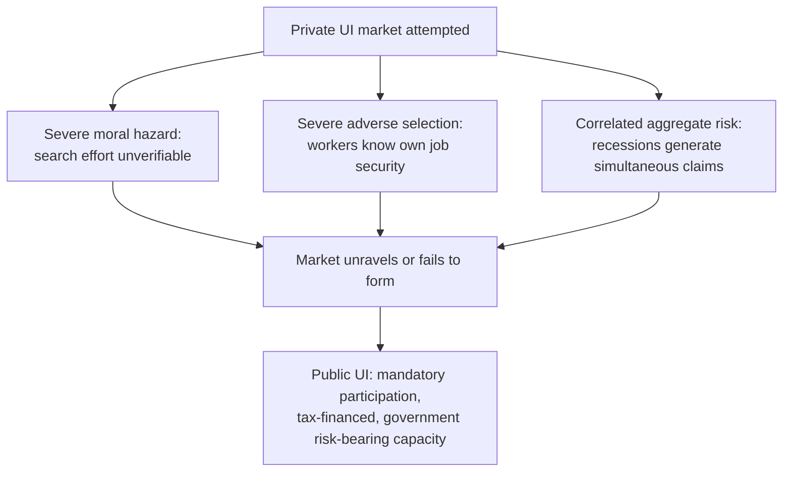

## Rationale for Public Unemployment Insurance

### Overview

Public unemployment insurance (UI) is justified by a combination of market failure arguments specific to the market for insuring against job loss, alongside macroeconomic stabilization and redistributive considerations. While the general "social versus private insurance" rationale (adverse selection, moral hazard interactions, mandatory pooling) applies to UI as a specific case, unemployment risk has several distinctive features that reinforce and extend the case for public provision beyond what applies to insurance markets generally.

### The Near-Total Absence of Private Unemployment Insurance Markets

**Key Points**

- Private, voluntary unemployment insurance markets are essentially nonexistent worldwide, in sharp contrast to private markets for life, auto, and (to varying degrees) health and disability insurance
- This near-total market absence, rather than merely thin or imperfect private markets, is itself the central empirical fact requiring explanation, and reflects a especially severe combination of adverse selection and moral hazard problems specific to job loss risk

**Why private UI markets fail more severely than other insurance lines:**

1. **Severe moral hazard**: job search effort and the reservation wage are almost entirely unobservable and unverifiable by an outside insurer, far more so than, e.g., health care utilization (which at least generates a paper trail of provider visits) or auto accidents (which generate police/claims reports). An insurer attempting to verify "sufficient job search effort" faces a much harder monitoring problem than verifying a medical claim or an accident.
2. **Severe adverse selection**: individuals possess substantial private information about their own job security (performance reviews, awareness of firm financial distress, personal relationship with management, industry-specific knowledge) that would be prohibitively costly or legally/practically impossible for an insurer to verify or price accurately at the individual level
3. **Correlated/aggregate risk**: unemployment risk is **highly correlated across individuals** during recessions — precisely when many people would want to draw on unemployment insurance simultaneously, a private insurer's diversification benefit from pooling across policyholders breaks down, since large numbers of claims arrive together, straining insurer solvency exactly when aggregate economic conditions make it hardest to raise additional capital or reinsurance
4. **Duration risk and dynamic selection**: unlike a discrete health event, unemployment spells vary enormously in duration and are influenced by the individual's own subsequent choices throughout the spell, compounding both the moral hazard and adverse selection problems in a dynamic, path-dependent way that is harder to contract around than a one-time insurable event

### Aggregate/Correlated Risk and the Government's Comparative Advantage

- Because unemployment risk is strongly correlated with the business cycle, insuring against it requires bearing substantial **aggregate risk**, not just idiosyncratic risk
- Private insurers, subject to solvency regulation and capital requirements, are structurally poorly suited to bearing aggregate risk that materializes economy-wide and simultaneously, since there is no large enough diversified counterparty willing to absorb it at reasonable cost absent government backing
- Government, via its taxation power, ability to run deficits, and capacity to spread the cost of a recession's UI claims across the broader tax base and over time (borrowing against future tax revenue), has a **comparative advantage in bearing aggregate/macroeconomic risk** that private capital markets and insurers structurally lack (Gordon and Varian, 1988) — this argument parallels the rationale for government provision of other aggregate-risk-exposed social insurance (e.g., pension systems bearing longevity/demographic risk)

### Macroeconomic Stabilization Function

Beyond the microeconomic insurance rationale, public UI serves as an **automatic fiscal stabilizer**:

- UI benefit payments automatically rise during recessions (as unemployment increases) and fall during expansions, injecting spending power into the economy precisely when aggregate demand is weak, without requiring discretionary legislative action
- [Inference] This countercyclical spending pattern is widely credited in the macroeconomics literature with dampening the severity of economic downturns, complementing (and to some degree providing an independent rationale beyond) the pure micro-level consumption-smoothing insurance argument — this stabilization role is sometimes cited as a reason optimal UI generosity should itself be countercyclical (more generous during recessions), as formalized by Landais, Michaillat, and Saez (2018), who argue that when labor markets are slack, the moral hazard cost of UI (in terms of reduced job search) is lower because job-finding is harder regardless, while the consumption-smoothing benefit remains high or rises

### Consumption Smoothing Rationale Specific to Job Loss

As developed in the general Consumption Smoothing Objectives content, job loss represents a canonical example of a shock against which many households are poorly self-insured:

- Gruber (1997) empirically demonstrates that unemployment insurance meaningfully reduces the consumption drop associated with job loss in the United States, directly evidencing the consumption-smoothing value of the program
- Absent UI, many households — particularly those with limited liquid savings — would face severe consumption disruption during unemployment spells, a risk that (per the arguments above) private markets do not provide meaningful voluntary insurance against

### Externalities and Search Behavior: A Nuanced Consideration

**Key Points**

- Beyond pure insurance value, some search-theoretic models suggest UI can generate **positive externalities on match quality**: by relaxing the financial pressure to accept the first available job offer, UI may allow workers to search longer and find better job matches (higher wage, better skill fit), potentially improving aggregate labor market efficiency, not just individual welfare
- This "search externality" argument is more nuanced and contested than the pure insurance rationale, since it depends on whether individual search decisions without UI are inefficiently *short* (workers settling for poor matches due to liquidity pressure) versus efficient from a decentralized search-theoretic equilibrium perspective — the theoretical prediction is ambiguous and the empirical evidence is mixed across studies and contexts [Unverified — the sign and magnitude of aggregate match-quality effects of UI generosity is not a settled empirical question]

### Redistribution and Risk Correlation with Income

- Unemployment risk, like many insurable risks relevant to social insurance, is **not randomly distributed across the income distribution** — lower-wage, less-educated, and more cyclically-exposed-industry workers face systematically higher unemployment risk and often have less access to private savings buffers or informal insurance (family wealth, spousal income)
- This means UI, even when designed to be actuarially neutral in a narrow sense, tends to be redistributive in practice, since the population drawing benefits is disproportionately composed of lower-income and higher-risk workers relative to the general tax base funding the program
- [Inference] Some UI systems explicitly incorporate progressive replacement rate structures (replacing a higher fraction of pre-job-loss earnings for lower earners) reflecting a deliberate redistributive design choice layered atop the pure insurance rationale, consistent with the Mirrleesian logic of combining insurance and redistribution objectives

### Employer-Provided Alternatives and Their Limits

- In principle, employers could offer severance pay or private unemployment benefits as part of compensation packages, and some do (particularly for higher-skilled or unionized positions)
- However, employer-provided severance faces its own limitations: it is typically not actuarially calibrated to broader unemployment risk, is often unavailable to lower-wage or less unionized workers, does not address firm-specific insolvency risk (a firm going bankrupt cannot pay severance from a fund it no longer has), and does not provide the risk-pooling benefits of a broad, mandatory, economy-wide system
- [Inference] This suggests employer-based severance and public UI are complements rather than substitutes in most economies, with public UI providing a baseline universal floor and employer arrangements providing supplementary, often more generous coverage for specific segments of the workforce

### Financing Considerations: Payroll Tax and Experience Rating

- Public UI in most countries is financed via payroll taxes, often with some degree of **experience rating** (employer contribution rates tied to their historical layoff frequency), which partially internalizes the social cost of layoffs onto the firms generating them
- [Inference] Incomplete experience rating (common due to caps on maximum employer tax rates in many U.S. states) is argued (Feldstein, 1976; Topel, 1983) to create an implicit subsidy for temporary layoffs, since employers do not bear the full marginal cost of laying off workers who subsequently draw UI benefits — this remains a design tension between administrative simplicity/political feasibility and full incentive alignment

### International Variation in UI System Design and Underlying Rationale Application

| System Feature | High-Replacement, Long-Duration Model (e.g., some Continental European systems) | Lower-Replacement, Shorter-Duration Model (e.g., U.S. baseline system) |
| --- | --- | --- |
| Emphasis | Strong consumption smoothing, generous income replacement | More limited insurance, tighter moral hazard control |
| Typical replacement rate | Often 60–80%+ initially | Often 40–50% |
| Typical maximum duration | Can extend beyond 12 months, sometimes with additional means-tested follow-on benefits | Often 26 weeks baseline (with extensions during recessions) |
| Job search conditionality | Varies; often paired with active labor market policies | Job search requirements and monitoring generally present |

[Unverified] Cross-country comparisons of these design choices and their welfare implications are complicated by differing labor market institutions (employment protection legislation, collective bargaining coverage, active labor market program intensity), making direct generosity comparisons an incomplete guide to overall system efficiency or worker welfare.

### Summary: Layered Rationale for Public UI

**Conclusion**

The case for public unemployment insurance rests on a **layered set of complementary arguments**: (1) private markets for this specific risk fail almost completely due to an unusually severe combination of moral hazard, adverse selection, and correlated aggregate risk; (2) government possesses a comparative advantage in bearing the aggregate/business-cycle component of unemployment risk; (3) UI serves a valuable macroeconomic stabilization function as an automatic fiscal stabilizer; (4) UI provides direct consumption-smoothing value against a shock many households are poorly self-insured against; and (5) UI carries an incidental but often deliberately reinforced redistributive function given the correlation between unemployment risk and lower lifetime income. These arguments jointly explain both *why* UI is public rather than private, and inform *how* it should optimally be designed (see Optimal Social Insurance Design), particularly regarding the tradeoff between generosity and moral hazard.

### Related Topics

- Rationale for Social versus Private Insurance
- Optimal Social Insurance Design and the Baily-Chetty Framework
- Consumption Smoothing Objectives
- Countercyclical Unemployment Insurance (Landais-Michaillat-Saez)
- Automatic Fiscal Stabilizers in Macroeconomic Policy
- Experience Rating and Employer Layoff Incentives (Feldstein, Topel)
- Search Theory and Job Match Quality Externalities
- Comparative Unemployment Insurance Systems (OECD Design Variation)
- Active Labor Market Policies as a Complement to Passive UI
- Gordon-Varian Intergenerational and Aggregate Risk-Sharing