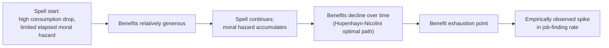

## Optimal Unemployment Benefit Design

### Overview

Optimal unemployment benefit design applies the general Baily-Chetty sufficient statistics framework to the specific parameters that characterize real-world unemployment insurance (UI) systems: the replacement rate, potential benefit duration, the time-path of benefits over a spell, waiting periods, experience-rated financing, and job search conditionality. While the Rationale for Public UI chapter established *why* government provides this insurance, this content addresses *how* benefit parameters should optimally be set given the consumption-smoothing versus moral hazard tradeoff, extended to incorporate dynamic, liquidity, and macroeconomic considerations.

### The Core Static Tradeoff Revisited

The foundational condition, developed in Baily (1978) and reformulated by Chetty (2006), sets the optimal replacement rate $b^*$ where the marginal consumption-smoothing benefit of a small increase in benefits equals the marginal fiscal cost from the induced behavioral (duration) response:

$$\frac{b^*}{1-b^*} = \frac{1}{\varepsilon} \cdot \frac{c_e - c_u}{c_u} \cdot \gamma$$

This static formula treats the replacement rate as a single scalar choice variable. Optimal design in practice requires extending this logic along several additional dimensions.

### Dimension 1: Benefit Level (Replacement Rate)

**Key Points**

- Empirically implementing the Baily-Chetty formula requires two sufficient statistics: the **consumption drop** upon job loss ($\Delta c/c$) and the **elasticity of unemployment duration** with respect to the benefit level ($\varepsilon$)
- Higher estimated consumption drops (indicating poor self-insurance) push the optimal replacement rate up; higher estimated duration elasticities (indicating larger moral hazard responses) push it down
- Most quasi-experimental estimates of the UI duration elasticity in the U.S. context cluster in the range of roughly 0.3–1.0, though [Unverified] the precise value varies substantially by study design, time period, labor market tightness, and demographic subgroup, and estimates from other countries with different institutional settings can differ meaningfully

**Heterogeneity considerations:**

- [Inference] Because both the consumption drop and the duration elasticity likely vary across the population (by income, liquidity, family structure, local labor market conditions), a single uniform replacement rate is unlikely to be exactly optimal for all workers — this motivates interest in **means-tested or liquidity-tested benefit generosity**, though implementing such differentiation raises administrative complexity and potential new incentive distortions (e.g., reduced incentive to accumulate precautionary savings pre-unemployment, a form of ex-ante moral hazard)

### Dimension 2: Benefit Duration and Time-Varying Profiles

**The Hopenhayn-Nicolini (1997) Dynamic Optimal Contract**

The static Baily-Chetty framework treats the unemployment spell as a single decision point, but job search effort is exerted continuously throughout a spell, and moral hazard incentives can compound dynamically. Hopenhayn and Nicolini formalize the **fully dynamic optimal UI contract** using a repeated moral hazard / mechanism design approach (related to the broader Mirrleesian dynamic contracting literature):

- The optimal benefit path **declines monotonically over the unemployment spell** — early in unemployment, benefits are relatively generous (reflecting a still-large uninsured consumption shock and limited elapsed moral hazard exposure), but decline as duration lengthens, sharpening the incentive to find work as time passes
- The model additionally derives an optimal **re-employment tax**: even after finding a new job, a worker who experienced a longer unemployment spell faces a somewhat higher effective tax rate on subsequent earnings, extending the incentive-compatibility constraint beyond the unemployment spell itself, since accumulated moral hazard incentives during the spell would otherwise be under-addressed by benefit cuts alone
- [Inference] This dynamic contract is rarely implemented in its pure theoretical form in real-world UI systems (re-employment taxes in particular are uncommon), but the qualitative implication — declining benefit profiles over the spell — is reflected in many actual UI systems' structure, and the theoretical result provides a normative benchmark against which observed benefit-duration schedules can be compared

**Benefit exhaustion effects as empirical validation:**

- The well-documented spike in job-finding rates at the point of benefit exhaustion (Katz and Meyer, 1990; Card, Chetty, Weber, 2007) is consistent with the qualitative logic of declining-incentive-preserving benefit design, and has motivated policy interest in smoothing the benefit reduction (rather than an abrupt cliff at exhaustion) to reduce the discontinuous behavioral distortion around the exhaustion point

### Dimension 3: Extensive Margin and Earnings Subsidies

Optimal design must also consider the **extensive margin** — whether unemployed individuals choose to search for and accept work at all, versus exiting the labor force entirely:

- When benefits are conditioned in ways that discourage part-time or lower-wage re-employment (e.g., steep effective benefit reduction rates upon partial earnings), workers may rationally decline available work to preserve benefit eligibility, an extensive-margin distortion beyond the pure search-intensity (intensive margin) effect
- Design responses include **earnings disregards** (allowing some earned income while still receiving partial UI benefits) and **re-employment bonuses** (lump-sum payments for finding work quickly), intended to preserve extensive-margin work incentives while retaining insurance value
- [Inference] The broader Diamond-Saez extensive margin logic from optimal taxation theory suggests that when extensive-margin responses are quantitatively important, optimal transfer design should feature **earnings subsidies rather than pure unconditional income replacement**, paralleling the EITC-style rationale developed in optimal income taxation

### Dimension 4: Monitoring, Job Search Requirements, and Sanctions

**Key Points**

- Job search monitoring and mandatory reporting requirements function as a **direct moral hazard mitigation tool distinct from benefit level reductions**, since they target the observability problem itself rather than reducing the consumption-smoothing value of the program for genuinely diligent searchers
- Empirical studies using policy variation in monitoring intensity (e.g., increased reporting requirements, in-person verification, sanctions for noncompliance) generally find that **stricter monitoring reduces unemployment duration**, consistent with a moral hazard mechanism, though [Unverified] the welfare implications depend on whether the induced faster exit reflects genuine previously-insufficient search effort being corrected, or excessive pressure pushing some workers into poor-quality job matches or out of the labor force into non-UI-covered states
- [Inference] Optimal design in principle jointly chooses benefit generosity *and* monitoring intensity, since more effective monitoring can allow a given level of benefit generosity to be sustained with a lower realized elasticity $\varepsilon$, effectively shifting the Baily-Chetty tradeoff in favor of more generous benefits — though monitoring itself is costly to administer and imperfect, generating both false negatives (undetected shirking) and potential false positives (sanctioning genuine searchers facing weak local labor demand)

### Dimension 5: Financing Structure and Experience Rating

- **Experience rating** ties employer UI tax contributions to their own historical layoff frequency, internalizing part of the social cost of layoffs onto the firms generating them and discouraging strategic use of temporary layoffs as a cost-shifting mechanism (Feldstein, 1976; Topel, 1983)
- Most U.S. states feature **incomplete experience rating** due to statutory caps on maximum employer tax rates, meaning some firms with high layoff rates do not bear the full marginal cost of additional layoffs, a design feature argued to create an implicit subsidy to temporary/seasonal layoffs
- [Inference] Fully experience-rated financing would, in principle, better align private layoff incentives with social cost, but faces political economy and practical constraints — very high experience-rated tax rates on cyclically volatile or seasonal industries could impose severe cash-flow burdens exactly when those firms are financially weakest, creating a tension between incentive alignment and firm liquidity/solvency considerations

### Dimension 6: Countercyclical Benefit Generosity

**Key Points**

- Landais, Michaillat, and Saez (2018) extend the optimal UI framework to incorporate **labor market slack/matching frictions**, arguing that the *moral hazard cost* of UI generosity is lower during recessions (since job-finding is difficult for structural/aggregate demand reasons largely independent of individual search effort) while the *consumption-smoothing benefit* remains high or increases (given longer expected unemployment durations and depleted household buffers)
- This generates a normative case for **automatically countercyclical UI generosity** — more generous benefit levels and/or longer potential duration during recessions, tapering during expansions — which is reflected in practice by many countries' (including the U.S.) history of temporary extended benefit programs enacted during major recessions (e.g., 2008–09 financial crisis, 2020 COVID-19 pandemic)
- [Inference] Whether *ad hoc*, legislatively-triggered extensions achieve the theoretically optimal countercyclical pattern, versus a pre-committed automatic formula tied to real-time labor market indicators (e.g., state unemployment rate triggers, as used in the U.S. Extended Benefits program), is a design question with tradeoffs between political responsiveness/flexibility and predictability/commitment credibility

### Interaction Between Design Dimensions: A Synthesis

The various design dimensions are not independent; effective optimal design requires considering their interaction:

| Design Lever | Primary Target | Interacts With |
| --- | --- | --- |
| Replacement rate level | Static consumption-smoothing vs. moral hazard | Duration profile, monitoring intensity |
| Declining benefit path | Dynamic/accumulating moral hazard | Benefit exhaustion behavioral spikes |
| Earnings disregards/re-employment bonuses | Extensive margin distortions | Replacement rate design |
| Job search monitoring | Observability of effort | Effective elasticity $\varepsilon$, hence optimal replacement rate |
| Experience rating | Employer layoff incentive | Overall UI system financing sustainability |
| Countercyclical adjustment | Time-varying moral hazard/smoothing tradeoff | All static parameters, reframed as cyclically state-contingent |

### Illustrative Application: Comparing Flat versus Declining Benefit Schedules

**Example**

Consider two stylized UI schedules for a 26-week benefit period:

- **Schedule A (flat)**: 50% replacement rate for all 26 weeks
- **Schedule B (declining)**: 65% replacement rate for weeks 1–8, declining linearly to 30% by week 26

[Inference] Under the Hopenhayn-Nicolini logic, Schedule B better aligns benefit generosity with the evolving consumption-smoothing-versus-moral-hazard tradeoff over the spell: early weeks (high uninsured consumption risk, limited elapsed moral hazard) receive more generous replacement, while later weeks (search incentives more critical to preserve as the spell lengthens) receive less. Whether Schedule B strictly dominates Schedule A in realized welfare depends on the specific empirically estimated elasticity and consumption-drop parameters at each point in the spell, which is why implementing genuinely optimal dynamic schedules in practice requires granular, spell-duration-specific empirical estimates rather than relying on the qualitative theoretical result alone.

### Ongoing Debates and Open Design Questions

- **Optimal degree of means-testing**: whether benefit generosity should vary with household wealth/liquidity, and how to do so without undermining ex-ante savings incentives
- **Automatic stabilizer design**: whether countercyclical benefit extensions should be legislatively discretionary or formulaically automatic (triggered by real-time labor market indicators)
- **Role of active labor market policies**: whether job training, placement services, and wage subsidies should substitute for or complement passive income replacement in optimal system design
- [Speculation] The extent to which technological change and the rise of non-traditional work arrangements (gig work, platform-based employment) require fundamental redesign of UI eligibility and financing structures, versus incremental adaptation of the existing framework, remains an unsettled and actively evolving area of both academic research and policy experimentation

### Related Topics

- Baily-Chetty Sufficient Statistics Framework
- Hopenhayn-Nicolini Dynamic Optimal Unemployment Insurance Contracts
- Countercyclical Unemployment Insurance (Landais-Michaillat-Saez)
- Rationale for Public Unemployment Insurance
- Moral Hazard in Social Insurance
- Consumption Smoothing Objectives
- Extensive Margin Labor Supply and Earnings Subsidy Design
- Experience Rating and Employer Layoff Incentives
- Benefit Exhaustion Effects and Job-Finding Discontinuities
- Active Labor Market Policies and UI System Complementarities