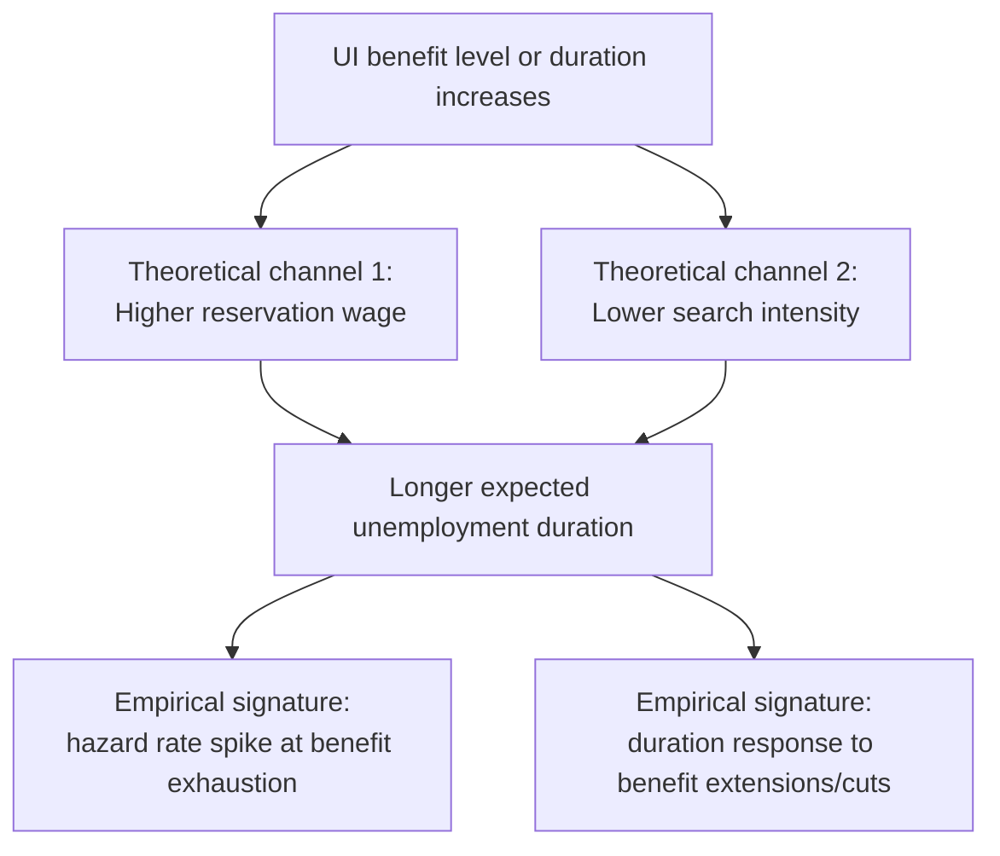

## Effects on Job Search and Unemployment Duration

### Overview

The empirical study of how unemployment insurance (UI) affects job search behavior and unemployment duration constitutes the core evidentiary basis for the moral hazard side of the Baily-Chetty optimal insurance framework. This body of research spans theoretical job search models, natural experiments exploiting policy discontinuities, and more recent work decomposing behavioral responses into distinct economic mechanisms (moral hazard, liquidity, and general equilibrium/spillover effects).

### Theoretical Framework: The Job Search Model

The standard non-sequential or sequential job search model provides the theoretical backbone for understanding UI's behavioral effects:

- Unemployed workers receive job offers at some arrival rate (search intensity) drawn from a wage offer distribution, and set a **reservation wage** below which they reject offers and continue searching
- UI benefits enter the model by raising the value of remaining unemployed (the "outside option" while searching), which theoretically:
  1. Raises the optimal reservation wage (workers become more selective)
  2. Reduces optimal search intensity/effort (since the cost of remaining unemployed is lower)
  3. Both channels operate to **increase expected unemployment duration**

$$w^* = \text{reservation wage}, \quad \frac{\partial w^*}{\partial b} > 0, \quad \frac{\partial (\text{search effort})}{\partial b} < 0$$

where $b$ is the benefit level. These comparative statics generate the standard prediction that **more generous UI benefits (higher level or longer potential duration) increase unemployment duration** — the theoretical foundation for expecting a positive duration elasticity $\varepsilon$ in the Baily-Chetty formula.

### Empirical Estimation Strategies

**Key Points**

- Because benefit generosity is rarely randomly assigned, credible identification of causal effects on duration requires quasi-experimental variation: discontinuities in benefit formulas by prior earnings, policy-driven changes in maximum benefit duration, state-level policy variation exploited via difference-in-differences, and regression discontinuity designs around eligibility or benefit-amount thresholds
- **Benefit level variation**: studies exploit kinks or discontinuities in how benefit amounts are calculated from prior earnings (e.g., replacement rate formulas with caps) to estimate the elasticity of duration with respect to the benefit *level*
- **Benefit duration variation**: studies exploit legislated extensions or reductions in maximum benefit *duration* (e.g., U.S. Extended Benefits triggers, EUC08 program during the Great Recession, EU country-specific reforms) to estimate the elasticity with respect to potential duration

### Landmark Empirical Findings

**Benefit exhaustion spikes**

A robust and widely replicated finding across many countries and time periods is a **pronounced spike in the job-finding/exit rate from unemployment at or near the point of benefit exhaustion**:

- Katz and Meyer (1990) document this pattern in early U.S. data, finding hazard rates into employment rise sharply as benefit exhaustion approaches
- Card, Chetty, and Weber (2007), using Austrian administrative data, similarly find pronounced spikes at benefit exhaustion and use the setting to help decompose moral hazard from liquidity effects
- [Inference] This spike pattern is widely interpreted as strong evidence of moral hazard/incentive effects, since job search theory predicts exactly this kind of behavioral response to a known, approaching reduction in the value of continued unemployment — though the precise magnitude of the spike attributable to pure incentive effects versus liquidity exhaustion (running out of savings around the same time) required further methodological work to isolate

**Meta-analytic elasticity estimates**

- [Unverified] Reviews of the UI duration elasticity literature (e.g., surveys by Krueger and Meyer, 2002; Schmieder and von Wachter, 2016) generally report elasticities of unemployment duration with respect to the benefit *level* in a range often cited around 0.1–0.9 depending on methodology, country, and time period, and elasticities with respect to benefit *duration* frequently found to be somewhat larger in magnitude than level elasticities in several studies, though exact figures vary substantially by source and should not be treated as a single settled parameter

### The Chetty (2008) Liquidity versus Moral Hazard Decomposition

A major methodological advance addresses whether observed duration responses to UI generosity reflect **pure substitution/moral hazard** (workers choosing to search less because the cost of unemployment is lower) or **liquidity effects** (workers who would otherwise be forced by cash constraints to accept jobs quickly are able to search longer once UI relaxes the constraint, potentially finding better matches):

- Chetty (2008) uses variation in **severance pay receipt** (a lump-sum payment unrelated to ongoing job search incentives but relaxing liquidity) alongside UI benefit variation to separately identify the two channels
- Key finding: households with **low liquid assets or limited access to credit** show substantially larger duration responses to UI benefit increases than households with ample liquidity, consistent with a meaningful liquidity channel operating alongside pure moral hazard
- [Inference] This implies that a portion of the "moral hazard cost" implied by naive duration elasticity estimates actually reflects a **welfare-enhancing liquidity-relaxation effect** rather than pure inefficient search reduction, since allowing liquidity-constrained workers to search longer (rather than accepting the first available job out of desperation) can improve job match quality and long-run outcomes — this reframes part of the standard moral hazard interpretation and implies the efficiency cost of UI generosity is smaller than duration elasticities alone would suggest

### Job Match Quality Effects: Theory and Evidence

**Key Points**

- A distinct strand of research asks whether longer search enabled by UI generosity **improves job match quality** (higher subsequent wages, longer job tenure, better skill fit) — a potential efficiency benefit that could partially or fully offset the pure moral hazard cost of extended unemployment duration
- Theoretically, this is ambiguous: search models can generate either efficient or inefficient search duration depending on assumptions about externalities and market frictions
- Empirical evidence is mixed: some studies (e.g., certain applications using severance pay or benefit extension variation) find modest positive effects of UI generosity on subsequent wages or job stability, while others find limited or no detectable match quality improvement
- [Unverified] The overall balance of evidence on match quality effects has not converged to a clear consensus magnitude, and results appear sensitive to the specific labor market, time period, and worker population studied

### General Equilibrium and Spillover Effects

Much of the microeconometric literature estimates **partial equilibrium** effects (how an individual's own duration responds to their own benefit level, holding the labor market environment fixed). More recent research has examined **general equilibrium and spillover effects**:

- If UI generosity affects the labor supply/search behavior of a large share of unemployed workers simultaneously, this could affect **vacancy creation, wage-setting, and overall labor market tightness**, generating effects beyond the simple partial-equilibrium individual-level elasticity
- Some studies using regional/local labor market variation in UI generosity (e.g., exploiting cross-state extended benefit variation during the Great Recession) find evidence consistent with **general equilibrium spillovers on non-recipients** (e.g., effects on local wages or vacancy posting), complicating simple extrapolation from micro-level partial equilibrium elasticities to aggregate economy-wide effects of nationwide UI policy changes
- [Inference] This general equilibrium dimension is central to the Landais-Michaillat-Saez (2018) argument for countercyclical optimal UI generosity, since labor market slack (which affects matching frictions and vacancy availability) interacts with how individual search responses translate into aggregate employment outcomes

### Monitoring, Job Search Requirements, and Behavioral Response

Separately from benefit level/duration, direct **monitoring and conditionality** interventions have been studied for their effects on search behavior and duration:

- Randomized and quasi-experimental studies of job search monitoring intensity (e.g., mandatory in-person reporting, increased documentation requirements, sanctions for noncompliance) generally find that **stricter monitoring reduces unemployment duration**, consistent with a moral hazard mechanism operating through the observability of effort
- [Inference] Some studies find that increased monitoring induces **exit from the UI system without necessarily corresponding increases in verified employment** (e.g., exit into non-employment, informal work, or benefit non-take-up), raising questions about whether monitoring-induced duration reductions represent genuine welfare-improving incentive correction or simply benefit-receipt suppression without commensurate employment gains — this distinction matters significantly for welfare interpretation and is an active area of empirical scrutiny

### Age, Demographic, and Labor Market Condition Heterogeneity

- [Inference] Duration elasticities are frequently found to vary across demographic groups and labor market conditions: some studies find larger responses among prime-age workers relative to workers near retirement age (who may have different outside options, such as early retirement pathways), and responses have been found in some studies to vary with local labor market tightness (search responses potentially more consequential when jobs are relatively plentiful than during severe downturns, consistent with the Landais-Michaillat-Saez logic)
- [Unverified] The precise pattern and magnitude of this heterogeneity is not uniform across the literature, and results depend heavily on the specific country, time period, and identification strategy employed

### Synthesis: What the Evidence Implies for the Elasticity $\varepsilon$

**Conclusion**

The empirical literature robustly establishes that unemployment insurance benefit level and duration causally increase unemployment duration, consistent with basic job search theory, with the benefit-exhaustion hazard spike serving as particularly compelling and widely replicated evidence. However, the *interpretation* of this duration response for welfare/policy purposes is considerably more nuanced than the raw elasticity alone suggests: a meaningful share of the response appears attributable to a **welfare-enhancing liquidity channel** (Chetty, 2008) rather than pure moral hazard, some evidence points to potential **job match quality benefits** partially offsetting duration costs, and **general equilibrium spillovers** complicate simple extrapolation from micro-level estimates to aggregate policy effects. This body of evidence collectively informs, but does not mechanically dictate, the sufficient-statistics-based optimal benefit design discussed in the Optimal Unemployment Benefit Design content.

### Related Topics

- Baily-Chetty Sufficient Statistics Framework
- Chetty (2008) Liquidity versus Moral Hazard Decomposition
- Optimal Unemployment Benefit Design
- Hopenhayn-Nicolini Dynamic Optimal Unemployment Insurance
- Job Search Theory and Reservation Wage Models
- Benefit Exhaustion Hazard Spikes (Katz-Meyer, Card-Chetty-Weber)
- Countercyclical Unemployment Insurance (Landais-Michaillat-Saez)
- General Equilibrium Spillover Effects of Labor Market Policy
- Job Search Monitoring and Sanctions Policy Evaluation
- Consumption Smoothing Objectives in Social Insurance