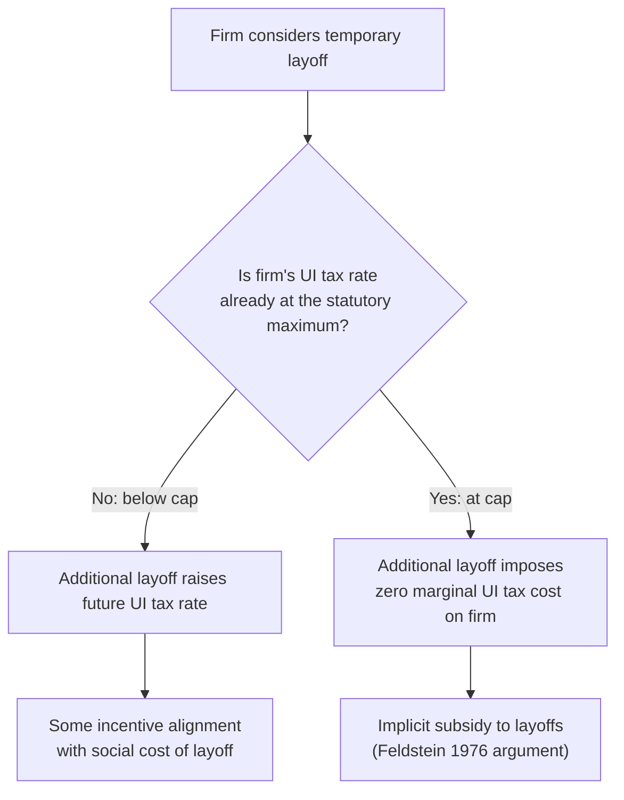

## Experience Rating and Financing

### Overview

Experience rating refers to the practice of tying an employer's unemployment insurance (UI) payroll tax rate to their own firm-specific history of layoffs and benefit claims, rather than charging a uniform tax rate across all employers. This financing mechanism is central to the design of most U.S. state UI systems and is theoretically motivated by the goal of internalizing the externality that layoffs impose on the broader UI system. This content covers the theoretical rationale for experience rating, its typical implementation, the consequences of incomplete experience rating, and alternative financing approaches used internationally.

### The Layoff Externality Rationale

**Key Points**

- When UI is financed by a uniform payroll tax (unrelated to a firm's own layoff behavior), individual employers do not bear the full marginal cost of laying off workers who subsequently draw UI benefits — the cost is instead spread across the entire tax base
- This creates a classic **externality problem**: a firm's layoff decision imposes costs on the UI system (and, ultimately, on other employers who help finance it) that the laying-off firm does not internalize under uniform financing
- **Experience rating** is designed to correct this externality by making each employer's tax rate an increasing function of their own historical layoff/claims experience, so that firms with higher layoff rates pay correspondingly higher UI taxes, more closely aligning private layoff costs with social costs
- This logic parallels the general Pigouvian principle of internalizing externalities through taxation calibrated to the marginal social cost of the externality-generating activity

### Theoretical Predictions: Feldstein (1976) and the Temporary Layoff Subsidy

Martin Feldstein's foundational analysis argues that **incomplete experience rating subsidizes temporary layoffs**:

- Many U.S. state UI systems impose a **maximum tax rate** on any given employer, regardless of how high their actual layoff-driven claims experience would otherwise push their rate
- Firms with very high layoff frequency (particularly industries with seasonal or cyclical layoff patterns, such as construction or certain manufacturing sectors) often hit this maximum rate cap, meaning **additional layoffs beyond the point of hitting the cap impose no additional marginal UI tax cost** on the employer
- This creates an implicit subsidy: since the marginal cost of an additional layoff to the firm is effectively zero once the cap binds, while the marginal cost to the UI system (and other taxpayers) is positive, firms have an inefficiently strong incentive to use temporary layoffs (rather than reduced hours, wage cuts, or other adjustment margins) as their preferred response to reduced labor demand
- [Inference] Feldstein and subsequent researchers (e.g., Topel, 1983) argue this incomplete experience rating contributes to excess use of temporary layoffs in the U.S. economy relative to what would occur under full experience rating, particularly concentrated in historically high-layoff industries — though [Unverified] the precise quantitative magnitude of this distortion, and how much it has changed as UI financing rules have evolved over subsequent decades, is not a fully settled empirical matter and estimates vary across studies and time periods

### Mechanics of U.S. State Experience Rating Systems

**Key Points**

- Most U.S. states use a **reserve-ratio** or **benefit-ratio** method to calculate individual employer tax rates:
  - **Reserve-ratio method**: tracks a notional account for each employer, crediting it with the employer's tax contributions and debiting it with benefits paid to the employer's former workers; the employer's tax rate is then set based on the resulting reserve ratio (account balance relative to taxable payroll)
  - **Benefit-ratio method**: sets the tax rate based on the ratio of benefits charged to the employer over a historical period relative to the employer's taxable payroll
- States set a **minimum and maximum tax rate schedule**, with new employers typically assigned an average or industry-specific "new employer rate" until sufficient claims history accumulates to individually experience-rate them
- The **taxable wage base** (the portion of each employee's wages subject to UI tax) also varies substantially by state and is often well below total compensation, which independently affects overall system financing adequacy and the effective degree of experience rating achieved in dollar terms

### Degree of Experience Rating: Full versus Partial

- **Full/perfect experience rating** would mean an employer's tax liability exactly equals the benefits paid to their former employees (a strict pay-as-you-go, firm-specific matching), fully internalizing the layoff externality
- In practice, **no U.S. state achieves full experience rating** due to statutory rate caps (both minimum and maximum), cross-subsidization built into rate schedules, and the "socialized" component of benefit charges in some circumstances (e.g., charges not attributed to a specific employer, benefits paid when an employer contests a claim and loses, or "noncharged" benefits under certain state provisions)
- [Inference] The degree of experience rating varies meaningfully across states depending on the specific tax rate schedule design (how many rate brackets, how wide the range between minimum and maximum rates, how quickly rates adjust to recent claims experience), and this variation has itself been used as a source of empirical identification for studying the effects of experience rating intensity on employer layoff behavior

### Consequences of Incomplete Experience Rating: Empirical Evidence

- Several studies exploit cross-state and cross-time variation in the degree of experience rating (e.g., differences in maximum tax rates, rate schedule steepness) to estimate effects on layoff behavior
- [Inference] Findings generally support the qualitative prediction that **more complete experience rating is associated with reduced use of temporary layoffs**, consistent with the Feldstein/Topel theoretical prediction, though the magnitude of estimated effects and the precise channels (whether firms substitute toward reduced hours, wage adjustment, or permanent separations instead) vary across studies and are sensitive to the specific policy variation and time period examined

### Alternative and Complementary Financing Considerations

**Employee contributions versus employer-only financing**

- Most U.S. states finance UI exclusively through employer payroll taxes, while some other countries (and a small number of U.S. states, such as historically Alaska, New Jersey, and Pennsylvania) include an employee contribution component
- [Inference] The economic incidence of payroll taxes (who ultimately bears the cost, regardless of statutory employer/employee split) is a separate economic question from experience rating design — standard tax incidence theory suggests the burden depends on relative labor supply and demand elasticities rather than the statutory assignment of the tax, though this is a general public finance principle rather than a UI-specific claim

**Trust fund solvency and countercyclical financing tension**

- UI systems are typically financed through state-level trust funds that accumulate reserves during expansions and draw down during recessions when claims rise
- A recurring policy challenge is that **UI trust funds can become insolvent during severe or prolonged recessions**, requiring states to borrow from the federal government (via Title XII advances) or from other sources, sometimes triggering automatic employer tax rate increases or federal loan interest charges precisely during periods of economic weakness — creating tension between experience-rating/solvency objectives and the countercyclical stabilization goals discussed in the Rationale for Public UI content
- [Inference] Some researchers and policymakers have proposed reforms such as pre-funding larger reserve targets during expansions, federal reinsurance mechanisms, or automatic triggers adjusting financing rules countercyclically, to reduce the tension between maintaining adequate experience-rating incentives and ensuring system solvency through business cycles, though [Unverified] the specific optimal design of such countercyclical financing mechanisms remains a subject of ongoing policy analysis rather than settled consensus

### International Comparison: Financing Approaches Beyond the U.S. Model

| Country/Region | Typical Financing Approach | Experience Rating Present? |
| --- | --- | --- |
| United States | State-level employer payroll tax, experience-rated | Yes (partial, capped) |
| Most Continental European systems | General payroll tax and/or general government revenue, often not firm-specific | Generally minimal or absent |
| Canada | Employer and employee premiums, national system with some regional variation | Limited experience rating historically, some reforms introduced elements over time |

[Unverified] Cross-country comparison of financing structures is complicated by differing underlying labor market institutions (employment protection law stringency, the role of collective bargaining, differing degrees of reliance on general tax revenue versus dedicated payroll taxes), so the presence or absence of experience rating should not be evaluated in isolation from these broader institutional differences when assessing overall system efficiency.

### Interaction with Optimal Benefit Design

**Key Points**

- Experience rating and benefit generosity design (see Optimal Unemployment Benefit Design) are **complementary levers**: experience rating targets the **employer-side** moral hazard/externality (firms' layoff decisions), while benefit level, duration, and monitoring design target the **employee-side** moral hazard (search effort and job acceptance decisions)
- [Inference] A UI system with weak experience rating may need to compensate with either more restrictive benefit eligibility rules or higher administrative scrutiny of claims to offset the incentive misalignment on the employer side, whereas stronger experience rating can, in principle, allow somewhat more generous employee-side benefit design without proportionally increasing the aggregate layoff rate — though this interaction has been less extensively empirically quantified than either side studied in isolation

### Summary

**Conclusion**

Experience rating represents the primary financing-side tool for addressing the moral hazard problem in unemployment insurance that operates through employer layoff decisions, complementing benefit design tools that address employee-side search and acceptance behavior. The Feldstein (1976) critique of incomplete experience rating — highlighting how rate caps create an implicit subsidy to temporary layoffs — remains a foundational reference point in the literature, though actual U.S. state systems continue to feature only partial experience rating due to a combination of administrative, political, and firm-liquidity considerations that create tension with the goal of fully internalizing the layoff externality.

### Related Topics

- Rationale for Public Unemployment Insurance
- Optimal Unemployment Benefit Design
- Feldstein (1976) and Topel (1983) on Temporary Layoff Incentives
- UI Trust Fund Solvency and Countercyclical Financing Design
- Payroll Tax Incidence Theory
- Countercyclical Unemployment Insurance (Landais-Michaillat-Saez)
- Comparative International Unemployment Insurance Financing Systems
- Pigouvian Taxation and Externality Correction
- Effects on Job Search and Unemployment Duration
- Moral Hazard in Social Insurance