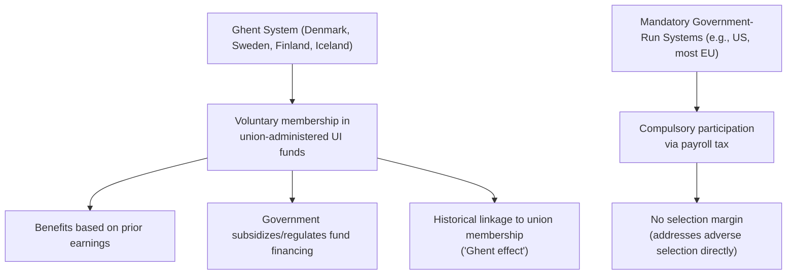

## Cross-Country Unemployment Insurance Systems

### Overview

Unemployment insurance systems vary substantially across countries in generosity, financing structure, administration, and the degree to which passive income replacement is paired with active labor market policy conditionality. Comparative analysis of these systems provides an empirical testing ground for the theoretical tradeoffs developed elsewhere in this chapter — the consumption-smoothing versus moral hazard tradeoff, experience rating design, and the role of active labor market policy complementarities — while also illustrating how differing labor market institutions (collective bargaining coverage, employment protection legislation) interact with UI system design in ways that complicate simple generosity comparisons.

### Net Replacement Rates: A Standard Comparative Metric

The OECD's standard comparative metric is the **net replacement rate (NRR)** — the proportion of net in-work income retained after a given period of unemployment, typically calculated for standardized household types (e.g., a single person without children previously earning the average wage). On average across the OECD, the net replacement rate in unemployment is around 58% in the initial phase of an unemployment spell for a single person without children with previous earnings at the average wage, but falls to roughly 37% once the person becomes long-term unemployed, reflecting the widespread practice of declining benefit generosity over the spell discussed in Optimal Unemployment Benefit Design. [OECD](https://www.oecd.org/en/publications/society-at-a-glance-2024_918d8db3-en/full-report/unemployment-and-social-safety-net-benefits_ddfedfa8.html)

**Key Points**

- This large gap between initial and long-term replacement rates is not uniform across countries — some systems (e.g., certain Southern/Continental European systems) feature explicit **declining benefit schedules within the UI system itself**, while others see the drop reflect **transition from contributory UI to lower, means-tested social assistance** after UI benefits are exhausted
- In some countries, such as Spain, the nominal replacement rate declines from 70% to 60% after six months, illustrating an explicit within-program declining benefit profile of the kind discussed theoretically by Hopenhayn and Nicolini [OECD](https://www.oecd.org/about/publishing/36965805.pdf)
- In a large majority of OECD countries, payment rates of unemployment insurance benefits are typically significantly higher than social safety net (non-contributory) benefits, meaning the two-tier structure (contributory UI followed by lower means-tested assistance) is the norm rather than the exception [OECD](https://www.oecd.org/en/publications/society-at-a-glance-2024_918d8db3-en/full-report/unemployment-and-social-safety-net-benefits_ddfedfa8.html)

### The Ghent System: Union-Administered Voluntary Insurance

**Key Points**

- The **Ghent system**, named after the Belgian city where it originated, is an arrangement whereby the main responsibility for unemployment benefit payments is held by trade unions rather than a government agency, and is the predominant form of unemployment benefit in Denmark, Finland, Iceland, and Sweden [Wikipedia](https://en.wikipedia.org/wiki/Ghent_system)
- Under this model, funds held by trade unions for benefit distribution are typically regulated or subsidized by the government, with individual benefit amounts generally depending on the person's previous earnings [hrzone](https://hrzone.com/?p=63025)
- A key institutional feature is **voluntary participation in union-administered unemployment insurance funds**, which historically created what researchers term a **"Ghent effect"**: the presence of an unemployment insurance system based on voluntary membership in union-administered insurance funds, combined with high union density, has long been documented as reinforcing trade union membership, since joining a fund for UI coverage often naturally coincides with union membership [vlex](https://law-journals-books.vlex.com/vid/the-ghent-effect-for-855612472)
- [Inference] This creates a distinctive selection dynamic largely absent from mandatory government-run systems: because participation is voluntary, the Ghent system in principle faces some residual adverse-selection risk (lower-risk workers opting out of paying fund contributions), historically mitigated by the bundling of insurance with union membership benefits and by government subsidies keeping worker contributions low relative to the value of coverage — a longstanding design tension the Ghent countries have addressed by maximizing state subsidies while minimizing individual contributions, and maximizing risk-sharing by making contributions independent of the individual fund's realized unemployment level [iab](https://doku.iab.de/veranstaltungen/2010/ws_recwowe2010_anderson.pdf)

- [Unverified] The Ghent system's distinctive union-linkage has come under documented pressure in recent decades — reforms and declining union density in some Nordic countries have been analyzed as contributing to an "erosion" of the traditional Ghent effect, though the precise magnitude and permanence of this erosion varies by country and is an active area of labor relations research

### Denmark's Flexicurity Model

**Key Points**

- Denmark's system is frequently cited as a paradigmatic example of **"flexicurity"** — a "golden triangle" combining flexibility in the labour market, social security, and active labour market policy with rights and obligations for the unemployed [Wikipedia](https://en.wikipedia.org/wiki/Flexicurity)
- The model deliberately combines a relatively flexible labour market (low employment protection legislation, allowing easier hiring and firing) with active labour market policies and a strong welfare state providing relatively generous unemployment benefits [davidhumeinstitute](https://www.davidhumeinstitute.com/s/David-Hume-Institute-Danish-Flexicurity-Briefing-March-2020.pdf)
- This is explicitly a **hybrid institutional design**: the Danish employment system combines a very liberal feature — non-restrictive employment protection legislation typical of Anglo-Saxon labour markets — with a generous welfare regime usual in Scandinavian countries [euba](https://fmv.euba.sk/www_write/files/dokumenty/veda-vyskum/medzinarodne-vztahy/archiv/2012/1/2012-1_potuzakova.pdf)
- The active labor market policy ("activation") component is designed to counteract moral hazard concerns that generous passive benefits alone would raise: participants in training and education programmes may be "upgraded" and have better job prospects (a qualification effect), while the approaching prospect of mandatory activation can itself have a motivational effect, intensifying job search as unemployed people try to avoid activation requirements [euba](https://fmv.euba.sk/www_write/files/dokumenty/veda-vyskum/medzinarodne-vztahy/archiv/2012/1/2012-1_potuzakova.pdf)
- [Inference] This flexicurity design can be understood as directly addressing the Optimal Unemployment Benefit Design tension between generosity (consumption smoothing) and moral hazard: rather than relying primarily on benefit level/duration reductions to control moral hazard, Denmark instead relies on low employment protection (making job transitions less costly and disruptive) combined with mandatory activation requirements (directly targeting search effort observability), potentially allowing more generous passive benefits to be sustained than would otherwise be optimal under the pure Baily-Chetty tradeoff
- Empirically, Denmark's unemployment rate fell by roughly half, from about 10% in 1993 to 5% in 2002, during the period the flexicurity model was developed and implemented, contributing to international interest in the model as an export template, though [Unverified] attributing this decline causally and specifically to the flexicurity institutional design, versus broader macroeconomic conditions of the period, is contested in the comparative welfare-state literature [euba](https://fmv.euba.sk/www_write/files/dokumenty/veda-vyskum/medzinarodne-vztahy/archiv/2012/1/2012-1_potuzakova.pdf)

### The United States: State-Based Experience-Rated System

As detailed in the Experience Rating and Financing content, the U.S. system is distinctive among OECD countries for its:

- **Decentralized, state-administered structure**, with substantial variation in benefit levels, duration, and financing rules across states
- **Firm-level experience rating** of employer payroll taxes, a feature largely absent or much less pronounced in most European systems
- Generally **lower replacement rates and shorter standard benefit duration** (often 26 weeks baseline) relative to many Continental European and Nordic systems, though subject to temporary federal extensions during major recessions

### Comparative Institutional Table

| Country/Model | Financing/Administration | Distinctive Feature | Duration Pattern |
| --- | --- | --- | --- |
| Denmark (Ghent + Flexicurity) | Union-administered funds, government-subsidized | Combines low employment protection with generous benefits and mandatory activation | Historically long relative to OECD average, tied to activation requirements |
| Sweden, Finland, Iceland (Ghent) | Union-administered, voluntary membership | Historical union-membership linkage | Varies; general OECD trend toward tighter conditionality |
| United States | State-administered, employer payroll tax, experience-rated | Firm-level experience rating; decentralized | Shorter (often 26 weeks baseline), extended during recessions |
| Continental Europe (general pattern) | General payroll tax, often less experience-rated | Larger role for general government revenue in some systems | Often longer than U.S., with two-tier UI/social assistance structure |
| Spain (illustrative declining-benefit example) | Government-administered | Explicit within-spell benefit decline | Nominal replacement rate declines from 70% to 60% after six months |

### Long-Term versus Initial Replacement Rate Gap as a Cross-Country Indicator

The gap between initial and long-term net replacement rates (58% initially versus 37% for the long-term unemployed, on OECD average) serves as a useful summary indicator of how strongly a given country's overall system (UI plus subsequent social assistance) is designed around the Hopenhayn-Nicolini-style logic of declining generosity over the spell: [OECD](https://www.oecd.org/en/publications/society-at-a-glance-2024_918d8db3-en/full-report/unemployment-and-social-safety-net-benefits_ddfedfa8.html)

- [Inference] Countries with a larger gap between initial and long-term rates place relatively more emphasis on preserving job search incentives over an extended spell, consistent with the dynamic optimal contract logic, while countries with a smaller gap place relatively more weight on sustained consumption smoothing even for the long-term unemployed, potentially at greater moral hazard cost — though this simple mapping abstracts from the role of active labor market policy conditionality, which can independently address moral hazard even where benefit levels remain relatively flat

### Active Labor Market Policy as a Cross-Nationally Varying Complement

- Countries vary substantially in the intensity and design of active labor market policies (ALMPs) — training programs, job placement services, wage subsidies, and public employment programs — that are paired with passive income replacement
- [Inference] Nordic countries, and Denmark in particular, are frequently cited as having comparatively high ALMP spending intensity relative to GDP and to passive benefit spending, consistent with the flexicurity emphasis on activation as a complement to (rather than pure substitute for) generous passive benefits
- [Unverified] Precise comparative ALMP spending figures and their marginal effectiveness vary by data source, time period, and program type, and rigorous causal evaluation of ALMP effectiveness (as opposed to simple spending comparisons) is a distinct and more methodologically demanding empirical literature

### Interpretive Caveats for Cross-Country Comparison

**Key Points**

- Cross-country UI generosity comparisons are complicated by differing **employment protection legislation** (a country with very strong job protection may need less generous UI to achieve a similar overall level of worker income security, since job loss itself is rarer or better compensated through severance requirements)
- Differences in **collective bargaining coverage** interact with UI design: Denmark's very high collective bargaining coverage (82% of workers in 2017, compared to an OECD average of 32%) and high trade union membership (67%) reflect a broader industrial relations context that shapes how the Ghent-system UI institution functions in practice, a context not present in countries adopting similar nominal benefit parameters without the underlying union-density infrastructure [davidhumeinstitute](https://www.davidhumeinstitute.com/s/David-Hume-Institute-Danish-Flexicurity-Briefing-March-2020.pdf)
- **Tax and benefit interaction effects** (net replacement rate calculations must account for the interaction of taxes, family benefits, and housing benefits alongside the UI benefit itself) mean that headline gross replacement rates can be misleading without full net income comparisons
- [Inference] These institutional complementarities imply that "importing" isolated design features from one country's system (e.g., adopting Danish-style generous benefits without the accompanying low employment protection or mandatory activation infrastructure) may not replicate the same outcomes, a caution frequently raised in the comparative welfare-state literature regarding flexicurity's exportability

### Related Topics

- Optimal Unemployment Benefit Design
- Experience Rating and Financing
- Rationale for Public Unemployment Insurance
- The Ghent System and Union-Administered Social Insurance
- Danish Flexicurity Model and Active Labor Market Policy Integration
- Hopenhayn-Nicolini Dynamic Optimal Unemployment Insurance Contracts
- Comparative Welfare State Regimes (Esping-Andersen Typology)
- Employment Protection Legislation and Its Interaction with UI Generosity
- Active Labor Market Policy Evaluation Methodology
- Effects on Job Search and Unemployment Duration