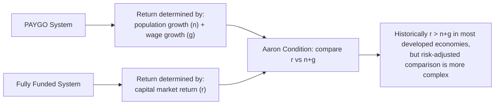
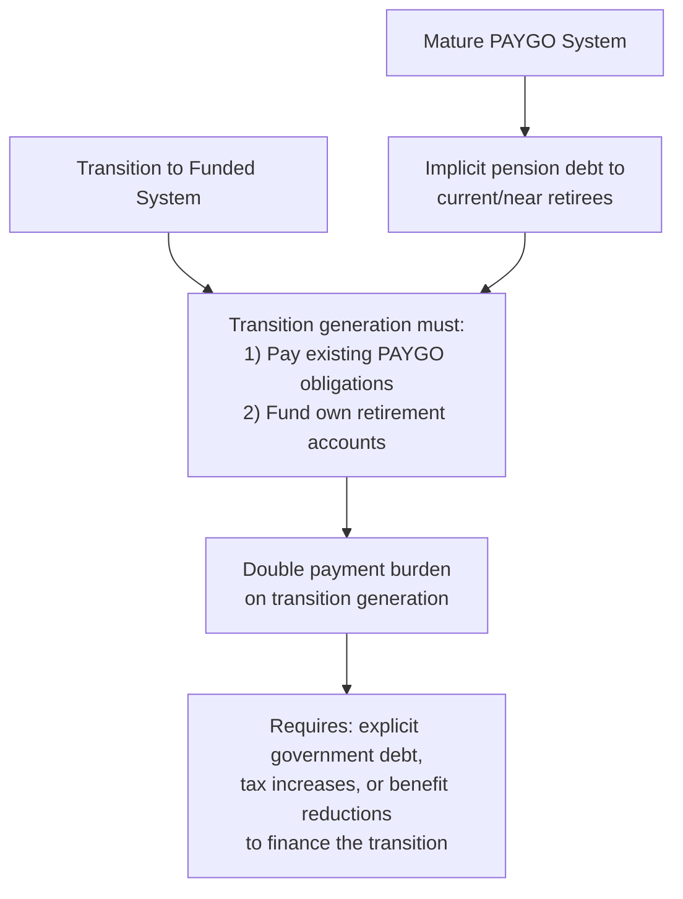

## Pay-as-You-Go versus Fully Funded Systems

### Overview

The choice between pay-as-you-go (PAYGO) and fully funded pension financing represents one of the central design questions in public economics of social security. A PAYGO system finances current retirees' benefits directly from current workers' contributions, with no substantial accumulated reserve, while a fully funded system requires each generation (or individual) to accumulate financial assets during their working years sufficient to finance their own retirement benefits. This distinction has profound implications for intergenerational risk-sharing, macroeconomic capital accumulation, rates of return, and transition dynamics.

### Basic Mechanics

**Pay-as-you-go (PAYGO):**

- Current workers' payroll tax contributions are transferred directly (with minimal lag) to pay current retirees' benefits
- The system holds little or no accumulated financial reserve; each period's benefit payments are financed by that period's contributions
- The implicit "return" earned by a participant is determined by the growth rate of the contribution base, not by capital market returns

**Fully funded:**

- Each generation's contributions are invested in financial assets (bonds, equities, or other instruments) during the working years
- Retirement benefits are financed by drawing down the accumulated fund (principal plus investment returns)
- The return earned is determined by realized capital market returns on the invested portfolio

### The Aaron (1966) Rate-of-Return Comparison

**Key Points**

- Henry Aaron's classic analysis provides the foundational comparison: under a PAYGO system, the implicit rate of return to participants approximately equals the sum of the **population growth rate** ($n$) and the **rate of growth of real wages** ($g$), often summarized as the growth rate of the aggregate wage bill
- Under a fully funded system, the rate of return approximately equals the **real rate of return on capital** ($r$)
- The comparison $r$ versus $n + g$ (sometimes called the **Aaron condition**) determines which system offers a higher return to a representative participant in steady state:

$$\text{PAYGO return} \approx n + g \quad \text{vs.} \quad \text{Funded return} \approx r$$

- Historically, in most developed economies, $r > n + g$ (capital returns have generally exceeded the sum of population and wage growth), which is often cited as an argument favoring funded systems on pure rate-of-return grounds
- [Inference] However, this comparison is significantly more subtle than a simple "funded systems pay more" conclusion, for several reasons developed below — most importantly, that $r$ typically incorporates a risk premium compensating for capital market risk that PAYGO systems do not require participants to bear in the same form

### Risk Characteristics: A Critical Distinction Beyond Simple Return Comparison

**Key Points**

- The simple Aaron comparison of average returns is incomplete because it ignores the **risk profile** attached to each system's return
- **PAYGO systems** expose participants to **demographic risk** (fluctuations in birth rates, life expectancy, and labor force growth) and **macroeconomic/political risk** (wage growth fluctuations, and the political risk that future benefit formulas or contribution rates could be altered)
- **Fully funded systems** expose participants to **capital market risk** (equity and bond return volatility, including the risk of experiencing poor returns during exactly the years immediately preceding retirement, a form of sequence-of-returns risk)
- [Inference] Because $n + g$ (GDP/wage bill growth) and $r$ (capital returns) are not perfectly correlated and are driven by different underlying economic shocks, a mixed system combining both PAYGO and funded components can, in principle, achieve **diversification benefits** unavailable to a system relying entirely on either financing method — this insight underlies much of the modern portfolio-theoretic literature on optimal pension system design (e.g., Merton, 1983 and subsequent literature applying portfolio diversification logic to social security design)

### Intergenerational Risk-Sharing

- A key theoretical argument for PAYGO systems (or at least a PAYGO component within a mixed system) is their capacity to spread demographic and macroeconomic shocks **across generations** in ways that private, individually funded arrangements cannot
- Gordon and Varian (1988) formalize this argument: government, through its ability to adjust future contribution rates or benefit formulas, can implement risk-sharing arrangements across generations that no private financial market contract can replicate, since such contracts would require binding unborn future generations to specific terms — a form of intergenerational risk-sharing that only a government-backed, politically-sustained system can approximate
- [Inference] This intergenerational risk-sharing rationale is conceptually related to the broader Rationale for Social versus Private Insurance argument that government has a comparative advantage in bearing aggregate/correlated risk that private insurance markets structurally cannot absorb

### Transition Costs: The "Double Payment Problem"

**Key Points**

- A central practical obstacle to transitioning from an existing PAYGO system to a funded system is the **transition cost** or "double payment problem": the generation alive at the time of transition must simultaneously (a) continue funding current retirees' PAYGO benefits (since those retirees have no accumulated personal fund) and (b) begin contributing to their own funded accounts for their own future retirement
- This double burden arises because a mature PAYGO system has effectively already made an **implicit pension debt** commitment to current retirees and near-retirees, based on the promise that their PAYGO contributions during their working years would be repaid by the next generation's contributions — transitioning away from PAYGO does not eliminate this pre-existing implicit debt, it merely make it explicit and requires it to be paid off from some source
- [Inference] Because of this transition cost, a full switch from PAYGO to funding cannot generate a costless "free lunch" rate-of-return improvement for the transition generation itself — someone must bear the cost of honoring the pre-existing implicit pension debt, whether through explicit government borrowing, higher taxes on the transition generation, or reduced benefits to existing retirees, which is a primary reason full transitions have historically proven politically and fiscally difficult in most countries that have PAYGO systems already in place

### Demographic Sustainability and PAYGO Vulnerability

- PAYGO systems are particularly sensitive to **demographic aging** — declining fertility rates and rising life expectancy reduce the ratio of contributing workers to benefit-receiving retirees (the **dependency ratio**), directly straining the system's ability to maintain benefit levels without raising contribution rates or reducing benefits
- Since the implicit PAYGO return approximately equals $n + g$, a decline in population growth $n$ (as has occurred in many developed economies) mechanically reduces the sustainable implicit return PAYGO can offer, absent offsetting increases in wage growth $g$ or parametric reforms
- [Inference] This demographic sensitivity has motivated numerous parametric reforms across countries (raising retirement ages, adjusting benefit formulas, introducing automatic balancing mechanisms tied to demographic indicators) rather than wholesale funded-system transitions, given the transition cost obstacle discussed above

### Fully Funded System Vulnerabilities

- Fully funded systems are exposed to **capital market risk**, including the possibility of poor investment returns, particularly damaging if concentrated in the years immediately before or after retirement (sequence-of-returns risk), when the accumulated balance is largest and least able to recover from a downturn through continued contributions
- Fully funded **defined contribution** systems shift this investment risk primarily onto individual participants, whereas funded **defined benefit** systems (where an employer or fund sponsor guarantees a specified benefit level) shift the risk onto the plan sponsor, which introduces its own solvency risk if the sponsor cannot honor the guarantee during adverse market conditions (a concern relevant to both private defined-benefit pensions and some public employee pension funds)
- [Inference] Administrative costs, investment management fees, and the risk of poor individual investment decisions (behavioral/financial literacy concerns) are additional practical considerations often raised regarding fully funded, individually-directed systems relative to centrally-managed PAYGO systems, though [Unverified] the magnitude of these cost differences varies substantially depending on specific fund design, regulatory framework, and country context

### Mixed/Multi-Pillar Systems

**Key Points**

- In practice, most countries operate **mixed or multi-pillar systems** combining PAYGO and funded elements, reflecting the diversification logic discussed above
- The World Bank's influential "multi-pillar" framework (elaborated in various forms since the 1990s) typically envisions: a redistributive/poverty-prevention pillar (often PAYGO or general-revenue financed, providing a basic minimum benefit), a mandatory funded pillar (individual or occupational accounts), and voluntary supplementary funded savings
- [Inference] This layered structure attempts to capture the intergenerational risk-sharing and redistributive benefits of PAYGO for a baseline level of retirement income security, while also capturing potential capital market return and individual capital accumulation benefits from a funded component for benefits above the baseline — though the specific optimal weighting between pillars remains a country-specific policy question rather than one with a single theoretically "correct" answer

### Illustrative Numerical Comparison

**Example**

Consider a stylized economy with population growth $n = 0.5\%$ per year, real wage growth $g = 1.5\%$ per year (giving an implicit PAYGO return of approximately 2%), and a real capital market return $r = 5\%$ per year with a standard deviation of returns around 15% annually.

- Under naive comparison of average returns alone, the funded system's 5% return appears to dominate the PAYGO system's 2% implicit return
- [Inference] However, incorporating risk aversion, an individual facing the funded system's return volatility would apply a **certainty-equivalent discount** to the 5% average return to reflect the risk borne — depending on the assumed degree of risk aversion, the risk-adjusted comparison could substantially narrow or even reverse the apparent funded-system advantage, particularly for risk-averse individuals close to retirement with limited capacity to wait out a market downturn
- This illustrates why the theoretically appropriate comparison for policy purposes is not simply "which system has a higher expected/average return" but rather a **risk-adjusted welfare comparison** incorporating the differing risk profiles of demographic/political risk (PAYGO) versus capital market risk (funded)

### Political Economy Considerations

- PAYGO systems' sustainability depends on the **political commitment** of future generations to continue honoring the implicit intergenerational contract (paying taxes to fund current retirees, trusting that future generations will do the same for them) — this creates a form of political/institutional risk distinct from either demographic or capital market risk
- [Speculation] Some researchers argue this political sustainability risk has become more salient as demographic pressures mount and political support for maintaining historical PAYGO generosity levels faces strain in some countries, though the extent to which this represents a genuine long-run threat to PAYGO system viability, versus a periodically recurring political debate that tends to result in incremental parametric adjustment rather than fundamental system change, is a matter of ongoing political-economic analysis rather than settled empirical fact

### Comparative Summary Table

| Dimension | Pay-As-You-Go | Fully Funded |
| --- | --- | --- |
| Return determinant | Population growth + wage growth ($n+g$) | Capital market return ($r$) |
| Primary risk borne | Demographic and political risk | Capital market/investment risk |
| Intergenerational risk-sharing | Strong (government can adjust across generations) | Limited (each generation bears own investment outcomes) |
| Transition cost from status quo PAYGO | N/A (status quo in most countries) | High (double payment problem) |
| Capital accumulation/investment effect | None (no reserve fund invested) | Potentially increases national saving/capital stock |
| Vulnerability to aging population | High (dependency ratio directly affects sustainability) | Lower direct demographic sensitivity, though wage-linked contribution bases still matter |

### Related Topics

- Aaron (1966) Rate-of-Return Comparison
- Gordon-Varian Intergenerational Risk-Sharing
- Transition Costs and the Implicit Pension Debt Problem
- Multi-Pillar Pension System Design (World Bank Framework)
- Demographic Aging and PAYGO Sustainability
- Defined Benefit versus Defined Contribution Plan Design
- Sequence-of-Returns Risk in Retirement Savings
- Rationale for Social versus Private Insurance (Aggregate Risk-Bearing)
- Political Economy of Pension Reform
- Optimal Portfolio Diversification Across PAYGO and Funded Components