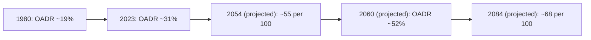
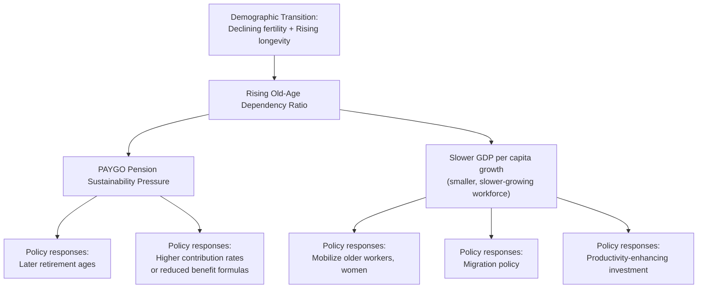

## Demographic Transition and Old-Age Dependency

### Overview

The demographic transition — the historical shift from high fertility/high mortality to low fertility/low mortality that most developed and increasingly many developing economies have undergone — is the primary structural driver of rising **old-age dependency ratios**, with direct and substantial consequences for the fiscal sustainability of pay-as-you-go pension systems, health and long-term care financing, and broader macroeconomic growth. This content examines the demographic mechanics, current and projected magnitudes, and the resulting policy implications for social security design.

### Defining the Old-Age Dependency Ratio

The **old-age dependency ratio (OADR)** is standardly defined as the number of individuals aged 65 and older per 100 (or as a percentage of) people of working age, with the working-age population conventionally defined by the OECD as ages 20–64. A related measure, the **old-age to working-age ratio**, is used interchangeably in much of the literature, while the broader **total dependency ratio** additionally incorporates youth dependents (population aged 0–14) in the numerator alongside the elderly population, divided by the working-age population aged 15–64.

$$\text{OADR} = \frac{\text{Population aged 65+}}{\text{Population aged 20–64}} \times 100$$

### Magnitude and Trajectory of the Demographic Shift

**Key Points**

- Across the OECD area, the old-age dependency ratio has increased dramatically from 19% in 1980 to 31% in 2023 and is projected to rise further to 52% by 2060 on average in the OECD [OECD](https://www.oecd.org/en/publications/2025/07/oecd-employment-outlook-2025_5345f034.html)
- Using a related dataset, the old-age to working-age ratio increased from 21 per 100 working-age people in 1994 to 33 per 100 in 2024, and is expected to reach 55 per 100 over the subsequent 30 years, with the average pace of ageing projected to be fast until about 2060, after which it is set to slow down substantially, though considerable uncertainty attaches to projections that far into the future
- The OECD Pensions at a Glance 2025 edition projects the old-age to working-age ratio for the OECD as a whole to rise from 32.6 in 2024 to 55.2 in 2054 and 67.7 in 2084
- By 2060, the working-age population will have declined by 8% in the OECD area, and by more than 30% in more than a quarter of OECD countries [OECD](https://www.oecd.org/en/publications/2025/07/oecd-employment-outlook-2025_5345f034/full-report/component-6.html)

### The Two Demographic Drivers: Fertility Decline and Rising Longevity

**Key Points**

- The old-age dependency ratio rises mechanically from two distinct demographic forces operating simultaneously:
  1. **Declining fertility rates**, which reduce the relative size of successive younger cohorts entering the working-age population
  2. **Rising life expectancy**, which increases the number of years individuals spend in the 65+ age bracket, expanding the numerator of the dependency ratio
- Between 1960 and 2022, the population aged 65 and over in the OECD area grew at an annualised rate of 2.2%, while the working-age population grew by merely 0.9%, illustrating the asymmetric growth rates driving the rising ratio [ECOSCOPE](https://oecdecoscope.blog/2025/11/07/the-fiscal-impact-of-population-ageing-how-can-we-afford-getting-older/)
- People around the world are living longer and healthier lives than ever before, a demographic achievement that is nonetheless the direct mechanical source of increased old-age dependency pressure on pension and health systems, illustrating that this is a case where a broadly positive underlying trend (longevity gains) generates a genuine fiscal and policy challenge as a byproduct

### Cross-Country Heterogeneity in the Pace of Ageing

**Key Points**

- Although ageing trends are broadly common across countries, there is substantial and growing heterogeneity in the projected pace and magnitude of ageing across OECD countries
- Korea represents the most extreme case among OECD countries: the old-age ratio in Korea is projected to increase from 7.3 in 1964 to 29.3 in 2024 to 122.0 in 2084, with Korea moving from being the tenth-youngest OECD country in 2024 to the oldest by 2084
- The working-age population is projected to fall by over 30% by 2064 in Estonia, Greece, Japan, the Slovak Republic, and Spain, and by over 35% in Italy, Korea, Latvia, Lithuania, and Poland
- In contrast, the working-age population is projected to increase by about 10% in Canada and Mexico, 20% in Australia, and 70% in Israel over the same period, reflecting substantially different fertility and migration trajectories across otherwise broadly comparable high-income economies
- [Inference] This heterogeneity means that the fiscal sustainability challenge facing PAYGO pension systems (discussed in the companion PAYGO versus Fully Funded content) varies enormously in urgency and magnitude across countries, with East Asian economies (Korea, Japan) and several Southern/Eastern European economies facing substantially more acute pressure than, for example, several English-speaking or higher-migration economies

### Connection to the PAYGO Sustainability Problem

**Key Points**

- As developed in the Aaron (1966) framework (see Pay-as-You-Go versus Fully Funded Systems), the implicit sustainable rate of return in a PAYGO pension system depends on the sum of population growth $n$ and wage growth $g$
- A declining or negative population growth rate $n$, combined with a rising ratio of beneficiaries to contributors, directly and mechanically reduces the sustainable generosity of a PAYGO system without offsetting parametric changes (higher contribution rates, later retirement ages, reduced benefit formulas, or increases in the contributing labor force via higher labor force participation or migration)
- Since the OADR represents almost the inverse of the support ratio underlying PAYGO financing capacity, the sharp projected rise in OADR (from roughly 31–33% currently to over 50% by mid-century in the OECD average) implies that, absent reform, either contribution rates must rise substantially, benefit levels must fall, retirement ages must increase, or some combination of all three, to maintain system solvency

### Macroeconomic and Growth Implications

**Key Points**

- Without big improvements in productivity, GDP per capita growth would drop from 1% annually in 2006-19 to just 0.6% in 2024-60 in the OECD, with the OECD warning that all but two OECD nations would see their per-capita growth decline [DevelopmentAid](https://www.developmentaid.org/news-stream/post/197869/oecd-employment-outlook-2025-aging-population-economic-slowdown)[DevelopmentAid](https://www.developmentaid.org/news-stream/post/197869/oecd-employment-outlook-2025-aging-population-economic-slowdown)
- Because of population ageing, the employment-to-population ratio is projected to decrease by 1.9 percentage points by 2060 in the OECD area, with the slump expected to be as large as 10 percentage points in Spain and the Slovak Republic [OECD](https://www.oecd.org/en/publications/2025/07/oecd-employment-outlook-2025_5345f034/full-report/component-6.html)
- [Inference] This growth slowdown channel operates independently of, but compounds, the direct fiscal sustainability pressure on pension systems: a smaller working-age population growing more slowly in productivity terms both shrinks the tax base available to finance PAYGO benefits and reduces the overall pace of economic growth against which pension obligations must be measured as a share of GDP

### Policy Response Margins

**Key Points**

- **Mobilizing underutilized labor resources**: the OECD identifies increasing employment among older workers and women in many countries as key to offsetting the demographic megatrend's growth impact, since these groups often have below-potential labor force participation rates in many member countries
- **Raising statutory and effective retirement ages**: directly increases the size of the contributing working-age population relative to the beneficiary population, mechanically improving the support ratio underlying PAYGO sustainability
- **Immigration/migration policy**: increasing net migration of working-age individuals can partially offset domestic fertility decline, contributing to the divergent projected trajectories observed across countries (e.g., the substantially different working-age population projections for high-migration economies like Canada, Australia, and Israel relative to lower-migration economies)
- **Parametric pension reform**: adjusting contribution rates, benefit formulas, indexation rules, and introducing automatic balancing mechanisms tied to demographic or financial indicators (as several OECD countries have implemented in recent pension reforms)
- **Productivity growth**: since dependency ratio pressure operates through the ratio of consumption needs to production capacity, sufficiently rapid productivity growth among the (shrinking) working-age population could in principle offset some of the fiscal and growth pressure, though this is not a policy lever directly controllable through pension system design alone

### Fiscal Impact Beyond Pensions: Health and Long-Term Care

- [Inference] Population ageing has direct fiscal consequences beyond pension systems specifically, since age-related public spending on health care and long-term care also rises mechanically with an ageing population, compounding the aggregate fiscal pressure beyond what pension-specific reforms alone can address — recent OECD analysis (Koutsogeorgopoulou and Morgavi, 2025) explicitly frames the fiscal impact of population ageing as a broader public finance challenge extending across multiple spending categories, not solely a pension-system-specific problem
- [Unverified] The precise quantitative decomposition of projected fiscal pressure across pensions, health, and long-term care spending varies by country-specific projection methodology and policy assumptions, and should be interpreted as indicative of the general magnitude and direction of pressure rather than a precise forecast

### Uncertainty in Long-Horizon Demographic Projections

**Key Points**

- Demographic projections, particularly those extending 30-60 years into the future, are subject to substantial uncertainty regarding future fertility rates, migration flows, and mortality improvements, even though near-term (10-20 year) projections are relatively more reliable since they largely reflect cohorts already born
- The United Nations World Population Prospects publishes probabilistic projections with confidence intervals (e.g., lower and upper 95th percentile ranges) precisely because point estimates for multi-decade horizons carry meaningful uncertainty, particularly regarding the pace of future fertility recovery or further decline and the pace of future longevity gains
- [Inference] This uncertainty implies that pension system design incorporating automatic adjustment mechanisms tied to realized (rather than projected) demographic outcomes — as some countries have implemented — may be more robust to projection error than reforms calibrated to a single point-estimate demographic forecast, though the specific automatic-adjustment design involves its own tradeoffs regarding predictability and political acceptability of benefit fluctuations

### Related Topics

- Pay-as-You-Go versus Fully Funded Systems
- Aaron (1966) Rate-of-Return Comparison and Sustainable PAYGO Returns
- Parametric Pension Reform: Retirement Age, Indexation, and Automatic Balancing Mechanisms
- Labor Force Participation of Older Workers and Women
- Immigration Policy and Working-Age Population Sustainability
- Fiscal Impact of Population Ageing on Health and Long-Term Care Spending
- Multi-Pillar Pension System Design (World Bank Framework)
- Productivity Growth and Demographic Headwinds to GDP per Capita
- UN World Population Prospects Methodology and Projection Uncertainty
- Gordon-Varian Intergenerational Risk-Sharing