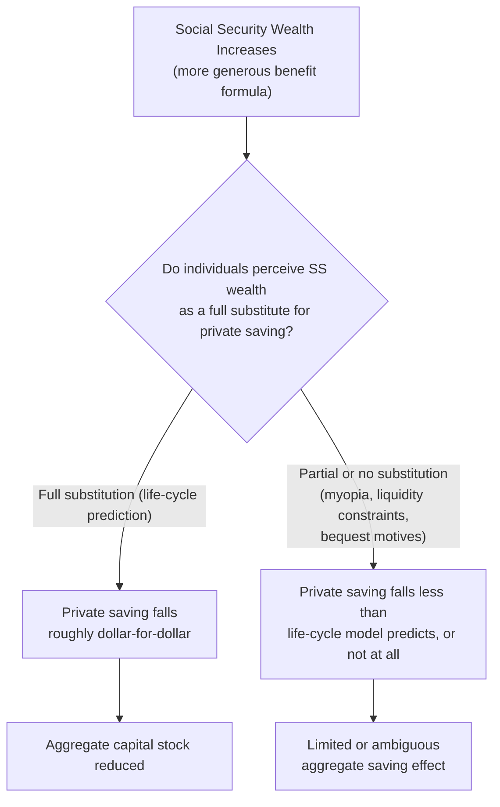

## Effects on Saving and Retirement Decisions

### Overview

Social security and public pension systems can substantially alter individual behavior along two related but distinct margins: **private saving** (how much households save during their working years) and **retirement timing** (when individuals exit the labor force). Understanding these behavioral responses is central to evaluating the fiscal sustainability, welfare consequences, and labor market effects of public pension systems, and connects directly to the life-cycle consumption smoothing framework, the PAYGO/funded system distinction, and the demographic pressures discussed elsewhere in this chapter.

### Theoretical Framework: The Life-Cycle Model and Social Security Wealth

The standard life-cycle model treats social security benefit entitlements as a component of an individual's total wealth — often termed **"social security wealth"** — which should, in principle, substitute for private saving to the extent individuals treat future promised benefits as equivalent to accumulated private assets.

$$W_{total} = W_{private} + W_{SS}$$

where $W_{SS}$ is the present discounted value of expected future social security benefits. Under a simple life-cycle framework with no other frictions, an increase in $W_{SS}$ (e.g., via more generous benefit formulas) should induce a roughly offsetting reduction in private saving $W_{private}$, since rational forward-looking individuals would recognize that mandatory public pension wealth reduces the need for voluntary private accumulation to achieve a given target retirement consumption level.

### The Feldstein (1974) Social Security Wealth Displacement Hypothesis

**Key Points**

- Martin Feldstein's influential and controversial 1974 study argued that the introduction and expansion of the U.S. Social Security system substantially **displaced private saving**, potentially reducing the aggregate capital stock and hence long-run economic growth
- The core mechanism: to the extent workers perceive Social Security benefit promises as a substitute for private retirement saving (an "asset substitution" effect), each dollar of social security wealth reduces private saving by some fraction, potentially up to a full dollar-for-dollar offset under strong life-cycle assumptions
- [Inference] Feldstein's original empirical estimates suggested a large displacement effect, but this finding proved highly controversial and was subject to extensive re-examination; subsequent research (including corrections to a data/coding error identified by Leimer and Lesnoy, 1982) produced substantially smaller and less robust estimated displacement effects, and the literature since has not converged on a single consensus magnitude for the aggregate saving displacement effect of Social Security
- [Unverified] The overall weight of subsequent empirical evidence is generally interpreted as suggesting a **more modest degree of private saving offset** than Feldstein's original estimates implied, though substantial uncertainty and methodological disagreement persists regarding the precise magnitude, given the inherent difficulty of estimating counterfactual saving behavior absent a large universal program that has existed for the entire adult lives of nearly all study subjects

### Reasons Why Full Displacement May Not Occur

**Key Points**

- **Myopia and present bias**: if individuals do not fully account for future Social Security benefits when making current saving decisions (due to bounded rationality, complexity of benefit calculation, or hyperbolic discounting), the life-cycle prediction of full offsetting displacement will not be realized
- **Borrowing/liquidity constraints**: individuals who are constrained in early adulthood (unable to borrow against future social security wealth to increase current consumption) will not exhibit the same behavioral response predicted by the frictionless life-cycle model, since the mechanism requires the ability to freely reallocate consumption across the life cycle in response to changes in perceived lifetime wealth
- **Bequest motives**: if individuals value leaving bequests to heirs, increased social security wealth (which typically cannot be bequeathed, or can only be partially transferred via survivor benefits) does not substitute for private wealth held specifically for bequest purposes, limiting the displacement effect
- **Retirement anchoring/induced retirement effect**: as discussed below, social security availability can induce **earlier retirement**, which — holding the retirement-age saving decision fixed — would actually require *more* private saving to finance a longer expected retirement period, partially offsetting the pure wealth-substitution effect in the opposite direction
- [Inference] The net empirical effect on aggregate private saving reflects the balance of these countervailing forces, which likely explains why estimated displacement effects across studies vary substantially and often fall well short of the full dollar-for-dollar offset implied by the simplest life-cycle framework

### Effects on Retirement Timing: The Induced Retirement Effect

**Key Points**

- A separate and generally more robustly documented empirical finding is that Social Security program design substantially affects the **timing of retirement**
- **Early and normal retirement age thresholds** built into benefit eligibility rules create strong focal points around which retirement decisions cluster — numerous studies across many countries document pronounced **spikes in retirement rates precisely at statutory early and normal retirement ages**, considerably sharper than would be predicted by a smooth, continuous distribution of optimal retirement timing absent these institutional thresholds
- **Actuarial adjustment factors** (how much the benefit amount is increased for delaying claiming, or reduced for early claiming) directly affect the financial incentive to continue working versus retire, and empirical work generally finds retirement/claiming behavior responds to these incentives, though the responsiveness (elasticity) varies across studies and populations
- [Inference] Historically, many pension systems featured implicit taxation on continued work past the early retirement age (benefit formulas that did not fully actuarially adjust for delayed claiming, or earnings tests that reduced benefits for continued work), effectively subsidizing early exit from the labor force — reforms in many OECD countries in recent decades (moving toward more actuarially neutral adjustment factors and eliminating or relaxing earnings tests) have been partly motivated by evidence that these features induced earlier-than-otherwise-optimal retirement, compounding the demographic pressures discussed in the Demographic Transition content

### The Gruber-Wise Cross-National Comparative Framework

**Key Points**

- An influential body of comparative research, associated with Jonathan Gruber and David Wise, examines cross-national variation in the implicit tax/subsidy structure embedded in different countries' pension systems and its relationship to observed labor force exit patterns among older workers
- The key methodological tool is calculating an **"implicit tax on work"** at each age — the extent to which continuing to work an additional year, versus claiming benefits, results in a net loss of expected lifetime pension wealth given the specific benefit formula and actuarial adjustment rules of a country's system
- [Inference] This research generally finds that countries with pension systems imposing larger implicit taxes on continued work exhibit correspondingly earlier average retirement ages and lower labor force participation among older workers, providing cross-national corroborating evidence for the retirement-timing responsiveness found in single-country studies, though [Unverified] the precise quantitative elasticity of retirement timing with respect to the implicit tax varies across the countries and time periods studied in this literature

### Interaction with the Demographic and PAYGO Sustainability Challenge

- [Inference] The retirement-timing behavioral response has direct fiscal significance for PAYGO pension sustainability (see Pay-as-You-Go versus Fully Funded Systems and Demographic Transition content): to the extent pension system design features (early retirement incentives, insufficiently actuarially-neutral adjustment factors) induce earlier-than-otherwise-optimal retirement, this both shrinks the contributing workforce and lengthens the average benefit-receiving period, directly worsening the dependency ratio pressure beyond what pure demographic trends alone would generate
- This has motivated a wave of parametric reforms across OECD countries over recent decades explicitly targeting the retirement-timing margin: raising statutory retirement ages, tightening early retirement eligibility, improving the actuarial neutrality of benefit adjustment for delayed claiming, and reducing or eliminating earnings tests that penalized continued work

### Distinguishing Retirement Timing from Labor Supply More Broadly

- Effects on retirement timing (a discrete exit decision) should be conceptually distinguished from effects on **labor supply intensity** among those who remain working (hours worked, part-time versus full-time status), though the two margins can interact, particularly around **phased or partial retirement** arrangements that some pension systems explicitly accommodate
- [Inference] Some reforms have introduced greater flexibility for partial benefit claiming combined with continued part-time work, reflecting a policy recognition that the traditional binary "working full-time versus fully retired" framing may not capture the full margin along which individuals wish to adjust their labor supply as they approach traditional retirement age

### Saving and Retirement Effects in Defined Contribution versus Defined Benefit Contexts

**Key Points**

- The saving-displacement question is conceptually somewhat different in **defined contribution** individual account systems (common in funded system components, see Pay-as-You-Go versus Fully Funded Systems) versus traditional **defined benefit** PAYGO systems
- In a mandatory defined contribution system, the "crowd-out" of voluntary private saving is more mechanically direct, since mandatory contributions to an individual account are themselves a form of forced saving that substitutes one-for-one, by construction, for what would otherwise be voluntary discretionary saving (subject to the same caveats regarding myopia, liquidity constraints, and whether individuals view the mandatory account as a genuine substitute for other savings vehicles)
- In a traditional defined benefit PAYGO system, the crowd-out question is more genuinely a behavioral/perceptual question (do individuals correctly perceive and respond to their accruing benefit entitlement as they would to an equivalent private asset), which is precisely the empirical question at the center of the Feldstein-era debate

### Illustrative Numerical Framing

**Example**

Consider a stylized worker with social security wealth $W_{SS} = \$150{,}000$ (present value of expected future benefits) and a life-cycle target total retirement wealth of $\$500{,}000$.

- Under a **full-displacement** life-cycle prediction, this worker would accumulate only $\$350{,}000$ in private saving, since the $\$150{,}000$ in social security wealth is treated as a perfect substitute
- Under a **zero-displacement** (fully myopic, or fully liquidity-constrained) scenario, the worker would still attempt to accumulate the full $\$500{,}000$ privately (perhaps because they do not factor social security into their mental accounting of retirement wealth, or because they were credit-constrained throughout their working years and could not have consumed more even had they wished to)
- [Inference] Most empirical estimates in the literature suggest actual behavior falls somewhere between these two extremes, with the precise location along this spectrum varying by study, time period, income group, and financial sophistication/literacy level of the population studied — a robust point estimate applicable across all contexts is not established in the literature

### Summary Table: Behavioral Margins and Evidentiary Robustness

| Behavioral Margin | Theoretical Prediction | Empirical Robustness |
| --- | --- | --- |
| Private saving displacement | Full offset under frictionless life-cycle model | Contested; likely partial, magnitude debated since Feldstein (1974) |
| Retirement age clustering at statutory thresholds | Focal-point/institutional effect | Well-documented across many countries |
| Responsiveness to actuarial adjustment incentives | Work incentive theory prediction | Generally supported, elasticity varies by study |
| Cross-national implicit tax on work vs. retirement age | Gruber-Wise comparative framework prediction | Generally supported in cross-national comparisons |

### Related Topics

- Pay-as-You-Go versus Fully Funded Systems
- Demographic Transition and Old-Age Dependency
- Feldstein (1974) Social Security Wealth Hypothesis and the Leimer-Lesnoy Critique
- Gruber-Wise Cross-National Implicit Tax on Work Framework
- Life-Cycle and Permanent Income Consumption Models
- Actuarial Neutrality in Benefit Adjustment Design
- Behavioral Public Economics: Myopia, Present Bias, and Retirement Saving
- Bequest Motives and Precautionary Saving
- Defined Benefit versus Defined Contribution Plan Design
- Parametric Pension Reform and Retirement Age Policy