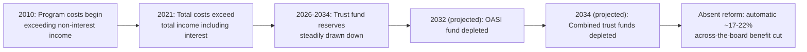
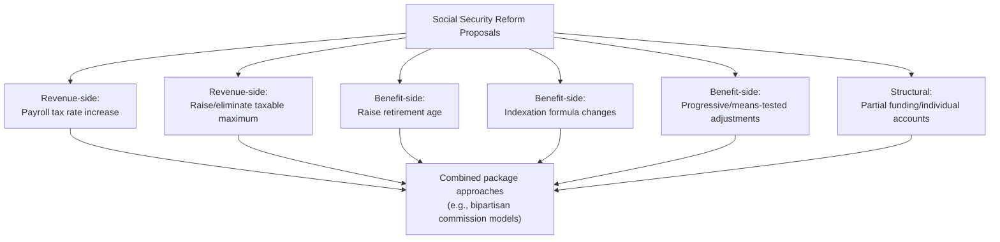

## Social Security Reform Debates

### Overview

Social Security reform debates center on the fundamental question of how to restore long-run fiscal balance to a pay-as-you-go system facing sustained demographic pressure, while weighing competing values of benefit adequacy, intergenerational fairness, and economic efficiency. Using the United States Old-Age, Survivors, and Disability Insurance (OASDI) program as the primary illustrative case — reflecting its centrality in the academic and policy literature — this content surveys the current fiscal outlook, the major categories of reform proposals, and the underlying economic tradeoffs each involves, connecting directly to the PAYGO financing mechanics, demographic transition, and behavioral response literatures developed elsewhere in this chapter.

### Current Fiscal Outlook: The Trust Fund Insolvency Trajectory

**Key Points**

- According to the 2026 Social Security Trustees Report, the combined Old-Age and Survivors Insurance and Disability Insurance (OASDI) trust fund reserves are projected to be depleted in 2034 if Congress does not act, at which point incoming payroll tax revenue would be sufficient to pay approximately 83 percent of scheduled benefits, representing an across-the-board benefit cut for all beneficiaries regardless of age, income, or need at that time
- The Old-Age and Survivors Insurance (OASI) fund specifically — the larger component covering retired workers and survivors — is projected to be depleted somewhat earlier, in 2032, one year sooner than projected in the prior year's report, while the smaller Disability Insurance (DI) trust fund is projected to remain solvent through the 75-year projection window
- The reserves of the combined OASI and DI Trust Funds declined by $160 billion in 2025 to $2.56 trillion, and the program's total cost has exceeded its non-interest income since 2010, with total cost exceeding total income (including interest) beginning in 2021
- Over the 75-year projection window (2025–2099), the program faces an estimated shortfall on the order of $30 trillion, reflecting a persistent structural imbalance between scheduled benefits and dedicated program revenue under current law

### Structural Drivers of the Shortfall

**Key Points**

- The program's growing deficits are largely the result of rising costs, which are driven by the ageing of the population and the growing number of beneficiaries relative to covered workers — directly reflecting the demographic transition and rising old-age dependency ratios discussed in the companion Demographic Transition content
- Between the 2025 and 2026 Trustees Reports, the projected shortfall worsened notably, with the actuarial balance for the combined OASDI trust funds deteriorating by 0.60 percentage points, an unusually large single-year change attributed in significant part to updated demographic assumptions, particularly lower assumed future birth rates
- [Inference] Legislative changes can also materially affect projected trust fund solvency dates independent of underlying demographic or economic fundamentals — for example, tax policy changes affecting the taxation of Social Security benefits can alter trust fund revenue flows (since income taxes on benefits are a dedicated funding source for the trust funds), illustrating that the projected insolvency date is sensitive not only to demographic and macroeconomic assumptions but also to interacting fiscal policy choices made elsewhere in the tax code

### The Cost of Delay: A Recurring Theme in Trustees' Reports

**Key Points**

- The Trustees have consistently noted across multiple years' reports that implementing changes sooner rather than later would allow more generations to share in the needed revenue increases or reductions in scheduled benefits, and that changes implemented sooner would allow workers and beneficiaries more time to adjust their behavior and expectations
- Quantitatively, restoring long-term financial balance today (as of the 2025 report) would require either a 29% payroll tax increase or a 22% across-the-board benefit cut applied immediately and permanently; waiting until the projected 2034 insolvency date would require a larger 34% payroll tax increase or 26% benefit cut, illustrating how the required magnitude of adjustment grows as action is delayed
- [Inference] This escalating-cost-of-delay dynamic reflects a basic actuarial mechanic: fewer years of adjusted contributions or benefits remain available to close a given present-value shortfall as the effective starting date for reform is pushed later, and a smaller pool of affected cohorts must bear a proportionally larger burden the longer reform is postponed

### Major Categories of Reform Proposals

**Key Points**

Reform proposals are typically grouped into several broad categories, each carrying distinct efficiency, distributional, and political economy implications:

**1. Payroll tax rate increases**

- Raising the OASDI payroll tax rate directly increases dedicated program revenue
- [Inference] Standard public finance efficiency concerns apply: higher payroll tax rates can affect labor supply decisions at the margin (though empirical labor supply elasticities with respect to payroll taxes are generally estimated to be modest for prime-age workers), and the economic incidence of the tax increase (who ultimately bears the burden, given relative labor supply and demand elasticities) may differ from its statutory incidence

**2. Raising or eliminating the taxable maximum (payroll tax cap)**

- Currently, only earnings up to a specified annual maximum are subject to OASDI payroll tax; proposals to raise or eliminate this cap would extend taxation to higher-earnings workers
- [Inference] This category of reform is often analyzed through a redistributive lens, since it would primarily affect higher earners, and its net effect on system finances depends on whether increased taxable earnings also translate into increased future benefit credits under the existing benefit formula (which is itself progressive, replacing a smaller fraction of earnings at higher income levels)

**3. Increasing the full/normal retirement age**

- Raising the age at which unreduced benefits become available effectively reduces lifetime benefits for a given retirement age, or induces later retirement (connecting to the retirement-timing behavioral responses discussed in the Effects on Saving and Retirement Decisions content)
- [Inference] This reform category interacts with the demographic transition directly, since rising life expectancy is one of the two fundamental drivers of the old-age dependency ratio pressure — indexing the retirement age to life expectancy gains has been proposed by some as a way of maintaining a roughly constant expected benefit-receipt duration over time, though this raises distributional concerns given documented differences in life expectancy gains across socioeconomic groups (workers in physically demanding occupations or lower socioeconomic groups have in some studies shown smaller life expectancy gains than higher-income workers, meaning uniform retirement age increases could disproportionately reduce lifetime benefits for these groups) [Unverified — the precise magnitude of differential life expectancy gains across socioeconomic groups varies across studies and datasets]

**4. Benefit formula adjustments (indexation changes)**

- Proposals in this category include changing the price index used for cost-of-living adjustments (e.g., adopting a "chained CPI" that some argue more accurately reflects consumer substitution behavior, which would generally result in slower benefit growth over time than current indexation) or altering the wage-indexing formula used to calculate initial benefits
- [Inference] These technical indexation changes can have substantial cumulative fiscal effects over long horizons despite appearing modest in any single year, precisely because Social Security benefits compound over potentially decades-long retirement periods

**5. Means-testing or progressive benefit formula changes**

- Proposals to reduce benefit growth rates more for higher-lifetime-earnings individuals (sometimes termed "progressive price indexing") would preserve benefit levels for lower earners while reducing the rate of benefit growth for higher earners
- [Inference] This category directly engages the redistribution-versus-insurance tension discussed in the general Consumption Smoothing Objectives content, since it would shift the program somewhat further toward a redistributive floor and away from a strict earnings-replacement insurance model for higher earners

**6. Investment-based reforms (partial funding/individual accounts)**

- Proposals to shift some portion of the system toward funded individual accounts invested in capital markets, drawing on the PAYGO versus Fully Funded rate-of-return and risk tradeoffs discussed in the corresponding content
- [Inference] As developed in that content, such proposals face the fundamental "double payment" transition cost problem, since diverting current contributions to individual accounts reduces revenue available to pay current retirees under the existing PAYGO structure, requiring some other financing source (explicit government borrowing, temporary tax increases, or benefit reductions for transition-generation retirees) to bridge the gap

### The Bipartisan Commission Model and Balanced Packages

**Key Points**

- Historical precedent, most notably the 1983 Greenspan Commission reforms (which combined payroll tax increases, a gradual increase in the full retirement age, and taxation of a portion of benefits for higher-income recipients), is frequently cited in current debates as a model for how bipartisan, balanced packages combining both revenue and benefit adjustments have previously restored system solvency
- [Inference] Recent policy analysis has argued that a balanced package of benefit adjustments and tax increases could make the program fiscally sustainable while also improving income adequacy in retirement for the lowest-earning workers, potentially making nearly all affected cohorts better off relative to the alternative of allowing automatic, unlegislated benefit cuts to occur at the point of trust fund depletion — though achieving political consensus on the specific composition of such a package has proven elusive in the current political environment, with observers noting that policymakers in both parties have largely avoided proposing politically costly changes despite widespread awareness of the underlying fiscal imbalance

### Economic Efficiency versus Distributional Tradeoffs Across Reform Types

| Reform Type | Primary Economic Concern | Primary Distributional Concern |
| --- | --- | --- |
| Payroll tax rate increase | Labor supply distortion (generally modest elasticity) | Broad-based; regressive relative to income above the cap unless cap also raised |
| Raise/eliminate taxable maximum | Minimal labor supply distortion at very high income segment affected | Progressive; concentrates burden on higher earners |
| Raise retirement age | Interacts with retirement-timing behavioral responses (Gruber-Wise framework) | Regressive if life expectancy gains differ by socioeconomic group |
| Indexation formula changes | Minimal direct behavioral distortion | Depends on which formula element is changed; can be broadly or narrowly targeted |
| Progressive benefit formula changes | Minimal direct behavioral distortion | Explicitly progressive by design |
| Partial funding/individual accounts | Transition cost (double payment problem); shifts risk to capital markets | Depends on account design; raises risk-bearing distributional questions |

### The Political Economy of Reform Timing

**Key Points**

- [Inference] The persistent pattern of delayed action despite decades of trustees' warnings is frequently analyzed through a political economy lens: near-term costs of reform (tax increases or benefit reductions) are concentrated and salient to current voters, while the benefits of earlier action (smaller required adjustments, more generations sharing the burden) are diffuse and accrue partly to future cohorts who are not current voters, a classic political economy dynamic that can produce systematic underinvestment in timely fiscal adjustment
- Some researchers and commentators have proposed automatic stabilizer mechanisms for Social Security itself — automatic triggers that would adjust benefits or taxes based on the trust fund's projected solvency, removing the need for discretionary legislative action — as a structural response to this political economy challenge, paralleling similar automatic-adjustment mechanisms adopted in some other countries' pension systems in response to demographic transition pressures
- [Speculation] Whether such automatic mechanisms would prove more politically durable and effective than periodic discretionary reform, given that they could still be legislatively overridden or amended, is a matter of ongoing debate rather than settled empirical consensus, since no long-running natural experiment within the U.S. context directly tests this proposition

### Related Topics

- Pay-as-You-Go versus Fully Funded Systems
- Demographic Transition and Old-Age Dependency
- Effects on Saving and Retirement Decisions
- Gruber-Wise Cross-National Implicit Tax on Work Framework
- Progressive Benefit Formula Design and Redistribution within Social Insurance
- 1983 Greenspan Commission Reforms as a Historical Reference Model
- Political Economy of Entitlement Reform and Intergenerational Bargaining
- Payroll Tax Incidence and Labor Supply Elasticity
- Automatic Fiscal Stabilizer Mechanisms in Pension System Design
- Multi-Pillar Pension System Design (World Bank Framework)