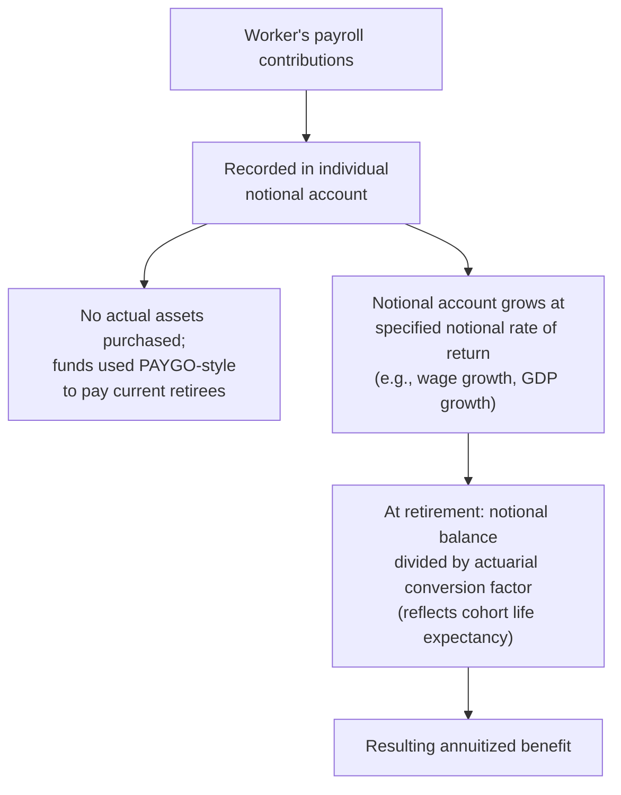

## Notional Defined Contribution Systems

### Overview

Notional Defined Contribution (NDC) systems represent a distinctive pension reform model that emerged in the 1990s, adopted most prominently by Sweden, Italy, Latvia, Poland, and Norway (in modified forms). NDC systems attempt to combine the financing mechanics of a pay-as-you-go (PAYGO) system with the individual-account-like benefit calculation logic and transparent, actuarially-linked incentive structure typically associated with fully funded defined contribution systems — without requiring the costly transition to actual asset accumulation. This hybrid design directly addresses several of the tensions developed in the PAYGO versus Fully Funded Systems and Demographic Transition content: NDC systems aim to preserve PAYGO's transition-cost advantage and intergenerational risk-sharing capacity while incorporating automatic demographic adjustment mechanisms and individually transparent accounting that traditional defined-benefit PAYGO systems typically lack.

### Core Mechanics

**Key Points**

- Each worker's payroll tax contributions are recorded in an individual **notional account**, but unlike a genuine funded defined contribution account, **no actual assets are purchased or accumulated** — contributions continue to be used, PAYGO-style, to pay current retirees' benefits
- The notional account balance grows each year according to a specified **notional rate of return**, which is typically indexed to a macroeconomic aggregate such as the growth rate of average covered wages, GDP growth, or a similar proxy for the sustainable PAYGO rate of return (recall from the Aaron (1966) framework that the sustainable PAYGO return approximates population growth plus wage growth, $n + g$)
- At retirement, the accumulated notional balance is converted into an annuitized benefit stream using an **actuarial conversion factor** that accounts for the retiree's remaining life expectancy at the time of retirement (and, in some system designs, cohort-specific life expectancy projections), directly linking benefit generosity to longevity trends
- This design creates individual accounts that behave, from the participant's perspective, much like a funded defined contribution account in terms of transparency and the direct link between lifetime contributions and eventual benefits, while remaining financed on a PAYGO basis

### Distinguishing NDC from Traditional Defined Benefit PAYGO Systems

**Key Points**

- **Traditional defined benefit (DB) PAYGO systems** typically calculate benefits using a formula based on some measure of career-average or final earnings, years of service, and a fixed accrual rate, with benefit generosity often only loosely and indirectly connected to underlying demographic sustainability parameters
- **NDC systems** instead calculate benefits as a direct actuarial function of lifetime contributions and life expectancy at retirement, meaning the benefit formula itself embeds an **automatic adjustment mechanism** for demographic change: as life expectancy rises (increasing the denominator in the annuitization calculation), the resulting annual benefit for a given accumulated notional balance automatically falls, without requiring discretionary legislative action
- [Inference] This automatic-adjustment property is often cited as NDC's central appeal relative to traditional DB PAYGO systems: it embeds a self-correcting mechanism directly responsive to the demographic transition pressures (rising life expectancy, changing dependency ratios) discussed in the Demographic Transition content, potentially reducing the need for the kind of periodic, politically difficult discretionary reform debates discussed in the Social Security Reform Debates content

### Distinguishing NDC from Fully Funded Defined Contribution Systems

**Key Points**

- The critical distinction from a genuine (funded) defined contribution system is that **NDC accounts hold no real financial assets** — the "notional" in notional defined contribution signals precisely this absence of actual asset backing
- This means NDC systems **avoid the double-payment transition cost problem** discussed in the Pay-as-You-Go versus Fully Funded Systems content, since converting a traditional DB PAYGO system to NDC does not require diverting current contributions away from paying current retirees — the same PAYGO cash flows continue, only the *benefit calculation method* changes
- Correspondingly, NDC systems **do not generate the capital market risk exposure or potential capital accumulation benefits** associated with genuine funding, since there is no actual investment portfolio; the notional rate of return is an administratively/formulaically determined proxy for the sustainable PAYGO return rather than a realized market return
- [Inference] This positions NDC as occupying a distinct point in the design space from both traditional PAYGO defined benefit and funded defined contribution systems: it captures the individual-account transparency and actuarial linkage benefits of funded DC systems while retaining the PAYGO financing structure's transition-cost and demographic-risk-sharing characteristics (rather than capital market risk exposure)

### Automatic Balancing Mechanisms (ABMs)

**Key Points**

- Several NDC systems, most notably Sweden's, incorporate an explicit **automatic balancing mechanism** that adjusts the notional rate of return downward if a solvency indicator (comparing the system's assets, including the PAYGO contribution asset and any buffer fund, against its liabilities) falls below a specified threshold
- Sweden's system, for example, includes a buffer fund (the AP funds) that holds actual financial assets to smooth demographic fluctuations, alongside the notional PAYGO liability calculation, and the automatic balancing mechanism has been triggered on more than one occasion since the system's introduction when the calculated balance ratio fell below the threshold, resulting in a temporarily reduced indexation of both notional accounts and benefits in payment
- [Inference] This automatic balancing feature represents an attempt to institutionalize fiscal sustainability directly into the system's operating rules, reducing reliance on the kind of discretionary political action whose delays and difficulties are documented in the general Social Security Reform Debates content — though [Unverified] the precise long-run effectiveness and political durability of automatic balancing mechanisms, particularly under conditions of severe or sustained demographic or macroeconomic stress, has not been tested across a sufficiently long historical period to draw definitive conclusions

### Risk Allocation Under NDC

- Under NDC, **demographic and macroeconomic risk (fluctuations in the notional rate of return, driven by wage or GDP growth variation) is borne collectively by the participant population**, similar to a traditional PAYGO system, rather than being individually diversifiable through personal investment choice as in a funded DC account
- **Longevity risk allocation** depends on the specific annuitization design: if the actuarial conversion factor is fixed at the point of retirement based on then-current cohort life expectancy, the retiree bears limited ongoing longevity risk after retirement (the annuity is fixed once calculated), but the overall system bears aggregate cohort longevity risk to the extent life expectancy projections used in setting conversion factors prove inaccurate ex post
- [Inference] This risk allocation structure represents a middle ground between traditional DB PAYGO (which typically socializes both demographic and longevity risk broadly across the system, often via discretionary benefit formula adjustment) and funded DC (which shifts investment risk onto individuals but often still socializes longevity risk if benefits are annuitized through an insurer or pooled arrangement)

### Country Implementation Variation

| Feature | Sweden | Italy | Latvia/Poland |
| --- | --- | --- | --- |
| Notional rate of return basis | Wage sum growth (per capita wage growth times covered worker growth) | GDP growth (5-year moving average) | Variants tied to wage bill or contribution revenue growth |
| Automatic balancing mechanism | Yes, explicit and has been triggered | Adjustment coefficients periodically revised, less automatic than Sweden's | Varies by country; generally weaker automatic mechanisms than Sweden |
| Funded component alongside NDC | Yes (mandatory individual funded accounts as a complementary pillar) | No mandatory funded pillar tied directly to NDC reform | Varies; Poland introduced a funded pillar alongside NDC reform (subsequently modified) |

[Unverified] The precise current parameters and any subsequent legislative modifications to these systems (particularly Poland's funded pillar, which has undergone significant changes since its original introduction) should be verified against current country-specific sources, since NDC system parameters are subject to ongoing legislative adjustment in several implementing countries.

### Theoretical Rationale: Combining PAYGO Financing with DC-Style Incentives

**Key Points**

- A central motivation for NDC design is **improving work and retirement-timing incentives** relative to traditional DB PAYGO formulas: because NDC benefits are calculated as a direct actuarial function of lifetime contributions, an additional year of work (and contributions) mechanically increases the notional account balance and, all else equal, increases the eventual benefit, without the kind of implicit taxation on continued work that characterized many traditional DB formulas (see the Gruber-Wise implicit tax on work framework discussed in Effects on Saving and Retirement Decisions)
- [Inference] By making the contribution-benefit link more actuarially transparent and immediate, NDC design is intended to reduce the kind of retirement-timing distortions (early retirement clustering at statutory ages driven by formula-embedded implicit subsidies) documented in traditional DB PAYGO systems, potentially improving labor supply incentives among older workers — a design goal directly relevant to the labor force participation and productivity concerns raised in the Demographic Transition content
- This actuarial transparency is also argued to improve the **political economy of adjustment**: because the benefit formula automatically incorporates demographic parameters (life expectancy at retirement, and in some systems, an automatic balancing trigger), some of the adjustment burden of demographic change is shifted from discretionary legislative reform (with its associated political economy difficulties, as discussed in Social Security Reform Debates) toward an automatic, rules-based mechanism

### Criticisms and Limitations

**Key Points**

- **Redistribution limitations**: because NDC benefit calculation closely tracks individual lifetime contributions, NDC systems by design provide **less implicit redistribution** across the income distribution than traditional progressive DB benefit formulas (such as the U.S. Social Security formula's progressive replacement rate structure) — this necessitates a separate, explicitly redistributive minimum pension or social assistance floor alongside the NDC component to protect low lifetime earners, adding institutional complexity
- **Continued exposure to demographic and macro shocks for participants**: while NDC systems handle demographic adjustment more transparently and automatically than DB PAYGO systems, participants still bear aggregate wage growth and demographic risk through the notional rate of return, meaning NDC does not eliminate PAYGO financing risk, it merely changes how that risk is transmitted and how transparently it is communicated to participants
- **Complexity and public understanding**: the actuarial mechanics of notional accounts, conversion factors, and automatic balancing mechanisms can be difficult for the general public to understand relative to simpler DB formulas, potentially complicating public communication and political accountability regarding system performance
- [Unverified] Whether NDC systems have empirically succeeded in improving retirement-timing incentives and reducing early retirement relative to comparable DB PAYGO systems, and by what magnitude, is a subject of ongoing empirical pension economics research rather than a fully settled finding, given the relatively limited number of countries and time periods over which NDC systems have operated

### Related Topics

- Pay-as-You-Go versus Fully Funded Systems
- Demographic Transition and Old-Age Dependency
- Aaron (1966) Rate-of-Return Comparison
- Effects on Saving and Retirement Decisions (Gruber-Wise Implicit Tax on Work)
- Social Security Reform Debates
- Automatic Balancing Mechanisms in Pension System Design (Sweden's AP Buffer Funds)
- Actuarial Neutrality and Annuitization Design
- Multi-Pillar Pension System Design (World Bank Framework)
- Progressive Benefit Formula Design and Redistribution within Social Insurance
- Comparative International Pension System Design (Sweden, Italy, Latvia, Poland)