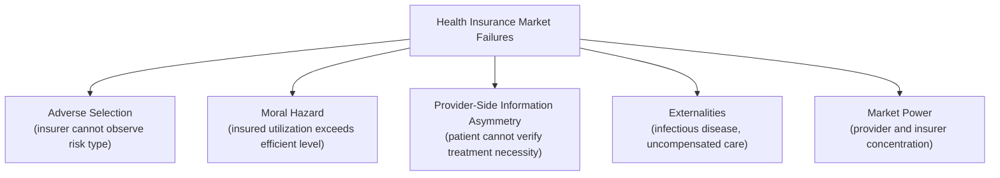

## Market Failures in Healthcare Markets

### Overview

Healthcare markets exhibit an unusually dense concentration of market failures relative to typical consumer goods markets, which is the central economic justification for extensive government intervention in health financing, insurance regulation, and provider markets. This content surveys the primary categories of market failure specific to healthcare: information asymmetries (both in insurance and in the patient-provider relationship), externalities, market power in provider and insurer markets, and the unique features of health as both a consumption good and an investment good. Many of these failures interact with and compound each other, which is part of why health policy is widely regarded as one of the more complex domains within applied public economics.

### Asymmetric Information in Health Insurance Markets

**Key Points**

- As developed extensively in the Adverse Selection in Insurance Markets content, health insurance markets are a canonical setting for adverse selection: individuals possess substantial private information about their own health status and expected future medical needs that insurers cannot fully observe or verify
- This generates the standard Rothschild-Stiglitz-style unraveling risk in voluntary, medically-underwritten individual health insurance markets, historically manifested in practices such as pre-existing condition exclusions, medical underwriting, and elevated premiums or outright coverage denial for high-risk individuals prior to regulatory reforms such as the U.S. Affordable Care Act's guaranteed issue and community rating provisions
- Moral hazard, as developed in the Moral Hazard in Social Insurance content, operates powerfully in health insurance specifically through **ex-post utilization effects**: once insured, patients face a marginal price for care well below the true resource cost, leading to increased utilization documented empirically in the RAND and Oregon Health Insurance Experiments

### Asymmetric Information in the Patient-Provider Relationship

**Key Points**

- Distinct from insurance-market adverse selection, healthcare markets feature a severe **information asymmetry between patients and providers** regarding diagnosis, appropriate treatment, and the necessity or quality of care delivered — patients typically lack the medical expertise to independently verify whether recommended tests, procedures, or treatments are medically necessary or optimally chosen
- This creates conditions for **supplier-induced demand**: because physicians and other providers typically act simultaneously as the patient's agent (advising on what care to receive) and as the seller of that care (financially benefiting from care provided, particularly under fee-for-service payment models), a potential conflict of interest arises wherein providers may have both the informational advantage and, under certain payment structures, the financial incentive to recommend more intensive or more frequent care than is medically optimal
- [Inference] The empirical magnitude of supplier-induced demand has been a subject of long-running debate in health economics; while the theoretical conditions for it are well established, disentangling genuine demand-inducement from legitimate practice-pattern variation reflecting differing clinical judgment, defensive medicine (driven by malpractice liability concerns), or genuinely justified treatment intensity differences across patient populations is empirically challenging, and estimates of its overall magnitude vary substantially across studies and clinical contexts

### The Physician-as-Agent Problem and Payment System Design

- The severity of the patient-provider information asymmetry problem depends heavily on the **provider payment system**: fee-for-service payment, which compensates providers per unit of service delivered, is widely argued to exacerbate incentives for volume-maximizing behavior (whether through genuine inducement or simply reduced incentive toward cost-conscious practice), while capitation or bundled/episode-based payment models shift financial risk (and, in principle, incentive alignment) differently
- [Inference] This has motivated substantial policy interest in alternative payment models (value-based payment, accountable care organizations, bundled payments) intended to realign provider financial incentives with efficient and appropriate care delivery, though [Unverified] the empirical track record of these alternative payment models in demonstrably reducing costs while maintaining or improving quality has been mixed across specific program evaluations, and the literature has not converged on a single clearly superior payment model applicable across all clinical contexts

### Externalities in Healthcare

**Key Points**

- **Infectious disease and vaccination** represent the clearest and most extensively studied case of positive externalities in healthcare: an individual's decision to be vaccinated confers protective benefits not only on themselves but on others in the population through reduced disease transmission (herd immunity effects), a benefit the vaccinated individual does not fully internalize when making their private vaccination decision
- This externality provides a standard public economics justification for public subsidization of vaccination (reducing the private cost below the social cost to correct the underprovision that would occur under purely private decision-making), and in some cases for outright vaccination mandates for certain diseases or in certain settings (school entry requirements being a common example)
- **Uncompensated care and cost-shifting**: in healthcare systems without universal coverage, uninsured individuals who receive emergency or urgent care that they cannot pay for generate costs that are often shifted onto other payers (through higher prices charged to insured patients, or through public subsidization of safety-net providers), representing a distinct externality-like mechanism through which the uninsured population's healthcare consumption imposes costs on the broader system
- [Inference] Some researchers frame broader **public health externalities** more expansively — for example, the argument that widespread untreated infectious or even certain chronic conditions can impose broader productivity and social costs beyond the individual, providing an additional rationale (beyond pure insurance market failure) for public involvement in ensuring baseline access to care, though the precise quantification and policy weight appropriately given to these broader externality arguments remains contested relative to the more clearly established insurance-market-failure rationale

### Market Power: Provider Consolidation and Insurer Concentration

**Key Points**

- Healthcare provider markets (hospitals, physician groups) have exhibited substantial **consolidation** in many countries, particularly the United States, raising standard market power concerns: concentrated provider markets can extract higher prices from insurers and patients than would prevail under more competitive conditions, without necessarily corresponding quality improvements
- [Inference] A substantial empirical literature using hospital merger natural experiments and market concentration measures generally finds that increased hospital market concentration is associated with higher prices, with more mixed and less consistent evidence regarding quality effects — this pattern is broadly consistent with standard market power theory predicting price increases from reduced competition, though the magnitude of estimated price effects varies across studies, markets, and time periods
- **Insurer market concentration** raises a distinct but related concern: in markets with few competing insurers, insurers may exercise monopsony power in negotiating with providers (potentially a countervailing force against provider market power) while simultaneously exercising market power over consumers/employers purchasing insurance, creating a more complex bilateral market power dynamic than a simple single-sided monopoly or monopsony model captures
- [Unverified] The net welfare effect of simultaneous provider-side and insurer-side market power (sometimes analyzed using "bargaining power" or countervailing power frameworks) is theoretically ambiguous and empirically context-dependent, since the interaction between two-sided market power does not resolve cleanly to a simple prediction without specifying the relative bargaining strength and market structure details of the specific market being analyzed

### Health as Simultaneously a Consumption and Investment Good

**Key Points**

- The Grossman (1972) model of health capital conceptualizes health as a durable capital stock that individuals invest in (through healthcare utilization, but also diet, exercise, and other health-producing behaviors), which depreciates over time and produces both direct utility (health as a consumption good, since being healthy is directly valued) and indirect utility through increased productive time available for market work and other activities (health as an investment good)
- [Inference] This dual nature complicates simple welfare analysis of healthcare markets, since a purely consumption-good framing (as would apply to most standard consumer goods analyzed in public economics) misses the investment-good dimension through which healthcare affects labor market productivity and lifetime earnings capacity — potentially strengthening the case for public investment or subsidization beyond what pure insurance-market-failure arguments alone would suggest, particularly for preventive and early-life health interventions with long horizons over which investment returns accrue

### Uncertainty and the Unpredictability of Healthcare Needs

- Unlike many goods and services, individual healthcare needs are subject to substantial, often catastrophic, and difficult-to-predict variation — a healthy individual can face sudden, extremely high-cost medical needs (major trauma, sudden onset of serious illness) that bear little relationship to prior health-related consumption patterns
- [Inference] This high degree of idiosyncratic, high-variance risk is precisely the condition under which insurance provides the greatest welfare value (per the Consumption Smoothing Objectives framework), while simultaneously being the condition under which private insurance markets are most vulnerable to adverse selection and require the largest risk pools to function efficiently — creating a structural tension between the strong theoretical case for insurance and the practical fragility of voluntary private markets in providing it

### Behavioral and Bounded Rationality Considerations

**Key Points**

- Beyond the standard information asymmetry and externality categories, health economics has increasingly incorporated **behavioral economics** considerations: patients may exhibit present bias in health-related decisions (underinvesting in preventive care with delayed benefits relative to immediate costs), have limited ability to process complex information about insurance plan options or treatment tradeoffs, or exhibit systematic biases in risk perception regarding their own future health needs
- [Inference] These behavioral considerations complicate the standard rational-expected-utility framework underlying much of the classical adverse selection and moral hazard literature, and are increasingly incorporated into health policy design considerations — for example, in the design of insurance plan choice architecture (default options, plan menu simplification) intended to help consumers navigate complex insurance marketplace decisions, though [Unverified] the precise welfare gains from specific behavioral-design interventions in health insurance marketplaces vary across studies and populations

### Summary Table: Market Failure Categories and Primary Policy Responses

| Market Failure | Primary Mechanism | Common Policy Response |
| --- | --- | --- |
| Adverse selection (insurance) | Private information about risk type | Mandates, community rating, guaranteed issue, risk adjustment |
| Moral hazard | Reduced marginal price faced by insured patient | Cost-sharing design (deductibles, coinsurance, caps) |
| Supplier-induced demand | Patient-provider information asymmetry | Payment reform (bundled/value-based payment), practice guidelines |
| Positive externalities (vaccination) | Herd immunity benefits not privately internalized | Subsidization, mandates for certain settings |
| Uncompensated care/cost-shifting | Uninsured care costs shifted to other payers | Coverage expansion, safety-net provider subsidies |
| Provider market power | Consolidation reducing competitive pressure | Antitrust enforcement, merger review |
| Insurer market power | Concentrated insurance markets | Antitrust enforcement, marketplace competition rules |
| Behavioral/bounded rationality | Present bias, information processing limits | Choice architecture, default options, plan simplification |

### Interaction Effects Across Market Failure Categories

**Conclusion**

The market failures surveyed here do not operate independently — they compound and interact in ways that make healthcare markets distinctively difficult to analyze using any single market-failure framework in isolation. Adverse selection interacts with moral hazard (selection on moral hazard, as discussed in the Adverse Selection content); provider market power interacts with insurer market power in bilateral bargaining; and behavioral limitations in navigating insurance choices compound the already substantial information asymmetries inherent in both the insurance-purchase decision and the treatment decision itself. This density and interaction of market failures is the central economic rationale underlying the extensive scope of government involvement in healthcare financing and regulation across virtually all developed economies, even where the specific institutional form of that involvement (single-payer, regulated multi-payer, employer-based with public backstops) varies substantially.

### Related Topics

- Adverse Selection in Insurance Markets
- Moral Hazard in Social Insurance
- Rationale for Social versus Private Insurance
- Grossman Model of Health Capital
- Supplier-Induced Demand and Physician Payment System Design
- Hospital and Insurer Market Concentration and Antitrust Policy
- Vaccination Externalities and Public Health Subsidization
- RAND and Oregon Health Insurance Experiments
- Behavioral Economics of Health Insurance Choice Architecture
- Value-Based Payment and Alternative Payment Models