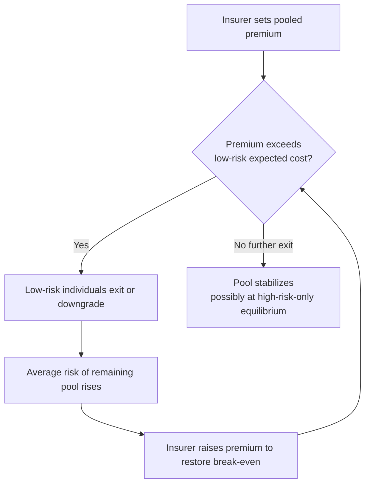

## Adverse Selection in Health Insurance

### Definition and Conceptual Overview

Adverse selection arises when there is asymmetric information between insurers and potential policyholders regarding individual risk types, such that individuals possess private information about their own expected health expenditures that insurers cannot observe or verify. Because insurers cannot price policies based on true individual risk, they must charge a premium reflecting the average risk of the insured pool. This uniform pricing induces low-risk individuals to find insurance unattractively priced relative to their actual expected costs, leading them to reduce coverage or exit the market, while high-risk individuals find the same price attractive and remain or enter. The resulting shift in the risk composition of the insured pool toward higher-cost individuals is the defining feature of adverse selection.

The term originates in insurance economics but is a special case of a more general problem of hidden information (as opposed to hidden action, which characterizes moral hazard). Adverse selection concerns the composition of who chooses to buy insurance and at what quantity; moral hazard concerns how insurance, once purchased, changes behavior.

**Key Points**

- Requires informational asymmetry: the individual knows more about their own risk type than the insurer.
- Operates through self-selection into (or out of) insurance contracts, not through insurer discrimination.
- Distinct from statistical discrimination, where insurers observe and price on risk factors (e.g., age) that are correlated with cost but not hidden.
- Can occur even when insurers are fully rational profit-maximizers; the problem is informational, not behavioral on the insurer's side.

---

### Theoretical Foundations

#### The Akerlof "Lemons" Framework Applied to Insurance

George Akerlof's 1970 "market for lemons" model, though originally developed for used cars, is the canonical foundation for adverse selection in insurance markets. Applied to health insurance:

- Let there be a continuum of individuals indexed by risk type $\theta$, where $\theta$ represents expected health expenditure.
- Individuals know their own $\theta$; insurers only know the distribution $F(\theta)$ across the population.
- If insurers must charge a single pooled premium $p$, only individuals with $\theta$ such that their valuation of insurance exceeds $p$ will purchase.
- Because valuation is typically increasing in $\theta$ (sicker people value insurance more), raising $p$ toward the average cost of the pool disproportionately drives out low-$\theta$ types, further raising the average cost of those remaining — a feedback loop.

#### The Rothschild-Stiglitz (1976) Model

This is the workhorse model of adverse selection in insurance economics and is a required build for a rigorous treatment.

**Setup:**

- Two risk types: high risk ($\theta_H$) with loss probability $p_H$, and low risk ($\theta_L$) with loss probability $p_L$, where $p_H > p_L$.
- Individuals are risk-averse expected-utility maximizers with wealth $W$ and a potential loss $D$ in the bad state.
- Insurers offer contracts specifying a premium and a payout (equivalently, coverage level).
- Insurers cannot observe an individual's type but know the population shares $\lambda$ (share high risk) and $1-\lambda$.
- Insurance market is competitive: contracts earn zero expected profit in equilibrium (Bertrand-style competition among insurers).

**Key results:**

1. **No pooling equilibrium exists.** Any contract that pools both types and breaks even on average is vulnerable to a profitable "cream-skimming" deviation: a rival insurer can offer a contract with slightly less coverage and a lower premium that only low-risk types find attractive, leaving the original pooled contract with only high-risk types and thus unprofitable. This destabilizes any candidate pooling equilibrium.
2. **A separating equilibrium, if it exists, involves under-insurance of low-risk types.** In a separating equilibrium:
   - High-risk individuals are offered (and choose) full insurance at an actuarially fair price for their own type, $p_H \cdot D$.
   - Low-risk individuals are offered only partial insurance at their actuarially fair price $p_L \cdot D$, with the coverage level restricted just enough that high-risk types are not tempted to mimic low-risk types by purchasing the low-risk contract (an incentive-compatibility / self-selection constraint).
   - This generates a **welfare loss for low-risk individuals**, who would prefer full insurance at their own fair price but cannot obtain it because such a contract would also be attractive to high-risk types, undermining insurer break-even.
3. **Non-existence problem.** Under certain distributions of $\lambda$ (specifically, when the share of low-risk individuals is small), no equilibrium exists at all in the pure Nash sense used by Rothschild-Stiglitz, because any candidate separating equilibrium is itself vulnerable to a profitable pooling deviation. This non-existence result motivated substantial follow-up literature (Wilson 1977, Miyazaki 1977, Spence 1978) exploring alternative equilibrium concepts (e.g., anticipatory equilibria, cross-subsidization) that restore existence.

**Diagrammatic representation (Rothschild-Stiglitz separating equilibrium in premium-coverage space):**

<svg xmlns="http://www.w3.org/2000/svg" viewBox="0 0 640 460" font-family="Helvetica, Arial, sans-serif">
<text x="320" y="24" text-anchor="middle" font-size="15" font-weight="bold">Rothschild-Stiglitz Separating Equilibrium (svg_diagram)</text>

<line x1="80" y1="400" x2="600" y2="400" stroke="black" stroke-width="1.5" />
<line x1="80" y1="400" x2="80" y2="50" stroke="black" stroke-width="1.5" />
<text x="600" y="420" font-size="12" text-anchor="end">Coverage in Bad State (C₁)</text>
<text x="60" y="45" font-size="12" text-anchor="middle" transform="rotate(-90 60 220)">Consumption in Good State (C₂)</text>

<line x1="80" y1="400" x2="500" y2="80" stroke="#888" stroke-width="1" stroke-dasharray="4,3" />
<text x="430" y="120" font-size="11" fill="#555">45° line (full insurance)</text>

<line x1="80" y1="400" x2="560" y2="130" stroke="#2b6cb0" stroke-width="1.5" />
<text x="500" y="150" font-size="11" fill="#2b6cb0">Low-risk fair-odds line</text>

<line x1="80" y1="400" x2="420" y2="90" stroke="#c05621" stroke-width="1.5" />
<text x="350" y="110" font-size="11" fill="#c05621">High-risk fair-odds line</text>

<circle cx="330" cy="230" r="5" fill="#c05621" />
<text x="340" y="225" font-size="11" fill="#c05621">Contract H (full insurance, high-risk price)</text>

<circle cx="260" cy="290" r="5" fill="#2b6cb0" />
<text x="150" y="315" font-size="11" fill="#2b6cb0">Contract L (partial insurance)</text>

<path d="M 150 380 Q 260 290 420 210" fill="none" stroke="#c05621" stroke-width="1" stroke-dasharray="2,2" />
<text x="130" y="395" font-size="10" fill="#c05621">High-risk indifference curve through H</text>

<text x="90" y="70" font-size="11" fill="#333">Endowment (no insurance)</text>

<circle cx="130" cy="380" r="4" fill="black" />

</svg>

The high-risk indifference curve through contract H passes exactly through contract L, meaning high-risk types are indifferent between mimicking low-risk types and taking their own contract — this is the binding incentive-compatibility constraint that pins down the (inefficiently low) coverage level offered to low-risk individuals.

---

### The Adverse Selection Death Spiral

**Mechanism:**

1. Insurer sets premium $p_0$ based on expected cost of the full risk pool.
2. Low-risk individuals, facing a premium exceeding their own expected cost, drop coverage or downgrade to cheaper/thinner plans.
3. The remaining pool has a higher average risk, raising the insurer's expected cost per enrollee.
4. Insurer raises premium to $p_1 > p_0$ to maintain solvency/break-even.
5. This induces the next tranche of relatively lower-risk individuals to exit.
6. The cycle repeats, and in the limiting (extreme) case can converge toward market unraveling, where only the highest-risk individuals remain insured or the market collapses entirely.

**Mermaid diagram of the death spiral dynamic:**

**Empirical note [Unverified as a universal outcome]:** Full market unraveling to a null market is a theoretical limiting case; in practice, observed "death spirals" are often partial, dampened by consumer inertia, brand loyalty, employer subsidies, or regulatory floors (e.g., open enrollment periods, mandates), and the extent of unraveling in any specific historical market is an empirical question rather than a theoretical certainty.

---

### Formal Model of Adverse Selection Cost Escalation

Let the population have a continuous risk distribution with density $f(\theta)$ over $[\theta_{min}, \theta_{max}]$, where $\theta$ is annual expected expenditure. Suppose the insurer charges premium $p$ and individuals with valuation $v(\theta) \geq p$ purchase, where $v(\theta)$ is increasing in $\theta$ (a standard "single-crossing" assumption in this literature).

Let $\theta^*(p)$ solve $v(\theta^*) = p$, the marginal buyer. Only individuals with $\theta \geq \theta^*(p)$ purchase. Insurer break-even requires:

$$p = \mathbb{E}[\theta \mid \theta \geq \theta^*(p)] = \frac{\int_{\theta^*(p)}^{\theta_{max}} \theta f(\theta)\, d\theta}{\int_{\theta^*(p)}^{\theta_{max}} f(\theta)\, d\theta}$$

This is a fixed-point condition: the premium must equal the average cost of exactly those who choose to buy at that premium. Because $\theta^*$ is increasing in $p$ (higher premiums drive out marginal low-risk buyers), and the conditional mean $\mathbb{E}[\theta \mid \theta \geq \theta^*]$ is itself increasing in $\theta^*$, there can be multiple fixed points, including a degenerate one where the market unravels to the point where only $\theta_{max}$-type individuals remain, or no fixed point in an interior range, illustrating Akerlof's original insight that adverse selection can eliminate mutually beneficial trade entirely.

---

### Adverse Selection Versus Moral Hazard: Distinguishing Features

| Dimension | Adverse Selection | Moral Hazard |
| --- | --- | --- |
| Information problem | Hidden information (pre-contractual) | Hidden action (post-contractual) |
| Timing | Exists before the insurance contract is signed | Emerges after coverage begins |
| Mechanism | Self-selection into/out of coverage by risk type | Behavioral change in response to being insured |
| Core distortion | Risk pool composition shifts toward high-cost individuals | Utilization/spending rises due to reduced marginal cost |
| Standard policy response | Mandates, risk adjustment, medical underwriting (where legal) | Cost-sharing (deductibles, coinsurance), utilization review |
| Canonical model | Rothschild-Stiglitz (1976), Akerlof (1970) | Pauly (1968), Zeckhauser (1970) |

These two phenomena are frequently conflated in casual discussion but require distinct policy instruments; a policy well-suited to controlling moral hazard (e.g., higher coinsurance) can *worsen* adverse selection by making the low-coverage plan even less attractive to high-risk individuals relative to a rival's richer plan, and vice versa. This interaction is itself a subject of active literature (Einav, Finkelstein, and Cullen, 2010).

---

### Empirical Testing Framework: The Positive Correlation Test

The dominant empirical approach for detecting asymmetric-information-driven adverse selection, developed by Chiappori and Salanié (2000), tests whether, conditional on all variables used by the insurer for pricing (risk classification), there remains a **positive correlation between coverage chosen and realized risk (claims/losses)**.

**Logic:**

- Under symmetric information (no adverse selection, no private information), coverage choice and risk should be conditionally independent once observable risk factors are controlled for.
- Under adverse selection, individuals with private knowledge of higher risk select more generous coverage, so — even after controlling for observables — higher coverage correlates with higher realized claims.

**Empirical specification (stylized):**

$$\text{Coverage}_i = \alpha + X_i'\beta + \varepsilon_i$$

$$\text{Claims}_i = \gamma + X_i'\delta + \eta_i$$

where $X_i$ are observable risk-rating variables used by the insurer. The test examines $\text{Corr}(\varepsilon_i, \eta_i)$ — the correlation between the residuals. A statistically significant positive correlation is interpreted as evidence consistent with adverse selection (or advantageous selection, if negative — see below).

**Important caveat [Inference / methodological]:** This test detects the *net* effect of both adverse selection and moral hazard simultaneously, since both generate a positive correlation between coverage and claims. Disentangling the two typically requires either panel data (observing claims before and after a coverage change for the same individual) or quasi-experimental variation in coverage that is unrelated to risk type (e.g., Einav, Finkelstein, and colleagues' work using premium/plan menu discontinuities).

---

### Advantageous Selection: An Important Empirical Complication

A substantial body of empirical work (e.g., Fang, Keane, and Silverman 2008 on Medigap; Cardon and Hendel 2001) has found instances of **advantageous selection**, where individuals who choose *more* generous coverage are, on average, *lower* risk — the opposite sign from the canonical adverse selection prediction.

**Mechanisms proposed:**

- Risk-averse individuals may be both more likely to purchase comprehensive insurance *and* more likely to engage in health-protective behaviors (exercise, preventive care), a multidimensional-type story where risk aversion and health risk are negatively correlated in the population.
- Cognitive ability and financial literacy may jointly predict both plan choice quality and health-related behaviors.
- These findings do not overturn the theoretical adverse selection mechanism but show that its empirical sign depends on the joint distribution of risk type and other characteristics (like risk aversion) correlated with plan choice — a **multidimensional heterogeneity** critique of the single-crossing assumption underlying Rothschild-Stiglitz.

---

### Policy Responses to Adverse Selection

#### 1. Community Rating and Guaranteed Issue

Regulations requiring insurers to charge the same premium regardless of health status (community rating) and to accept all applicants (guaranteed issue) eliminate medical underwriting but, absent complementary policies, *worsen* adverse selection incentives for healthy individuals to opt out, since they can no longer obtain a lower price reflecting their lower risk.

#### 2. Individual Mandates

A mandate requiring universal purchase (as under the U.S. Affordable Care Act, subject to a penalty, later reduced to $0 federally after 2017 while some states retained state-level mandates) directly targets the adverse selection mechanism by preventing low-risk individuals from exiting the pool, holding the risk pool's composition closer to the population average.

#### 3. Risk Adjustment

Ex-post transfers from insurers with healthier-than-average enrollees to insurers with sicker-than-average enrollees (based on risk scores derived from diagnoses, demographics) neutralize the incentive for insurers to engage in risk selection (cherry-picking) and can, in some designs, reduce the adverse-selection-driven cost differential borne by any single insurer.

#### 4. Reinsurance and Risk Corridors

Government or pooled reinsurance mechanisms that cover a share of very high-cost claims reduce insurers' exposure to the tail of the risk distribution, dampening the premium increases that would otherwise be needed to cover a few extremely high-cost enrollees, which in turn slows the death-spiral feedback loop.

#### 5. Subsidies Tied to Income (not risk)

Premium subsidies that lower the effective price faced by low-risk (and typically lower/middle income) individuals can keep them in the pool even as gross premiums rise, without requiring insurers to alter their pricing.

#### 6. Standardized Benefit Design / Limited Plan Menus

Restricting the degree of plan differentiation (e.g., ACA metal tiers: Bronze, Silver, Gold, Platinum with defined actuarial value bands) limits insurers' ability to design contracts that cream-skim via benefit structure (e.g., excluding maternity or mental health coverage to deter high-risk enrollees), a strategy predicted by the Rothschild-Stiglitz screening logic.

**Comparative summary:**

| Policy Instrument | Primary Mechanism | Key Trade-off |
| --- | --- | --- |
| Community rating | Removes price signal of individual risk | Increases incentive for healthy to opt out absent a mandate |
| Individual mandate | Forces participation regardless of risk | Political economy and enforcement costs; penalty must be salient enough to bind |
| Risk adjustment | Neutralizes insurer-level selection incentives | Requires accurate risk-scoring; imperfect models leave residual selection incentive on unscored dimensions |
| Reinsurance/risk corridors | Caps insurer exposure to high-cost tail | Fiscal cost borne by government or pooled fund |
| Income-based subsidies | Lowers effective price for marginal (often low-risk) buyers | Fiscal cost; subsidy cliffs can create their own distortions |
| Standardized benefit tiers | Limits screening via contract design | Reduces product variety/consumer choice |

---

### Worked Numerical Example

Consider a stylized two-type population:

- High risk: $\lambda = 0.3$ share, expected annual cost $\theta_H = \$12{,}000$
- Low risk: $1-\lambda = 0.7$ share, expected annual cost $\theta_L = \$2{,}000$
- Pooled actuarially fair premium: $p_{pool} = 0.3(12{,}000) + 0.7(2{,}000) = \$5{,}000$

If low-risk individuals' maximum willingness to pay is $3,500 (reflecting only modest risk aversion given their low expected cost), they will not purchase at $p_{pool} = \$5{,}000$. If they exit:

$$p_{pool}' = \theta_H = \$12{,}000$$

The pool collapses to high-risk types only, priced at their own actuarially fair rate. The $1,500 in potential consumer surplus that low-risk individuals would have realized from actuarially fair insurance at $2,000 is lost — this is the deadweight loss of adverse selection, a market failure in the sense that mutually beneficial trade (low-risk individuals purchasing insurance at a price reflecting their own risk) fails to occur due to the pooling constraint imposed by unobservable heterogeneity.

---

### Related Topics / Next Steps

- Moral Hazard in Health Insurance (ex-ante and ex-post)
- Risk Adjustment Mechanisms and Risk Scoring Models (e.g., HCC coding)
- Screening and Signaling Models (Spence 1973 comparison)
- The Affordable Care Act: Individual Mandate, Exchanges, and Metal Tiers
- Employer-Sponsored Insurance and the Tax Exclusion's Effect on Risk Pooling
- Medicare Advantage Risk Selection and Favorable Selection Evidence
- Community Rating vs. Experience Rating: Comparative Welfare Analysis
- The Chiappori-Salanié Positive Correlation Test: Extensions and Critiques
- Multidimensional Screening Models and Advantageous Selection
- Reinsurance, Risk Corridors, and Risk Corridor Litigation (ACA Section 1342)