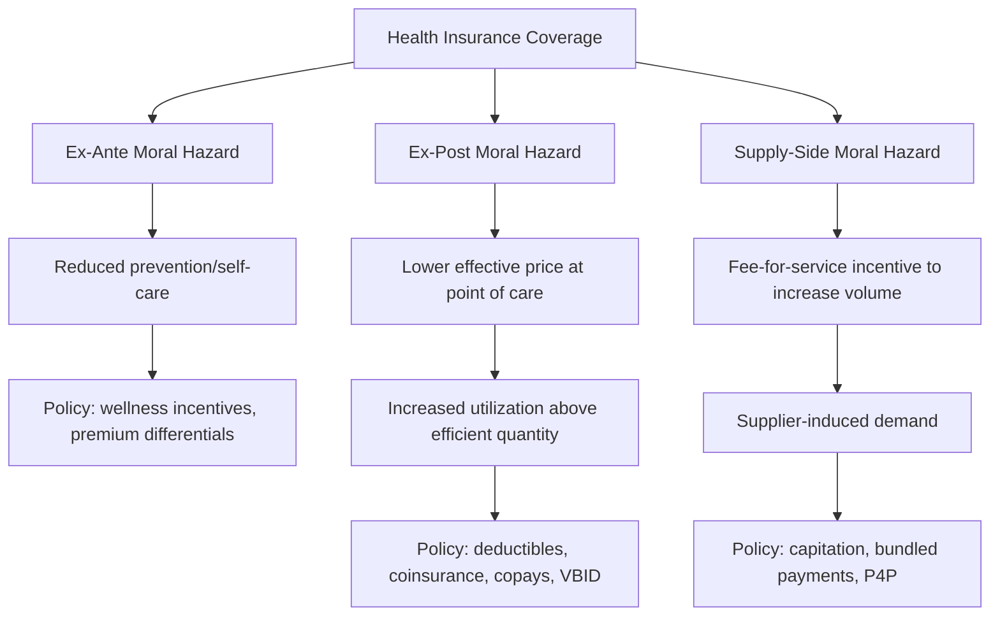

## Moral Hazard and Health Insurance Design

### Definition and Conceptual Overview

Moral hazard in health insurance refers to the change in health-care-related behavior that occurs because an individual is insured, arising from the fact that insurance drives a wedge between the price a consumer pays at the point of service (out-of-pocket price) and the marginal social cost of the resource consumed. Because insurance lowers the effective price faced by the consumer below the true resource cost, standard consumer theory predicts increased quantity demanded relative to the uninsured (full-price) benchmark. This is fundamentally a **hidden-action** problem (as opposed to adverse selection's hidden-information problem): the insurer cannot costlessly observe or contract on the consumer's utilization decisions or underlying effort/behavior once coverage is in place.

**Key Points**

- Arises post-contractually, after coverage begins, distinguishing it from adverse selection.
- Reflects price-responsiveness of health care demand, not necessarily "abuse" of the system, an important distinction developed below.
- Creates the central efficiency-insurance trade-off that governs optimal health insurance contract design.
- Applies both to the extensive margin (whether to seek care at all) and intensive margin (how much/what intensity of care to consume once care is sought).

---

### Ex-Ante Versus Ex-Post Moral Hazard

A foundational distinction, developed primarily by Ehrlich and Becker (1972) and Zeckhauser (1970):

**Ex-ante moral hazard**: Insurance reduces the incentive to engage in loss-prevention or health-protective behavior *before* any illness occurs, because the insured individual bears less of the financial consequence of becoming ill. Examples: reduced exercise, worse diet adherence, reduced use of preventive screening, riskier lifestyle choices — since the "insurance" against the financial cost of poor health outcomes weakens the private return to prevention.

**Ex-post moral hazard**: Once insured and once illness/injury has occurred, the individual consumes more medical care than they would at the full (uninsured) price, because the marginal price they face is below marginal cost. This is the dominant focus of the health economics literature and the primary target of most insurance benefit design (cost-sharing).

**Distinguishing table:**

| Dimension | Ex-Ante Moral Hazard | Ex-Post Moral Hazard |
| --- | --- | --- |
| Timing | Before illness/loss occurs | After illness has occurred, at point of care |
| Behavior affected | Prevention, lifestyle, risk-avoidance | Utilization intensity, quantity of care demanded |
| Standard policy lever | Wellness incentives, premium differentials, limited applicability of cost-sharing | Deductibles, coinsurance, copayments |
| Relative empirical magnitude | [Inference] Generally found to be smaller in magnitude in most empirical studies | Larger and more robustly estimated (e.g., RAND HIE) |

---

### The Pauly (1968) Critique and Efficient Response

Mark Pauly's 1968 paper is the canonical starting point for modern treatment of moral hazard, offered as a response/refinement to Kenneth Arrow's (1963) framing of moral-hazard-induced overconsumption as unambiguously wasteful.

**Pauly's core argument:** The increase in utilization following insurance coverage is not necessarily evidence of "waste" or irrational overconsumption. Rather, it is the **predictable, rational response of a utility-maximizing consumer facing a lower effective price** — precisely analogous to how a consumer would rationally buy more of any good whose price falls. The welfare question is not whether utilization rises (it should, by standard demand theory) but whether the resulting quantity, priced at the *distorted* (insured) marginal price rather than true marginal cost, generates a welfare loss because the marginal unit of care consumed is valued by the patient at less than its true resource cost.

This reframes moral hazard from a problem of "bad behavior" to a problem of **price distortion and the resulting deadweight loss**, which is the standard modern welfare-economics treatment.

---

### Formal Welfare Analysis: The Deadweight Loss of Moral Hazard

Let $D(p)$ be the demand curve for medical care as a function of out-of-pocket price $p$, with $D'(p) < 0$. Let $c$ be the true marginal (social) cost of a unit of care, assumed constant for simplicity. Let $q^*$ be the socially efficient quantity, where $D(c) = q^*$ — i.e., the quantity demanded if the consumer faced the true marginal cost.

With coinsurance rate $\tau$ (patient pays share $\tau$ of the total price, insurer pays $1-\tau$), the consumer faces effective price $p = \tau c$ and demands $q(\tau c) = q_1 > q^*$ (assuming $\tau < 1$).

**Deadweight loss (Feldstein 1973 triangle):**

$$DWL = \int_{q^*}^{q_1} \left[ c - D^{-1}(q) \right] dq$$

This is the standard Harberger triangle: the area between the marginal cost curve $c$ and the (inverse) demand curve, integrated over the excess quantity consumed due to the price distortion, $q_1 - q^*$.

**Diagram (deadweight loss triangle in price-quantity space):**

<svg xmlns="http://www.w3.org/2000/svg" viewBox="0 0 640 420" font-family="Helvetica, Arial, sans-serif">
<text x="320" y="22" text-anchor="middle" font-size="15" font-weight="bold">Deadweight Loss from Ex-Post Moral Hazard (svg_diagram)</text>
<line x1="80" y1="370" x2="600" y2="370" stroke="black" stroke-width="1.5" />
<line x1="80" y1="370" x2="80" y2="40" stroke="black" stroke-width="1.5" />
<text x="600" y="392" font-size="12" text-anchor="end">Quantity of Care (q)</text>
<text x="55" y="35" font-size="12">Price</text>

<path d="M 100 60 Q 300 150 560 340" fill="none" stroke="#2b6cb0" stroke-width="2" />
<text x="520" y="330" font-size="11" fill="#2b6cb0">Demand D(p)</text>

<line x1="80" y1="140" x2="600" y2="140" stroke="#c05621" stroke-width="1.5" />
<text x="500" y="132" font-size="11" fill="#c05621">Marginal cost c</text>

<line x1="80" y1="290" x2="600" y2="290" stroke="#2f855a" stroke-width="1.5" stroke-dasharray="4,3" />
<text x="500" y="282" font-size="11" fill="#2f855a">Out-of-pocket price τc</text>

<line x1="270" y1="370" x2="270" y2="140" stroke="#888" stroke-width="1" stroke-dasharray="2,2" />
<text x="255" y="385" font-size="11">q*</text>

<line x1="430" y1="370" x2="430" y2="290" stroke="#888" stroke-width="1" stroke-dasharray="2,2" />
<text x="420" y="385" font-size="11">q₁</text>

<path d="M 270 140 L 430 140 L 430 290 Z" fill="#e53e3e" fill-opacity="0.25" stroke="#e53e3e" stroke-width="1" />
<text x="335" y="200" font-size="11" fill="#e53e3e" font-weight="bold">DWL</text>
</svg>

**Key comparative statics:**

- $DWL$ rises approximately with the square of the price distortion $(c - \tau c)$ and with the elasticity of demand — implying deadweight loss is convex in the generosity of coverage, so the *marginal* welfare cost of additional coverage rises as coverage becomes more generous.
- Feldstein (1973) and subsequent work (Feldstein and Friedman 1977) used this framework to argue optimal coinsurance rates should generally be strictly positive (i.e., full insurance is *not* optimal) once moral hazard is accounted for, given plausible demand elasticities for medical care.

---

### The Fundamental Trade-off: Risk Protection Versus Moral Hazard (The Zeckhauser 1970 Framework)

Richard Zeckhauser's 1970 model formalizes the central design tension in health insurance:

- **More generous coverage** (lower coinsurance $\tau$) → better risk-smoothing/consumption-smoothing across health states → higher expected utility from the risk-reduction channel, valuable because individuals are risk-averse over financial outcomes.
- **More generous coverage** → larger price distortion at point of care → larger moral hazard-driven overconsumption → larger deadweight loss.

**Optimal coinsurance** trades off these two forces:

$$\tau^* = \arg\max_{\tau} \left\{ \mathbb{E}[U(\text{consumption})] - \text{(risk premium avoided)} - DWL(\tau) \right\}$$

The qualitative result: optimal coinsurance is **strictly between 0 and 1** (neither full insurance nor no insurance is optimal) whenever both (a) the individual is risk-averse and (b) demand for care is price-elastic. The precise optimal $\tau^*$ increases with the price elasticity of demand for care and decreases with the degree of risk aversion and the variance of the health-expenditure shock.

$$\tau^* \text{ increasing in: } |\epsilon_{q,p}| \quad ; \quad \tau^* \text{ decreasing in: } \text{Arrow-Pratt risk aversion}, \; \sigma^2_{loss}$$

---

### Empirical Evidence: The RAND Health Insurance Experiment (HIE)

The RAND HIE (1971–1982), a large-scale randomized controlled trial assigning families to insurance plans with varying coinsurance rates (0%, 25%, 50%, 95%, and a variant with an income-related catastrophic cap), remains the most-cited empirical benchmark for the price elasticity of demand for medical care.

**Key findings [Facts, well-documented]:**

- Overall arc price elasticity of demand for medical services was estimated around $-0.1$ to $-0.2$, i.e., inelastic but non-zero — a 10% reduction in out-of-pocket price was associated with roughly a 1–2% increase in spending.
- Higher cost-sharing reduced use of both "appropriate" and "inappropriate" care roughly proportionally — the RAND HIE did not find strong evidence that patients selectively cut only low-value care, a finding with significant implications for value-based insurance design (see below).
- For most subgroups, the reduction in utilization from cost-sharing had **no statistically detectable effect on health outcomes**, except for certain vulnerable subpopulations (notably poor individuals with hypertension, where free care was associated with improved blood pressure control and reduced mortality risk).
- Free care (0% coinsurance) increased annual per-person spending by approximately 25–30% relative to the 95% coinsurance arm. [Note: exact percentage figures vary somewhat by outcome measure and study cited; treat as approximate order-of-magnitude estimates from the original RAND published results.]

**More recent evidence — the Oregon Health Insurance Experiment (2008):** A randomized lottery for Medicaid access in Oregon provided a second major quasi-experimental data point. Findings included increased health care utilization, improved self-reported health and reduced depression, and significant reductions in financial strain (catastrophic medical expenditure), but mixed/limited evidence of improvement in objective physical health measures (e.g., blood pressure, cholesterol, glycated hemoglobin) over the roughly two-year study window — a result that generated substantial debate over the interpretation window and statistical power. [Inference: the Oregon result's interpretation for objective health measures remains contested in the literature regarding whether the null results reflect a true absence of effect or insufficient study duration/power.]

---

### Health Insurance Contract Design: Instruments for Managing Moral Hazard

#### 1. Deductibles

A fixed dollar threshold below which the patient pays 100% of costs, after which coinsurance or copayments apply. Deductibles concentrate cost-sharing on the marginal (discretionary) low-cost visit while limiting the financial burden on individuals who already have high-cost claims (since the deductible is a fixed, bounded amount). This targets the *decision to seek care at all* for minor/discretionary conditions.

#### 2. Coinsurance

A percentage of costs paid by the patient (e.g., 20%) applied continuously across a range of spending. Coinsurance maintains price-sensitivity across the full range of utilization, unlike a flat copay, and is the instrument most directly analyzed in the Feldstein/Zeckhauser theoretical framework.

#### 3. Copayments

A flat dollar amount per service (e.g., $25 per office visit) regardless of the total cost of the service. Copayments are simple and predictable for consumers but create a distorted marginal price signal for expensive services (a $25 copay is a much smaller fraction of price for an MRI than for a routine visit), which is a known design limitation relative to proportional coinsurance.

#### 4. Out-of-Pocket Maximums (Stop-Loss / Catastrophic Caps)

An annual ceiling on total patient cost-sharing, after which the insurer pays 100%. This reintroduces full insurance at the margin for catastrophic spending, addressing the risk-protection side of the Zeckhauser trade-off for the tail of the loss distribution, where risk-aversion concerns dominate and moral-hazard concerns are less relevant (very few people seek elective/discretionary excess care once already catastrophically ill).

#### 5. Tiered Networks and Reference Pricing

Cost-sharing that varies by provider tier or sets a fixed "reference price" the insurer will pay for a given service (with the patient responsible for any amount above it if they choose a higher-priced provider) targets *price* moral hazard — overconsumption driven by provider price variation — rather than *quantity* moral hazard.

#### 6. Value-Based Insurance Design (VBID)

Rather than applying uniform cost-sharing across all services, VBID varies cost-sharing *inversely* with the clinical value of the service — lowering or eliminating cost-sharing for high-value care (e.g., insulin, statins, preventive screenings) while maintaining or raising cost-sharing for low-value/discretionary care. This directly responds to the RAND HIE finding that uniform cost-sharing cuts high- and low-value care proportionally, attempting to make the response to moral hazard *selective* rather than uniform.

**Comparative summary of instruments:**

| Instrument | Margin Targeted | Main Limitation |
| --- | --- | --- |
| Deductible | Extensive margin (whether to seek any care) | Can deter needed early-stage/preventive care |
| Coinsurance | Intensive margin across full spending range | Financial risk exposure scales with total spending |
| Copayment | Extensive margin, simple signal | Distorted marginal price signal for costly services |
| Out-of-pocket max | Tail/catastrophic risk | Does little to address moral hazard below the cap |
| Reference pricing | Provider price selection | Requires price transparency infrastructure |
| VBID | Service-specific value | Requires credible, updated evidence on clinical value per service |

---

### Supply-Side (Provider-Side) Moral Hazard

Moral hazard in health insurance is not confined to the demand side. **Supply-side moral hazard** refers to physician/provider behavior responding to insurance-driven reimbursement incentives rather than (or in addition to) patient demand — sometimes termed **supplier-induced demand**. Under fee-for-service reimbursement, providers may have a financial incentive to recommend additional services, given asymmetric information between physician and patient regarding necessity of care (the physician as imperfect agent for the patient).

**Related payment reforms targeting supply-side moral hazard:**

- Capitation (fixed payment per enrolled patient regardless of utilization) — shifts financial risk to the provider, but can induce *under*-provision (a symmetric but opposite distortion).
- Bundled payments / episode-based payment — fixes payment per clinical episode, reducing incentive to increase volume of discrete billable services within an episode.
- Pay-for-performance and value-based payment models — tie some portion of reimbursement to quality/outcome metrics rather than volume alone.

This is formally a **double moral hazard** problem in the principal-agent sense: both patient and provider have private information and independently-influenced actions, and insurance design must jointly consider demand-side cost-sharing and supply-side payment incentives, since strengthening one can partially offset or interact with the other. [Inference: the optimal joint design of demand- and supply-side incentives is an active area of research without full theoretical consensus, given the complexity of modeling two simultaneous agency problems.]

---

### Mermaid Diagram: Moral Hazard Channels and Policy Levers

---

### Interaction with Adverse Selection in Contract Design

Because generous coverage both (a) attracts high-risk individuals under adverse selection and (b) induces greater overutilization under moral hazard, insurers face a *compounded* incentive to limit coverage generosity, but the two forces are not simply additive: Einav, Finkelstein, and Cullen (2010) showed that in the presence of both frictions simultaneously, the standard "bang for the buck" welfare calculation from expanding coverage must separately identify the *selection* effect (who enrolls) from the *moral hazard* effect (how enrollees behave once covered), since they have different — and sometimes offsetting — welfare implications and require different empirical identification strategies (e.g., using exogenous price variation held fixed for a given risk pool to isolate moral hazard from selection).

---

### Related Topics / Next Steps

- Adverse Selection in Health Insurance (see prior item; interaction effects with moral hazard)
- The RAND Health Insurance Experiment: Full Methodology and Robustness Debates
- The Oregon Health Insurance Experiment: Design and Interpretation Controversies
- Value-Based Insurance Design: Empirical Evidence and Implementation Challenges
- Supplier-Induced Demand and Physician Agency Models
- Optimal Coinsurance Design: The Feldstein-Friedman Model in Full
- Provider Payment Reform: Capitation, Bundled Payments, and Pay-for-Performance
- Health Savings Accounts (HSAs) and High-Deductible Health Plans (HDHPs)
- Behavioral Economics Extensions: Present Bias and Health Insurance Plan Choice
- Catastrophic Coverage Design and Optimal Stop-Loss Thresholds