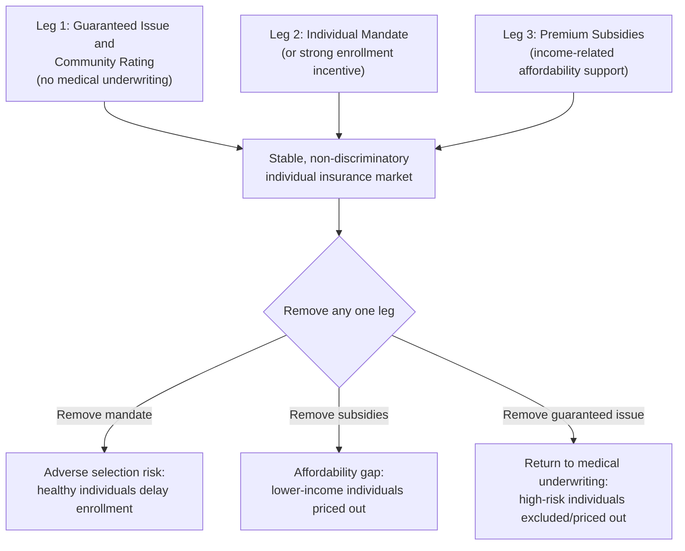

## Health Insurance Mandates and Exchanges

### Conceptual Overview

Health insurance mandates and exchanges are complementary policy instruments designed to address the adverse selection and market fragmentation problems developed earlier in this chapter, while preserving a role for competitive private insurance markets rather than moving fully to public single-payer financing. A **mandate** requires (or strongly incentivizes) individuals or employers to obtain/offer insurance coverage, directly targeting the low-risk-exit mechanism underlying adverse selection death spirals. An **exchange** (or marketplace) is a regulated, standardized platform on which individuals and small businesses can compare and purchase private insurance plans, designed to address information frictions, adverse selection through risk-pooling regulation, and search/transaction costs in the individual insurance market.

**Key Points**

- Mandates and exchanges are most coherently understood as a *package* of interlocking reforms, not independent instruments — most theoretical and empirical treatments (e.g., the "three-legged stool" framing of the ACA) emphasize that removing one component undermines the functioning of the others.
- The core economic logic is a direct application of the Rothschild-Stiglitz/Akerlof adverse selection framework: community rating without a mandate reproduces the unraveling problem; a mandate without community rating does not need to exist as a market-stabilizing tool in the same way.
- Distinct from public program design (Medicare/Medicaid) in that the underlying risk pool remains privately insured; government's role is regulatory and subsidizing rather than directly financing or providing care.

---

### The "Three-Legged Stool" Framework

The canonical framing (widely used in the health economics and ACA policy literature) holds that three regulatory components must operate jointly to sustain a functional, non-discriminatory individual insurance market:

**Economic logic of interdependence:**

- **Guaranteed issue + community rating** alone (without a mandate) reproduces the Akerlof/Rothschild-Stiglitz unraveling dynamic: insurers cannot price-discriminate by risk, so low-risk individuals face a premium above their actuarially fair value and have an incentive to exit or delay enrollment until sick (since guaranteed issue means they cannot later be denied coverage), degrading the risk pool.
- **A mandate** counteracts this by compelling (or strongly incentivizing) low-risk individuals to remain in the pool, holding community-rated premiums closer to the population-average cost rather than the sick-only cost that would prevail after unraveling.
- **Subsidies** are necessary because without guaranteed issue and community rating, high-risk individuals could not obtain affordable coverage at all; and without subsidies, a mandate compelling purchase at full community-rated price could be financially punitive or politically/legally unsustainable for lower-income individuals, undermining the mandate's durability and effectiveness.

---

### Individual Mandates: Design and Mechanics

#### Enforcement Mechanism

An individual mandate is typically enforced through a **tax penalty** for non-compliance (rather than direct legal compulsion to purchase a specific product), reflecting both constitutional considerations (in the U.S. context, the mandate's constitutionality was upheld in *NFIB v. Sebelius*, 2012, specifically as a valid exercise of Congress's taxing power rather than the Commerce Clause) and practical enforceability considerations.

**Stylized penalty structure (illustrative of ACA design):**

$$\text{Penalty} = \max\left(\text{Flat dollar amount per person}, \; \text{Percentage of household income above filing threshold}\right)$$

The "greater of" structure ensures the penalty scales with income for higher earners (where a flat penalty might be a trivially small disincentive) while maintaining a meaningful floor penalty for lower earners.

#### Theoretical Determinants of Optimal Penalty Size

The mandate penalty must be calibrated relative to the gap between the community-rated premium and an individual's actuarially fair (risk-based) premium to effectively deter exit:

$$\text{Penalty} \gtrsim p_{community} - v(\theta)$$

where $v(\theta)$ is a low-risk individual's valuation of coverage. If the penalty is too low relative to this gap, low-risk individuals may rationally choose to pay the penalty and remain uninsured (or purchase only when sick, given guaranteed issue) rather than purchase coverage — the mandate's deterrent effect is a direct function of penalty severity relative to the adverse-selection-driven premium markup.

#### Empirical Evidence on Mandate Effectiveness

The 2017 U.S. Tax Cuts and Jobs Act reduced the ACA's federal individual mandate penalty to $0 effective 2019, creating a valuable natural experiment. Empirical estimates of the effect on enrollment and premiums vary, but most studies find [Inference: precise magnitudes remain an active empirical literature, and estimates differ by study design and time period] a moderate reduction in marketplace enrollment and some upward pressure on premiums in affected markets, though effects were reportedly smaller than some pre-repeal projections, plausibly reflecting the continued operation of the other two "legs" (subsidies and guaranteed issue/community rating remained in place) and other offsetting factors such as state-level mandates adopted by some states after the federal penalty reduction (e.g., Massachusetts, New Jersey, California, Rhode Island, D.C.). Given the ongoing and evolving nature of this literature, current search would be warranted for the most recent empirical consensus if precise elasticity estimates are needed for a specific application.

#### Employer Mandate

Distinct from the individual mandate, an **employer mandate** (the ACA's "employer shared responsibility provision") requires firms above a specified size threshold (50+ full-time-equivalent employees under the ACA) to offer minimum essential coverage meeting affordability and minimum-value standards or pay a penalty. The economic rationale differs somewhat from the individual mandate: it primarily addresses concerns about employer "dumping" of employees onto subsidized public exchanges (a fiscal externality/cost-shifting concern) rather than directly targeting adverse selection in the individual market per se, though it also has secondary effects on the size of the individual-market risk pool.

---

### Health Insurance Exchanges: Structure and Function

#### Core Functions

1. **Standardization of benefit design**: Exchanges typically require plans to be categorized into standardized actuarial-value tiers (e.g., the ACA's Bronze/Silver/Gold/Platinum metal tiers, each corresponding to a target percentage of expected costs covered by the plan versus the enrollee), directly limiting insurers' ability to engage in risk-selection-via-benefit-design (a screening strategy predicted by the Rothschild-Stiglitz framework, where insurers might otherwise design deliberately unattractive benefit packages, e.g., excluding maternity care, to deter high-risk enrollees).
2. **Price/plan transparency and comparison**: Reduces consumer search costs and information asymmetry regarding plan terms, addressing a distinct (non-risk-related) information friction in insurance shopping.
3. **Subsidy administration**: Serves as the administrative mechanism through which income-related premium tax credits and cost-sharing reductions are calculated and applied at point of purchase.
4. **Risk pool aggregation**: By channeling individual-market enrollment through a common platform, exchanges can support the operation of risk-adjustment transfers across participating insurers.

#### Actuarial Value Tiers (ACA Example)

| Metal Tier | Target Actuarial Value | Plan Characteristics |
| --- | --- | --- |
| Bronze | ~60% | Lower premium, higher cost-sharing (deductibles/coinsurance) |
| Silver | ~70% | Base for cost-sharing reduction subsidies (for eligible lower-income enrollees) |
| Gold | ~80% | Higher premium, lower cost-sharing |
| Platinum | ~90% | Highest premium, lowest cost-sharing |

The Silver tier holds particular policy significance because ACA cost-sharing reduction (CSR) subsidies — which lower out-of-pocket costs for enrollees with incomes up to 250% FPL — are structured to apply only to Silver-tier plans, creating a "silver loading" dynamic in insurer pricing behavior after CSR direct federal funding was discontinued in 2017 (insurers incorporated the unfunded CSR cost into Silver-tier premiums specifically, since that is the tier where CSR-eligible enrollees are concentrated), which had complex secondary effects on subsidy calculations given that subsidies are benchmarked to the second-lowest Silver premium — a well-documented instance of regulatory/pricing interaction effects that a full technical treatment of exchange mechanics should flag as a case study in second-best regulatory design.

#### Risk Adjustment on Exchanges (The "3 Rs")

The ACA implemented three complementary risk-mitigation mechanisms for exchange-participating insurers, illustrating applied versions of the theoretical adverse-selection policy responses:

1. **Risk Adjustment** (permanent): Transfers funds from insurers with lower-risk enrollee populations to insurers with higher-risk populations, based on a risk-scoring model using enrollee diagnosis and demographic data — directly analogous to Medicare Advantage's HCC risk adjustment and Germany's Risikostrukturausgleich.
2. **Reinsurance** (temporary, 2014–2016 under the ACA, though some states have since implemented state-based reinsurance programs under Section 1332 waivers): Reimbursed insurers for a share of very high-cost individual claims, reducing the premium impact of catastrophic outlier cases.
3. **Risk Corridors** (temporary, 2014–2016): A budget-neutral-by-design mechanism intended to limit insurer gains and losses relative to premium targets in the new marketplace's early, uncertain years by transferring funds between insurers with better-than-expected and worse-than-expected experience — this mechanism became the subject of significant litigation (*Maine Community Health Options v. United States*, 2020) after Congress restricted the appropriation used to fund risk corridor payments, with the Supreme Court ultimately ruling insurers were owed the shortfall payments under the statutory formula, a notable case study in the political-economy and legal risk associated with implementing novel risk-mitigation mechanisms.

---

### Small Group Exchanges (SHOP) and Employer Market Considerations

The ACA also established Small Business Health Options Program (SHOP) exchanges intended to allow small employers to access group coverage with similar plan-comparison and (initially) tax-credit features, targeting small-group market adverse selection and small employers' historically limited bargaining power/plan choice relative to large self-insured employers. [Note: SHOP marketplace enrollment and take-up were substantially lower than initially projected, and the program's design and utilization have been a subject of policy evaluation regarding why small-group exchange mechanisms saw more limited uptake than individual exchanges; the specific causes are debated in the literature — administrative complexity, broker channel competition, and employer preference for direct broker relationships have all been proposed as contributing factors.]

---

### Comparative International Example: Health Insurance Exchanges Outside the U.S.

**Switzerland**: Operates a mandatory individual private insurance system (since 1996) with community rating within cantons, standardized basic benefit packages, and income-related premium subsidies — structurally very similar in economic logic to the ACA's three-legged-stool design, often cited as a precedent/comparator in U.S. policy debates given its long operating history with a broadly analogous mandate-plus-regulated-private-market architecture.

**Netherlands**: Similarly operates a mandatory private insurance system (since 2006 reform) with a central risk-equalization fund performing a function directly analogous to ACA risk adjustment, community-rated premiums, and income-related subsidies (zorgtoeslag) — another frequently-cited comparative case for mandate-based regulated competition models ("managed competition," a framework substantially influenced by economist Alain Enthoven's theoretical work).

---

### Formal Welfare Comparison: Mandate-Regulated Private Market vs. Alternatives

A rigorous comparison should note that the mandate-plus-exchange architecture is a specific point in a broader policy design space, with distinct welfare properties relative to alternatives:

| Architecture | Adverse Selection Handling | Consumer Choice | Administrative Complexity |
| --- | --- | --- | --- |
| Unregulated private market | Unaddressed; Rothschild-Stiglitz unraveling risk | High | Low (market-determined) |
| Mandate + community rating + subsidies + exchange (ACA/Swiss/Dutch model) | Directly addressed via mandate + regulation | Moderate (within standardized tiers) | High (subsidy calculation, risk adjustment administration) |
| Single-payer public insurance | Addressed by eliminating private risk selection entirely | Low (typically no plan choice, though provider choice may remain) | Potentially lower (no multi-insurer risk adjustment needed) |
| Employer-based voluntary group coverage | Partially addressed via employer-group risk pooling (natural grouping reduces adverse selection relative to individual market) | Low-moderate (limited to employer's offered plans) | Low-moderate |

[Inference: the relative overall welfare ranking of these architectures depends on the specific weighting of consumer choice value, administrative cost, and distributional preferences embedded in the social welfare function used for comparison — this is not a case where economic theory alone yields a single unambiguously dominant design independent of value judgments about these trade-offs.]

---

### Related Topics / Next Steps

- Adverse Selection in Health Insurance (theoretical foundation for mandate/exchange design)
- Public Health Insurance Programs (contrast with public program eligibility/financing)
- Public versus Private Provision of Healthcare (financing-provision matrix applied to exchanges)
- Risk Adjustment Methodology: HCC Models and Risk Score Calculation
- The Economics of "Managed Competition" (Enthoven Framework)
- Cost-Sharing Reduction Subsidies and "Silver Loading" Dynamics
- Employer Mandate Design and Labor Market Effects (Full-Time Equivalent Thresholds)
- Comparative Mandate-Based Systems: Switzerland and Netherlands in Depth
- Legal and Constitutional Foundations of the Individual Mandate (*NFIB v. Sebelius*)
- State-Based Marketplaces vs. Federally-Facilitated Marketplace (Healthcare.gov) Administrative Design