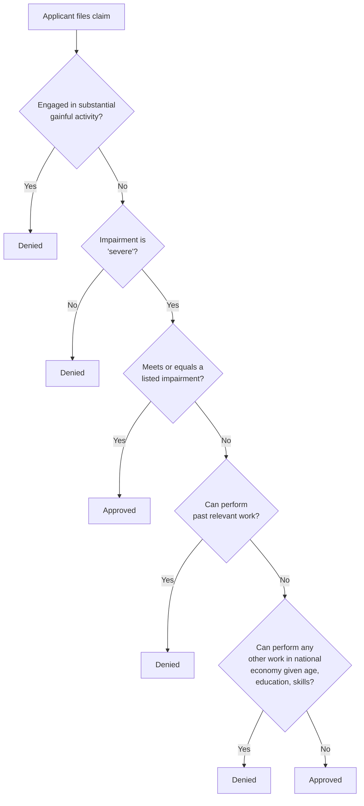

## Rationale and Design of Disability Insurance

### Conceptual Overview

Disability insurance (DI) provides income replacement to individuals whose earnings capacity is reduced or eliminated by a medically determinable physical or mental impairment. It shares the core insurance-economics structure developed for health insurance (risk pooling against an uncertain, financially consequential event) but introduces a distinct set of design challenges centered on the **verifiability of disability status itself**, which is imperfectly observable and partly a matter of degree rather than a binary, objectively measurable event — a fundamentally different informational structure than most health insurance claims (where a diagnosis or procedure is comparatively more verifiable).

**Key Points**

- Disability status combines an objective medical component and a labor-market/functional-capacity component, the latter of which is inherently harder to verify.
- The central design tension, paralleling health insurance, is between consumption-smoothing/risk-protection value and moral-hazard-induced work disincentives — but the "quantity" being distorted is labor supply rather than medical care utilization.
- Private markets for disability insurance are thin relative to health insurance, motivating a stronger public-provision rationale rooted in more severe adverse selection and verification problems.

---

### Theoretical Rationale for Public Disability Insurance

#### 1. Severe Adverse Selection

Individuals possess substantially more private information about their own health trajectory, occupational risk exposure, and (critically) their own effort/motivation to work than any insurer could feasibly verify ex ante. This is an even more acute version of the health-insurance adverse selection problem because disability risk correlates with occupation, private health information, and subjective factors (pain tolerance, motivation) that are essentially unobservable to an outside insurer, making private-market underwriting for long-duration disability insurance especially difficult to sustain without extensive (and imperfect) restriction and screening.

#### 2. Limited Private Market Development

Unlike health insurance, private long-term disability insurance coverage rates are comparatively low, and coverage that does exist is disproportionately employer-provided (group) coverage rather than individually purchased — consistent with the standard adverse-selection prediction that individual/non-group markets for hard-to-verify risks are especially prone to unraveling, since group-based (employer) enrollment functions similarly to a mandate in maintaining a broader, less self-selected risk pool.

#### 3. Correlated/Systemic Risk Considerations

Certain disability risk factors (e.g., macroeconomic downturns affecting labor demand for physically impaired workers, occupational hazards concentrated in specific industries) generate correlated risk across policyholders within an insurer's book, complicating private risk pooling and reserve requirements in ways broadly analogous to (though distinct in source from) the correlated catastrophic risk concerns in property/casualty insurance.

#### 4. Equity and the Social Insurance Rationale

Loss of earnings capacity due to disability is generally viewed as a risk outside individual control (at least for a large share of disabling conditions), supporting a social-insurance rationale grounded in the same consumption-smoothing and equity logic as social insurance more broadly — individuals cannot self-insure against career-ending impairment through savings alone at any reasonable cost, given the potentially large and long-duration nature of the income loss.

---

### The Core Design Trade-off: Insurance Value versus Labor Supply Moral Hazard

The Baily-Chetty optimal social insurance framework, originally developed primarily for unemployment insurance (Baily 1978; Chetty 2006), applies directly and is the standard theoretical lens for disability insurance generosity:

$$\text{Optimal benefit level: } \; \frac{u'(c_{disabled})}{u'(c_{working})} = 1 + \frac{\epsilon}{1-\epsilon} \times (\text{elasticity-related term})$$

More intuitively, the **Baily-Chetty formula** for the optimal replacement rate balances:

1. **Consumption-smoothing benefit**: The gap between marginal utility of consumption while disabled versus while working — larger when disability causes a severe, poorly-insured consumption drop (evidence of incomplete private self-insurance/savings buffering).
2. **Moral hazard cost**: The elasticity of disability program entry/exit (applications, awards, and duration on the rolls) with respect to benefit generosity — larger benefits induce more applications (including from marginal cases with more ambiguous work capacity) and longer program duration, imposing a fiscal cost and a foregone-output cost from reduced labor supply.

**Formal statement (simplified consumption-smoothing sufficient-statistic approach):**

$$\frac{\Delta c}{c} \approx \text{(observed consumption drop upon disability onset, e.g., from PSID/SIPP data)}$$

Larger observed consumption drops upon disability onset (relative to what would occur under actuarially fair full insurance) imply higher optimal benefit generosity, all else equal, since they indicate high uninsured risk exposure; larger estimated labor-supply/duration elasticities with respect to benefit generosity imply lower optimal generosity, since they indicate a larger behavioral response/moral hazard cost per dollar of benefit increase.

---

### Screening and Verification: The Central Operational Challenge

Because disability status is not perfectly observable, public disability insurance programs must design **screening mechanisms** to distinguish genuinely work-incapacitated applicants from those who could work but prefer not to (or who are marginal cases where true work capacity is ambiguous even to the individual). This is the disability-insurance analogue of the information-asymmetry problem in adverse selection, but addressed through *ex-post claims screening* rather than *ex-ante risk-based pricing* (since disability insurance is typically provided at a common benefit formula rather than individually risk-rated).

**Standard screening instruments:**

1. **Medical evidence requirements**: Requiring documented medical evidence of a qualifying impairment from treating physicians and/or independent medical examinations, addressing the objective-medical component of disability determination.
2. **Sequential/multi-step determination processes**: Programs like the U.S. Social Security Disability Insurance (SSDI) program use a structured sequential evaluation (assessing whether the applicant is engaged in substantial gainful activity, whether the impairment is "severe," whether it meets or equals a listed impairment, and — critically — whether the impairment prevents the applicant from performing their past work or any other work existing in the national economy given their age, education, and skills), embedding both medical and vocational/labor-market judgment into the determination.
3. **Waiting periods**: A mandatory period between disability onset and benefit eligibility (e.g., SSDI's five-month waiting period) screens out short-duration conditions and reduces the incentive to apply for temporary or minor impairments, functioning analogously to a deductible in health insurance by concentrating program resources on longer-duration (more clearly disabling) cases.
4. **Benefit generosity calibration ("moral hazard-consciousness" in program design)**: Setting replacement rates well below 100% of prior earnings (SSDI's benefit formula is progressive and yields replacement rates that decline as a share of income as prior earnings rise, but generally well under full replacement even at the low end) to preserve some work incentive at the margin, directly paralleling the Zeckhauser coinsurance trade-off logic but applied to earnings replacement rather than medical care coinsurance.
5. **Ongoing eligibility review (Continuing Disability Reviews)**: Periodic reassessment of beneficiaries' medical condition and work capacity, addressing the dynamic/ex-post version of the screening problem — since medical conditions and functional capacity can improve over time, a program without ongoing review would have no mechanism to remove beneficiaries whose disability status has changed.

---

### Screening Diagram: SSDI Sequential Evaluation Process (Stylized)

---

### Empirical Evidence on Moral Hazard in Disability Insurance

#### The Screening-Generosity Trade-off in Practice

A substantial empirical literature (e.g., studies exploiting variation across U.S. states in SSDI application/award rates, and cross-country comparisons of disability program generosity and employment rates among older/disabled workers) has generally found that disability program applications and rolls respond positively to benefit generosity and to labor market conditions (applications rise during recessions, consistent with disability programs partly functioning as a form of extended unemployment insurance for older or less-employable workers during downturns, sometimes termed the "hidden unemployment" or labor-market-conditions channel in DI applications). [Inference: the precise elasticity of DI applications/awards with respect to benefit generosity varies across studies and identification strategies, and remains an actively researched empirical magnitude rather than a single settled parameter.]

#### The "Cash Cliff" / Benefit Notch Problem

Because SSDI benefits (and associated Medicare eligibility after a waiting period) are largely lost upon return to substantial work, beneficiaries face a discontinuous "cliff" in effective marginal tax rates around the substantial gainful activity threshold, a design feature identified in the literature as a significant disincentive to attempted work re-entry even for beneficiaries with partial residual work capacity — motivating policy experiments with smoother benefit phase-out ("benefit offset") pilot programs (e.g., the SSA's Benefit Offset National Demonstration, BOND) intended to test whether a gradual reduction (rather than abrupt cliff) improves employment outcomes among beneficiaries without excessively increasing program cost via induced entry. [Inference: BOND and related demonstration results have shown mixed/modest employment effects in published evaluations; specific quantitative results should be verified against current SSA/Mathematica evaluation publications if precise figures are required.]

---

### Formal Model: The Screening-Generosity Frontier

A useful stylized framework (paralleling Zeckhauser's risk-protection/moral-hazard trade-off) frames disability insurance design as choosing a point along a **screening-generosity possibility frontier**:

- **More stringent screening** (longer waiting periods, more extensive medical/vocational evidence requirements, more frequent continuing disability reviews) reduces moral-hazard-driven applications from marginal/able-to-work individuals but imposes:
  - **Type II error costs**: Genuinely disabled individuals wrongly denied or facing prolonged adjudication delays, with associated welfare loss from unsmoothed consumption during appeal.
  - **Administrative costs**: Resources devoted to medical examinations, vocational assessment, appeals processing.
- **More generous benefits / less stringent screening** improves consumption-smoothing for genuinely disabled applicants and reduces Type II error but increases:
  - **Type I error costs**: Award of benefits to individuals with meaningful residual work capacity, generating both fiscal cost and foregone labor-market output.
  - Induced application/entry from marginal cases where true disability status is ambiguous even under careful review.

$$\text{Program design problem: } \min_{\text{screening stringency}} \left[ \text{Type I error cost} + \text{Type II error cost} + \text{Administrative cost} \right]$$

This is directly analogous to a statistical hypothesis-testing framing (minimizing a weighted combination of false-positive and false-negative error rates subject to a resource/administrative-cost constraint), a framing explicitly used in some of the academic literature on disability determination process design.

---

### Disability Insurance Program Design Variants: Comparative Table

| Design Feature | Rationale | Example |
| --- | --- | --- |
| Waiting period before benefits begin | Screens short-duration/minor conditions | SSDI: 5-month waiting period |
| Sequential medical-vocational evaluation | Combines objective medical and functional-capacity assessment | SSDI five-step sequential evaluation |
| Partial/graduated benefits | Reduces cliff-edge work disincentive | Some European "partial disability pension" systems; U.S. BOND pilot |
| Continuing eligibility review | Addresses dynamic/ex-post changes in condition | SSDI Continuing Disability Reviews |
| Vocational rehabilitation incentives/return-to-work programs | Directly targets labor-supply moral hazard by subsidizing re-entry rather than only screening at entry | SSA Ticket to Work program |
| Experience-rated employer disability insurance premiums (where used, e.g., some workers' compensation systems) | Internalizes employer incentive to reduce workplace disability risk | State workers' compensation experience rating |

---

### Distinction from Related Programs (Workers' Compensation, Unemployment Insurance, SSI)

A precise technical treatment must distinguish disability insurance from adjacent income-support programs, since they address overlapping but analytically distinct risks:

| Program | Risk Insured | Financing | Key Distinguishing Feature |
| --- | --- | --- | --- |
| SSDI (Social Security Disability Insurance) | Long-term work incapacity from medical impairment, among individuals with sufficient work history (insured status) | Payroll tax (FICA, same trust fund mechanism family as Social Security retirement) | Contributory social insurance; benefit tied to earnings history |
| SSI (Supplemental Security Income) | Financial need among aged/blind/disabled individuals regardless of work history | General revenue | Means-tested welfare program, not contributory social insurance; does not require prior work history |
| Workers' Compensation | Work-related injury/illness specifically | Employer-paid premiums (state-regulated, often experience-rated) | No-fault system limited to *occupational* injury/illness, historically a trade-off exchanging workers' tort-liability rights for guaranteed no-fault compensation |
| Unemployment Insurance | Involuntary job loss (not tied to personal incapacity) | Employer payroll tax (state/federal) | Explicitly time-limited, tied to job search requirements; does not require any impairment |

This distinction matters analytically because the *moral hazard margin* differs across programs: SSDI/SSI target the margin of whether an individual with a genuine impairment chooses to work at all given their residual capacity, workers' compensation additionally raises employer-side moral hazard concerns (workplace safety investment), and unemployment insurance targets job-search effort/reservation wage behavior — each requiring different screening and incentive-design instruments even though all four programs share the underlying social-insurance/consumption-smoothing rationale.

---

### Related Topics / Next Steps

- Optimal Unemployment Insurance Design (Baily-Chetty Framework in Full)
- SSDI Benefit Formula and Trust Fund Financing
- Vocational Rehabilitation and Return-to-Work Program Design (Ticket to Work)
- Workers' Compensation: Experience Rating and Employer Safety Incentives
- SSI as Means-Tested Disability Support: Comparison to Contributory Social Insurance
- Consumption-Smoothing Evidence: Empirical Estimates of Income Drop at Disability Onset
- Disability Determination Process: Administrative Law Judge Appeals and Backlogs
- International Comparisons of Disability Program Generosity and Employment Rates
- The "Benefit Cliff" Problem and Graduated Benefit-Offset Reform Proposals
- Aging Workforce Trends and Long-Run SSDI Caseload Projections