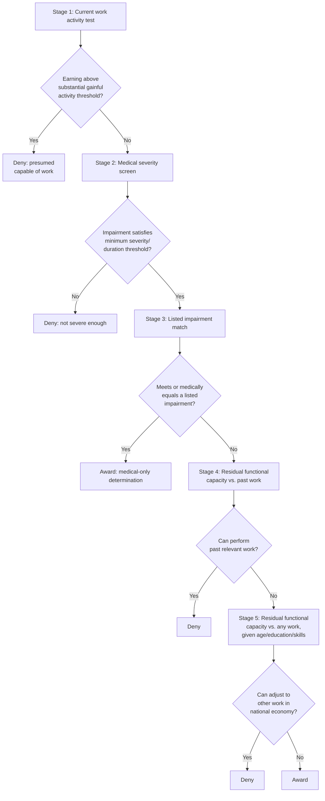

## Screening and Eligibility Determination

### Conceptual Overview

Screening and eligibility determination refers to the set of administrative, medical, and vocational assessment mechanisms used by disability insurance programs to distinguish applicants who genuinely lack the capacity to engage in substantial work from those who retain meaningful work capacity, under conditions where true disability status is not directly observable by the program administrator. This is the operational core of disability insurance design introduced in the preceding entry — this entry develops the screening problem in greater depth as a distinct topic in mechanism design and asymmetric information, since it is the primary lever through which disability programs manage the trade-off between consumption-smoothing value and moral hazard.

**Key Points**

- Screening is fundamentally a signal-extraction problem: the program must infer an unobservable true state (work capacity) from observable but imperfect signals (medical evidence, functional testing, behavioral proxies).
- Unlike health insurance claims verification (where a diagnosis or procedure is comparatively verifiable), disability determination requires an additional vocational/labor-market judgment layer, since "disability" in most programs is legally defined relative to inability to perform *work*, not merely presence of a medical condition.
- Screening mechanisms trade off Type I error (false awards to individuals with residual work capacity) against Type II error (false denials of genuinely disabled applicants), each with distinct welfare costs.

---

### The Formal Screening Problem

#### Unobservable True State and Observable Signals

Let $\theta \in \{D, N\}$ denote an applicant's true state: genuinely disabled ($D$, meaning work capacity below a policy-relevant threshold) or not disabled ($N$). The administrator observes a vector of signals $S$ — medical records, examination findings, functional capacity test results, work history, education, and age — and must construct a decision rule $\delta(S) \in \{\text{Award}, \text{Deny}\}$ without directly observing $\theta$.

**Error taxonomy:**

|  | True State: Disabled ($D$) | True State: Not Disabled ($N$) |
| --- | --- | --- |
| Decision: Award | Correct award | **Type I error** (false award) |
| Decision: Deny | **Type II error** (false denial) | Correct denial |

The screening design problem is to choose a decision rule (equivalently, a threshold on some sufficient statistic derived from $S$) that minimizes a weighted sum of the two error rates plus administrative cost, where the weights reflect the relative social cost the policymaker assigns to each error type:

$$\min_{\delta} \; \left[ w_1 \cdot P(\text{Type I error}) + w_2 \cdot P(\text{Type II error}) + C_{admin}(\delta) \right]$$

**Key asymmetry in typical policy weighting:** Most disability program design (and much of the surrounding political and ethical discourse) places a comparatively higher implicit weight $w_2$ on Type II error (wrongly denying a genuinely disabled person, with attendant severe unsmoothed-consumption/hardship consequences) relative to $w_1$ on Type I error (wrongly awarding benefits to someone with residual work capacity, which is primarily a fiscal and allocative-efficiency cost) — though this weighting is a normative/political choice rather than one derived from a single objective efficiency criterion, and reasonable policy frameworks differ on the appropriate relative weight. [Note: this asymmetry-in-weighting claim is a characterization of observed program design tendencies rather than a strictly established empirical fact, and should be read as an interpretive framing rather than a measured parameter.]

---

### Sequential/Multi-Stage Screening Design

Rather than a single binary test, most disability programs use a **sequential evaluation process**, which is a design response to the fact that no single signal is sufficiently informative on its own, and sequential filtering allows cheaper/coarser screens to be applied first before more costly and detailed evaluation is required.

**Generic structure (illustrated with the SSDI five-step model as the leading example, though the general logic applies across many national disability programs):**

**Economic rationale for sequential design:**

- **Stage 1 (work activity test)** is a nearly costless, highly informative screen: an individual currently earning above a substantial-gainful-activity threshold is, by administrative presumption, treated as not disabled without need for costly medical review — an efficient low-cost filter applied first.
- **Stages 2–3 (medical severity and listings)** apply progressively more detailed medical evidence review, with Stage 3's "listed impairments" (a pre-specified catalog of conditions presumptively meeting the disability standard at defined severity levels) functioning as a low-administrative-cost shortcut for the clearest cases, avoiding the need for full vocational analysis when medical evidence alone is sufficiently decisive.
- **Stages 4–5 (vocational assessment)** are reserved for the harder, more ambiguous cases where medical evidence alone does not resolve the determination, and require the more costly and judgment-intensive residual-functional-capacity and vocational-grid analysis — concentrating the most expensive assessment resources on the cases where they are most needed to resolve genuine uncertainty.

This is a direct real-world instance of **optimal sequential testing under costly information acquisition**: cheap, highly diagnostic tests are applied first, with more expensive and nuanced assessment reserved for cases that survive initial screens, analogous in logic to sequential clinical diagnostic protocols or credit-screening cascades in other economic contexts.

---

### The Vocational Grid: Formalizing the Age-Education-Skill Adjustment

A distinctive feature of disability determination (relative to a purely medical model of disability) is the explicit incorporation of **vocational factors** — age, education, and transferability of work skills — into the final eligibility decision, reflecting the policy view that "disability" is properly defined relative to inability to perform *any substantial work reasonably available given the applicant's characteristics*, not merely presence of a medical impairment in the abstract.

**Illustrative logic (as operationalized in SSDI's Medical-Vocational Guidelines, informally the "grid rules"):**

An applicant with an identical residual functional capacity (e.g., limited to "sedentary work") may be found disabled or not disabled depending on age, education, and prior work skill transferability:

| Age | Education | Skill Transferability | Typical Grid Outcome (sedentary RFC) |
| --- | --- | --- | --- |
| Younger individual (e.g., under 50) | High school or more | N/A | Often "not disabled" — presumed greater adaptability |
| Closely approaching advanced age (50-54) | Limited education | Skills not transferable | May be "disabled" |
| Advanced age (55+) | Limited education | Skills not transferable | Often "disabled" |

**Economic interpretation:** This grid structure operationalizes the intuition that the same residual physical/mental capacity translates into different *effective employability* depending on human capital and labor market adaptability factors, and that older, less-educated workers with non-transferable skills face a systematically thinner set of alternative work opportunities even with identical medical limitations — an application of standard human capital and labor-market-matching theory to the disability determination context. [Table entries above are illustrative simplifications of a more granular rule matrix; exact grid rule outcomes depend on the full combination of exertional level, specific age brackets, and skill categories defined in the governing regulations.]

---

### Screening Instrument Design: A Closer Look

#### 1. Medical Evidence Standards

Requiring evidence from "acceptable medical sources" and, in many programs, giving structured weight to treating-physician opinions versus independent/consultative examinations addresses a specific sub-problem: physicians (especially treating physicians with an ongoing patient relationship) may face incentives or informational biases that differ from a neutral evaluator, creating a secondary principal-agent layer within the screening problem itself (the administrator must also assess the reliability of its medical information sources, not only the applicant's claim).

#### 2. Functional Capacity Evaluations

Standardized physical/cognitive testing protocols intended to generate a more objective, comparable measure of residual capacity than physician narrative opinion alone — addressing measurement-reliability and inter-rater consistency concerns in subjective medical assessment.

#### 3. Duration Requirements

Requiring that an impairment be expected to last (or has lasted) a minimum duration (e.g., SSDI's 12-month duration requirement) screens out transient conditions, functioning as a temporal analog to the severity threshold — concentrating program resources on genuinely long-duration risk rather than short-term conditions better addressed by other mechanisms (short-term disability insurance, sick leave, or savings).

#### 4. Administrative Law Judge (ALJ) Appeals Process

Multi-level appeal structures (reconsideration, ALJ hearing, Appeals Council review, federal court review in the SSDI context) provide an error-correction mechanism for initial determination mistakes, but introduce their own economic considerations: appeal processing capacity is a scarce resource, creating queuing/backlog dynamics, and documented differences in award rates across ALJs and hearing offices have been a subject of empirical scrutiny regarding determination *consistency* — a distinct concern from determination *accuracy*, since substantial inter-adjudicator variation in outcomes for similar cases suggests either inconsistent application of the standard or genuine differences in case mix across adjudicators, and disentangling these explanations is an active empirical research question. [Inference: the relative contribution of adjudicator inconsistency versus case-mix differences to observed award-rate variation remains debated in the empirical literature.]

---

### Behavioral and Information-Design Considerations in Screening

#### Self-Selection via Application Costs

Beyond formal medical/vocational screening, the disability determination *process itself* — its complexity, documentation burden, and typical multi-month-to-multi-year adjudication timeline — functions as an implicit screening device: the time and effort cost of applying and pursuing appeals imposes a real cost on applicants, which (under standard screening-model logic, akin to Spence-style signaling costs) may be more readily borne by applicants with a stronger true claim (who have more at stake and potentially more supporting documentation readily available) than by marginal applicants with weaker claims. [Inference: this "ordeal mechanism" interpretation of application costs — following Nichols and Zeckhauser's (1982) theoretical framework on targeting via ordeals in welfare program design — is a recognized theoretical lens in the public economics literature, but empirically the application/appeals burden is also criticized for imposing genuine hardship on legitimately disabled applicants during a period of unsmoothed consumption, so the net welfare effect of high application costs as a screening tool is a matter of ongoing normative and empirical debate, not a straightforwardly beneficial design feature.]

#### Continuing Disability Reviews as Dynamic Screening

Because true disability status can change over time (medical improvement, adaptation, or acquisition of new work skills), a purely static at-entry screen is insufficient; **continuing disability reviews (CDRs)** re-apply the screening process periodically post-award, with review frequency often risk-adjusted (e.g., conditions expected to improve are scheduled for more frequent review than those expected to be permanent) — an application of dynamic/repeated screening design responsive to the evolving informativeness of accumulated evidence over the beneficiary's spell on the program.

---

### Cross-Program Comparison of Screening Philosophy

| Program Type | Primary Screening Basis | Degree of Vocational/Behavioral Judgment | Administrative Cost Profile |
| --- | --- | --- | --- |
| SSDI/SSI (U.S.) | Sequential medical + vocational grid | High (explicit age/education/skill adjustment) | High (multi-stage, extensive appeals infrastructure) |
| Workers' compensation (occupational only) | Medical causation tied to specific work injury | Moderate (impairment rating schedules, sometimes with vocational disability supplements) | Moderate-high (contested causation determinations common) |
| Private long-term disability (own-occupation policies) | Contractual definition, often tied narrowly to inability to perform "own occupation" (more generous) transitioning to "any occupation" after a defined period | Contract-defined, less discretionary than public vocational grids | Insurer-internal claims review, subject to litigation risk (ERISA disputes in the U.S. context) |
| Some European partial-disability systems | Graduated functional capacity assessment with partial benefit tiers | Explicit partial/graduated capacity recognition rather than binary determination | Potentially lower error-cost from binary misclassification, given graduated benefit structure, but higher assessment complexity |

**Design contrast note:** A binary disability/not-disability screening architecture (as in the core SSDI determination) versus a graduated/partial-capacity architecture represents a fundamental design choice with direct implications for the error-cost structure above: a binary system concentrates all Type I/Type II error costs at a single threshold, while a graduated system spreads assessment across multiple capacity tiers, potentially reducing the welfare cost of misclassification at the margin (an error is "off by one tier" rather than "off by the entire benefit") at the cost of greater assessment complexity and potentially more numerous decision-margin disputes.

---

### Related Topics / Next Steps

- Rationale and Design of Disability Insurance (see prior item; screening as operationalization of the broader trade-off)
- Nichols-Zeckhauser Ordeal Mechanisms in Welfare Program Targeting
- SSDI Medical-Vocational Guidelines ("Grid Rules") in Full Regulatory Detail
- Administrative Law Judge Decision Variation and Determination Consistency Research
- Continuing Disability Reviews: Frequency Rules and Medical Improvement Standards
- Private Long-Term Disability Insurance: "Own Occupation" vs. "Any Occupation" Contract Design
- ERISA and Litigation over Private Disability Benefit Denials
- Comparative International Disability Assessment Systems (Graduated vs. Binary Models)
- Statistical Decision Theory Applications in Program Eligibility Design
- SSDI Appeals Backlog: Administrative Capacity and Queuing Analysis