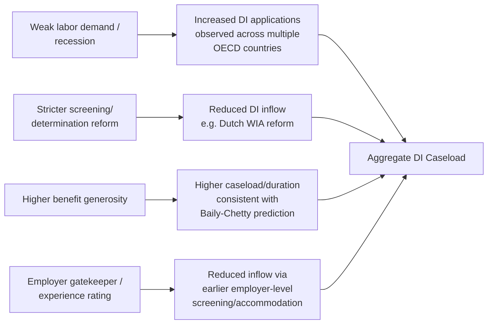

## Cross-Country Disability Insurance Systems

### Conceptual Overview

Cross-country comparison of disability insurance (DI) systems provides an empirical testing ground for the theoretical design trade-offs developed in the preceding entries — the generosity/moral-hazard trade-off, screening stringency choices, and the binary-versus-graduated determination architecture — since different countries have made substantially different institutional choices along each of these dimensions, generating meaningful cross-national variation that has been extensively exploited in the empirical public economics literature. This entry synthesizes the major comparative design axes and representative national systems, drawing primarily on the well-established OECD comparative disability-policy literature (notably OECD *Sickness, Disability and Work* series, and academic comparative work such as Autor and Duggan's U.S.-focused analyses alongside European comparative studies).

**Key Points**

- Cross-national DI caseload and spending levels vary substantially and are not straightforwardly explained by underlying population health differences alone, motivating institutional/design explanations.
- The comparative literature broadly organizes systems along axes already introduced: generosity, screening stringency, binary-versus-graduated determination, and integration with (or separation from) general social assistance and unemployment systems.
- Cross-country comparison is a standard empirical strategy for identifying the causal role of program design (holding underlying population health risk roughly constant across broadly similar advanced economies) versus underlying disability prevalence.

---

### Comparative Design Axes: A Structured Framework

| Design Axis | Range of Variation Observed Across Countries | Illustrative Poles |
| --- | --- | --- |
| Benefit generosity (replacement rate) | Low to high wage replacement | Lower relative generosity (e.g., U.S. SSDI, modest flat/progressive formula) vs. higher replacement systems (some Scandinavian designs historically) |
| Determination architecture | Binary vs. graduated/partial capacity | U.S. SSDI (largely binary) vs. graduated partial-disability tiers common in several continental European systems |
| Screening stringency | Loose to strict medical/vocational review | Varies substantially; empirically linked to caseload differences in comparative literature |
| Integration with unemployment/sickness systems | Fully separate program vs. integrated pathway | Some countries historically saw disability programs used as a de facto extended unemployment channel for older workers, particularly before reforms tightening this pathway |
| Employer role in initial sickness/disability period | Employer-paid sick leave preceding public DI vs. immediate public program entry | Netherlands' historically extensive employer sick-pay period (pre-2000s reform) vs. more immediate public program entry in other systems |
| Private vs. public DI role | Primarily public vs. substantial private/occupational layering | U.S. combines public SSDI with a meaningful private long-term disability insurance market (often employer-provided); many European systems rely more heavily on public/mandatory occupational schemes |

---

### United States: SSDI (Reference Case, Detailed in Prior Entries)

As developed in the preceding two entries, the U.S. SSDI system uses a binary, sequential medical-vocational determination architecture with a relatively strict, multi-stage screening process, comparatively modest replacement rates, and a documented benefit-cliff structure. It is frequently used in the comparative literature as a relatively "strict screening, lower generosity" reference point, though this characterization should be read as relative positioning within the OECD comparison set rather than an absolute claim independent of comparison country.

---

### Netherlands: A Widely-Studied Reform Case

The Dutch disability insurance system (WAO, later reformed into WIA) is one of the most frequently cited comparative case studies in the DI economics literature, specifically because the Netherlands experienced an unusually large disability caseload buildup from the 1980s through the early 2000s, followed by a series of substantial reforms — providing rich within-country policy-variation evidence alongside the cross-country comparison.

**Key historical/design features:**

- The Dutch system historically featured a **graduated (partial) disability determination**, awarding benefits proportional to assessed loss of earning capacity across multiple percentage bands, rather than a purely binary award/deny outcome — a structurally different architecture from SSDI's largely binary approach, illustrating the graduated-tier alternative discussed in the prior entry's cross-program comparison.
- The Netherlands historically saw a disability caseload substantially larger relative to its working-age population than most comparator OECD countries, which became a significant focus of Dutch and comparative academic and policy attention, generating extensive research (e.g., work associated with economists such as Lans Bovenberg and others studying Dutch social insurance reform) into the causes of the buildup.
- Major reforms (including the 1990s Gatekeeper Protocol strengthening employer/employee obligations during the sickness period prior to DI application, extension of employer-paid sick leave periods, and the 2006 WIA reform tightening the disability determination threshold and further differentiating benefit generosity by degree of work incapacity) were followed by documented substantial reductions in new DI inflows, providing a widely-cited natural experiment on the caseload-responsiveness of DI systems to determination stringency and employer-incentive design. [Given the significant institutional detail and the fact that Dutch social insurance policy has continued to evolve, current search would be advisable if precise dates, threshold percentages, or the most recent WIA parameters are needed for a specific application.]

---

### Nordic Systems (Illustrative: Sweden, Norway, Denmark)

Nordic disability insurance systems have historically been characterized in the comparative literature by relatively higher benefit generosity combined with strong active labor market policy integration (vocational rehabilitation, job placement support) intended to offset the work-disincentive risk that higher generosity alone would predict under the standard Baily-Chetty framework. [Inference: the degree to which active labor market policy integration successfully offsets the generosity-driven disincentive is a genuinely studied but not fully settled empirical question, with results varying by specific program and country-period studied.] Sweden in particular has been studied extensively regarding sickness-absence and disability program interaction, given a historically documented sensitivity of program inflows to benefit-level reforms and business-cycle conditions.

---

### United Kingdom: Incapacity Benefit / Employment and Support Allowance

The UK system has undergone significant restructuring, transitioning from Incapacity Benefit to Employment and Support Allowance (ESA), incorporating a **Work Capability Assessment** intended to more systematically differentiate claimants by degree of functional limitation and channel those with some assessed work capacity toward job-search-related support groups rather than unconditional long-term benefit receipt — a design response directly targeting the same screening-accuracy and work-disincentive concerns discussed in the prior entries, implemented through a more explicit functional-capacity-tiered structure than SSDI's largely binary approach. [This program has continued to undergo further reform (including integration considerations with Universal Credit); current search is advisable for the present-day structure if up-to-date programmatic detail is required.]

---

### Comparative Empirical Findings on Caseload Determinants

The cross-country comparative literature, alongside within-country natural-experiment evidence (such as the Dutch reform episode), has generally supported several broad conclusions relevant to the theoretical framework developed earlier:

1. **Screening stringency matters substantially for caseload size.** Countries and reform episodes that tightened medical/vocational determination criteria generally show measurably reduced program inflows, consistent with a meaningful moral-hazard-responsive margin in disability applications rather than caseloads being determined solely by exogenous population health.
2. **Benefit generosity and caseload are positively associated** in cross-country and within-country reform comparisons, broadly consistent with the theoretical prediction from the Baily-Chetty-style trade-off, though the magnitude of responsiveness varies across studies and contexts.
3. **The interaction with macroeconomic/labor-market conditions is a robust cross-national finding**: disability program applications and awards tend to rise during periods of weak labor demand across multiple studied countries, consistent with disability programs partially absorbing "hidden unemployment," particularly among older or less-employable workers — a finding replicated across several national contexts beyond the U.S., strengthening confidence that this is a general phenomenon rather than an artifact specific to one country's institutional design.
4. **Employer-incentive design (e.g., experience-rating of sick-pay/disability costs, gatekeeper protocols requiring employer engagement before DI application) appears to meaningfully affect inflow rates** in the studied European reform episodes, suggesting that shifting some initial screening/cost-bearing responsibility to employers (who have better information about a specific employee's true work capacity and accommodation feasibility) can be an effective design lever distinct from the government-administered medical-vocational screening discussed in the prior entry.

---

### Illustrative Comparative Caseload Dynamics (Stylized)

---

### Private Versus Public DI Role: A Comparative Note

As introduced in the "Rationale and Design" entry, the U.S. is comparatively distinctive in the significant role played by employer-sponsored **private** long-term disability insurance operating alongside SSDI (often providing supplemental replacement income and using a distinct, contractually-defined "own occupation" versus "any occupation" determination standard, subject to different legal frameworks such as ERISA rather than the public administrative law process governing SSDI). Many European systems rely more heavily on unified public or quasi-public (mandatory occupational pension-linked) disability provision, with private disability insurance playing a comparatively smaller supplementary role — a difference in the public-private mix directly analogous to the public-versus-private provision framework developed in the health insurance chapter, but applied here to income-replacement insurance rather than health care financing/provision.

---

### Methodological Value of Cross-Country Comparison

Cross-country DI comparison serves a specific methodological function in public economics beyond simple descriptive interest: because advanced OECD economies share broadly similar underlying demographic aging trends and (plausibly) broadly comparable underlying disability prevalence absent policy differences, persistent and substantial cross-national variation in DI caseloads and spending — and its responsiveness to specific, dateable policy reforms (as in the Dutch case) — provides comparatively strong evidence that **program design, not merely underlying health, is a first-order determinant of disability program caseloads**, reinforcing the centrality of the screening and moral-hazard design questions addressed in the preceding two entries as genuinely consequential policy levers rather than a secondary concern relative to exogenous health trends.

---

### Related Topics / Next Steps

- Rationale and Design of Disability Insurance (see prior item; theoretical trade-off underlying cross-country variation)
- Screening and Eligibility Determination (see prior item; binary vs. graduated architecture comparison)
- Work Disincentive Effects (see prior item; comparative benefit-cliff and generosity evidence)
- The Dutch WAO/WIA Reform Episode: Detailed Policy Timeline and Evaluation Literature
- OECD *Sickness, Disability and Work* Comparative Reports: Methodology and Key Findings
- Employer Experience-Rating and Gatekeeper Protocols: Design and Incentive Effects
- Active Labor Market Policy Integration with Disability Benefit Systems (Nordic Model)
- UK Work Capability Assessment: Design, Criticism, and Reform History
- Aging Population Trends and Long-Run Comparative DI Fiscal Sustainability
- Private Long-Term Disability Insurance and ERISA Litigation (U.S. Comparative Context)