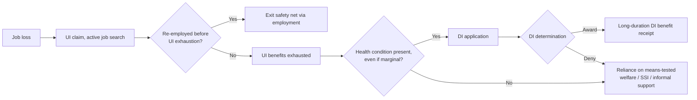

## Interaction between Disability Insurance and Other Social Programs

### Conceptual Overview

Disability insurance does not operate as an isolated program but as one node within a broader social insurance and safety-net system, and its design, generosity, and eligibility rules interact — often substantially — with unemployment insurance, means-tested welfare/SSI, retirement/pension systems, health insurance, and workers' compensation. These interactions matter for public economics analysis for two distinct reasons: (1) they generate **cross-program substitution effects** that can undermine or amplify the intended incentive design of any single program analyzed in isolation, and (2) they raise **program-coordination and targeting-efficiency** questions that are analytically separate from the within-program screening and generosity trade-offs developed in the preceding entries.

**Key Points**

- Program interactions can generate "waterbed effects," where tightening one program's eligibility shifts caseload pressure onto an adjacent program rather than reducing total safety-net claims.
- Sequencing and coordination rules (concurrent receipt limits, offset provisions) are designed to prevent duplicate benefit receipt but introduce their own complexity and marginal-incentive effects.
- Because disability and adjacent programs often have different financing sources and administering agencies, coordination is also a fiscal-federalism and administrative-design problem, not purely a benefit-formula problem.

---

### Disability Insurance and Unemployment Insurance: The Substitution Margin

#### Theoretical Basis for Substitution

Both disability insurance (DI) and unemployment insurance (UI) provide income replacement during a spell of non-work, but are nominally targeted at different underlying causes (incapacity to work versus involuntary job loss with ongoing job search). Because the *observable* behavior in both cases is similar (non-employment), and because DI eligibility determination has an inherent judgment component (as developed in the "Screening and Eligibility Determination" entry), there is a well-documented empirical concern that DI can function as a **de facto extended-duration UI substitute**, particularly for older displaced workers with diminished re-employment prospects, whose underlying situation is genuinely ambiguous between "unable to work due to impairment" and "unable to find work due to labor market conditions and age-related hiring discrimination or skill mismatch."

**The "hidden unemployment" channel (referenced in the prior cross-country entry):** Empirical findings that DI applications rise during weak labor-market conditions are the primary evidence base for this substitution channel — since the underlying medical condition of the applicant population should not, in principle, vary systematically with the business cycle, a cyclically-sensitive application rate suggests some applicants are on the margin between "genuinely disabled" and "unemployed with limited alternatives," and that weak labor demand shifts the *relative attractiveness* of applying for DI (a program with, in some systems, potentially longer expected benefit duration than time-limited UI) versus continuing UI-covered job search.

#### Sequencing Effects: UI Exhaustion and DI Application Timing

A distinct empirical regularity documented in several national contexts is that DI applications cluster around the point of **UI benefit exhaustion** (the end of the maximum UI benefit duration), consistent with a subset of long-term unemployed individuals — having exhausted the UI safety net without finding employment — subsequently applying to DI as an alternative income source. This generates a structural interaction in which the *effective* duration and generosity of UI indirectly affects DI caseload dynamics, meaning DI program evaluation that does not account for UI system design (maximum benefit duration, extended benefits during recessions) risks misattributing UI-driven caseload variation entirely to DI-specific factors.

---

### Disability Insurance and SSI: Categorical Versus Means-Tested Coordination

As distinguished in the "Rationale and Design" entry, SSDI (contributory, work-history-based) and SSI (means-tested, need-based) serve overlapping but distinct populations, and many disabled individuals interact with both programs, requiring explicit coordination rules:

- **Concurrent eligibility**: An individual with a limited SSDI work history may qualify for a modest SSDI benefit that falls below the SSI income threshold, making them simultaneously eligible for a supplemental SSI payment up to the combined federal benefit rate — this "concurrent beneficiary" population requires benefit-offset coordination rules (SSI benefits are reduced, generally close to dollar-for-dollar after an initial income disregard, for SSDI income received) to avoid unintended duplicate full-rate payment from both programs.
- **Categorical eligibility cascades**: In some systems, SSI eligibility (a means-tested disability/aged/blind determination) can serve as an automatic or streamlined qualifying pathway into other means-tested programs (e.g., in the U.S. context, SSI receipt can confer automatic or expedited eligibility for Medicaid in many states, and for SNAP in some circumstances) — meaning the disability determination embedded in SSI has downstream fiscal and access implications well beyond the SSI cash benefit itself, a "gateway" effect that amplifies the stakes of the underlying screening accuracy question beyond a single program's budget.

**Coordination formula (stylized, illustrating the offset mechanism):**

$$\text{SSI Payment} = \max\left(0, \; \text{Federal Benefit Rate} - (\text{Countable Income, including SSDI benefit net of disregard})\right)$$

This dollar-for-dollar (after disregard) offset structure means that, for concurrent beneficiaries, the *marginal* value of an additional dollar of SSDI benefit is partially or fully absorbed by a corresponding SSI reduction — an important consideration when analyzing the effective generosity and work-incentive properties of the combined benefit package, since analyzing SSDI generosity in isolation for this subpopulation would overstate its net marginal effect on their total income.

---

### Disability Insurance and Workers' Compensation: The Offset Provision

Because a work-related injury can potentially generate simultaneous eligibility for both workers' compensation (state-administered, employer-financed, tied to occupational causation) and SSDI (federal, tied to general work incapacity regardless of cause), most systems include an explicit **offset provision** limiting combined workers' compensation and SSDI payments to a specified percentage of the worker's prior average earnings (in the U.S. SSDI context, generally 80%), reducing the SSDI benefit (not the workers' compensation benefit) when the combined total would otherwise exceed this cap.

**Economic rationale for the offset:** Without such a provision, an individual with a qualifying occupational injury could receive combined benefits exceeding (or substantially replacing) prior earnings from two separately-financed programs, which would both impose unintended fiscal cost across the two financing streams and exacerbate the work-disincentive concerns discussed in the "Work Disincentive Effects" entry, since near-full or over-full earnings replacement sharply reduces any residual financial incentive to attempt work, all else equal. The offset is thus a direct coordination mechanism explicitly targeting cross-program combined-generosity moral hazard.

---

### Disability Insurance and Retirement/Pension Systems: The Age-Boundary Interaction

DI programs interact with retirement pension systems at the boundary of normal/early retirement age, since near-retirement-age individuals with declining health face a choice between applying for disability benefits versus claiming early retirement benefits (where both are available), and program rules governing this boundary have documented behavioral consequences.

**Key interaction margins:**

- **Automatic conversion at full retirement age**: In systems like U.S. SSDI, disability benefits automatically convert to retirement benefits at the beneficiary's full retirement age, generally without a change in payment amount — meaning DI functions, for beneficiaries who remain on the rolls until retirement age, as a bridge to retirement rather than solely a working-age income-replacement program, a design feature relevant to understanding DI caseload composition and long-run cost projections (an aging DI caseload structurally resembles, in its later years, an early-retirement population).
- **Relative generosity at the early-retirement/disability boundary**: Where disability benefits are more generous than actuarially-reduced early retirement benefits (a common relationship in several systems, since retirement benefits claimed early are typically permanently reduced while disability benefits are not correspondingly reduced), individuals near the early-retirement eligibility age face a financial incentive to pursue disability application rather than early retirement claiming, even for marginal health conditions — a boundary-interaction analog to the DI-UI substitution margin discussed above, but occurring at the older end of the age distribution and interacting with pension-system claiming-age design rather than UI duration design.

---

### Disability Insurance and Health Insurance: The Medicare/Medicaid Linkage

As introduced in the "Work Disincentive Effects" entry, SSDI beneficiaries in the U.S. become Medicare-eligible after a statutory waiting period, and SSI recipients are typically eligible for Medicaid — meaning disability cash-benefit programs function simultaneously as **gateways to public health insurance eligibility**, not solely as income-replacement programs. This creates a distinctive interaction: the marginal value (and marginal work disincentive) of disability benefit receipt is understated by looking at the cash benefit alone if health coverage access is bundled with and contingent upon cash-benefit status, particularly for beneficiaries with substantial ongoing health care needs who would face large uninsured medical costs if cash benefits (and associated health coverage) were lost — amplifying the "lock-in" effect discussed in the work-disincentive entry and creating an additional layer of program interdependence between the disability-insurance and health-insurance policy domains covered across this chapter.

---

### The "Waterbed Effect": A General Framework for Cross-Program Substitution

A useful organizing concept across all the interactions above is the **waterbed effect**: tightening eligibility or reducing generosity in one program does not necessarily reduce aggregate social-program caseloads or spending proportionally, because individuals on the margin of eligibility for the tightened program may shift into an adjacent program with looser criteria or greater relative attractiveness, partially or substantially offsetting the intended fiscal or caseload-reduction effect of the initial reform.

$$\Delta(\text{Total safety-net caseload}) = \Delta(\text{Program A caseload}) + \Delta(\text{Program B caseload}) + \dots$$

If $\Delta(\text{Program A caseload}) < 0$ (successful tightening) but $\Delta(\text{Program B caseload}) > 0$ and of comparable magnitude (substitution into an adjacent program), the *net* effect on total social-program reliance and total fiscal cost can be substantially smaller than the isolated Program A caseload reduction would suggest — a first-order consideration for policy evaluation that analyzes only a single program's caseload response to a reform without tracking cross-program migration of the affected population. [Inference: the empirical magnitude of waterbed/substitution effects across specific program pairs (DI-UI, DI-SSI, DI-early retirement) varies across studies and country contexts, and represents an active area of applied public economics research rather than a single settled cross-program elasticity.]

---

### Comparative Summary: Interaction Types and Coordination Mechanisms

| Program Pair | Nature of Interaction | Primary Coordination Mechanism | Key Behavioral Concern |
| --- | --- | --- | --- |
| DI – UI | Substitution at UI exhaustion; cyclical application sensitivity | Generally minimal formal coordination (separate systems); interaction is behavioral/sequential rather than formula-based | "Hidden unemployment" absorption into DI |
| DI – SSI | Concurrent eligibility for low-work-history individuals | Dollar-for-dollar (post-disregard) benefit offset | Understated effective marginal benefit value for concurrent beneficiaries |
| DI – Workers' Compensation | Dual eligibility for occupational injuries | Combined-benefit cap (offset reduces SSDI portion) | Over-full earnings replacement absent offset |
| DI – Retirement/Pension | Boundary substitution near early-retirement age; automatic conversion at full retirement age | Automatic benefit conversion at full retirement age | Incentive to pursue DI over reduced early retirement benefits |
| DI – Health Insurance (Medicare/Medicaid) | Cash benefit as gateway to health coverage eligibility | Waiting-period-linked automatic health coverage eligibility | Health-coverage "lock-in" amplifying work disincentive |

---

### Implications for Program Evaluation and Reform Design

The central methodological implication of this entry for public economics analysis is that **single-program evaluation of DI reforms (screening tightening, generosity changes) risks materially mismeasuring the true net welfare and fiscal effect** if cross-program substitution is not accounted for — a reform that appears successful in reducing DI caseloads may simply relocate the affected population to UI, SSI, or informal/uninsured status, with different (and not necessarily superior) welfare and fiscal consequences depending on the relative generosity, health-coverage linkage, and targeting accuracy of the destination program. This motivates the increasing use, in recent empirical public economics research, of **linked administrative data across multiple programs** (rather than single-program caseload data alone) to trace individual-level trajectories across the full social-insurance system following a policy change, allowing researchers to distinguish genuine caseload reduction (successful targeting improvement) from cross-program relocation (a waterbed effect with limited net social benefit).

---

### Related Topics / Next Steps

- Rationale and Design of Disability Insurance (see prior item)
- Screening and Eligibility Determination (see prior item)
- Work Disincentive Effects (see prior item; health-coverage lock-in interaction)
- Cross-Country Disability Insurance Systems (see prior item; comparative UI-DI substitution evidence)
- Optimal Unemployment Insurance Duration and Benefit Design
- SSI-Medicaid Categorical Eligibility Linkages in Detail
- Workers' Compensation Offset Provisions: Statutory Design Across U.S. States
- Early Retirement Claiming Behavior and Social Security Benefit Actuarial Reduction
- Linked Administrative Data Methods in Social Insurance Program Evaluation
- The "Waterbed Effect" in Welfare Program Reform: Empirical Estimates Across Program Pairs