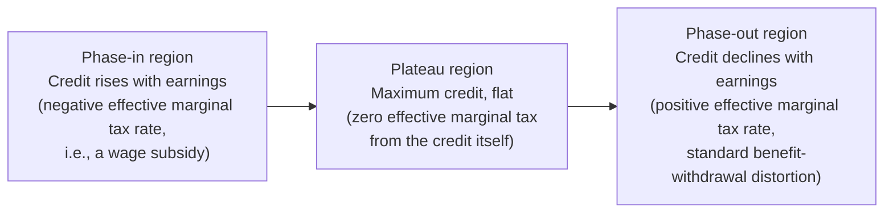

## Means-Tested Cash Transfers

### Conceptual Overview

Means-tested cash transfers provide direct income support to individuals or households whose income or assets fall below a specified threshold, with benefit eligibility and/or amount explicitly conditioned on a verified measure of financial need ("the means test"). This distinguishes means-tested transfers from both universal (categorical, non-income-conditioned) transfers and contributory social insurance programs (such as SSDI or Social Security retirement, where eligibility derives from prior contribution/work history rather than current financial need). Means-tested cash transfers are a central instrument of poverty alleviation policy and raise a distinct set of public economics design questions centered on the **targeting-efficiency versus labor-supply-distortion trade-off**, which structurally parallels but is analytically distinct from the insurance-generosity/moral-hazard trade-offs developed in the disability insurance entries.

**Key Points**

- The defining design tension is between **targeting accuracy** (concentrating limited transfer budgets on the poorest, for a given total budget) and the **labor-supply distortion** created by benefit phase-out as income rises (an implicit marginal tax on earnings).
- Means-tested transfers are financed and evaluated differently from social insurance: there is no actuarial fairness benchmark since eligibility is not contingent on a prior contribution or an insurable risk event, so the standard analytical framework is optimal-taxation-adjacent rather than insurance-theoretic.
- Both static (single-period targeting accuracy) and dynamic (labor-supply response over time, program dependency, take-up behavior) considerations are central to design evaluation.

---

### Theoretical Framework: The Targeting-Distortion Trade-off

#### The Basic Transfer-Phase-Out Structure

The canonical means-tested transfer combines a maximum benefit level for those with zero (or very low) income with a phase-out rate as earned income rises:

$$B(y) = \max\left(0, \; B_0 - t \cdot y\right)$$

where $B_0$ is the maximum benefit (guarantee level), $y$ is earned income, and $t$ is the **benefit reduction rate** (implicit marginal tax rate on earnings within the phase-out range). This formula directly generates the central efficiency concern: within the phase-out range, the recipient's effective marginal tax rate is $t$ (from benefit withdrawal) plus any explicit payroll/income tax rate applying to the same earnings, and if $t$ is set high (to concentrate the budget on the very poorest, i.e., low $y$ range with steep phase-out), the combined effective marginal tax rate can become very high, discouraging work at the margin — the same qualitative concern as the disability-insurance benefit cliff, but here typically implemented as a continuous (rather than discontinuous "cliff") phase-out, making it a smooth analog of the same underlying problem.

**Diagram: benefit level and effective marginal tax rate across the income range**

<svg xmlns="http://www.w3.org/2000/svg" viewBox="0 0 640 420" font-family="Helvetica, Arial, sans-serif">
<text x="320" y="22" text-anchor="middle" font-size="15" font-weight="bold">Means-Tested Transfer: Benefit Phase-Out (svg_diagram)</text>
<line x1="80" y1="370" x2="600" y2="370" stroke="black" stroke-width="1.5" />
<line x1="80" y1="370" x2="80" y2="50" stroke="black" stroke-width="1.5" />
<text x="600" y="392" font-size="12" text-anchor="end">Earned Income (y)</text>
<text x="55" y="45" font-size="12">Benefit / Net Income</text>

<line x1="80" y1="120" x2="220" y2="120" stroke="#2b6cb0" stroke-width="2.5" />
<text x="100" y="110" font-size="11" fill="#2b6cb0">Flat guarantee B₀</text>
<line x1="220" y1="120" x2="420" y2="330" stroke="#2b6cb0" stroke-width="2.5" />
<text x="280" y="220" font-size="11" fill="#2b6cb0">Phase-out (slope = -t)</text>
<line x1="420" y1="330" x2="600" y2="330" stroke="#2b6cb0" stroke-width="1" stroke-dasharray="3,3" />
<text x="450" y="345" font-size="10" fill="#2b6cb0">Benefit = 0 beyond breakeven</text>

<line x1="80" y1="370" x2="560" y2="90" stroke="#888" stroke-width="1" stroke-dasharray="4,3" />
<text x="480" y="120" font-size="10" fill="#666">Earned income (no transfer)</text>

<line x1="420" y1="370" x2="420" y2="330" stroke="#c05621" stroke-width="1.5" />
<text x="400" y="385" font-size="11" fill="#c05621">Breakeven income</text>
</svg>

#### The Guarantee-Phase-Out Rate Frontier

For a fixed total program budget, there is a direct trade-off between the **guarantee level** $B_0$ (generosity at zero income, determining depth of poverty alleviation for the very poorest) and the **phase-out rate** $t$ combined with the **breakeven income** (the income level at which benefits reach zero, determining program reach/coverage): holding budget fixed, a higher $B_0$ combined with a low $t$ extends benefits further up the income distribution (a wider "reach"), while achieving the same $B_0$ with a higher $t$ concentrates the same total spending more narrowly on the poorest but at the cost of a steeper (more distortionary) effective marginal tax rate over a shorter income range.

$$\text{Total program cost} \approx \int_0^{y^*} B(y) \, dF(y)$$

where $y^*$ is the breakeven income and $F$ is the income distribution — this integral constraint formalizes the intuition that $B_0$, $t$, and program reach cannot all be independently maximized for a fixed budget, requiring an explicit policy trade-off.

---

### The Optimal Income Taxation / Transfer Connection (Mirrlees-Adjacent Framework)

Means-tested transfer design at the bottom of the income distribution is formally a special case of the broader optimal nonlinear income taxation problem (Mirrlees 1971 and its extensive descendant literature, notably Saez 2002's treatment of optimal transfers at the low end of the distribution), since the transfer's phase-out schedule *is* effectively a marginal tax schedule over the relevant income range, and the same efficiency-equity trade-off logic applies:

$$t^*(y) \propto \frac{1 - F(y)}{y \cdot f(y)} \times \frac{1}{\epsilon(y)} \times \left(1 - \frac{g(y)}{\lambda}\right)$$

(a stylized version of the standard Mirrlees/Saez optimal marginal tax rate formula, applicable at low-income ranges), where $\epsilon(y)$ is the relevant labor-supply elasticity at income $y$, and $g(y)/\lambda$ represents the social marginal value of an additional dollar to individuals at income $y$ relative to public funds. **Key qualitative implication for transfer design**: because social marginal welfare weight $g(y)$ is typically very high for the very poorest (low $y$), the formula does not straightforwardly imply "tax the poor at a low rate" — rather, optimal design depends critically on the *elasticity* of labor supply at low income levels and the shape of the income density $f(y)$ near zero, which is why the extensive-margin labor supply literature (discussed below) is particularly central to transfer-schedule design specifically at the bottom of the distribution, distinguishing this literature from optimal-tax analysis focused on higher-income intensive-margin responses.

---

### Extensive Margin Versus Intensive Margin Responses

A distinctive feature of the means-tested transfer literature (developed prominently by Saez 2002 and subsequent extensive-margin-focused optimal tax work) is the emphasis on the **extensive margin** (the decision of whether to work at all) as potentially more empirically important than the **intensive margin** (hours/earnings conditional on working) for low-income populations, in contrast to the traditional optimal-tax literature's historical intensive-margin focus.

**Implication for program design:** If extensive-margin responsiveness dominates at low income levels, this favors transfer designs that provide a meaningful reward specifically for the *transition from zero to positive earnings* — motivating instruments like the Earned Income Tax Credit's phase-in region (discussed in detail as a related, closely-connected instrument below) rather than a pure guarantee-with-phase-out structure (like a negative income tax), since a pure guarantee-with-immediate-phase-out structure provides comparatively weak reward for the specific zero-to-positive-earnings transition relative to a design with an explicit phase-in subsidy region.

---

### Program Design Variants: A Comparative Framework

| Design Type | Structure | Key Feature | Illustrative Example |
| --- | --- | --- | --- |
| Guaranteed minimum income / Negative income tax | Flat guarantee, immediate phase-out from $y=0$ | Simple, but weak reward for initial work transition (no phase-in) | Friedman's classic Negative Income Tax proposal; some guaranteed-income pilots |
| Categorical means-tested cash assistance | Guarantee conditioned on both income *and* categorical status (family structure, disability, etc.) | Combines means test with categorical eligibility restriction | U.S. TANF (Temporary Assistance for Needy Families) |
| Earnings subsidy with phase-in, plateau, phase-out | Benefit rises with earnings over an initial range (phase-in), plateaus, then phases out | Directly rewards the zero-to-positive earnings transition | Earned Income Tax Credit (EITC) |
| Universal/unconditional transfer (not means-tested, included for contrast) | Fixed payment regardless of income | No means test, no phase-out distortion, but higher fiscal cost per poverty-dollar delivered for a given budget, absent means-testing | Universal basic income proposals |

---

### The Earned Income Tax Credit: A Detailed Design Case Study

The EITC (and structurally similar programs in other countries, e.g., the UK's historical Working Tax Credit, Canada's Working Income Tax Benefit) is a particularly well-studied instrument precisely because its phase-in structure was explicitly designed to address the extensive-margin concern above, and it has generated one of the most extensive empirical literatures in public economics regarding labor-supply response to transfer design.

**Three-region structure:**

**Key empirical findings [well-established in the literature]:** A substantial body of empirical research, particularly studies of EITC expansions in the 1990s (e.g., Eissa and Liebman 1996; subsequent work by Meyer and Rosenbaum, and others), has found the EITC associated with **meaningfully increased labor force participation** among single mothers, particularly in the phase-in region — consistent with the extensive-margin-responsiveness theoretical prediction. Evidence on intensive-margin effects (hours worked conditional on working, particularly within the phase-out region where the EITC's positive effective marginal tax rate would theoretically predict reduced hours) has generally found smaller and less consistently detected effects, though [Inference: the precise intensive-margin elasticity estimates vary across studies and identification strategies, and remain a more contested empirical parameter than the extensive-margin participation finding].

---

### Take-Up and Administrative/Informational Frictions

A distinct empirical and policy-design literature addresses **incomplete take-up**: many means-tested transfer programs exhibit eligible-but-non-participating populations, meaning the pure benefit-formula analysis above (assuming full take-up conditional on eligibility) can overstate both program cost and program effectiveness at actual poverty reduction if take-up is incomplete.

**Documented determinants of incomplete take-up [general findings, magnitude varies by program/country]:**

- Administrative/compliance costs of application (documentation requirements, verification burdens) — connecting to the "ordeal mechanism" screening logic introduced in the disability insurance entries, since application burden can function as an implicit (though often unintended or at least secondary) screening device, though with the same normative ambiguity noted there regarding whether burden-based screening improves or degrades overall targeting welfare.
- Stigma associated with means-tested program participation, a behavioral/social consideration distinct from pure administrative cost.
- Imperfect information about eligibility or program existence among the eligible population.
- Benefit amount relative to application/compliance cost — very small benefits may not be worth the application burden for marginal-eligibility individuals, a rational-choice explanation for selective take-up.

$$\text{Effective coverage rate} = \text{Take-up rate} \times \text{Eligibility rate among target population}$$

This decomposition is analytically important because policy interventions addressing *eligibility rules* (e.g., expanding income thresholds) and interventions addressing *take-up frictions* (e.g., simplified application processes, automatic enrollment, outreach campaigns) target entirely different components of the coverage gap and require different evaluation evidence.

---

### Categorical Versus Pure Income Means-Testing

Many real-world means-tested programs combine an income test with additional **categorical eligibility restrictions** (e.g., requiring presence of dependent children, as in U.S. TANF, or specific demographic categories), a design choice with distinct efficiency and equity implications relative to a pure income means test:

**Rationale for categorical restriction (Akerlof 1978's "tagging" framework):** If a categorical characteristic (e.g., having dependent children, or being of working age versus elderly) is correlated with both need and with labor-supply elasticity, and if the characteristic is itself difficult or costly to manipulate (unlike income, which is directly responsive to behavior), then conditioning transfers on the observable "tag" in addition to income can improve targeting efficiency relative to income-testing alone, since the tag provides additional, less behaviorally-distortable information about relative need or relative social welfare weight — a distinct theoretical justification from the pure income-based means test, developed formally in the "tagging" literature following Akerlof (1978) and subsequently extended by Immonen, Kanbur, Keen, and Tuomala and others.

---

### Comparative Summary: Efficiency-Equity Trade-offs Across Design Choices

| Design Choice | Targeting Accuracy Effect | Labor Supply Distortion Effect | Administrative Complexity |
| --- | --- | --- | --- |
| Higher phase-out rate $t$ | Improves (concentrates budget on poorest) for fixed budget | Increases (steeper effective marginal tax) | Neutral |
| Phase-in region (EITC-style) | Somewhat reduces pure targeting concentration (benefits extend to some non-poorest working households) | Reduces extensive-margin distortion; may create intensive-margin distortion in phase-out | Increases (three-region formula more complex than simple guarantee) |
| Categorical restriction ("tagging") | Can improve if tag correlates with need/elasticity | Can reduce distortion if tag is behaviorally non-manipulable | Increases (verification of categorical status) |
| Simplified application / automatic enrollment | Improves effective coverage among eligible (raises take-up) | Neutral to formula-level distortion, but may reduce implicit ordeal-based self-selection screening | Can reduce (fewer manual verification steps) or increase (data-matching infrastructure) depending on implementation |

---

### Related Topics / Next Steps

- Rationale and Design of Disability Insurance (parallel generosity/moral-hazard trade-off framework)
- Optimal Nonlinear Income Taxation (Mirrlees 1971; Saez 2002 Extensive-Margin Extension)
- The Earned Income Tax Credit: Detailed Empirical Literature and Phase-In/Phase-Out Design
- Tagging and Categorical Welfare Targeting (Akerlof 1978 Framework)
- Take-Up of Means-Tested Benefits: Behavioral and Administrative Determinants
- Universal Basic Income as a Non-Means-Tested Alternative: Comparative Welfare Analysis
- TANF Design and the Shift from AFDC: Time Limits and Work Requirements
- Guaranteed Income Pilot Programs: Design and Emerging Evidence
- Effective Marginal Tax Rates Across Overlapping Transfer Programs ("Benefit Stacking")
- Cross-National Comparison of Minimum Income Guarantee Schemes