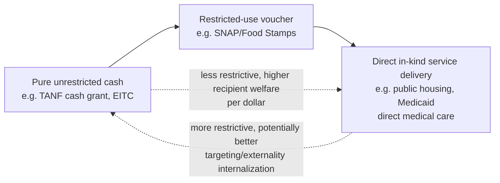

## In-Kind Transfers versus Cash Transfers

### Conceptual Overview

The choice between providing poverty-alleviation support as unrestricted cash versus as in-kind benefits (goods, services, or restricted vouchers for specific categories of consumption, such as food, housing, or medical care) is a central and long-standing design question in public economics, sitting at the intersection of standard consumer-theory welfare analysis, paternalism/merit-good arguments, and political-economy considerations regarding public support for redistribution. This entry develops the standard theoretical framework, the leading rationales for in-kind provision despite its apparent consumer-theoretic inefficiency, and the empirical literature testing these theoretical predictions.

**Key Points**

- The baseline consumer-theory result is that cash transfers weakly dominate in-kind transfers of equal cost in terms of recipient welfare, since cash allows recipients to reach their own preferred consumption bundle.
- Despite this baseline result, in-kind transfers are pervasive in actual welfare systems, motivating a substantial theoretical literature explaining this apparent puzzle through externalities, paternalism, screening/targeting, and political-economy arguments.
- Empirical evaluation of in-kind versus cash equivalence requires care in distinguishing pure income effects from the behavioral effects of the specific restriction imposed by in-kind design.

---

### The Baseline Consumer-Theory Result: Cash Dominance

#### Standard Indifference-Curve Argument

Consider a recipient with a fixed budget allocated across two goods, $X$ (the in-kind good, e.g., food) and $Y$ (all other goods), with standard well-behaved, convex preferences. A cash transfer of value $V$ shifts the budget constraint outward uniformly; an in-kind transfer of the same cost $V$, restricted to good $X$, shifts the budget constraint outward only in the $X$ direction (effectively creating a kinked budget constraint).

**Key result**: If the recipient's unconstrained optimal choice given the cash-equivalent budget would involve consuming *less* of $X$ than the in-kind transfer amount, the in-kind transfer is a **binding constraint** that forces the recipient away from their preferred bundle, generating strictly lower utility than the equivalent-cost cash transfer would provide, while producing identical or lower utility even in the case where the constraint does not bind (in which case in-kind and cash transfers are welfare-equivalent, since the recipient would have chosen at least that much of $X$ anyway).

$$U(\text{cash transfer of value } V) \geq U(\text{in-kind transfer of value } V)$$

with strict inequality whenever the in-kind restriction binds (i.e., whenever the recipient's income-unconstrained preferred consumption of $X$ under the cash-equivalent budget is less than the mandated in-kind quantity).

**Diagram: cash versus in-kind budget constraints and consumer optimum**

<svg xmlns="http://www.w3.org/2000/svg" viewBox="0 0 640 420" font-family="Helvetica, Arial, sans-serif">
<text x="320" y="22" text-anchor="middle" font-size="15" font-weight="bold">Cash vs. In-Kind Transfer: Budget Constraint (svg_diagram)</text>
<line x1="80" y1="370" x2="600" y2="370" stroke="black" stroke-width="1.5" />
<line x1="80" y1="370" x2="80" y2="40" stroke="black" stroke-width="1.5" />
<text x="600" y="392" font-size="12" text-anchor="end">Good X (e.g., food)</text>
<text x="55" y="35" font-size="12">All Other Goods (Y)</text>

<line x1="80" y1="300" x2="300" y2="80" stroke="#a0aec0" stroke-width="1.5" stroke-dasharray="4,3" />
<text x="150" y="270" font-size="10" fill="#888">Original budget</text>

<line x1="80" y1="200" x2="450" y2="60" stroke="#2b6cb0" stroke-width="2" />
<text x="380" y="90" font-size="11" fill="#2b6cb0">Cash transfer budget</text>

<line x1="80" y1="300" x2="80" y2="200" stroke="#c05621" stroke-width="2" />
<line x1="80" y1="200" x2="300" y2="200" stroke="#c05621" stroke-width="2" />
<line x1="300" y1="200" x2="300" y2="80" stroke="#c05621" stroke-width="2" />
<line x1="300" y1="80" x2="450" y2="60" stroke="#c05621" stroke-width="2" />
<text x="150" y="215" font-size="11" fill="#c05621">In-kind budget (kinked)</text>

<path d="M 200 130 Q 250 100 420 75" fill="none" stroke="#2f855a" stroke-width="1.5" stroke-dasharray="2,2" />
<circle cx="250" cy="95" r="4" fill="#2f855a" />
<text x="255" y="90" font-size="10" fill="#2f855a">Cash optimum (less X than in-kind floor)</text>
<circle cx="300" cy="140" r="4" fill="#c05621" />
<text x="310" y="150" font-size="10" fill="#c05621">In-kind constrained optimum (on kink)</text>
</svg>

The consumer's unconstrained (cash) optimum lies at a point with less of $X$ than the in-kind program mandates, so under the in-kind constraint the consumer is pushed onto the kink point rather than their true optimum — reaching a strictly lower indifference curve.

---

### Theoretical Rationales for In-Kind Provision Despite Cash Dominance

Given the baseline result above, the pervasiveness of in-kind transfers in actual welfare systems (food assistance, housing vouchers/public housing, in-kind medical care via Medicaid, school meal programs) motivates a distinct literature explaining why policymakers might rationally prefer in-kind provision despite its apparent recipient-welfare inferiority for a given budget. The major theoretical rationales:

#### 1. Externalities in the Target Good's Consumption

If consumption of the specific good $X$ generates positive externalities beyond the recipient (the clearest example being child nutrition or child health care, where donors/taxpayers may specifically value the *child's* consumption of these goods, not merely the household's general welfare), then in-kind provision can be efficient *for the donor's objective function* even though it is inefficient from the recipient's own preference-satisfaction standpoint alone — this is fundamentally a case where the relevant welfare function being maximized is not solely the recipient's own utility, but incorporates the donor/taxpayer's specific preferences over the recipient's *consumption composition*, not merely their consumption *level*.

#### 2. Paternalism and "Merit Good" Arguments

Distinct from externalities (which involve third parties beyond the recipient), a paternalistic rationale holds that policymakers (or the median voter/taxpayer) may believe recipients would under-consume certain goods relative to what is "good for them" if given unrestricted cash — due to, for example, present bias, addiction, or other behavioral deviations from the standard rational-choice model assumed in the baseline consumer-theory argument. [Note: this is explicitly a normative/political-economy argument resting on a judgment that recipient preferences should not be the sole basis for welfare evaluation in this context, a position that is contested on liberal/autonomy grounds within the broader public economics and philosophy literature, and should be presented as one recognized rationale among several rather than an uncontroversial efficiency justification.]

#### 3. Donor/Taxpayer Preferences Directly Over In-Kind Provision ("Commodity Egalitarianism")

A related but distinct argument (associated with the political philosophy of "specific egalitarianism," e.g., James Tobin's writings on the topic) holds that taxpayer/voter support for redistribution is, empirically and politically, often stronger for specific goods deemed essential (food, housing, health care, education) than for unrestricted cash, meaning in-kind provision may be a **politically sustainable** mechanism for achieving a given level of redistribution that unrestricted cash transfers of equivalent cost would not achieve, because voters are willing to fund the former but not the latter. This is a political-economy argument about the *size of the sustainable transfer budget*, not an argument that in-kind provision is efficient conditional on a fixed budget — an important distinction from the externality and paternalism rationales above, since it operates through the political feasibility constraint rather than through the welfare-function specification itself.

#### 4. Screening / Self-Targeting via In-Kind Restriction

Following the same "ordeal mechanism" logic introduced in the disability insurance and means-tested transfer entries (Nichols and Zeckhauser 1982), in-kind transfers restricted to goods that are relatively less valuable to higher-income individuals (or that carry some stigma or inconvenience) can function as a **self-selection screening device**, discouraging take-up by ineligible or marginal-need individuals who would find the in-kind good's restricted form less attractive than its cash-equivalent value, thereby improving targeting efficiency (reducing "leakage" to non-intended beneficiaries) relative to unrestricted cash at the same nominal budget — an efficiency-improving rationale for in-kind design operating through the *targeting* channel rather than the recipient-welfare channel, and notably one of the few rationales that can, in principle, improve overall social welfare (net of targeting-efficiency gains) even while accepting that in-kind provision reduces welfare *conditional on being a recipient*.

#### 5. Administrative and Fraud-Control Considerations

In-kind provision (e.g., direct service delivery, restricted-use vouchers with vendor verification) can in some contexts offer superior fraud-control and verification properties relative to cash, since the in-kind good's actual delivery/consumption can sometimes be more readily verified than a recipient's true use of unrestricted cash — though [Inference: the relative fraud-control advantage of in-kind versus cash-with-monitoring systems depends heavily on the specific administrative technology and program context, and is not a general theoretical result independent of implementation details].

---

### Empirical Literature: Testing the "Infra-Marginal" Prediction

The baseline theoretical prediction generates a specific testable empirical implication: **for recipients whose unconstrained preferred consumption of the in-kind good already exceeds the mandated in-kind quantity** (termed "infra-marginal" recipients, for whom the in-kind constraint does not bind), in-kind and cash transfers of equal value should be behaviorally equivalent — the in-kind transfer functions exactly like cash for this subgroup, since it does not actually constrain their choice.

**Key empirical test — Food Stamps/SNAP cash-out experiments**: Several U.S. state-level demonstration programs in the 1990s converted Food Stamp benefits from an in-kind (restricted-use) voucher to cash payment of equivalent value, providing a direct empirical test of the cash-equivalence prediction. Findings from this literature [well-documented empirical result] generally showed that for the majority of recipients (whose food expenditure already exceeded the benefit amount, i.e., infra-marginal recipients), the cash-out had **minimal effect on food expenditure**, consistent with the theoretical prediction that in-kind and cash transfers are equivalent for infra-marginal recipients. However, some studies also found a subset of recipients (particularly those with lower overall food expenditure, closer to or below the benefit amount) for whom the in-kind restriction *did* appear to bind, with cash-out associated with somewhat reduced food-specific spending relative to the in-kind benchmark for this subgroup — consistent with the "flypaper effect" discussed below for the marginal/constrained population specifically. [Inference: the precise share of the recipient population found to be constrained (marginal) versus unconstrained (infra-marginal) varies across the specific studies and time periods examined.]

#### The "Flypaper Effect" / Excess Sensitivity to In-Kind Transfers

A related and more general empirical puzzle — observed not only in the food-stamp cash-out literature but across a range of in-kind and categorical/earmarked transfer contexts (including, in the public finance literature more broadly, intergovernmental grants to local governments) — is that recipients often exhibit a larger marginal propensity to consume the specifically-subsidized good out of an in-kind transfer than the standard income-effect-only theoretical prediction would suggest, informally termed the **"flypaper effect"** ("money sticks where it hits"). Proposed explanations include mental accounting/behavioral departures from the standard fungibility assumption, imperfect information about the transfer's true cash-equivalent value, and administrative/political constraints on fully substituting in-kind transfers for other spending. [This remains a genuinely debated empirical and behavioral-economics topic without full consensus on the relative contribution of each proposed mechanism.]

---

### Comparative Summary: Cash versus In-Kind Transfer Design

| Dimension | Cash Transfer | In-Kind Transfer |
| --- | --- | --- |
| Recipient welfare (fixed budget) | Weakly higher (never lower) by standard consumer theory | Weakly lower; strictly lower if constraint binds |
| Administrative cost | Generally lower (simpler disbursement) | Often higher (vendor verification, program-specific administration) |
| Political sustainability of a given transfer size | Often lower, per commodity-egalitarianism arguments | Often higher, if voters specifically value the target good's consumption |
| Targeting efficiency via self-selection | No self-targeting mechanism from restriction itself | Can improve targeting if restriction is more burdensome for non-target population ("ordeal"/self-selection effect) |
| Externality internalization (if target good has positive externalities) | Does not directly internalize | Directly targets the externality-generating good |
| Fungibility / flypaper effect | Fully fungible, standard income effect | Documented tendency toward excess spending on target good beyond pure income effect |

---

### Illustrative Real-World Program Spectrum

---

### Synthesis: When Does the Theory Favor In-Kind Provision?

Bringing together the rationales above, a rigorous position is that **in-kind provision is not generally efficiency-superior to cash from the standpoint of maximizing recipient welfare for a fixed budget** — the baseline consumer-theory result stands as the default benchmark — but in-kind provision can be justified as part of an **overall social welfare-maximizing policy** (incorporating taxpayer/donor preferences, externalities, political-feasibility constraints on transfer size, or targeting-efficiency gains from self-selection) under one or more of the specific conditions enumerated above. The appropriate policy conclusion is therefore not a blanket preference for either cash or in-kind transfers, but a case-by-case evaluation of which of these specific rationales applies to the good and population in question — food and child-related goods (externality, paternalism, and political-support arguments all plausibly apply with some force) are a materially different case from unrestricted general income support (where the baseline cash-dominance result applies with comparatively less counterargument), which is broadly consistent with the observed real-world pattern of heavier in-kind provision concentrated in food, housing, health care, and child-related categories relative to general income support.

---

### Related Topics / Next Steps

- Means-Tested Cash Transfers (see prior item; phase-out design applies equally to in-kind benefit schedules)
- Nichols-Zeckhauser Ordeal Mechanisms and Self-Targeting via Program Design
- SNAP/Food Stamp Cash-Out Demonstrations: Detailed Study Designs and Results
- The Flypaper Effect in Intergovernmental Grants: Public Finance Literature
- Tagging and Categorical Welfare Targeting (connects to Akerlof 1978 framework)
- Paternalism and Behavioral Public Economics: Present Bias and Merit Goods
- Housing Vouchers versus Public Housing: Comparative Program Design
- Medicaid as In-Kind Medical Care Provision versus Cash-Equivalent Health Subsidy
- Political Economy of Redistribution: Commodity Egalitarianism (Tobin) versus Welfarism
- Universal Basic Income and School Meal/Nutrition Program Design Comparisons