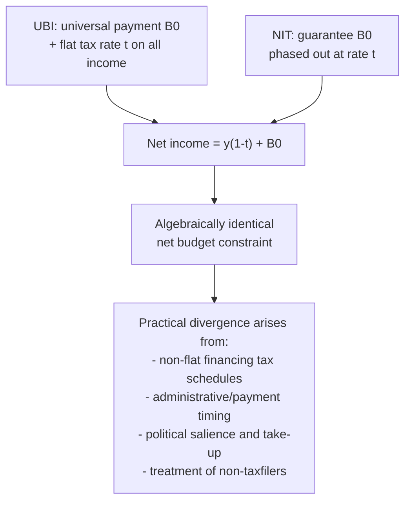

## Negative Income Tax and Universal Basic Income

### Conceptual Overview

The Negative Income Tax (NIT) and Universal Basic Income (UBI) are two closely related but structurally distinct mechanisms for providing guaranteed minimum income support, both representing a shift away from categorical or narrowly means-tested transfer design toward a broader, more unconditional approach to income guarantees. Both are direct extensions of the theoretical framework developed in the "Means-Tested Cash Transfers" entry — NIT is essentially the pure guarantee-with-phase-out structure formalized there, while UBI represents the polar case of a transfer with **no means test and no phase-out** at all (a fixed payment to every individual regardless of income), making the two a useful paired case study in the guarantee-level/phase-out-rate/coverage trade-off space.

**Key Points**

- NIT and UBI differ primarily in whether the transfer is phased out with income (NIT) or paid universally regardless of income (UBI) — a distinction with major implications for both fiscal cost and effective marginal tax rates.
- Under standard assumptions, a UBI combined with an appropriately designed flat or progressive tax schedule can be shown to be **mathematically equivalent** to an NIT with a particular phase-out structure — an important theoretical result that reframes much of the "NIT vs. UBI" debate as being about financing/labeling rather than fundamental economic structure, though real-world implementations frequently diverge from this equivalence in practice.
- Empirical evidence comes primarily from historical NIT field experiments (1970s U.S. and Canada) and a more recent wave of UBI/guaranteed-income pilot programs, each with distinct methodological strengths and limitations.

---

### Negative Income Tax: Formal Structure

#### Basic Formula

The NIT, originally proposed in its modern economics form by Milton Friedman (1962), integrates the tax and transfer systems into a single schedule:

$$\text{Net Transfer}(y) = B_0 - t \cdot y$$

where $B_0$ is the guarantee (payment received at zero earned income), $t$ is a single implicit marginal tax rate applied uniformly across the *entire* income range (not merely a phase-out range distinct from the ordinary tax system, as in a typical means-tested program), and $y$ is earned (pre-tax, pre-transfer) income. When $\text{Net Transfer}(y) > 0$, the individual receives a payment from the government (a "negative tax"); when $\text{Net Transfer}(y) < 0$, the individual pays the standard positive tax.

**Breakeven income**: the point at which $\text{Net Transfer}(y) = 0$, given by $y^* = B_0 / t$.

**Key structural feature distinguishing NIT from a typical means-tested program**: because the same rate $t$ applies uniformly rather than only within a narrow phase-out band followed by a separate, potentially different explicit tax schedule at higher incomes, NIT proposals are explicitly designed to avoid the "benefit stacking" problem (in which overlapping means-tested programs with independent phase-out schedules can combine to produce very high or even seemingly-perverse cumulative effective marginal tax rates for a recipient navigating multiple programs simultaneously) — a design virtue frequently emphasized in NIT advocacy relative to the fragmented multi-program welfare systems it was originally proposed to replace or consolidate.

**Diagram: NIT net transfer schedule**

<svg viewBox="0 0 640 380" xmlns="http://www.w3.org/2000/svg" font-family="Helvetica, Arial, sans-serif">
<text x="320" y="22" text-anchor="middle" font-size="15" font-weight="bold">Negative Income Tax Schedule (svg_diagram)</text>
<line x1="80" y1="330" x2="600" y2="330" stroke="black" stroke-width="1.5"/>
<line x1="80" y1="200" x2="600" y2="200" stroke="#888" stroke-width="1"/>
<text x="600" y="352" font-size="12" text-anchor="end">Earned Income (y)</text>
<text x="55" y="40" font-size="12">Net Transfer / Tax</text>
<text x="65" y="205" font-size="10">0</text>
<!-- NIT line, downward sloping through breakeven -->
<line x1="80" y1="70" x2="560" y2="320" stroke="#2b6cb0" stroke-width="2.5"/>
<text x="100" y="60" font-size="11" fill="#2b6cb0">B&#8320; (guarantee at y=0)</text>
<!-- Breakeven marker -->
<line x1="330" y1="330" x2="330" y2="200" stroke="#c05621" stroke-width="1.5" stroke-dasharray="2,2"/>
<text x="335" y="345" font-size="11" fill="#c05621">Breakeven y* = B&#8320;/t</text>

<text x="450" y="280" font-size="11" fill="`#2b6cb0`">Positive tax region (y > y*)</text>

<text x="120" y="170" font-size="11" fill="`#2b6cb0`">Net transfer region (y < y*)</text>

</svg>

---

### Universal Basic Income: Formal Structure

#### Basic Formula

$$\text{Net Payment}(y) = B_0 \quad \text{(for all } y\text{, regardless of level)}$$

with a *separately determined* tax schedule $T(y)$ applied to fund the universal payment, typically progressive or flat, but structurally independent of the transfer itself (unlike NIT, where the phase-out rate and the payment are integrated into a single schedule).

**Key structural distinction**: because $B_0$ is paid regardless of income, there is **no benefit-withdrawal-driven distortion from the transfer itself** — the only labor-supply distortion in a UBI system comes from whatever separate tax schedule $T(y)$ is used to finance it, not from any implicit "phase-out tax" embedded in the transfer formula. This is frequently cited by UBI proponents as a work-incentive advantage relative to means-tested transfers or even NIT, though (as developed in the equivalence result below) this apparent advantage can be misleading once the financing side is fully specified.

---

### The NIT-UBI Equivalence Result

A central and frequently under-appreciated theoretical result is that a UBI of amount $B_0$ financed by a flat tax rate $t$ on all income is **mathematically identical** in its net effect on every individual's budget constraint to an NIT with guarantee $B_0$ and phase-out rate $t$:

$$\text{Net income under UBI} = y - t \cdot y + B_0 = y(1-t) + B_0$$

$$\text{Net income under NIT} = y + (B_0 - t \cdot y) = y(1-t) + B_0$$

The two expressions are algebraically identical. This equivalence result (widely noted in the public economics literature, sometimes attributed informally to observations following from Friedman's original NIT proposal alongside later UBI-specific formalizations) has an important implication: **the "NIT vs. UBI" debate, when both are precisely specified including their financing mechanism, is often less a debate about fundamental economic structure and more a debate about administrative implementation, political framing, and the specific (often more complex, non-flat) tax schedules used in practice to finance each** — real-world UBI proposals are rarely financed by a single flat tax rate exactly mirroring an NIT's phase-out rate, and real-world NIT proposals may interact with existing tax brackets in ways that break the clean equivalence, so the equivalence is best understood as a benchmark theoretical result illustrating underlying structural similarity rather than a claim that all real-world proposals are interchangeable.

---

### Key Practical Divergences Despite Theoretical Equivalence

#### 1. Take-Up and Administrative Salience

Because UBI is typically framed and administered as an automatic, universal payment (often not requiring an active application, particularly if integrated with existing tax/benefit administrative infrastructure), it can in principle achieve **higher effective take-up** among the eligible population than an NIT or means-tested program requiring active application or tax filing — directly connecting to the take-up/administrative-friction discussion in the "Means-Tested Cash Transfers" entry, since NIT's need for income verification (even if integrated into the tax system) can reproduce some of the same compliance-cost and stigma-related take-up frictions as conventional means-tested programs, whereas a fully universal payment sidesteps this by construction.

#### 2. Fiscal Cost and the "Universal Overpayment" Consideration

Because UBI pays $B_0$ to every individual regardless of income — including individuals far above any reasonable need threshold — its **gross fiscal cost** (before netting out the additional tax revenue collected to finance it) is substantially larger than a means-tested or NIT program providing the same net transfer only to lower-income individuals. While the equivalence result shows the *net* budget effect can be identical for a given individual under matched parameters, the **gross transfer flows are much larger under UBI**, which has practical fiscal-administration, political-salience, and (potentially) macroeconomic financing implications not captured in the simple net-budget-constraint equivalence — a distinction frequently emphasized by critics of pure UBI proposals relative to NIT or means-tested alternatives with equivalent net effect but smaller gross transaction volume.

#### 3. Political Economy and Coalition-Building

A frequently cited (though contested) political-economy argument for UBI's universality is that broad-based (non-means-tested) programs tend to generate **broader political coalitions and greater long-run political durability** than narrowly targeted means-tested programs (an argument associated with welfare-state scholarship, e.g., work in the tradition of Skocpol's "targeting within universalism" literature), since a universal program benefits (and is therefore defended by) a much broader swath of the electorate, including middle- and higher-income voters who might otherwise have limited stake in defending a narrowly means-tested program. [This is explicitly a political-economy/sustainability argument, not an efficiency argument, and its empirical support is derived primarily from comparative welfare-state political science literature rather than a standard public-economics efficiency framework.]

---

### Empirical Evidence: Historical NIT Experiments (1968–1982)

The U.S. and Canada conducted several large-scale randomized NIT field experiments in the 1970s (the New Jersey Income Maintenance Experiment, Seattle/Denver Income Maintenance Experiments — SIME/DIME, Gary Income Maintenance Experiment, and Canada's MINCOME in Manitoba), among the earliest large-scale randomized social experiments in economics and a foundational contribution to the empirical labor-supply-elasticity literature.

**Key documented findings [established empirical results from this experimental literature]:**

- Labor supply reductions in response to the guaranteed income were generally found across the experiments, but were **modest in magnitude** relative to some pre-experiment predictions, with reductions concentrated more in hours worked (intensive margin) and among secondary earners (particularly married women) and youth, rather than a large-scale withdrawal from the labor force by primary earners.
- The SIME/DIME experiments in particular produced widely-cited estimates of labor supply response, though methodological critiques (including reanalysis by Ashenfelter and Plant, and others, raising concerns about differential attrition and specific aspects of the experimental design) generated ongoing debate about the precision and robustness of some headline estimates. [Inference: the exact magnitude of labor supply elasticity estimated from this experimental literature remains subject to some methodological debate regarding specific estimation approaches, even though the qualitative finding of modest-but-nonzero response is broadly robust across reanalyses.]
- The Canadian MINCOME experiment (Manitoba, 1974-1979) has received particular retrospective attention following later analysis (notably by Evelyn Forget) finding suggestive evidence of health-related benefits (including reduced hospitalization rates) associated with the guaranteed income, alongside modest labor-supply effects — though [Unverified/Inference: caution is warranted regarding the causal robustness of some of these retrospective findings, given that MINCOME's original design was not fully carried through to completion with contemporaneous analysis, and later analysis relied in part on administrative data reconstruction after the fact].

---

### Empirical Evidence: Modern UBI/Guaranteed Income Pilots

A more recent wave of smaller-scale, often privately or foundation-funded guaranteed-income pilot programs (e.g., various U.S. city-level guaranteed income pilots in the 2020s, Y Combinator Research/OpenResearch's unconditional cash study, and international pilots such as GiveDirectly's work in Kenya) has generated a growing but methodologically distinct evidence base — typically smaller in scale, shorter in duration, and often not structured as a true NIT (many provide a fixed unconditional payment without the explicit phase-out/tax-integration structure of the classic NIT experiments) — meaning direct comparison to the 1970s NIT literature requires some care regarding differences in program structure, though both literatures speak to the closely related question of unconditional/near-unconditional cash transfer effects on labor supply and wellbeing. [Given the number of ongoing and recently-completed pilots and the fast-evolving nature of this literature, current search would be advisable for the most recent published results and their specific findings if precise, up-to-date figures are required for a given pilot program.]

---

### Comparative Summary: NIT versus UBI versus Conventional Means-Tested Transfers

| Dimension | Negative Income Tax | Universal Basic Income | Conventional Means-Tested Transfer |
| --- | --- | --- | --- |
| Means test / income verification | Required (integrated with tax filing) | Not required (universal) | Required, often with separate application |
| Effective marginal tax rate structure | Single integrated rate across full income range | Determined entirely by separate financing tax schedule | Often high and non-uniform within phase-out band; can "stack" with other programs |
| Gross fiscal cost (before netting financing) | Lower (payments concentrated below breakeven) | Higher (universal payment to all) | Lowest (narrowly targeted) |
| Take-up / administrative friction | Moderate (tax-filing-based, but still requires income reporting) | Low (automatic/universal by design) | Often highest (application, verification, potential stigma) |
| Political durability argument | Intermediate | Strongest (broad-based coalition argument) | Weakest (narrow beneficiary base) |
| Net budget constraint (given matched $B_0$, $t$) | Identical to UBI with flat-tax financing at rate $t$ | Identical to NIT with guarantee $B_0$, phase-out $t$ | Distinct; typically non-linear/multi-segment schedule |

---

### Synthesis: Positioning within the Broader Transfer-Design Framework

NIT and UBI are best understood not as a wholly separate category of policy instrument but as **specific, polar points within the same guarantee-phase-out design space** introduced in the "Means-Tested Cash Transfers" entry — NIT is essentially that entry's baseline guarantee-with-phase-out formula applied economy-wide and integrated with the tax system, while UBI represents the limiting case of a phase-out rate embedded entirely within general taxation rather than within the transfer formula itself. The theoretical equivalence result underscores that debates over NIT versus UBI are frequently, at their core, debates over financing structure, administrative design, and political economy rather than over a fundamentally different underlying economic mechanism — a synthesis point valuable for situating this topic relative to the surrounding chapter material on means-tested and in-kind transfer design.

---

### Related Topics / Next Steps

- Means-Tested Cash Transfers (see prior item; guarantee-phase-out framework generalized here)
- In-Kind Transfers versus Cash Transfers (see prior item; UBI/NIT as polar unrestricted-cash cases)
- SIME/DIME and Historical NIT Experiments: Detailed Methodology and Reanalysis Debates
- MINCOME (Manitoba) Retrospective Health Findings: Evidence and Limitations
- Modern Guaranteed Income Pilots: OpenResearch, GiveDirectly, and City-Level U.S. Programs
- Optimal Flat Tax Financing of Universal Transfers: Public Finance Considerations
- "Targeting Within Universalism" and Welfare-State Political Economy (Skocpol)
- Benefit Stacking and Cumulative Effective Marginal Tax Rates Across Overlapping Programs
- Friedman's Original Negative Income Tax Proposal: Historical and Theoretical Context
- Labor Supply Elasticity Estimation: Experimental versus Quasi-Experimental Approaches