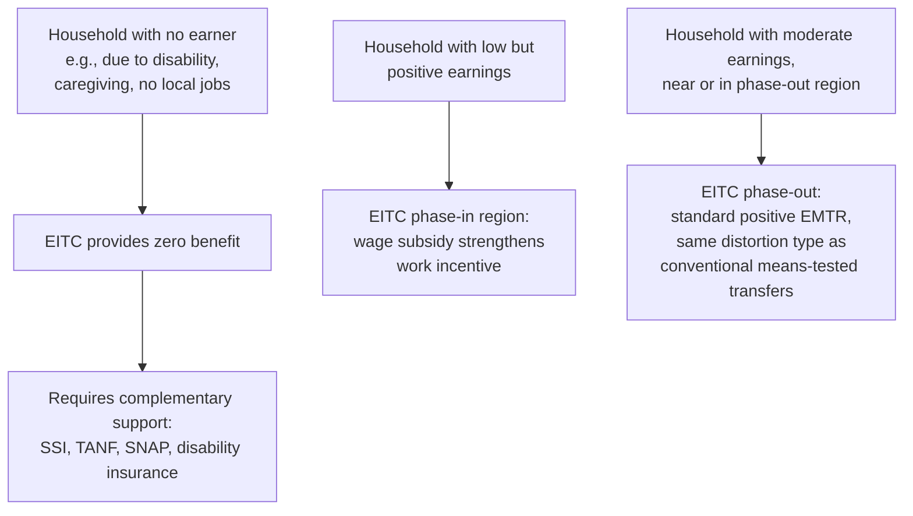

## Earned Income Tax Credit and Work-Conditional Transfers

### Conceptual Overview

Work-conditional transfers are cash or near-cash benefits whose eligibility or amount is explicitly contingent on labor market participation — most commonly, on having positive earned income — distinguishing them from the pure guarantee-based transfers (NIT, UBI, basic means-tested cash assistance) developed in the preceding entries. The Earned Income Tax Credit (EITC) is the paradigmatic and most extensively studied instrument of this type, and this entry builds directly on the extensive-margin/phase-in discussion introduced in the "Means-Tested Cash Transfers" entry, developing the EITC's full theoretical structure, empirical literature, and comparative international analogues in depth as the chapter's dedicated treatment of work-conditional design.

**Key Points**

- Work-conditional transfers invert the standard means-tested transfer's relationship between income and benefit at the lowest income levels: rather than benefits declining monotonically from a maximum at zero income, work-conditional transfers are typically **zero or minimal at zero earned income and rise with initial earnings**, directly targeting the extensive-margin labor-supply-elasticity considerations discussed in the Saez (2002) framework.
- This design directly addresses a criticism of pure guarantee-based transfers (NIT/UBI/basic welfare): that providing meaningful income support unconditionally at zero earnings may weaken work incentives at exactly the margin (entering employment) where extensive-margin elasticities appear empirically largest for low-income populations.
- The trade-off is not eliminated but relocated: work-conditional design improves extensive-margin incentives but does not by itself address income needs of those unable to work at all (the severely disabled, individuals in very tight local labor markets, caregivers without childcare access), a structural limitation requiring complementary programs.

---

### Formal Structure: The Three-Region EITC Schedule

As introduced in the prior entry, the EITC schedule divides into three regions as a function of earned income $y$:

$$\text{Credit}(y) = \begin{cases}

\rho \cdot y & 0 \leq y < y_1 \quad \text{(phase-in)} \

C_{max} & y_1 \leq y < y_2 \quad \text{(plateau)} \

\max(0, ; C_{max} - \tau \cdot (y - y_2)) & y \geq y_2 \quad \text{(phase-out)}

\end{cases}$$

where $\rho$ is the phase-in (subsidy) rate, $C_{max} = \rho \cdot y_1$ is the maximum credit, and $\tau$ is the phase-out rate.

**Effective marginal tax rate (EMTR) by region:**

| Region | EMTR from the credit alone | Economic interpretation |
| --- | --- | --- |
| Phase-in ($0 \leq y < y_1$) | $-\rho$ (negative) | A **wage subsidy**: each additional dollar earned yields more than a dollar of net income, directly incentivizing labor force entry |
| Plateau ($y_1 \leq y < y_2$) | $0$ | Neutral: credit neither rises nor falls with additional earnings in this band |
| Phase-out ($y \geq y_2$) | $+\tau$ (positive) | Standard benefit-withdrawal distortion, structurally identical to the phase-out region analyzed in the "Means-Tested Cash Transfers" entry |

**Diagram: EITC credit schedule and implied effective marginal tax rate**

<svg xmlns="http://www.w3.org/2000/svg" viewBox="0 0 640 440" font-family="Helvetica, Arial, sans-serif">
<text x="320" y="22" text-anchor="middle" font-size="15" font-weight="bold">EITC Schedule: Credit and Effective Marginal Tax Rate (svg_diagram)</text>

<line x1="80" y1="180" x2="600" y2="180" stroke="black" stroke-width="1.5" />
<line x1="80" y1="180" x2="80" y2="50" stroke="black" stroke-width="1.5" />
<text x="55" y="45" font-size="11">Credit ($)</text>
<line x1="80" y1="180" x2="220" y2="80" stroke="#2b6cb0" stroke-width="2.5" />
<line x1="220" y1="80" x2="360" y2="80" stroke="#2b6cb0" stroke-width="2.5" />
<line x1="360" y1="80" x2="560" y2="175" stroke="#2b6cb0" stroke-width="2.5" />
<text x="110" y="100" font-size="10" fill="#2b6cb0">Phase-in</text>
<text x="255" y="70" font-size="10" fill="#2b6cb0">Plateau</text>
<text x="420" y="140" font-size="10" fill="#2b6cb0">Phase-out</text>

<line x1="80" y1="410" x2="600" y2="410" stroke="black" stroke-width="1.5" />
<line x1="80" y1="300" x2="600" y2="300" stroke="#888" stroke-width="1" />
<line x1="80" y1="410" x2="80" y2="220" stroke="black" stroke-width="1.5" />
<text x="600" y="432" font-size="12" text-anchor="end">Earned Income (y)</text>
<text x="45" y="225" font-size="11">EMTR</text>
<text x="60" y="305" font-size="10">0</text>
<line x1="80" y1="350" x2="220" y2="350" stroke="#e53e3e" stroke-width="2.5" />
<text x="105" y="370" font-size="10" fill="#e53e3e">Negative (subsidy)</text>
<line x1="220" y1="300" x2="360" y2="300" stroke="#38a169" stroke-width="2.5" />
<text x="255" y="290" font-size="10" fill="#38a169">Zero</text>
<line x1="360" y1="250" x2="560" y2="250" stroke="#d69e2e" stroke-width="2.5" />
<text x="420" y="240" font-size="10" fill="#d69e2e">Positive</text>
<line x1="220" y1="410" x2="220" y2="220" stroke="#ccc" stroke-width="1" stroke-dasharray="2,2" />
<line x1="360" y1="410" x2="360" y2="220" stroke="#ccc" stroke-width="1" stroke-dasharray="2,2" />
</svg>

---

### Theoretical Foundation: Extensive-Margin-Focused Optimal Transfer Design

The EITC's design is closely connected to the extensive-margin optimal-transfer theory developed by Saez (2002), which departs from the traditional Mirrlees (1971) intensive-margin-focused optimal tax framework by explicitly modeling the discrete work/no-work decision as the empirically dominant margin for low-income populations.

**Key theoretical insight:** If the extensive-margin elasticity (responsiveness of the work/no-work decision to the net financial return from working) is large relative to the intensive-margin elasticity (responsiveness of hours/effort conditional on working) at low income levels, then optimal transfer design should feature a **negative implicit tax rate specifically at the bottom of the earnings distribution** (i.e., a wage subsidy region), even though this appears to contradict the intuition — carried over from the simpler NIT/means-tested framework — that transfers to the poorest should feature the *highest* social marginal welfare weight and therefore, naively, the most generous unconditional support. The resolution is that a pure guarantee at $y=0$ (maximal generosity for non-workers) can be extensive-margin-inefficient if it fails to differentially reward the transition into work relative to remaining at zero earnings, whereas the EITC's phase-in structure explicitly channels support toward low-*earning* rather than zero-earning households, altering the extensive-margin incentive at exactly the point where — per the elasticity assumption — behavioral response is largest.

$$\text{Saez (2002) key result: optimal transfer at bottom of distribution features EITC-like negative EMTR when extensive-margin elasticity} \gg \text{intensive-margin elasticity}$$

**Important caveat on distributional coverage**: this extensive-margin-efficient design necessarily provides **less support to those with zero earnings** than a pure NIT/guarantee structure of comparable overall cost, which is the structural trade-off underlying the "complementary program" point noted in Key Points above — a household with no earners at all (due to disability, caregiving responsibilities, or complete absence of local job opportunities) receives no EITC benefit regardless of financial need, meaning EITC-style work-conditional transfers function as a complement to, rather than substitute for, safety-net programs targeting non-working populations (SSI, disability insurance, TANF).

---

### Empirical Literature: Labor Supply Effects

#### Extensive-Margin Participation Effects

The empirical literature on EITC expansions — particularly studies exploiting the substantial 1990s federal EITC expansions (Eissa and Liebman 1996 being a foundational early study using the 1986 and subsequent expansions; extensive follow-on work by Meyer and Rosenbaum, and others using state-level EITC variation as additional identifying variation) — has documented **a well-established increase in labor force participation among single mothers** following EITC expansions, with this population studied intensively both because it was the primary intended beneficiary group and because single mothers' labor supply decisions are less confounded by joint household labor-supply decisions relative to married-couple households (discussed further below).

#### Intensive-Margin and Married-Couple Complications

Evidence on intensive-margin effects (hours conditional on working) is more mixed, and a particularly important complication arises for **married couples**, where EITC eligibility is based on joint household income: a **secondary earner's** (often the wife's) additional earnings can push the household from the plateau into the phase-out region, or even push a household earning near the top of the schedule out of eligibility altogether, creating a work *disincentive* for secondary earners even while the credit creates a work *incentive* at the primary-earner/household level for entry from zero earnings. This documented asymmetry — the EITC's incentive effects differ substantially by earner role within the household — is a well-established finding in the literature (e.g., Eissa and Hoynes' work specifically on married couples) and is a leading example of how a policy's aggregate labor-supply prediction can mask offsetting effects across subpopulations within the eligible group.

**Illustrative summary of documented directional effects by subgroup [general pattern, magnitudes vary by study]:**

| Subgroup | Primary Margin Affected | General Direction of Effect |
| --- | --- | --- |
| Single mothers | Extensive (work/no-work) | Positive — increased labor force participation |
| Married primary earners | Extensive/intensive | Generally modest positive or neutral |
| Married secondary earners | Intensive/extensive, in phase-out range | Some evidence of negative effect (reduced hours/participation) due to joint-income phase-out |
| Childless adults (pre-recent-expansion EITC, historically much smaller credit) | Extensive | Historically limited effect given very small credit amount for this group prior to later expansions |

#### Effects Beyond Labor Supply

A substantial and separate empirical literature has examined EITC effects on outcomes beyond labor supply narrowly defined, including documented associations with improved child health and educational outcomes (attributed to the income effect and to increased maternal employment/earnings), though [Inference: as with much of the broader income-transfer-and-child-outcomes literature, attributing precise causal magnitudes to the income channel specifically (versus correlated changes in parental time use, employment-related stress, or other unobserved factors) requires careful identification, and the literature includes a range of estimated effect sizes across studies using different identification strategies (e.g., regression kink/discontinuity designs around EITC schedule notches, difference-in-differences across state EITC supplement variation)].

---

### Comparative International Work-Conditional Transfer Programs

The EITC is the most extensively studied example, but several other advanced economies have implemented structurally similar work-conditional credits, providing comparative evidence:

- **United Kingdom**: The historical Working Tax Credit (subsequently substantially restructured within the Universal Credit system) similarly conditioned support on meeting minimum work-hours thresholds, with UK-specific research (e.g., studies by Blundell and collaborators) examining labor supply responses to its introduction and subsequent reforms — providing an important comparative data point given the UK's somewhat different threshold-based (minimum hours requirement) rather than pure phase-in-rate design relative to the U.S. EITC.
- **Canada**: The Working Income Tax Benefit (subsequently rebranded as the Canada Workers Benefit) similarly provides a phase-in/phase-out structure conditioned on employment income, generating comparative Canadian evidence on work-conditional transfer effects.
- [Note: given the pace of ongoing reform to these and related programs internationally, current search would be advisable for up-to-date program parameters and most recent evaluation findings if precise current-year comparative detail is required for a specific analytical purpose.]

---

### Interaction with the Broader Transfer System: EITC as a Complement, Not a Substitute

Building directly on the "Interaction between Disability Insurance and Other Social Programs" entry's framework, the EITC's structural limitation (zero benefit at zero earnings) means it functions most effectively as **one component of a layered transfer system** rather than a stand-alone poverty-alleviation instrument:

This layered-system perspective is the key synthesis point connecting this entry to the chapter's broader treatment: the EITC does not eliminate the fundamental guarantee-generosity/labor-supply-distortion trade-off identified throughout this chapter (means-tested transfers, NIT/UBI, in-kind transfers) — it *relocates* the trade-off to a different point in the income distribution (shifting the zero/negative EMTR region to low-but-positive earnings rather than to zero earnings), which is efficient specifically under the empirical condition that extensive-margin elasticity dominates at that income range, but does not by itself solve the income-adequacy problem for households unable to generate any earned income, a population that necessarily requires the guarantee-based and disability/categorical programs discussed in the earlier entries of this chapter.

---

### Comparative Summary: Work-Conditional versus Guarantee-Based Transfer Design

| Dimension | Work-Conditional (EITC-style) | Guarantee-Based (NIT/UBI/TANF-style) |
| --- | --- | --- |
| Benefit at zero earnings | Zero (or minimal) | Positive (the guarantee $B_0$) |
| EMTR at very low positive earnings | Negative (wage subsidy) | Zero to positive, depending on phase-out design |
| Best-suited elasticity assumption | Dominant extensive-margin elasticity | Elasticity structure less central to basic design logic (though still relevant to optimal $t$) |
| Coverage of non-working households | None (structural gap) | Full (by design) |
| Complementary program need | High (requires guarantee-based programs for non-workers) | Lower (self-contained for the population it targets) |
| Household joint-income complications | Documented secondary-earner disincentive in married-couple phase-out | Present but structurally identical to standard means-tested phase-out, no distinct "entry incentive" complication |

---

### Related Topics / Next Steps

- Means-Tested Cash Transfers (see prior item; phase-out mechanics shared with EITC phase-out region)
- Negative Income Tax and Universal Basic Income (see prior item; contrast with zero-earnings coverage gap)
- Saez (2002) Extensive-Margin Optimal Transfer Theory in Full Formal Detail
- Married-Couple Labor Supply and Joint EITC Eligibility (Eissa-Hoynes Literature)
- EITC and Child Outcomes: Identification Strategies and Effect-Size Literature
- Comparative Work-Conditional Credits: UK Working Tax Credit / Universal Credit and Canada Workers Benefit
- Regression Kink Design Methodology Applied to EITC Schedule Notches
- State-Level EITC Supplements: Variation as a Source of Identification
- Layered Transfer-System Design: Coordinating Work-Conditional and Guarantee-Based Programs
- Childless-Worker EITC Expansions: Recent Policy Changes and Evaluation Evidence