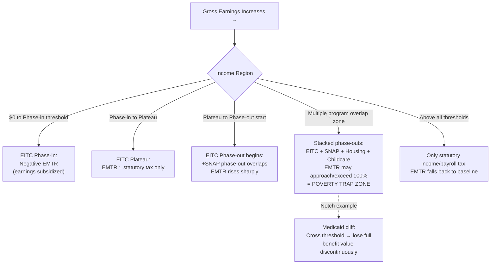

## Welfare Program Work Incentives and Poverty Traps

### Definition and Scope

Welfare program work incentives and poverty traps refer to the behavioral and structural effects that means-tested transfer programs create on recipients' labor supply decisions, arising specifically from how benefit levels are reduced (phased out) as earned income rises. A **poverty trap** describes a situation in which the combined effect of benefit withdrawal and taxation on additional earnings leaves a low-income individual with little or no net financial gain from working more hours or accepting higher-paying work—and in extreme cases, actually *worse off*—thereby creating a structural disincentive to increase labor supply or exit welfare dependency.

This topic sits at the intersection of optimal transfer program design, labor supply theory, and the equity-efficiency trade-off central to redistributive policy: any means-tested program that conditions benefits on income necessarily creates *some* implicit tax on earnings, and the central design question is how to structure that implicit tax to balance targeting efficiency (getting benefits to those who need them) against work-incentive costs (discouraging labor supply among recipients).

### Key Points

- **The marginal tax rate mechanism**: Poverty traps arise from the **effective marginal tax rate (EMTR)**—the combined effect of formal income taxes, payroll taxes, and benefit withdrawal (phase-out) rates—which can approach or exceed 100% for low-income workers facing multiple overlapping programs.
- **Benefit cliffs vs. gradual phase-outs**: A "cliff" is a discontinuous, large loss of benefits triggered by crossing an eligibility threshold (e.g., losing all childcare subsidy eligibility at a specific income level), producing acute local disincentives; a "gradual phase-out" (tapering) spreads the same total benefit reduction over a wider income range, reducing peak EMTRs but extending the affected income range.
- **Stacking/cumulative effect across programs**: Because many welfare programs (SNAP, housing assistance, Medicaid/TANF, EITC phase-out, childcare subsidies) operate independently with separate phase-out schedules, a household can face **multiple simultaneous phase-outs** at the same income level, stacking EMTRs far higher than any single program's design would suggest.
- **The labor supply elasticity is central to the empirical stakes**: The real-world magnitude of the poverty trap problem (how much behavioral response actually occurs) depends on the extensive margin (whether to work at all) and intensive margin (how many hours to work) labor supply elasticities of the affected population, which vary substantially across demographic groups (evidence suggests single mothers show relatively higher extensive-margin elasticities than prime-age men, for instance).
- **The Earned Income Tax Credit (EITC) as a counter-example**: The EITC is a canonical policy response designed explicitly to avoid poverty-trap dynamics in its phase-in region by *subsidizing* (not taxing) earnings up to a point, though it still generates a positive EMTR in its phase-out region.
- **NIT and UBI as alternative architectures**: Negative Income Tax (NIT) and Universal Basic Income (UBI) proposals are motivated substantially by a desire to smooth or eliminate the high EMTRs generated by categorical, notch-heavy welfare systems, at the cost of higher program expense (since benefits are not as tightly targeted).

### Theoretical Framework: Effective Marginal Tax Rates

**Basic EMTR Formula**

For an individual receiving multiple transfers, each phased out at its own rate, the effective marginal tax rate on an additional dollar earned is:

$$EMTR = t_{income} + t_{payroll} + \sum_{i} \phi_i$$

where $t_{income}$ is the statutory income tax rate, $t_{payroll}$ is the payroll/social insurance tax rate, and $\phi_i$ is the phase-out (benefit reduction) rate of the $i$-th transfer program at that income level. Take-home net income after an additional dollar earned is:

$$\Delta(\text{Net Resources}) = \$1 \times (1 - EMTR)$$

When $EMTR \geq 1$ (100%), an additional dollar earned produces zero or negative net gain in disposable resources—the definitional core of a poverty trap.

**Illustrative Stacking Example**

Consider a single parent simultaneously subject to (illustrative rates, not universal constants):

- Federal/state income tax: 10%
- Payroll tax (employee share): 7.65%
- SNAP (food assistance) benefit reduction rate: ~24% (30% of net income after standard deductions, approximated)
- Housing assistance phase-out: ~30%
- Childcare subsidy phase-out: ~10% (varies enormously by jurisdiction and program design)

$$EMTR \approx 10\% + 7.65\% + 24\% + 30\% + 10\% = 81.65\%$$

At this stacked EMTR, each additional $100 earned yields only about $18.35 in net additional disposable resources—a level of implicit taxation that would be considered politically unacceptable if imposed as an explicit statutory tax rate on any income group, yet arises as an unintended consequence of independently designed, uncoordinated program phase-out schedules. [Inference: exact stacked rates vary enormously by jurisdiction, household composition, and the specific combination of programs a household is enrolled in; the illustrative figure above demonstrates the mechanism, not a universal empirical constant.]

**Notches vs. Kinks**

Formally, program design creates two distinct discontinuity types in the budget constraint:

- A **kink** is a discontinuity in the *slope* of the budget line (marginal tax rate changes) but not its level—net resources are continuous, but the EMTR jumps at the kink point (e.g., where SNAP phase-out begins).
- A **notch** is a discontinuity in the *level* of net resources itself—crossing the threshold causes an abrupt loss of total resources (e.g., losing Medicaid eligibility entirely at a fixed income cutoff, resulting in a large lump-sum loss of benefit value for a marginal dollar of additional earnings). Notches generate substantially stronger behavioral responses (in principle, an infinite implicit marginal tax rate at the exact notch point) and are generally considered worse-designed than kinks from a work-incentive standpoint, motivating policy shifts toward tapered "phase-out" designs.

### Diagram: Budget Constraint with Stacked Benefit Phase-Outs (svg_diagram)

### Efficiency-Equity Trade-off in Phase-Out Design

**The Fundamental Tension**

Optimal transfer design (following the Mirrlees, 1971, optimal income tax tradition applied to transfer programs) faces an inescapable trade-off:

$$\text{Steeper phase-out} \Rightarrow \text{Better targeting (lower cost for given generosity)} \Rightarrow \text{Higher EMTR} \Rightarrow \text{Larger work disincentive}$$

$$\text{Gradual phase-out} \Rightarrow \text{Benefits extend further up income scale} \Rightarrow \text{Lower EMTR} \Rightarrow \text{Higher program cost for given generosity to the poorest}$$

This is structurally identical to the classic optimal income taxation trade-off (Mirrlees) applied specifically to the transfer (negative tax) side of the schedule: the government cannot simultaneously achieve (a) generous benefits for the poorest, (b) low implicit tax rates on work effort, and (c) low fiscal cost, and must choose which two to prioritize at the expense of the third.

**Behavioral Evidence on Labor Supply Responses**

- **Extensive margin responses** (the decision to work at all) tend to be more empirically significant than intensive margin responses (hours conditional on working) for low-income populations, particularly for single parents—implying that policies affecting the *participation* incentive (such as work requirements or the EITC's phase-in subsidy) may have larger real-world behavioral effects than policies focused solely on marginal phase-out rates for those already working.
- **EITC empirical literature**: Extensive quasi-experimental research (exploiting state and federal EITC expansions, notably the 1990s expansions) has found employment increases among single mothers attributable to the EITC's phase-in subsidy, consistent with the theoretical prediction that a negative EMTR in the phase-in region increases labor force participation. Evidence on hours worked (intensive margin) in the phase-out region, where the EITC imposes a *positive* EMTR, is more mixed and generally shows smaller effects than the extensive-margin participation response. [Unverified: precise elasticity estimates vary across studies, time periods, and demographic subgroups, and should be sourced from current empirical literature for any application requiring specific numbers.]
- **Salience and information frictions**: A recurring finding in behavioral public finance is that recipients often do not perceive or respond to complex, stacked marginal tax rates with full accuracy—EMTRs derived from formal program rules may overstate actual behavioral responses if recipients are not fully aware of how phase-outs interact, though salient, easily-understood program features (like the size of the EITC refund check) can generate outsized behavioral responses even when the underlying marginal incentive is small.

### Policy Responses to Poverty Traps

**1. Wage Subsidies / Earnings Subsidies (EITC-style)**

Rather than taxing earnings, wage subsidy programs *supplement* low earnings, creating a negative EMTR over the phase-in range. This directly counters the poverty-trap problem in the region where it is applied but necessarily requires a phase-out region elsewhere in the schedule (to contain fiscal cost), simply relocating rather than eliminating the high-EMTR zone.

**2. Time Limits and Work Requirements**

Programs like the US TANF (post-1996 welfare reform) impose lifetime benefit limits and work requirements as an alternative mechanism to encourage labor force attachment, substituting an explicit behavioral mandate for reliance purely on financial incentives. This approach shifts the policy tool from price incentives (EMTR) to quantity constraints (mandated work hours, time limits), with efficiency and equity trade-offs of its own (e.g., risk of leaving vulnerable populations without support if they cannot meet work requirements due to health, caregiving, or labor market barriers).

**3. Program Consolidation and Harmonized Phase-Outs**

Because much of the poverty trap problem arises from **uncoordinated stacking** of independently designed phase-out schedules across separate programs, one class of policy response is administrative/legislative coordination—aligning phase-out ranges across programs, using a single combined income test, or converting in-kind benefits with cliffs (e.g., Medicaid) into smoother subsidized alternatives (e.g., income-scaled premium subsidies as under ACA marketplace design) to reduce cliff effects.

**4. Universal Basic Income (UBI) and Negative Income Tax (NIT)**

A **Negative Income Tax**, proposed by Milton Friedman (1962), replaces categorical means-tested programs with a single formula:

$$\text{Net Transfer} = G - \phi \times (\text{Earnings})$$

where $G$ is the guaranteed minimum benefit (received at zero earnings) and $\phi$ is a single, moderate phase-out rate applied uniformly. A **Universal Basic Income** takes this further by providing $G$ to *all* individuals regardless of income, with the "phase-out" occurring implicitly through the ordinary progressive income tax system rather than a program-specific benefit reduction rate. Both designs are explicitly motivated by eliminating the *stacking* problem (since there is only one phase-out schedule instead of many) at the cost of either: (a) a higher required tax rate on the broader population to finance a universal benefit at adequate levels, or (b) reduced targeting efficiency relative to categorical means-tested programs (a NIT and UBI both spend some resources on individuals higher up the income distribution who would not have qualified for the original targeted programs). [Inference: whether NIT/UBI designs are fiscally and politically superior overall to reformed categorical systems remains a live and unresolved policy debate, not a settled result.]

### Example

Consider a single parent with two children evaluating whether to accept a promotion increasing annual earnings from $22,000 to $30,000 (a $8,000 gross increase).

**Without accounting for phase-outs**: The family appears $8,000 (before taxes) better off.

**Accounting for stacked phase-outs** (illustrative, jurisdiction-dependent figures):

- Federal/state income and payroll taxes on the additional $8,000: approximately $1,200 (15% combined effective rate in this range, illustrative)
- SNAP benefit reduction: approximately $1,920 (24% of the increase)
- Loss of childcare subsidy eligibility (a notch, assumed triggered within this range): approximately $3,000 lump-sum loss
- Reduced housing assistance: approximately $1,600 (20% of the increase)

**Net calculation**:

$$8{,}000 - 1{,}200 - 1{,}920 - 3{,}000 - 1{,}600 = 280$$

The family retains only $280 of the $8,000 gross increase—an effective marginal tax rate of approximately 96.5%—illustrating why some low-income workers rationally decline promotions, additional hours, or job changes that appear financially advantageous on a gross-earnings basis but yield negligible or negative net gains once cumulative benefit withdrawal is accounted for. This example is illustrative of the *mechanism*; exact dollar figures depend heavily on state-specific program parameters, household composition, and the specific set of programs a family is enrolled in.

### Measurement and Analytical Tools

- **EMTR/EITC calculators and microsimulation models**: Analysts typically compute stacked EMTRs using detailed tax-benefit microsimulation models (e.g., the Urban Institute's TRIM3 model in the US, or EUROMOD in the EU context) that incorporate the full rule set of overlapping programs, since back-of-envelope calculations (as in the illustrative example above) cannot capture jurisdiction-specific interactions, phase-in ranges, and eligibility notches precisely.
- **"Cliff effect" mapping**: Some state and local policy analyses explicitly map out EMTR/net-resource curves across the full income range for representative family types, visually identifying "cliff" zones where net resources fall or stagnate despite rising gross earnings—a standard diagnostic tool in welfare program redesign efforts.
- **International comparison**: The magnitude and structure of poverty traps varies considerably across welfare states—residual/liberal welfare regimes (heavy reliance on means-tested programs, per Esping-Andersen's typology) tend to generate sharper stacked EMTRs than universal benefit systems (Nordic-style), where benefits are less tightly means-tested and financed instead through broader-based taxation, illustrating a structural link between welfare regime type and poverty-trap severity.

**Related Topics:**

- The Earned Income Tax Credit: Design, Phase-In/Phase-Out Structure, and Evidence
- Negative Income Tax and Universal Basic Income Proposals
- Mirrlees Optimal Income Taxation and the Transfer-Program Analog
- Labor Supply Elasticities: Extensive vs. Intensive Margin
- TANF and US Welfare Reform (1996 PRWORA)
- Notches vs. Kinks in Tax and Benefit Schedule Design
- Categorical vs. Means-Tested Targeting of Transfers
- Microsimulation Modeling of Tax-Benefit Systems