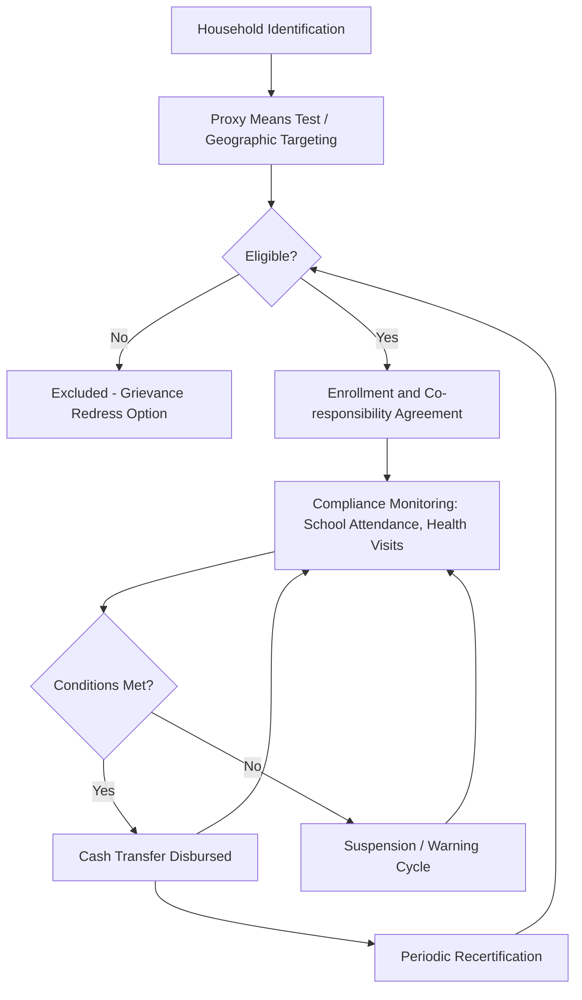

## Conditional Cash Transfer Programs

### Definition and Core Concept

Conditional Cash Transfer (CCT) programs are social welfare instruments that provide direct monetary payments to poor households, contingent on the fulfillment of specific, verifiable human-capital-building behaviors. Unlike unconditional cash transfers (UCTs), which impose no behavioral requirements, CCTs link disbursement to co-responsibilities typically involving:

- School enrollment and minimum attendance rates for children
- Regular health check-ups, vaccinations, and prenatal/postnatal care
- Nutritional monitoring for young children
- Participation in health/nutrition education sessions

The theoretical foundation rests on two simultaneous objectives: **short-term poverty alleviation** (via the income transfer itself) and **long-term poverty reduction** (via human capital accumulation that raises future earning potential). This dual-objective design distinguishes CCTs from pure safety-net transfers.

### Theoretical Rationale

**Market Failures and Underinvestment in Human Capital**

CCTs are grounded in the economic argument that poor households underinvest in children's education and health relative to the socially optimal level, due to several frictions:

1. **Credit constraints**: Households cannot borrow against a child's future earnings to finance current schooling costs, since human capital cannot serve as collateral.
2. **Externalities**: Investment in a child's education/health generates positive externalities (reduced disease transmission, higher aggregate productivity, lower crime) not captured by the private decision-maker.
3. **Information failures**: Parents may underestimate the returns to schooling or health investments.
4. **Intra-household bargaining and principal-agent problems**: The decision-maker (often a parent) may not fully internalize the child's welfare, creating a wedge between private and socially efficient investment.

**Conditionality as a Paternalistic Correction**

The conditional design is essentially a form of *soft paternalism*: rather than trusting the unconditional income effect alone to generate behavior change, the state imposes a price change (in effect, a subsidy conditional on the behavior) to correct the underinvestment. Formally, this can be modeled as a household utility maximization problem:

$$\max_{c, e} U(c, e) \quad \text{s.t.} \quad c + p_e e = y + T \cdot \mathbb{1}[e \geq \bar{e}]$$

where $c$ is consumption, $e$ is the human-capital-investment behavior (e.g., school attendance), $p_e$ is its effective cost, $y$ is baseline income, $T$ is the transfer amount, and $\bar{e}$ is the compliance threshold. The conditionality effectively creates a discontinuous budget constraint (a "notch"), incentivizing households at the margin to cross the threshold $\bar{e}$.

### Income and Substitution Effects Decomposition

A CCT combines an **income effect** (household is richer, may consume more of all normal goods, including "child leisure" i.e., less schooling if schooling is disliked) with a **price/substitution effect** (conditionality lowers the effective cost of the required behavior, encouraging more of it). This is the core theoretical distinction from a UCT:

- **UCT**: Pure income effect. If child schooling is a normal good, transfers increase schooling somewhat, but the effect is generally weaker and more diffuse.
- **CCT**: Income effect + substitution effect operating in the same direction (assuming the household values consumption more than the child's foregone labor income), producing a larger and more targeted behavioral response on the conditioned margin.

**[Inference]** The relative magnitude of income vs. substitution effects is empirically debated; some studies find UCTs achieve comparable schooling gains at lower administrative cost, suggesting the substitution effect from conditionality may be smaller than originally theorized in certain contexts.

### Design Parameters

**Key Points**

- **Targeting mechanism**: Geographic targeting (poor municipalities/regions) combined with household-level proxy means testing (PMT) using observable correlates of poverty (housing materials, asset ownership, household composition) rather than direct income verification, which is unreliable in informal economies.
- **Transfer size**: Typically calibrated to a percentage of the poverty gap or as a flat/tiered amount per child, often with caps to avoid perverse fertility incentives (e.g., Mexico's Prospera capped payments per household regardless of additional children).
- **Conditionality monitoring**: Requires administrative infrastructure to verify school attendance and health visits — a significant implementation cost and a common source of program failure in low-capacity states.
- **Gender targeting of payments**: Many CCTs disburse to the mother/female household head, based on evidence that resources controlled by women are more likely allocated to child welfare (intra-household bargaining literature).
- **Exit strategy/graduation**: Time-limited enrollment or benefit tapering to avoid permanent dependency and manage fiscal sustainability.

### Canonical Program Examples

**Example**

- **Progresa/Oportunidades/Prospera (Mexico, est. 1997)**: The prototype CCT, later expanded and rebranded twice before being discontinued in 2019. Conditioned transfers on school attendance (grades 3–12) and clinic visits; grants increased with grade level and were higher for girls in secondary school to counteract gender dropout gaps.
- **Bolsa Família (Brazil, est. 2003)**: Merged several prior transfer programs; conditioned on 85% school attendance for children 6–15 and vaccination/growth monitoring for children under 7. Became one of the largest CCTs globally by coverage, later folded into Auxílio Brasil and then restored as Bolsa Família in 2023.
- **Pantawid Pamilyang Pilipino Program (4Ps, Philippines, est. 2008)**: Administered by the Department of Social Welfare and Development (DSWD); conditions include 85% school attendance, health check-ups, and attendance at Family Development Sessions (FDS). Directly relevant given the Philippine LGU administrative context, as local government units assist in beneficiary validation, grievance redress, and convergence with local health/education services.
- **Familias en Acción (Colombia)**, **Red de Protección Social (Nicaragua)**, and **Child Support Grant (South Africa, effectively a hybrid)** represent variations across targeting stringency and conditionality enforcement.

### Empirical Evidence on Effectiveness

**Education outcomes**: A broad empirical consensus (drawing on randomized and quasi-experimental evaluations of Progresa/Oportunidades and Bolsa Família) finds CCTs consistently increase school enrollment and attendance rates, with the largest effects at the secondary-school transition, where dropout risk is highest absent the transfer.

**Health and nutrition outcomes**: Evidence shows improvements in preventive care utilization (check-up rates, vaccination coverage) but more mixed results on final health outcomes like child height-for-age (stunting), suggesting behavioral compliance does not automatically translate into biological outcomes without complementary service quality.

**Learning outcomes**: **[Inference]** The evidence that increased attendance translates into improved test scores/learning outcomes is notably weaker and more contested than the enrollment effect, implying CCTs address the demand side of schooling but not necessarily the supply-side quality constraints.

**Long-run/intergenerational effects**: Some longitudinal follow-ups of Progresa cohorts find persistent gains in educational attainment and, for some cohorts, labor market outcomes into adulthood, though effect sizes attenuate and are sensitive to the follow-up methodology used. **[Unverified]** Cross-country generalizability of these long-run estimates remains an open empirical question given differing labor markets and program designs.

### Conditional vs. Unconditional Cash Transfers: Comparative Framework

| Dimension | CCT | UCT |
| --- | --- | --- |
| Behavioral targeting | Direct (via conditionality) | Indirect (via income effect only) |
| Administrative cost | Higher (monitoring/verification) | Lower |
| Paternalism | Explicit | Minimal |
| Exclusion risk | Higher (non-compliant households lose benefits) | Lower |
| Political economy appeal | Often higher (perceived as "earned") | Sometimes lower (perceived as "handout") |
| Effectiveness on non-targeted margins | Limited | Potentially broader (household chooses allocation) |

**[Inference]** The choice between CCT and UCT design is not purely technical; it often reflects political economy considerations about public acceptability of transfers to the poor, since conditionality can increase taxpayer support even where efficiency gains over UCTs are empirically modest.

### Critiques and Limitations

- **Regressivity of compliance costs**: Conditions impose implicit costs (transportation to clinics/schools, foregone child labor income) that may be highest for the poorest and most remote households, potentially causing exclusion of the most vulnerable — the "targeting-conditionality tension."
- **Supply-side bottlenecks**: Conditioning on school/clinic attendance is ineffective if local schools and health facilities are of low quality or non-existent, a particularly salient issue in decentralized/LGU-administered contexts where local service capacity varies.
- **Labor supply effects**: Some evidence suggests CCTs may reduce adult labor supply, especially of female recipients, though estimated elasticities are generally small and vary by country. **[Inference]** This is a live debate; disincentive effects are typically found to be modest relative to poverty-reduction gains, but design (e.g., income thresholds, benefit tapering) affects the magnitude.
- **Fiscal sustainability**: Requires stable, often donor-independent, financing given multi-decade program horizons; premature termination interrupts investments already underway in beneficiary children.
- **Measurement error in targeting**: Proxy means testing produces both inclusion errors (non-poor beneficiaries) and exclusion errors (poor households missed), a persistent second-best problem in most large-scale CCTs.

### Fiscal and Public Economics Framing

From a public finance perspective, CCTs can be analyzed through the **optimal transfer design** lens (Mirrlees-style), balancing:

$$W = \int_0^\infty u(c_i) \, dF(i) - \lambda \cdot \text{(deadweight loss from taxation and behavioral distortion)}$$

where the conditionality mechanism is itself a tagging/screening device — using observable proxies (school attendance) to indirectly target unobservable characteristics (chronic poverty, intergenerational risk) more efficiently than an untargeted transfer, at the cost of introducing new margins of behavioral distortion and administrative deadweight loss.

**[Inference]** Some public economists frame CCTs as a form of *in-kind transfer with a twist* — rather than providing the service directly (in-kind), the state subsidizes the *use* of an existing service, which can be more cost-effective where private provision or decentralized public provision already exists, but is vulnerable to quality variance across jurisdictions.

### Process Flow Diagram

### Illustrative Diagram: Budget Constraint Shift Under Conditionality (svg_diagram)

<svg xmlns="http://www.w3.org/2000/svg" viewBox="0 0 520 380">
<text x="260" y="24" font-size="15" text-anchor="middle" font-family="sans-serif" font-weight="bold">Budget Constraint Shift Under CCT (svg_diagram)</text>
<line x1="60" y1="330" x2="480" y2="330" stroke="black" stroke-width="1.5" />
<line x1="60" y1="330" x2="60" y2="40" stroke="black" stroke-width="1.5" />
<text x="470" y="350" font-size="12" font-family="sans-serif">School attendance (e)</text>
<text x="20" y="45" font-size="12" font-family="sans-serif">Consumption (c)</text>
<line x1="60" y1="90" x2="400" y2="330" stroke="#555" stroke-width="2" />
<text x="405" y="330" font-size="11" font-family="sans-serif" fill="#555">Original BC</text>
<line x1="60" y1="60" x2="260" y2="60" stroke="#1a6" stroke-width="2" />
<line x1="260" y1="60" x2="260" y2="200" stroke="#1a6" stroke-width="2" stroke-dasharray="4,3" />
<line x1="260" y1="200" x2="440" y2="330" stroke="#1a6" stroke-width="2" />
<text x="270" y="55" font-size="11" font-family="sans-serif" fill="#1a6">CCT-shifted BC (notch at threshold)</text>
<line x1="260" y1="330" x2="260" y2="336" stroke="black" />
<text x="250" y="352" font-size="11" font-family="sans-serif">ē (compliance threshold)</text>
<circle cx="260" cy="200" r="4" fill="#c33" />
<text x="270" y="200" font-size="11" font-family="sans-serif" fill="#c33">Discontinuous jump = T</text>
</svg>

### Related Topics

- Proxy means testing and targeting error (inclusion/exclusion trade-offs)
- Unconditional cash transfers and universal basic income comparisons
- Human capital theory and returns to schooling (Mincer framework)
- Intra-household bargaining models and gendered transfer targeting
- Fiscal federalism and the role of local government units in welfare program delivery
- Randomized controlled trials in development economics methodology
- Graduation models and exit strategies from social protection programs
- In-kind transfers versus cash transfers: efficiency and paternalism debates