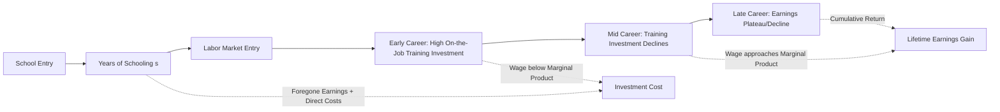

## Human Capital Theory

### Definition and Core Concept

Human capital theory treats education, training, health, and other investments in people as forms of capital accumulation, analogous to physical capital investment, that raise an individual's productive capacity and future earnings. The theory, formalized primarily by Theodore Schultz, Gary Becker, and Jacob Mincer in the 1950s–1960s, models schooling and training decisions as rational investment choices: individuals (or their households) forgo current income and incur direct costs to acquire skills, in exchange for a stream of higher future earnings.

The foundational move was reconceptualizing labor not as a homogeneous, fixed factor of production but as **heterogeneous and augmentable** — workers embody varying stocks of skill, knowledge, and health that can be increased through deliberate investment, just as firms invest in machinery.

### Theoretical Foundations

**The Investment Framework**

An individual choosing to invest in education faces a decision analogous to any capital investment: compare the present discounted value of costs against the present discounted value of returns.

$$PV(\text{benefits}) = \sum_{t=s+1}^{T} \frac{E_t^{(s+1)} - E_t^{(s)}}{(1+r)^t}$$

where $E_t^{(s)}$ is earnings at time $t$ given $s$ years of schooling, $r$ is the discount rate, and $T$ is the time horizon (e.g., retirement). The individual continues investing in schooling until the marginal rate of return equals the discount rate (opportunity cost of funds/time).

**Costs of Human Capital Investment**

1. **Direct costs**: tuition, fees, books, materials
2. **Opportunity costs (foregone earnings)**: income not earned while studying rather than working — typically the *larger* component of total cost, especially at higher education levels
3. **Psychic costs**: effort, stress, disutility of studying (harder to quantify, often omitted from empirical models)

**Types of Human Capital (Becker's Taxonomy)**

- **General human capital**: Skills useful across many employers/firms (e.g., literacy, general problem-solving). Under perfect competition, firms will not pay for general training since a trained worker could be poached by competitors at the same wage; theory predicts workers themselves bear the cost of general training (via lower wages during training) and capture the returns afterward.
- **Specific human capital**: Skills valuable only to the current employer (e.g., firm-specific processes). Because specific human capital creates no outside-market value, theory predicts costs and returns are shared between firm and worker, since neither wants to lose the relationship-specific investment — this also explains lower turnover and implicit long-term contracts for workers with high firm-specific capital.

### The Mincer Earnings Function

The dominant empirical workhorse for testing human capital theory, developed by Jacob Mincer:

$$\ln(w_i) = \beta_0 + \beta_1 S_i + \beta_2 X_i + \beta_3 X_i^2 + \varepsilon_i$$

where:

- $\ln(w_i)$ = log of earnings for individual $i$
- $S_i$ = years of schooling
- $X_i$ = years of potential labor market experience (often proxied as $\text{Age} - S - 6$)
- $X_i^2$ = experience squared, capturing the concave (diminishing-returns) shape of the age-earnings profile
- $\beta_1$ = interpreted as the **private rate of return to one additional year of schooling**

**Key Points**

- The log-linear specification is not arbitrary: it follows directly from the human capital investment model under specific assumptions (constant proportional returns per year of schooling, and earnings as a geometric rather than arithmetic function of foregone-earnings-financed investment).
- $\beta_2 > 0, \beta_3 < 0$ generates the familiar concave, hump-shaped age-earnings profile: earnings rise with experience but at a decreasing rate, consistent with on-the-job training investment being front-loaded early in a career (more time horizon remaining to recoup returns).
- Empirically, estimated returns to schooling ($\beta_1$) typically fall in the range of 5–15% per year across countries and time periods, though this varies substantially by country income level, gender, and estimation method. **[Inference]** Returns tend to be higher in lower-income countries, consistent with diminishing marginal returns to human capital as aggregate schooling levels rise, though the relationship is not perfectly monotonic across all country studies.

### The Human Capital Earnings Function Derivation

Consider a simplified two-period model where an individual chooses schooling years $s$ to maximize the present value of lifetime earnings net of costs. Under the assumption that each additional year of schooling raises earnings by a constant proportional rate $r$ (the internal rate of return), integrating the no-arbitrage condition across schooling levels yields:

$$w(s) = w(0) \cdot e^{rs}$$

Taking logs: $\ln w(s) = \ln w(0) + rs$, which directly produces the linear-in-schooling term in the Mincer equation, with $r = \beta_1$ interpretable as the internal rate of return to schooling under the compensating-differential assumption that all schooling levels must yield equal lifetime present value in equilibrium (otherwise everyone would choose the higher-return level).

### Signaling and Screening: The Competing Hypothesis

**[Inference — contested theoretical alternative, not a settled empirical matter]** Michael Spence's signaling model challenges the causal human-capital interpretation of the schooling-earnings correlation. In the signaling framework, education does not raise productivity at all; rather, it serves as a **credible signal** of pre-existing, otherwise unobservable ability, because higher-ability individuals find it less costly (in effort/psychic terms) to obtain credentials. Employers use educational attainment to statistically infer productivity and set wages accordingly, even absent any causal skill-building effect.

**Distinguishing the two hypotheses empirically:**

| Test | Human Capital Prediction | Signaling Prediction |
| --- | --- | --- |
| Returns to credentials vs. years (sheepskin effects) | Should be smooth in years completed | Discrete jumps at diploma/degree completion |
| Returns to schooling for self-employed (no employer to signal to) | Similar returns (skills are still productive) | Should be lower (no signaling value) |
| Employer learning over tenure | Returns to schooling should persist | Returns to schooling should decline as true productivity is revealed |

Empirical evidence finds some support for "sheepskin effects" (discrete jumps in earnings at degree-completion years, consistent with signaling), but overall the literature has not resolved the human capital/signaling debate definitively, and most economists now view them as complementary rather than mutually exclusive mechanisms — education both builds skill and signals ability.

### Returns to Education: Estimation Challenges

**Ability bias**: Since we cannot randomly assign schooling, OLS estimates of $\beta_1$ conflate the true causal return to schooling with unobserved ability that is correlated with both schooling choice and earnings, biasing the coefficient (typically upward, though the direction is theoretically ambiguous once measurement error and other factors are considered).

**Instrumental variable strategies** used to identify causal returns include:

- **Compulsory schooling law changes / distance to school** (Card, and others): using policy-induced or geographic variation in schooling access as instruments
- **Quarter of birth** (Angrist and Krueger): exploiting the interaction between compulsory schooling age laws and birth timing, since children born earlier in the year reach the legal dropout age with more completed schooling
- **Twin studies** (Ashenfelter and Krueger): comparing schooling differences within identical twin pairs to net out shared genetic/family ability

**[Inference]** IV estimates of returns to schooling are frequently found to be similar to or slightly *higher* than OLS estimates in the U.S. context, which is theoretically surprising if ability bias were the dominant concern; this has generated ongoing debate about local average treatment effect (LATE) interpretation — IV estimates identify returns for the specific "marginal" compliers induced by the instrument (e.g., students on the margin of dropping out), who may have systematically different (and possibly higher, due to credit constraints) returns than the average population.

### On-the-Job Training and the Age-Earnings Profile

Becker's framework decomposes post-schooling human capital investment into on-the-job training, which explains why earnings continue rising after formal schooling ends:

$$w_t = MP_t - C_t$$

where $MP_t$ is marginal product (including embodied training investment) and $C_t$ is the cost of training in period $t$, borne by the worker for general training (via wages below marginal product early in a career) in exchange for higher $MP_t$ (and wages) later. This produces the characteristic **concave, upward-then-flattening age-earnings profile**, with steeper early-career wage growth for more educated workers (who undertake more on-the-job training, complementary to formal schooling).

### Externalities and Social Returns

Distinct from the **private return** captured in Mincer regressions, human capital may generate positive externalities not captured by the individual:

- Knowledge spillovers (more educated workforces raise co-worker productivity)
- Reduced crime and improved civic participation
- Intergenerational transmission (more educated parents raise more educated, healthier children)
- Aggregate innovation and technology diffusion effects (endogenous growth theory linkage — see Lucas, Romer models where human capital is a driver of long-run growth)

**[Inference]** The magnitude of the gap between private and social returns is empirically difficult to identify cleanly and remains debated; if social returns meaningfully exceed private returns, this constitutes a standard public economics rationale (positive externality → underinvestment → case for public subsidy of education), which is the theoretical bridge between human capital theory and public finance of education.

### Public Economics Implications

**Rationale for public intervention in education markets:**

1. **Credit market failures**: as in CCT theory, human capital cannot serve as loan collateral, so credit-constrained but high-ability individuals underinvest — justifying public loans, grants, or free provision.
2. **Positive externalities**: as above, justifying Pigouvian-style subsidization.
3. **Merit good / paternalism arguments**: society may value minimum education levels independent of the private investment calculus (e.g., for democratic citizenship).
4. **Redistribution**: since returns to schooling are large and human capital is the primary asset of the poor (who lack physical/financial capital), subsidized education functions as a redistributive tool with efficiency-enhancing (not purely equity-costly) properties — distinguishing it from many other redistributive transfers.

### Age-Earnings Profile Diagram

### Illustrative Diagram: Concave Age-Earnings Profiles by Schooling Level (svg_diagram)

<svg xmlns="http://www.w3.org/2000/svg" viewBox="0 0 520 380">
<text x="260" y="24" font-size="15" text-anchor="middle" font-family="sans-serif" font-weight="bold">Age-Earnings Profiles by Schooling (svg_diagram)</text>
<line x1="60" y1="330" x2="480" y2="330" stroke="black" stroke-width="1.5" />
<line x1="60" y1="330" x2="60" y2="40" stroke="black" stroke-width="1.5" />
<text x="420" y="350" font-size="12" font-family="sans-serif">Age / Experience</text>
<text x="15" y="45" font-size="12" font-family="sans-serif">ln(Earnings)</text>
<path d="M 90 300 Q 200 130 460 160" stroke="#1a6" stroke-width="2.5" fill="none" />
<text x="330" y="140" font-size="11" font-family="sans-serif" fill="#1a6">High schooling (s2)</text>
<path d="M 130 310 Q 230 210 460 240" stroke="#555" stroke-width="2.5" fill="none" />
<text x="330" y="260" font-size="11" font-family="sans-serif" fill="#555">Low schooling (s1)</text>
<line x1="90" y1="330" x2="90" y2="300" stroke="#1a6" stroke-dasharray="3,2" />
<line x1="130" y1="330" x2="130" y2="310" stroke="#555" stroke-dasharray="3,2" />
<text x="70" y="345" font-size="10" font-family="sans-serif">Entry(s2)</text>
<text x="110" y="345" font-size="10" font-family="sans-serif">Entry(s1)</text>

<text x="150" y="290" font-size="10" font-family="sans-serif" fill="#c33">Crossover: higher-s earnings overtake after foregone-earnings period</text>

</svg>

### Related Topics

- Mincer earnings function estimation and instrumental variable strategies
- Signaling and screening models (Spence, Arrow)
- Endogenous growth theory and human capital (Lucas, Romer)
- Credit constraints and education finance (student loans, income-share agreements)
- Sheepskin effects and credentialism
- Intergenerational mobility and parental education transmission
- Optimal public subsidy design for education (vouchers, grants, free provision)
- Health as a form of human capital (Grossman model)