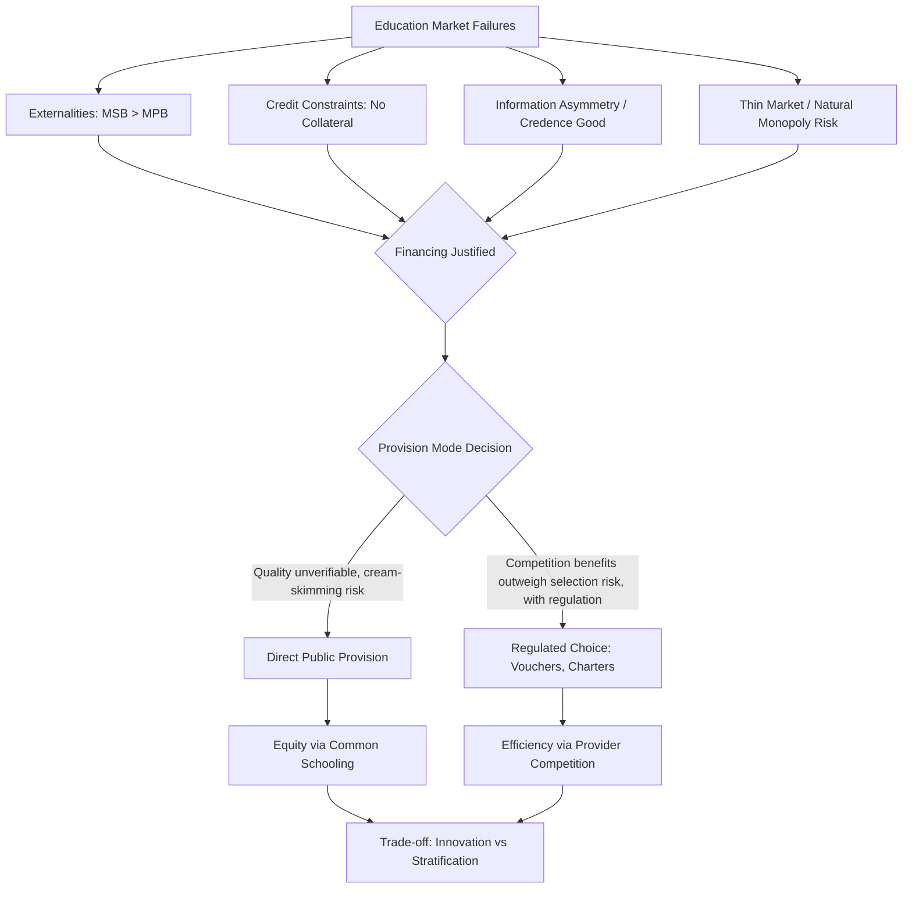

## Rationale for Public Provision of Education

### Core Distinction: Financing vs. Provision

A foundational analytical distinction in public economics separates **public financing** (who pays) from **public provision** (who produces/delivers the service). Governments can subsidize education without directly producing it (e.g., vouchers redeemable at private schools), or can both finance and produce it (traditional public schools). The rationale for public *provision* specifically must therefore go beyond the general case for public *financing* (externalities, credit constraints — covered under human capital theory) and address why the state should also be the direct producer/operator of schools, rather than merely a funder of privately-produced education.

### Market Failure Rationales

**1. Externalities (Financing Rationale, Foundation for Provision Debate)**

Education generates both private returns (captured by the individual via higher earnings) and social/external returns not captured privately:

$$MSB = MPB + MEB$$

where $MSB$ is marginal social benefit, $MPB$ is marginal private benefit, and $MEB$ is marginal external benefit (spillovers to non-attendees: reduced crime, informed citizenry, civic participation, aggregate productivity gains, intergenerational transmission to future children). Left to private markets, individuals equate $MPB$ to marginal cost, under-consuming relative to the social optimum where $MSB = MC$. This is a standard positive-externality underprovision argument, calling for a Pigouvian subsidy — but note this argument alone justifies *subsidization*, not necessarily *public production*.

**2. Credit Market Failures**

As in human capital theory generally, families (especially poor ones) cannot borrow against a child's future earnings to finance current schooling costs, since human capital is not collateralizable and enforcement of loan repayment from minors is legally and practically infeasible. This underinvestment problem is most acute for low-income households, making credit constraints a rationale that is simultaneously an efficiency argument (correcting underinvestment) and an equity argument (disproportionately affects the poor).

**3. Information Asymmetries and Bounded Rationality**

Parents (particularly with limited education themselves) may have imperfect information about:

- The long-run returns to schooling
- The quality of available schools
- Optimal educational inputs for child development

**[Inference]** This creates a "merit good" style rationale distinct from the classical externality argument — the case here rests on paternalism (correcting a decision-making failure rather than a market failure per se), which is theoretically more contested since it implies public authorities know parents' or children's welfare-maximizing choice better than the household itself.

**4. Natural Monopoly / Scale Economics in Thin Markets**

In sparsely populated or low-income areas, the fixed costs of establishing a school (facilities, minimum viable class size) may not be recoverable by a private provider at a price poor households can pay, leading to **market thinness** — no private supplier enters, and the area is left unserved absent public provision. This is a distinct rationale from externalities: it is about production feasibility, not just consumption incentives, and applies most strongly in rural/remote administrative contexts.

### Equity Rationales

**Redistribution via Human Capital, Not Just Cash**

Because human capital is often the primary asset available to the poor (who lack financial or physical capital), providing free or subsidized quality education functions as a redistributive mechanism that is potentially efficiency-enhancing rather than purely efficiency-costly — unlike most redistribution, which faces an equity-efficiency trade-off (the "leaky bucket" of Okun), education subsidies to credit-constrained, high-potential poor children can simultaneously raise both equity and aggregate output, since the underlying market failure (credit constraint) means the pre-transfer allocation is already inefficient.

**Equality of Opportunity**

A distinct normative principle separate from utilitarian efficiency: consistent with Rawlsian or Roemer-style "equality of opportunity" frameworks, public education is justified as a mechanism to decouple a child's life outcomes from circumstances of birth (parental income, geography) that the child did not choose and cannot be held responsible for — an argument resting on distributive justice rather than market failure.

### Why Public *Provision* Specifically (Not Just Financing)?

This is the more contested and analytically distinct question. Arguments for direct public production over pure financing (e.g., vouchers to private schools) include:

**1. Quality Verification Problems (Credence Good Argument)**

Education quality is difficult for parents to observe and verify ex ante (a "credence good," similar to medical care) — the true value of schooling to a child may only be apparent years or decades later. **[Inference]** This creates scope for private providers to under-invest in quality while maximizing short-run profit (an adverse-selection/moral-hazard problem in the education "market"), which some economists argue justifies direct public operation and accreditation/oversight rather than trusting parental choice and market discipline alone; this remains a genuinely contested empirical and theoretical claim in the school-choice literature, not a settled consensus.

**2. Cream-Skimming / Adverse Selection in Voucher and Choice Systems**

**[Inference — contested]** If private schools can select students (explicitly or via costly application processes, transportation requirements, or implicit signaling), voucher/choice systems risk concentrating higher-ability or higher-resource students in better-performing private schools, leaving public schools with a residual, higher-cost-to-educate population — a potential negative externality of choice expansion on those who remain in the public system. Empirical evidence on the magnitude of this effect across voucher programs (Chile, Sweden, U.S. charter/voucher programs) is mixed and highly context-dependent.

**3. Positive Externalities from Common Schooling / Social Cohesion**

A civic/political-economy argument (distinct from human-capital externalities above): shared public schooling may generate social cohesion, reduced stratification by class/ethnicity/religion, and shared civic values — an externality specifically tied to the *pooling* function of public provision, which could be undermined by highly segmented private/choice systems. This argument is more normative/political than a strict efficiency claim and is contested by advocates of choice, who argue diversity of pedagogical approaches has its own social value.

**4. Coordination and Standard-Setting**

Direct provision allows the state to more directly control curriculum standardization, teacher credentialing, and quality benchmarks at scale, which may be harder to enforce uniformly across a fragmented network of private providers, particularly in decentralized administrative settings with variable local government capacity.

### The Financing-Provision Matrix

|  | Public Financing | Private Financing |
| --- | --- | --- |
| **Public Provision** | Traditional public schools (fully state financed and operated) | Rare (e.g., public schools charging some fees in mixed systems) |
| **Private Provision** | Vouchers, charter schools, per-pupil grants to private operators | Unsubsidized private schools |

This matrix clarifies that most real-world policy debates (vouchers, charter schools, tax credits) are actually debates about the *provision* dimension while typically retaining substantial *public financing* — the externality and credit-constraint arguments justify the financing cell regardless of provision mode; the harder analytical question is which provision mode best delivers quality and equity given financing is already public.

### Empirical Evidence on Public vs. Private/Choice Provision

**Key Points**

- Voucher program evaluations (Chile's nationwide system since 1981, Milwaukee, Colombia's PACES program) show heterogeneous results: some find modest test score or graduation gains for lottery winners (particularly in the U.S. urban RCT literature), while others find limited or no effects, with results highly sensitive to program design (regulation of private-school entry, information provision to parents, voucher value relative to true cost).
- **[Inference]** The Chilean experience is frequently cited in the stratification debate: expansion of the national voucher system coincided with increased socioeconomic segregation across schools, though the causal contribution of vouchers versus other concurrent factors (residential segregation, complementary top-up fees allowed under the system) is disputed in the literature.
- Charter school evaluations (using lottery-based admission as a natural experiment) in some U.S. urban contexts (e.g., Boston, certain "no-excuses" charter networks) show sizable achievement gains, while broader national averages across all charter schools are closer to zero or mixed — indicating substantial heterogeneity in provider quality within the "private/choice provision" category itself, undermining any uniform claim that private provision is systematically better or worse.

### Efficiency Case for Blended/Hybrid Models

**[Inference]** A significant strand of current public economics thinking favors neither pure public monopoly provision nor pure private/voucher systems, but rather hybrid models: public financing combined with managed choice (e.g., charter schools operating under public accountability standards, weighted student funding formulas that follow the child, or regulated voucher systems with anti-cream-skimming rules such as lottery-based admission requirements and information support for low-income parents). This reflects an attempt to capture provision-side efficiency/innovation benefits attributed to competition while mitigating the adverse-selection and stratification risks associated with unregulated choice.

### Decentralization and Local Government Provision

In many countries, primary/secondary education provision is constitutionally or administratively assigned to sub-national/local government units, motivated by:

- **Preference-matching (Tiebout logic)**: local provision allows better matching of school quality/spending to local community preferences, with household mobility across jurisdictions as a market-like disciplining mechanism
- **Local accountability**: proximity may improve monitoring of school performance by parents/local officials relative to distant central bureaucracies

**[Inference]** This is counterbalanced by well-documented equity concerns: local financing (especially where tied to local property tax bases) can generate large disparities in per-pupil spending correlated with local wealth, which is a central rationale for supplementary national/central government equalization grants in most decentralized education finance systems.

### Public Provision Rationale Flow

### Illustrative Diagram: Externality-Based Underprovision (svg_diagram)

<svg xmlns="http://www.w3.org/2000/svg" viewBox="0 0 520 380">
<text x="260" y="24" font-size="15" text-anchor="middle" font-family="sans-serif" font-weight="bold">Education Externality and Underprovision (svg_diagram)</text>
<line x1="60" y1="330" x2="480" y2="330" stroke="black" stroke-width="1.5" />
<line x1="60" y1="330" x2="60" y2="40" stroke="black" stroke-width="1.5" />
<text x="440" y="350" font-size="12" font-family="sans-serif">Years of Schooling</text>
<text x="15" y="45" font-size="12" font-family="sans-serif">Price / Value</text>
<line x1="60" y1="310" x2="460" y2="80" stroke="#555" stroke-width="2" />
<text x="380" y="100" font-size="11" font-family="sans-serif" fill="#555">MSB (Social)</text>
<line x1="60" y1="310" x2="380" y2="140" stroke="#1a6" stroke-width="2" />
<text x="300" y="160" font-size="11" font-family="sans-serif" fill="#1a6">MPB (Private)</text>
<line x1="60" y1="220" x2="460" y2="220" stroke="#c33" stroke-width="2" />
<text x="420" y="212" font-size="11" font-family="sans-serif" fill="#c33">MC</text>
<line x1="245" y1="330" x2="245" y2="220" stroke="black" stroke-dasharray="3,2" />
<line x1="330" y1="330" x2="330" y2="140" stroke="black" stroke-dasharray="3,2" />
<text x="220" y="345" font-size="10" font-family="sans-serif">s_private</text>
<text x="310" y="345" font-size="10" font-family="sans-serif">s_social*</text>

<text x="150" y="270" font-size="10" font-family="sans-serif" fill="#c33">Underprovision Gap</text>

</svg>

### Related Topics

- Voucher and school choice program design and evaluation methodology
- Tiebout model and fiscal federalism in local public goods
- Credence goods and quality-verification problems in service markets
- Charter school lottery-based (RCT) evaluations
- Merit goods and paternalism in public economics
- School finance equalization and property-tax-based funding disparities
- Human Capital Theory (linked foundational chapter topic)
- Cream-skimming and adverse selection in quasi-market public services