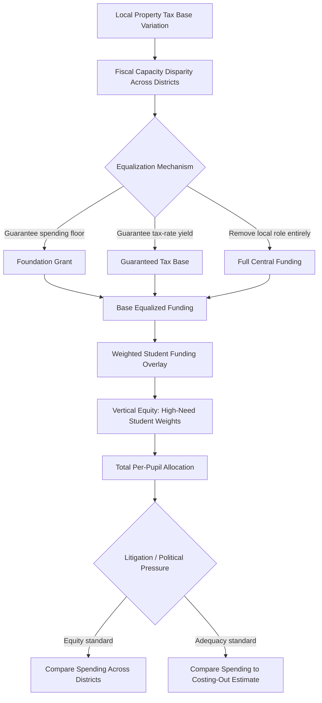

## School Finance Systems

### Definition and Core Concept

School finance systems are the institutional and fiscal arrangements governing how funds are raised, allocated, and distributed across schools and jurisdictions to pay for K-12 (and in some systems, pre-primary/tertiary) education. The central public economics problem is a **fiscal federalism** question: how to reconcile local revenue-raising capacity (which varies enormously by jurisdiction wealth) with a policy goal of adequate and/or equitable education funding for all children regardless of where they live.

This creates the defining tension of school finance: **local control and preference-matching** (Tiebout-style efficiency benefits of decentralized provision) versus **equity and adequacy** (ensuring funding is not simply a function of local property wealth or income).

### The Foundational Problem: Local Revenue Base Variation

In systems where school funding is substantially locally financed (the traditional U.S. model, and many decentralized systems globally), revenue is typically raised via a **local property tax**:

$$R_j = t_j \cdot V_j$$

where $R_j$ is revenue raised in jurisdiction $j$, $t_j$ is the local tax rate, and $V_j$ is the local property tax base (assessed property value) per pupil. Because $V_j$ varies enormously across jurisdictions (rich versus poor municipalities), jurisdictions with identical tax *rates* $t_j$ generate vastly different revenue *per pupil* — meaning a poor district must set a much higher tax rate than a wealthy district to raise equivalent per-pupil funding, a phenomenon known as **fiscal capacity disparity**.

**Key Points**

- This is distinct from an expenditure preference difference: two districts may have identical *desired* spending levels but face entirely different tax-rate burdens to achieve them purely due to differing tax bases.
- Historically, this property-tax-based local financing model produced (and in many decentralized systems continues to produce) large per-pupil spending gaps correlated with local wealth, motivating central/state government intervention.

### Equalization Grant Mechanisms

Central or state governments address fiscal capacity disparities through intergovernmental transfer formulas. The main archetypes:

**1. Foundation Grants (Minimum Foundation Program)**

Guarantees a minimum per-pupil spending level $F$ by having the central government fill the gap between what a jurisdiction could raise at a specified minimum tax rate $t_{min}$ and the foundation amount:

$$G_j = \max(0, F - t_{min} \cdot V_j)$$

The jurisdiction may then choose to spend above $F$ using additional local revenue, but the floor $F$ is guaranteed regardless of local wealth. This is the most widely used equalization mechanism globally, balancing adequacy (the floor) with continued local discretion above it.

**2. Guaranteed Tax Base (GTB) / District Power Equalizing**

Rather than guaranteeing an absolute spending floor, this mechanism guarantees that a given local tax *rate* yields the same revenue per pupil regardless of actual local tax base, by having the central government supplement (or, in theory, recapture from) districts based on the gap between their actual base and a guaranteed base $V^*$:

$$G_j = t_j \cdot (V^* - V_j)$$

This preserves local choice over spending *levels* (districts can still choose to tax/spend more or less) while neutralizing the effect of tax-base variation on the price of an additional dollar of spending — theoretically more consistent with Tiebout-style local preference-revelation than a flat foundation grant, since it does not compress spending toward a single level.

**3. Full State/Central Funding**

Complete removal of local discretion; the central government sets a uniform per-pupil amount and finances it entirely from central (often more progressive, e.g., income tax based) revenue sources, eliminating fiscal capacity disparities by construction but also eliminating local preference-matching, and centralizing political accountability.

**4. Categorical/Weighted Student Funding**

Overlaid on any of the above base mechanisms, additional weighted allocations are commonly provided for students with higher-cost needs:

$$\text{Total funding}_j = \text{Base}_j \times \left(1 + \sum_k w_k \cdot p_{k,j}\right)$$

where $p_{k,j}$ is the proportion of students in category $k$ (e.g., special education, English-language learners, low-income/poverty status) in jurisdiction $j$, and $w_k$ is the weight reflecting the additional cost of educating that population. This mechanism addresses **cost-adjusted adequacy** rather than pure fiscal-capacity equalization — recognizing that equal dollar amounts do not necessarily produce equal educational opportunity if underlying student needs differ.

### Equity Concepts in School Finance

**Key Points**

- **Horizontal equity**: equal treatment of equals — students with similar needs should receive similar resources regardless of jurisdiction.
- **Vertical equity**: appropriately *unequal* treatment of unequals — students with greater needs (disability, poverty, limited language proficiency) should receive proportionally more resources, operationalized via weighted funding formulas.
- **Fiscal neutrality**: the principle (central to U.S. school finance litigation, e.g., *Serrano v. Priest* in California) that the quality of a child's education (as proxied by per-pupil spending) should not be a function of anything other than the wealth of the state as a whole — i.e., local property wealth should not determine spending.
- **Adequacy**: a distinct and, since the 1990s, increasingly dominant standard shifting focus from *equalizing inputs across districts* (equity-based) toward *ensuring sufficient resources to meet defined educational outcome standards* (e.g., proficiency benchmarks) — adequacy litigation (e.g., costing-out studies) asks "what does it cost to provide an adequate education to this student population?" rather than "are per-pupil dollars equal across jurisdictions?"

### The Adequacy versus Equity Distinction

**[Inference]** This distinction has significant practical policy implications: an equity-focused reform might simply equalize per-pupil spending across all districts, while an adequacy-focused reform could justify spending *above* the state average in high-poverty/high-need districts and *below* average in low-need districts, since the underlying standard is meeting an outcome threshold rather than achieving numerical equality — this reframing has been influential in more recent school finance litigation and reform design, though "costing-out" studies estimating the true cost of adequacy remain methodologically contested.

### Effects of School Finance Reform: Empirical Evidence

**Spending Equalization Effects**

Empirical studies of court-mandated school finance reforms (following equity/adequacy litigation across many U.S. states from the 1970s onward) consistently find that such reforms substantially reduce within-state variance in per-pupil spending, primarily by raising spending in previously low-spending (poor) districts, financed through increased state-level revenue.

**Outcome Effects**

A growing body of research (drawing on the staggered timing of school finance reforms across states as a source of identifying variation) finds:

- Increased per-pupil spending in low-income districts is associated with improved student outcomes, including higher educational attainment, and in some studies, longer-run improvements in adult earnings and reduced likelihood of adult poverty for cohorts exposed to the increased spending during their school years.
- **[Inference]** These "money matters" findings represent a meaningful shift from an earlier generation of research (associated with the Coleman Report era and Hanushek's subsequent work) that found weak or no correlation between school spending and outcomes; the more recent literature attributes part of this divergence to better causal identification strategies (exploiting reform-induced spending variation rather than cross-sectional correlations) and to reforms being specifically targeted at previously under-resourced districts where marginal returns to additional spending are plausibly higher.
- The debate over the "money doesn't matter" versus "money matters" question is not fully settled and remains an active area of empirical public economics; effect sizes and mechanisms (teacher salaries/class size vs. facilities vs. other spending categories) vary across studies.

### Comparative Systems Framework

| System Type | Financing Level | Local Discretion | Primary Equity Mechanism |
| --- | --- | --- | --- |
| Fully local (unreformed) | Local property tax | High | None (spending tracks local wealth) |
| Foundation grant | Mixed local + central | Moderate (above floor) | Guaranteed minimum floor |
| Guaranteed tax base | Mixed local + central | High (price-equalized) | Neutralizes tax-base effect on price |
| Full central/state funding | Central | Low | Complete equalization by construction |
| Weighted student funding | Often central/mixed | Varies | Cost-adjusted vertical equity |

**[Inference]** Most real-world systems are hybrids rather than pure types — for example, many countries combine a central foundation/block grant with some local supplementary taxing authority and categorical weighted add-ons for special needs populations, reflecting a practical compromise between the competing objectives of equity, adequacy, and local accountability/preference-matching.

### Decentralized/LGU Context Considerations

In systems where local government units play a substantial role in education finance and administration (whether through direct local revenue contribution, co-financing of facilities, or administrative support functions), several public economics issues become salient:

- **Vertical fiscal imbalance**: LGUs may have administrative/service responsibilities for education-adjacent functions (facilities maintenance, feeding programs, health referrals) without commensurate independent revenue-raising authority, creating dependence on central government transfers and potential funding gaps if transfer formulas do not fully account for local cost structures.
- **Transfer formula design salience**: The choice between block grants (LGU discretion over use) versus categorical/earmarked grants (central government specifies use) directly parallels the equity/adequacy and local-control tensions discussed above, and is a recurring design question in decentralized service delivery generally, not unique to education.
- **Capacity variation**: Poorer or more remote LGUs may have weaker administrative capacity to access, manage, or effectively deploy transferred funds (e.g., procurement bottlenecks, staffing shortages), meaning nominal fiscal equalization does not automatically translate into equalized service quality — an implementation-capacity gap distinct from the pure financing-formula design question.

### Political Economy of School Finance Reform

**[Inference]** School finance equalization reforms face a structurally difficult political economy: reforms that raise funding for poor districts typically require either (a) new central/state revenue (facing general tax-increase resistance) or (b) some form of recapture/redistribution from wealthy districts (facing concentrated, well-organized opposition from higher-income constituencies who perceive the reform as a loss even when it does not reduce their absolute spending, only their relative advantage) — this dynamic helps explain why school finance reform in many systems has historically required judicial intervention (constitutional education-clause litigation) rather than emerging solely through the ordinary legislative process.

### School Finance Equalization Flow

### Illustrative Diagram: Foundation Grant Mechanism (svg_diagram)

<svg xmlns="http://www.w3.org/2000/svg" viewBox="0 0 540 380">
<text x="270" y="24" font-size="15" text-anchor="middle" font-family="sans-serif" font-weight="bold">Foundation Grant Equalization (svg_diagram)</text>
<line x1="60" y1="330" x2="500" y2="330" stroke="black" stroke-width="1.5" />
<line x1="60" y1="330" x2="60" y2="40" stroke="black" stroke-width="1.5" />
<text x="420" y="350" font-size="12" font-family="sans-serif">District Wealth (V_j)</text>
<text x="15" y="45" font-size="12" font-family="sans-serif">Per-Pupil Funding</text>
<line x1="60" y1="110" x2="500" y2="110" stroke="#1a6" stroke-width="2" stroke-dasharray="5,3" />
<text x="420" y="102" font-size="11" font-family="sans-serif" fill="#1a6">Foundation Level (F)</text>
<line x1="60" y1="260" x2="220" y2="110" stroke="#c33" stroke-width="2" />
<text x="150" y="240" font-size="10" font-family="sans-serif" fill="#c33">Grant fills gap</text>
<line x1="220" y1="110" x2="500" y2="60" stroke="#555" stroke-width="2" />
<text x="400" y="70" font-size="10" font-family="sans-serif" fill="#555">Local revenue exceeds F</text>
<line x1="220" y1="330" x2="220" y2="110" stroke="black" stroke-dasharray="3,2" />
<text x="180" y="345" font-size="10" font-family="sans-serif">Break-even wealth</text>
<line x1="60" y1="330" x2="60" y2="260" stroke="#c33" stroke-width="4" />
<text x="20" y="300" font-size="10" font-family="sans-serif" fill="#c33">Local raised</text>
</svg>

### Related Topics

- Fiscal federalism and intergovernmental transfer design
- Tiebout model and jurisdictional sorting by fiscal preference
- Rationale for Public Provision of Education (linked chapter topic)
- Costing-out studies and adequacy standard methodology
- Property tax incidence and capitalization effects
- Weighted student funding formula design
- Court-mandated school finance litigation (comparative case law)
- Teacher labor markets and compensation as a spending-outcome mechanism