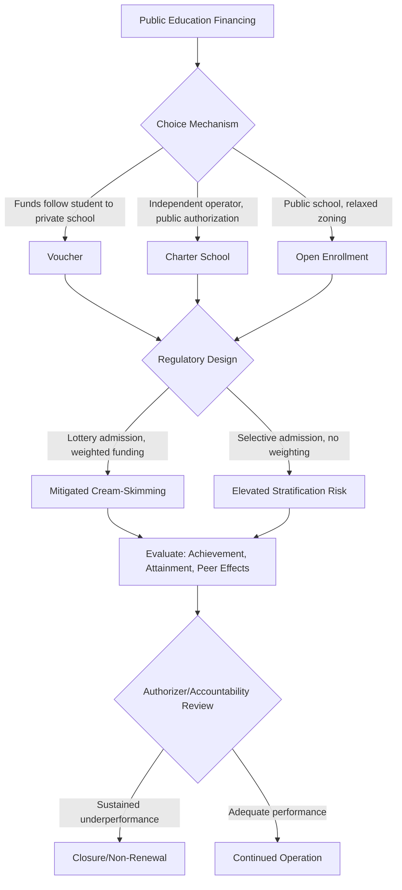

## School Choice, Vouchers, and Charter Schools

### Definition and Core Concept

School choice encompasses policy mechanisms that decouple a student's assigned school from strict residential zoning, allowing families to select among multiple schooling options financed wholly or partly by public funds. The three principal institutional forms differ in their financing-provision structure:

- **Vouchers**: Public funds (a fixed per-pupil amount) provided directly to families, redeemable at participating private (and sometimes public) schools of their choice.
- **Charter schools**: Publicly funded but independently (often privately) operated schools, granted autonomy from many traditional public-school regulations (curriculum, staffing, calendar) in exchange for accountability to a charter authorizer, typically subject to renewal/revocation based on performance.
- **Open enrollment / inter/intra-district choice**: Allows students to attend public schools outside their assigned attendance zone, without introducing private providers, retaining public financing and public provision but relaxing the provision-location constraint.

These mechanisms represent points along the financing-provision spectrum introduced in the general rationale for public education: vouchers move furthest toward private provision with continued public financing; charters occupy an intermediate position (publicly authorized and financed, privately/independently operated); open enrollment retains full public provision while introducing intra-system competition.

### Theoretical Rationale: The Competition/Efficiency Argument

**Milton Friedman's Original Case (1955)**

The foundational argument for vouchers rests on applying standard market-competition logic to education: under a traditional zoned public-school monopoly, schools face no competitive pressure to improve quality or efficiency, since families cannot exit a poorly performing assigned school without costly residential relocation (the Tiebout "voting with your feet" mechanism, which requires housing mobility and is therefore slow, costly, and regressive — wealthier families can move; poorer families often cannot). Vouchers introduce direct product-market competition: schools that fail to attract/retain students (and thus per-pupil funding) face closure or reform pressure, theoretically incentivizing quality improvement and innovation analogous to competitive markets in other sectors.

**Formal Competitive Pressure Model**

$$\pi_s = \sum_i \mathbb{1}[\text{student } i \text{ chooses school } s] \times v - C_s$$

where $\pi_s$ is a school's net position (enrollment-linked funding minus costs), $v$ is the voucher/per-pupil amount, and $C_s$ is the school's cost structure. Under choice, a school's funding depends directly on its ability to attract enrollment, in contrast to a zoned system where funding is largely enrollment-independent within the assigned catchment (subject only to demographic/residential shifts).

### Counter-Arguments and Market Failure Concerns

**1. Credence Good / Quality-Verification Problem**

As established in the general public-provision rationale, education quality is difficult for parents to verify ex ante, and the consequences of a poor choice may not be apparent for years. **[Inference — contested]** This undermines the standard competitive-market assumption that consumers can accurately assess quality and drive out low-quality providers; if parents rely on imperfect signals (marketing, school reputation, peer composition rather than actual value-added), competitive pressure may not translate into the quality improvements the simple market model predicts. The strength of this argument is disputed; proponents of choice argue that information interventions (school report cards, standardized outcome disclosure) can substantially mitigate this problem.

**2. Cream-Skimming and Adverse Selection**

Choice systems create incentives and mechanisms (explicit selection criteria, costly application processes, transportation requirements, disciplinary policies that induce self-selection) for schools to preferentially enroll higher-achieving, lower-cost-to-educate, or more engaged-family students, leaving a residual population in the remaining assigned public schools that may be increasingly composed of higher-need, harder-to-educate students — a potential negative externality imposed on non-choosing families. Well-designed choice systems attempt to mitigate this via **lottery-based admission** (required when oversubscribed), **backfilling policies**, and **weighted funding** that gives schools financial incentive to enroll higher-need students rather than avoid them.

**3. General Equilibrium / Peer Effects**

Because student achievement is influenced by peer composition (a widely documented empirical finding, though effect-size estimates vary), sorting induced by choice can generate systemic effects beyond the direct treatment effect on choosers: if choice programs sort students by ability, motivation, or family engagement across schools, this can raise average outcomes for those who sort favorably while potentially lowering them for those who do not, independent of any change in school "quality" per se — meaning individual-level (partial equilibrium) evaluations of choice programs may not capture the full general-equilibrium welfare effect on the broader system.

**4. Public Goods / Social Cohesion Externality**

As discussed under the general provision rationale, common schooling may generate externalities related to social cohesion and civic integration that are diminished under highly stratified choice systems — a normative/political-economy argument distinct from the efficiency-focused cream-skimming concern.

### Empirical Evidence: Voucher Programs

**Key Points**

- **Milwaukee Parental Choice Program** (U.S., est. 1990, the longest-running large-scale U.S. voucher program): longitudinal evaluations comparing lottery winners/losers and later cohort-tracking studies find effects on test scores that are modest and sensitive to methodology, with somewhat more consistent positive effects found on high school graduation and college enrollment rates than on standardized test scores.
- **Chilean national voucher system** (est. 1981, essentially universal since it applies nationwide rather than to a targeted subgroup): a uniquely large-scale, long-running natural experiment. Evidence on average achievement effects is mixed, while evidence on increased **socioeconomic and academic stratification** across schools following voucher expansion (particularly after reforms permitting schools to charge supplementary "top-up" fees on top of the voucher) is more consistently documented, though the causal attribution to vouchers specifically (versus concurrent residential segregation trends) remains debated.
- **Colombia's PACES program** (targeted secondary school vouchers, subject to a well-known randomized lottery evaluation due to oversubscription): found meaningful positive effects on educational attainment (reduced grade repetition, higher completion rates) and later labor market outcomes for lottery winners, frequently cited as some of the strongest experimental evidence in favor of targeted, means-tested voucher design.
- **[Inference]** A pattern across the literature suggests that *targeted* voucher programs directed at low-income students in underperforming public school systems tend to show more consistently positive effects than *universal* voucher systems, though this generalization should be treated cautiously given substantial heterogeneity in program design, regulatory environment, and country context across studies.

### Empirical Evidence: Charter Schools

**Key Points**

- Lottery-based (randomized) evaluations — considered the gold-standard identification strategy since oversubscribed charter schools must use lotteries for admission, creating quasi-random assignment among applicants — show substantial heterogeneity: some urban "no-excuses" charter networks (extended school day, strict behavioral codes, intensive tutoring, frequent assessment) show large, statistically robust achievement gains, particularly in mathematics and for historically underserved student populations.
- National-level averages across the full universe of U.S. charter schools (including non-lottery, non-oversubscribed schools evaluated via less rigorous methods) are considerably more mixed, with some studies finding charter attendance associated with outcomes indistinguishable from or even below matched traditional public schools, particularly for virtual/online charter schools.
- **[Inference]** This heterogeneity is a central finding of the charter school literature: "charter school" is not a homogeneous treatment but an institutional category encompassing highly variable pedagogical models, management quality, and regulatory oversight — meaning average effects across all charters can mask both high-performing and low-performing sub-populations, a methodological point relevant whenever evaluating any policy category defined by governance structure rather than by a specific, uniform intervention.
- Charter schools have also been studied for spillover/competitive effects on nearby traditional public schools, with some evidence of modest positive competitive effects on TPS performance in areas with substantial charter market share, though this literature is less extensive and consensus is weaker than for direct attendance effects.

### Regulatory Design Features Affecting Outcomes

**Admissions and Selection Rules**

- **Lottery requirements** for oversubscribed schools (mitigates but does not eliminate cream-skimming, since which families *apply* is itself a non-random, self-selected process — the "differential application" problem).
- **Weighted/backpack funding** tied to student characteristics (higher per-pupil amounts for low-income, special-needs, or English-learner students) to remove the financial disincentive to enroll higher-cost students.
- **Anti-discrimination and enrollment transparency mandates** (standardized application timelines, prohibition on discretionary interviews/essays as admission criteria) to reduce implicit selection.

**Accountability Mechanisms**

- **Authorizer oversight and renewal**: charter schools nominally close or lose authorization for sustained poor performance, a market-exit mechanism largely absent in traditional public school systems; **[Inference]** the actual rigor and consistency of authorizer enforcement varies substantially across jurisdictions and is frequently identified in the literature as a key determinant of whether charter sectors achieve positive average effects.
- **Information disclosure**: standardized school report cards / performance dashboards to address the credence-good/quality-verification problem discussed above, though evidence on how effectively parents use such information in practice is mixed.

### Comparative Institutional Framework

| Mechanism | Financing | Provision | Admission Constraint | Primary Regulatory Lever |
| --- | --- | --- | --- | --- |
| Voucher | Public | Private | Varies (open, lottery, or selective) | Regulation of participating private schools |
| Charter school | Public | Independent/private operator, publicly authorized | Lottery if oversubscribed | Authorizer renewal/revocation |
| Open enrollment | Public | Public | Space-available, sometimes lottery | Transportation/capacity rules |
| Traditional zoned public | Public | Public | Residence-based assignment | Direct administrative control |

### Political Economy Considerations

**[Inference]** School choice policy debates are shaped by a distinctive political-economy dynamic: they combine efficiency arguments (competition, innovation) that appeal across conventional political divisions with distributional and institutional-interest dimensions (effects on teacher labor unions, existing public school district budgets and staffing, and the fiscal impact of per-pupil funding following students to alternative providers) that generate strong organized opposition and support from correspondingly organized interest groups — meaning empirical evidence, while informative, has historically played a less decisive role in choice policy adoption/rejection than in more technocratic areas of public finance.

### School Choice Mechanism Comparison

### Illustrative Diagram: Cream-Skimming Sorting Dynamic (svg_diagram)

<svg xmlns="http://www.w3.org/2000/svg" viewBox="0 0 540 380">
<text x="270" y="24" font-size="15" text-anchor="middle" font-family="sans-serif" font-weight="bold">Cream-Skimming Under Unregulated Choice (svg_diagram)</text>
<rect x="60" y="60" width="180" height="240" fill="none" stroke="#555" stroke-width="1.5" />
<text x="150" y="50" font-size="12" text-anchor="middle" font-family="sans-serif">Applicant Pool</text>
<circle cx="110" cy="100" r="10" fill="#1a6" />
<circle cx="150" cy="100" r="10" fill="#1a6" />
<circle cx="190" cy="100" r="10" fill="#1a6" />
<circle cx="110" cy="140" r="10" fill="#c33" />
<circle cx="150" cy="140" r="10" fill="#c33" />
<circle cx="190" cy="140" r="10" fill="#1a6" />
<circle cx="110" cy="180" r="10" fill="#c33" />
<circle cx="150" cy="180" r="10" fill="#1a6" />
<circle cx="190" cy="180" r="10" fill="#c33" />
<text x="150" y="220" font-size="10" text-anchor="middle" font-family="sans-serif">Green: lower-cost / higher-achieving</text>
<text x="150" y="235" font-size="10" text-anchor="middle" font-family="sans-serif">Red: higher-need / higher-cost</text>
<path d="M 245 100 L 320 90" stroke="#1a6" stroke-width="2" marker-end="url(#arrow1)" />
<path d="M 245 180 L 320 260" stroke="#c33" stroke-width="2" marker-end="url(#arrow2)" />
<rect x="330" y="50" width="170" height="100" fill="none" stroke="#1a6" stroke-width="1.5" />
<text x="415" y="40" font-size="11" text-anchor="middle" font-family="sans-serif">Choice School</text>
<circle cx="380" cy="90" r="10" fill="#1a6" />
<circle cx="420" cy="90" r="10" fill="#1a6" />
<circle cx="460" cy="90" r="10" fill="#1a6" />
<circle cx="380" cy="120" r="10" fill="#1a6" />
<rect x="330" y="230" width="170" height="100" fill="none" stroke="#c33" stroke-width="1.5" />
<text x="415" y="220" font-size="11" text-anchor="middle" font-family="sans-serif">Residual Public School</text>
<circle cx="380" cy="270" r="10" fill="#c33" />
<circle cx="420" cy="270" r="10" fill="#c33" />
<circle cx="380" cy="300" r="10" fill="#c33" />
</svg>

### Related Topics

- Rationale for Public Provision of Education (linked chapter topic)
- School Finance Systems and weighted student funding (linked chapter topic)
- Peer effects and educational production functions
- Randomized lottery-based program evaluation methodology
- Tiebout sorting and residential mobility as an implicit choice mechanism
- Teacher labor markets, unionization, and charter school staffing autonomy
- Credence goods and information disclosure policy design
- Comparative international school choice systems (Sweden's friskolor, Chile, Netherlands)