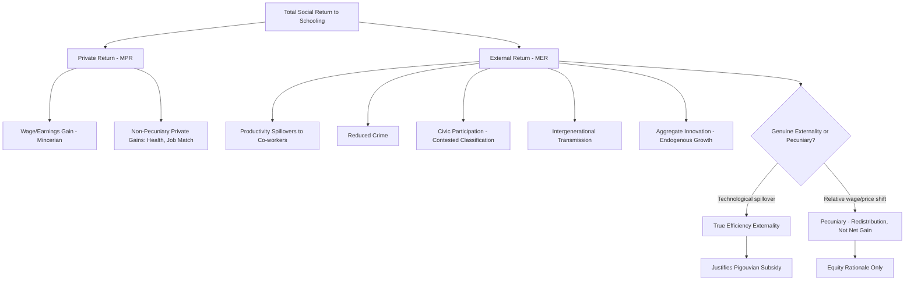

## Returns to Education and Externalities

### Definition and Core Concept

The economic analysis of education's payoff separates into two conceptually and empirically distinct components: **private returns** (the earnings gain captured directly by the individual who acquires education) and **social/external returns** (additional benefits accruing to third parties or society at large, not captured in the individual's private decision calculus). This distinction is the analytical hinge connecting human capital theory to the public finance rationale for education subsidy: if social returns exceed private returns, individuals underinvest relative to the social optimum, justifying public intervention on efficiency (not just equity) grounds.

$$MSR = MPR + MER$$

where $MSR$ is the marginal social return, $MPR$ is the marginal private return (captured in Mincer-style wage regressions), and $MER$ is the marginal external return (spillovers). Public economics is centrally concerned with estimating the magnitude of $MER$, since this determines the efficiency case for subsidization independent of any equity/redistribution rationale.

### Measuring Private Returns

**The Mincerian Baseline**

As established in human capital theory, the private return is conventionally estimated via the Mincer equation:

$$\ln(w_i) = \beta_0 + \beta_1 S_i + \beta_2 X_i + \beta_3 X_i^2 + \varepsilon_i$$

with $\beta_1$ interpreted as the private percentage return per additional year of schooling, typically estimated in the 5–15% range depending on country, time period, and estimation method (OLS versus instrumental variables approaches addressing ability bias, as discussed under human capital theory).

**Private Non-Pecuniary Returns**

Beyond wage effects, private returns include non-market benefits captured by the individual: improved own health and longevity, more efficient household production and consumption decision-making, better job-search efficiency and matching, and higher subjective well-being, all of which are generally excluded from standard Mincerian wage-return estimates and therefore imply that even well-identified wage-based estimates likely *understate* total private returns.

### Categories of External Returns (Social Spillovers)

**1. Productivity Spillovers / Peer Human Capital Externalities**

**[Inference]** A substantial empirical literature (using variation in local area or firm-level average education levels) finds evidence that an individual worker's productivity/wages are correlated with the average education level of co-workers or the local labor market, holding the individual's own education constant — consistent with knowledge spillovers, informal skill transfer, and agglomeration effects. Magnitude estimates vary considerably across studies and identification strategies, and separating a genuine causal productivity spillover from unobserved sorting of high-ability individuals into high-education areas remains a significant empirical challenge in this literature.

**2. Reduced Crime**

Multiple studies (frequently using compulsory schooling law changes or dropout-age variation as identification strategies, similar to instrumental variable approaches used for private returns) find that increased educational attainment, particularly increased high school completion, is associated with reduced criminal activity and incarceration rates. Since crime imposes costs on victims and society broadly (not internalized by the potential offender's private schooling decision), this constitutes a genuine positive externality distinct from the offender's own private return.

**3. Civic Participation and Democratic Externalities**

Higher educational attainment is robustly associated with higher voter turnout, civic engagement, and political participation in the empirical literature. **[Inference]** Whether this constitutes a true externality in the strict public-economics sense (a benefit to others not priced into the individual's decision) or is better understood as a private consumption benefit of civic engagement to the educated individual themselves is a genuinely debated conceptual question in the literature — the classification affects whether this channel supports an efficiency-based subsidy argument or is better framed as a non-pecuniary private return.

**4. Intergenerational Transmission**

More educated parents tend to have children with better educational, health, and labor market outcomes, operating through channels including home learning environment, parenting practices, household income, and assortative mating patterns. **[Inference]** Because this benefit accrues to the *next generation* (who cannot be party to the parent's schooling investment decision at the time it is made), it constitutes a distinct intergenerational externality/internality problem — parents may not fully internalize benefits to future children when making their own schooling investment decisions, a distinct rationale from same-generation spillovers.

**5. Health Externalities**

Public health literature finds correlations between community education levels and public health outcomes, including disease transmission reduction (from health-literacy-driven behavior change) and reduced healthcare system burden. Some of these effects operate through externality channels (reduced disease transmission benefits others directly) while others are better classified as private health returns to the individual.

**6. Innovation and Aggregate Growth Externalities (Endogenous Growth Channel)**

In endogenous growth theory frameworks (Lucas, Romer), aggregate human capital contributes to technology diffusion, innovation rates, and total factor productivity growth in ways that go beyond the sum of individual private returns, since knowledge and innovation have non-rivalrous, partially non-excludable characteristics — an individual's contribution to the aggregate knowledge stock benefits the entire economy's future growth trajectory, not just the individual's own career.

### Empirical Challenges in Measuring Social Returns

**Key Points**

- **Separating externality from sorting/selection**: Most cross-sectional or aggregate correlations between local education levels and outcomes (wages, crime, health) are vulnerable to the same ability-bias and selection concerns as private-return estimation — areas/firms/social networks with higher average education may differ systematically in other unobserved ways (institutional quality, industry composition, underlying regional productivity) that independently drive both education levels and the outcome of interest.
- **Instrumental variable and quasi-experimental approaches**: The strongest evidence for genuine causal externalities comes from studies using plausibly exogenous variation (compulsory schooling law changes, dropout-age reforms, natural experiments in local school construction) combined with peer/aggregate-level outcome data, rather than simple cross-sectional correlation.
- **[Unverified]** Precise point estimates of the *magnitude* of the externality-to-private-return ratio vary substantially across studies, contexts, and outcome measures; there is no single consensus figure for "the" social-to-private return ratio in the way there is a reasonably converged range for private Mincerian returns, and any specific numerical claim about aggregate externality magnitude should be treated as context-specific and methodologically contingent rather than a settled parameter.

### Public Economics Implications: The Efficiency Case for Subsidy

**The Pigouvian Logic**

If $MER > 0$ at the private-optimum schooling level $s^*_{private}$ (where $MPR = MC$), then $s^*_{private} < s^*_{social}$ (where $MSR = MC$), implying underinvestment relative to the social optimum. The standard Pigouvian correction is a per-unit subsidy equal to the marginal external return:

$$\text{Optimal subsidy} = MER(s^*_{social})$$

This is the theoretically clean efficiency argument distinct from (though often invoked alongside) the credit-constraint and equity rationales discussed under the general public-provision-of-education rationale — note these are three analytically separate justifications for public subsidy that happen to point in the same policy direction (increase education investment/access), which can lead to conflating distinct mechanisms in policy discourse.

**Distinguishing the Three Efficiency/Equity Rationales**

| Rationale | Mechanism | Addressed By |
| --- | --- | --- |
| Externality | Social benefit exceeds private benefit | Pigouvian subsidy (proportional to schooling) |
| Credit constraint | Cannot borrow against future earnings | Direct financing (loans, grants, free provision) |
| Equity/redistribution | Human capital as redistributive asset | Progressive targeting of subsidy by income |

**[Inference]** In practice, most real-world education subsidy levels are not calibrated with reference to an explicitly estimated $MER$ parameter (given the measurement difficulty noted above), but rather reflect a political-economy blend of adequacy standards, historical funding levels, and equity considerations — meaning the theoretically clean Pigouvian framework is more useful as an organizing conceptual lens than as a literal calibration tool for observed policy.

### Private Versus Social Return Wedge: Illustrative Comparison

**Example**

Consider a stylized numerical illustration (illustrative parameters, not drawn from a specific empirical study): if the private Mincerian return to a year of secondary schooling is estimated at 8%, and externality studies suggest an additional social spillover component in the range of 1–3 percentage points from combined crime-reduction, civic-participation, and productivity-spillover channels, the implied optimal Pigouvian subsidy would be calibrated to close this 1–3 percentage point wedge — though as noted, the true magnitude of this wedge remains empirically uncertain and should not be treated as a precisely known parameter.

### Distinguishing Externalities from Pecuniary "Spillovers"

**[Inference]** A conceptually important distinction in the public economics literature: not all apparent "social returns" to education represent genuine externalities in the welfare-relevant sense. Some observed effects (for example, wage compression effects where increased aggregate education supply lowers the relative wage of highly educated workers while raising that of less-educated workers) are **pecuniary externalities** — operating through relative price/wage changes rather than genuine technological spillovers — and represent a redistribution between groups rather than a net efficiency gain to society, meaning they do not by themselves justify a Pigouvian subsidy on efficiency grounds (though they may still be relevant to equity/distributional policy goals).

### Returns and Externality Decomposition Diagram

### Illustrative Diagram: Private vs Social Optimal Schooling (svg_diagram)

<svg xmlns="http://www.w3.org/2000/svg" viewBox="0 0 520 380">
<text x="260" y="24" font-size="15" text-anchor="middle" font-family="sans-serif" font-weight="bold">Private vs Social Optimal Schooling (svg_diagram)</text>
<line x1="60" y1="330" x2="480" y2="330" stroke="black" stroke-width="1.5" />
<line x1="60" y1="330" x2="60" y2="40" stroke="black" stroke-width="1.5" />
<text x="410" y="350" font-size="12" font-family="sans-serif">Years of Schooling</text>
<text x="15" y="45" font-size="12" font-family="sans-serif">Marginal Return / Cost</text>
<line x1="60" y1="300" x2="440" y2="90" stroke="#555" stroke-width="2" />
<text x="380" y="105" font-size="11" font-family="sans-serif" fill="#555">MSR (Private + External)</text>
<line x1="60" y1="300" x2="380" y2="150" stroke="#1a6" stroke-width="2" />
<text x="320" y="170" font-size="11" font-family="sans-serif" fill="#1a6">MPR (Private only)</text>
<line x1="60" y1="230" x2="440" y2="230" stroke="#c33" stroke-width="2" />
<text x="400" y="222" font-size="11" font-family="sans-serif" fill="#c33">MC</text>
<line x1="280" y1="330" x2="280" y2="230" stroke="black" stroke-dasharray="3,2" />
<line x1="350" y1="330" x2="350" y2="150" stroke="black" stroke-dasharray="3,2" />
<text x="255" y="345" font-size="10" font-family="sans-serif">s*_private</text>
<text x="330" y="345" font-size="10" font-family="sans-serif">s*_social</text>

<text x="290" y="270" font-size="10" font-family="sans-serif" fill="#c33">Underinvestment gap = Pigouvian subsidy target</text>

</svg>

### Related Topics

- Human Capital Theory and Mincer earnings function (linked chapter topic)
- Rationale for Public Provision of Education (linked chapter topic)
- Endogenous growth theory (Lucas, Romer models)
- Pigouvian taxation and subsidy design
- Peer effects and productivity spillover identification strategies
- Crime economics and educational attainment
- Intergenerational mobility and human capital transmission
- Pecuniary versus technological externalities in public economics