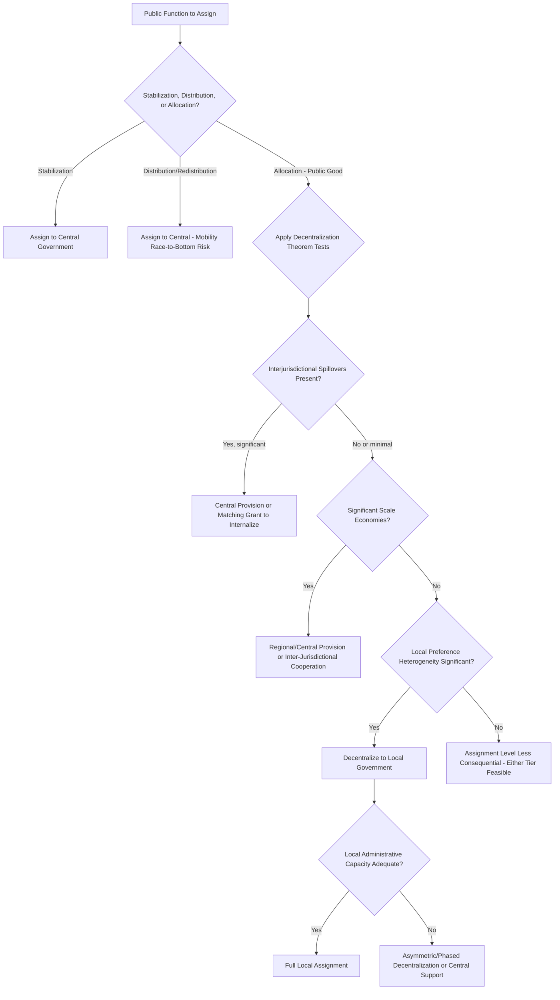

## Assignment of Functions across Government Levels

### Definition and Core Concept

The assignment of functions problem — often called the "assignment problem" in fiscal federalism — addresses which level of government (central/national, state/regional, or local) should be responsible for which public functions: expenditure responsibilities (service provision), revenue-raising authority (taxation), and regulatory functions. This is the foundational design question of fiscal federalism, logically prior to questions of intergovernmental transfers, tax assignment, or borrowing rules, since those subsequent design choices depend on which functions have already been assigned to which tier.

The classic normative framework, most associated with Wallace Oates's **Decentralization Theorem** and Richard Musgrave's tripartite division of fiscal functions, provides the analytical structure for assigning responsibilities based on the economic characteristics of each function.

### Musgrave's Tripartite Framework

Musgrave (1959) decomposed government fiscal functions into three categories, with differing implications for optimal assignment:

**1. Stabilization Function**

Macroeconomic stabilization (countercyclical fiscal policy, managing aggregate demand, currency and monetary policy) is assigned almost exclusively to the **central government** because:

- Sub-national governments are typically small open economies relative to the national economy, so fiscal stimulus leaks out through trade with other jurisdictions (a fiscal externality/spillover problem), reducing the local multiplier and making sub-national stabilization policy largely ineffective.
- Sub-national governments generally cannot issue currency and often face balanced-budget requirements (constitutional or market-imposed via borrowing costs), constraining their capacity to run countercyclical deficits.
- Monetary policy coordination requires unified national-level authority by construction.

**2. Distribution Function**

Income redistribution is assigned predominantly to the **central government** because of a classic mobility-driven race-to-the-bottom concern: if a single sub-national jurisdiction pursues aggressive redistribution (high taxes on the rich, generous transfers to the poor) while neighboring jurisdictions do not, this creates incentives for **out-migration of high-income/high-tax-base residents** and **in-migration of transfer beneficiaries**, undermining the fiscal sustainability of redistribution at the sub-national level (a specific application of Tiebout-style mobility, but here operating to *undermine* rather than support efficient local provision).

$$\text{Local redistribution sustainability} \downarrow \text{ as household/capital mobility} \uparrow$$

**[Inference]** This argument's strength scales with the degree of interjurisdictional mobility; in contexts with high mobility costs (geographic, linguistic, administrative barriers to relocation), the race-to-the-bottom pressure is theoretically weaker, which is sometimes invoked to justify greater sub-national redistributive latitude in lower-mobility federal systems, though this remains a matter of degree rather than a bright-line rule.

**3. Allocation Function (Public Goods Provision)**

This is the function most amenable to decentralization, and where the core Decentralization Theorem applies.

### The Decentralization Theorem (Oates, 1972)

**Formal Statement**

For a public good whose consumption benefits are geographically limited to a sub-national jurisdiction (a "local public good"), and where preferences for the good vary across jurisdictions, welfare is maximized (or at minimum, no lower) when the good is provided by decentralized/local governments at levels tailored to local demand, rather than by a uniform central-government-determined quantity, *provided there are no significant scale economies or interjurisdictional externalities (spillovers) associated with provision.*

$$W_{decentralized} \geq W_{centralized} \quad \text{when heterogeneous local preferences and no spillovers}$$

**Underlying Logic**

- **Heterogeneity of preferences**: Different jurisdictions have different demand for local public goods (e.g., preferences over park quality, local road standards, library hours) due to differing demographics, income levels, and tastes.
- **Central government uniform provision cost**: A central government providing a single national quantity/quality level either over-provides for low-demand jurisdictions or under-provides for high-demand jurisdictions (or both, depending on where the uniform level is set relative to the distribution of local preferences), generating deadweight welfare loss relative to a matched, decentralized provision level.
- **Local information advantage**: Local governments are assumed to have superior information about local preferences and local production costs relative to a distant central authority, an informational rationale reinforcing the preference-matching argument.

**The Tiebout Connection**

The Decentralization Theorem is closely related to, but conceptually distinct from, the Tiebout (1956) model: Tiebout demonstrates how household mobility across jurisdictions with differing tax/service bundles can generate efficient sorting and preference revelation ("voting with your feet") even without any central coordination, functioning analogously to a market mechanism for local public goods. The Decentralization Theorem's welfare result holds even *without* invoking household mobility, relying instead simply on decentralized governments' ability to tailor provision to (given, not necessarily mobility-revealed) local preferences.

### Conditions Favoring Centralization: Correcting the Theorem's Assumptions

The Decentralization Theorem's welfare ranking flips or weakens when its key assumptions (no spillovers, no scale economies) are violated:

**1. Interjurisdictional Spillovers (Externalities)**

If a local public good generates benefits that spill over jurisdictional boundaries (e.g., local environmental regulation affecting downstream/downwind jurisdictions, or local infrastructure benefiting through-traffic from other jurisdictions), a purely local government will under-provide relative to the social optimum, since it does not internalize the benefit to non-resident spillover recipients — a direct local-government analogue of the standard externality underprovision problem.

$$MSB_{local} = MPB_{local} + \text{Spillover to other jurisdictions}$$

This argues for either (a) central government provision/regulation, (b) matching grants from a higher tier calibrated to internalize the spillover (a Pigouvian-style intergovernmental transfer), or (c) voluntary interjurisdictional cooperation/compacts (though the latter face their own collective-action problems analogous to any public-goods cooperation game).

**2. Economies of Scale in Provision**

Some public services exhibit substantial scale economies (declining average cost as jurisdiction size/population served increases) — examples include specialized infrastructure, certain regulatory/administrative functions, and some health/utility services. Highly fragmented small-jurisdiction provision forfeits these scale economies, favoring assignment to a larger (regional or central) tier, or inter-municipal cooperative arrangements/shared service delivery to capture scale benefits while retaining some local governance input.

**3. Administrative and Coordination Costs**

Fragmenting a function across many small jurisdictions can generate coordination costs, inconsistent standards (problematic for functions requiring national uniformity, e.g., national defense standards, currency, certain regulatory functions where interstate/interjurisdictional commerce requires harmonization), and duplicated administrative overhead — favoring centralization on pure administrative-efficiency grounds independent of preference heterogeneity or spillover considerations.

**4. Redistribution/Equity Considerations Revisited**

As discussed under Musgrave's framework, functions with significant redistributive content (not just efficiency-neutral local public goods) generally favor central assignment or at minimum central equalization/oversight, given the mobility-driven sustainability concern.

### The Subsidiarity Principle

A normative decision rule frequently invoked in fiscal federalism design (prominently in EU governance and many federal constitutions): functions should be assigned to the *lowest* level of government capable of performing them effectively, with higher-level assignment reserved only when lower-level provision would be demonstrably inadequate (due to spillovers, scale economies, or capacity constraints) — essentially operationalizing the Decentralization Theorem as a default-to-local presumption, rebutted only by the specific conditions (spillovers, scale, coordination needs) identified above.

### Applying the Framework: Function-by-Function Illustration

**Key Points**

| Function | Typical Assignment | Rationale |
| --- | --- | --- |
| National defense | Central | Pure public good at national scale, massive scale economies, no meaningful local preference heterogeneity relevant to provision |
| Monetary policy | Central | Coordination requirement, stabilization function |
| Income redistribution/social insurance | Central (often with local delivery) | Mobility-driven race-to-bottom concern |
| Primary/secondary education | Mixed — often local/regional provision, central financing/standards | Local preference heterogeneity favors decentralized provision; externality/equity concerns favor central financing oversight (see School Finance Systems) |
| Local roads, parks, waste collection | Local | Classic local public good — geographically contained benefits, heterogeneous local preferences, limited scale economies beyond a small jurisdiction size |
| Environmental regulation (transboundary pollution) | Central or regional | Spillover/externality across jurisdictional boundaries |
| Public health (communicable disease control) | Central, with local implementation | Disease transmission spillovers across jurisdictions, but local knowledge useful for implementation — often modeled as shared/concurrent function |
| Land use/zoning | Local | Highly localized preferences and impacts, limited spillovers in most cases |

**[Inference]** In practice, most real-world federal and decentralized systems assign the majority of functions as **concurrent or shared responsibilities** rather than exclusively to a single tier, reflecting the practical reality that few functions perfectly satisfy either the pure "no spillover, high preference heterogeneity" conditions favoring full decentralization, or the pure "large spillover, no preference heterogeneity" conditions favoring full centralization — most functions fall along a spectrum, motivating hybrid assignment (e.g., central standard-setting with local implementation, or local provision with central financing and equalization, as in school finance).

### Vertical Fiscal Imbalance as a Consequence of Assignment Design

**[Inference]** A near-universal empirical pattern in decentralized systems: expenditure assignment tends to devolve more functions to sub-national governments than revenue-raising authority is correspondingly devolved (since major, administratively efficient tax bases — income, VAT/consumption, corporate — are more easily and efficiently administered centrally, per standard tax-assignment principles), producing structural **vertical fiscal imbalance** requiring intergovernmental transfers to close the gap between locally-assigned expenditure responsibilities and locally-raised revenue. This structural mismatch is a direct downstream consequence of the functional assignment problem discussed here, and motivates the subsequent (separate) analytical questions of tax assignment design and transfer/grant system design.

### Capacity Constraints in Practice

**[Inference]** The normative Decentralization Theorem assumes local governments possess adequate administrative, technical, and fiscal capacity to actually exercise decentralized authority effectively; in contexts with substantial variation in local government administrative capacity (common in many developing and middle-income country decentralization contexts), nominal functional assignment to local government units may not translate into effective local service delivery, creating a distinct **capacity-adjusted assignment** consideration layered on top of the pure theoretical efficiency criteria — some frameworks address this via asymmetric decentralization (different functional assignments for jurisdictions of different capacity levels) rather than uniform assignment rules across all sub-national units.

### Functional Assignment Decision Framework

### Illustrative Diagram: Decentralization Theorem Welfare Gain (svg_diagram)

<svg xmlns="http://www.w3.org/2000/svg" viewBox="0 0 540 380">
<text x="270" y="24" font-size="15" text-anchor="middle" font-family="sans-serif" font-weight="bold">Decentralization Theorem: Preference Matching (svg_diagram)</text>
<line x1="60" y1="330" x2="500" y2="330" stroke="black" stroke-width="1.5" />
<line x1="60" y1="330" x2="60" y2="40" stroke="black" stroke-width="1.5" />
<text x="440" y="350" font-size="12" font-family="sans-serif">Quantity of Local Public Good</text>
<text x="15" y="45" font-size="12" font-family="sans-serif">Marginal Value</text>
<line x1="60" y1="310" x2="240" y2="60" stroke="#1a6" stroke-width="2" />
<text x="170" y="90" font-size="10" font-family="sans-serif" fill="#1a6">Demand: Jurisdiction A (low)</text>
<line x1="60" y1="310" x2="420" y2="60" stroke="#c33" stroke-width="2" />
<text x="330" y="80" font-size="10" font-family="sans-serif" fill="#c33">Demand: Jurisdiction B (high)</text>
<line x1="60" y1="230" x2="480" y2="230" stroke="#555" stroke-width="2" />
<text x="450" y="222" font-size="11" font-family="sans-serif" fill="#555">MC</text>
<line x1="150" y1="330" x2="150" y2="230" stroke="#1a6" stroke-dasharray="3,2" />
<line x1="290" y1="330" x2="290" y2="230" stroke="#c33" stroke-dasharray="3,2" />
<line x1="220" y1="330" x2="220" y2="330" stroke="black" />
<text x="120" y="345" font-size="10" font-family="sans-serif" fill="#1a6">q*_A (local)</text>
<text x="270" y="345" font-size="10" font-family="sans-serif" fill="#c33">q*_B (local)</text>
<text x="195" y="360" font-size="10" font-family="sans-serif">Uniform central q (compromise, mismatched to both)</text>
</svg>

### Related Topics

- Decentralization Theorem formal proofs and extensions
- Tiebout model and jurisdictional sorting
- Tax assignment principles across government levels
- Intergovernmental transfer and grant design (matching vs. block grants)
- Vertical and horizontal fiscal imbalance
- Subsidiarity principle in comparative federalism (EU, federal constitutions)
- School Finance Systems (linked applied example of mixed assignment)
- Interjurisdictional externalities and regional cooperation mechanisms