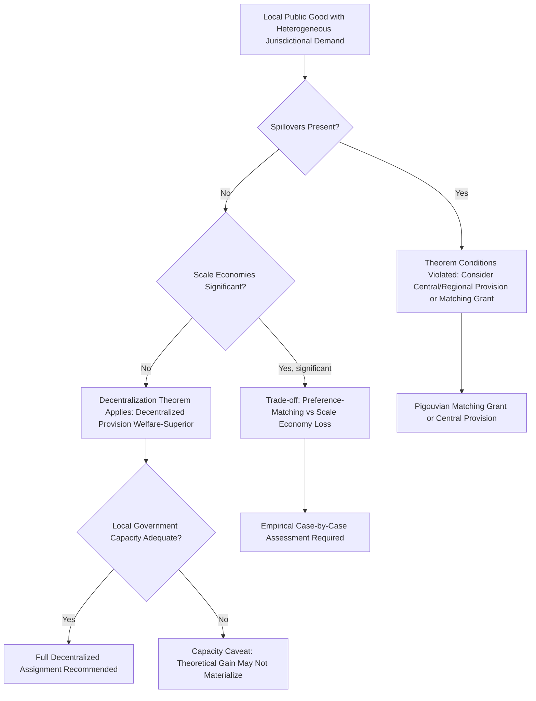

## Decentralization Theorem

### Definition and Core Concept

The Decentralization Theorem, formalized by Wallace Oates in *Fiscal Federalism* (1972), is the central normative proposition of fiscal federalism theory: for a public good whose benefits are geographically confined to sub-national jurisdictions, and whose demand varies across jurisdictions, social welfare is maximized — or at minimum, not reduced — by allowing each jurisdiction to independently determine its own efficient provision level, relative to any uniform, centrally-imposed level of provision across all jurisdictions. This proposition provides the formal efficiency foundation for decentralized public goods provision, distinct from (though complementary to) Tiebout's mobility-based sorting mechanism.

### Formal Statement (Oates, 1972)

**The Canonical Formulation**

Consider a local public good $G$ consumed by residents of two or more jurisdictions, where preferences (demand) for $G$ differ across jurisdictions due to heterogeneous tastes, income, demographics, or local conditions. Let $W_D$ denote welfare under decentralized provision (each jurisdiction sets its own level $G_i$) and $W_C$ denote welfare under centralized, uniform provision (a single level $\bar{G}$ imposed on all jurisdictions). Oates's theorem states:

$$W_D \geq W_C$$

with **strict inequality** whenever (a) jurisdictional demands for $G$ genuinely differ, and (b) there are no interjurisdictional spillovers or economies of scale in provision that would be sacrificed by decentralization. The inequality becomes an **equality** only in the degenerate case where all jurisdictions have identical demand for $G$ (in which case uniform central provision at the shared optimal level achieves the same welfare as decentralized provision).

### Mathematical Derivation

**Setup**

Suppose jurisdiction $i$ has a per-capita benefit function $B_i(G_i)$ from local public good level $G_i$, and a per-capita cost function $C(G_i)$ (assumed identical across jurisdictions for simplicity, capturing pure provision cost with no scale economies). Jurisdiction $i$'s optimal (decentralized) provision level $G_i^*$ solves:

$$\frac{\partial B_i}{\partial G_i}\bigg|_{G_i^*} = \frac{\partial C}{\partial G_i}\bigg|_{G_i^*}$$

i.e., marginal benefit equals marginal cost, separately for each jurisdiction — the standard local optimality condition.

**Centralized Uniform Provision**

Under centralization, a single national government chooses one level $\bar{G}$ to maximize aggregate welfare across all $n$ jurisdictions:

$$\max_{\bar{G}} \sum_{i=1}^{n} \left[B_i(\bar{G}) - C(\bar{G})\right]$$

yielding the first-order condition:

$$\sum_{i=1}^{n} \frac{\partial B_i}{\partial \bar{G}} = n \cdot \frac{\partial C}{\partial \bar{G}}$$

i.e., the *average* marginal benefit across jurisdictions equals marginal cost — a compromise level that generally does not equal any individual jurisdiction's true optimum $G_i^*$ unless all $B_i$ functions are identical.

**Welfare Loss from Uniformity**

For any jurisdiction $i$ whose true optimum $G_i^* \neq \bar{G}$, imposing $\bar{G}$ generates a deadweight welfare loss equal to the area between the marginal benefit and marginal cost curves over the interval between $\bar{G}$ and $G_i^*$:

$$\text{DWL}_i = \int_{\min(G_i^*, \bar{G})}^{\max(G_i^*, \bar{G})} \left| \frac{\partial B_i}{\partial G} - \frac{\partial C}{\partial G} \right| dG$$

Summing this loss across all jurisdictions whose preferences diverge from the uniform level yields the theorem's central result: decentralized, preference-matched provision strictly dominates uniform centralized provision whenever such divergence exists.

### Key Assumptions Underlying the Theorem

**Key Points**

The theorem's validity rests on several assumptions, each of which — if violated — weakens or reverses the decentralization welfare ranking:

1. **No interjurisdictional spillovers**: benefits of $G_i$ accrue exclusively to residents of jurisdiction $i$, with no externality to neighboring jurisdictions.
2. **No economies of scale in provision**: the cost function $C(G)$ is assumed identical regardless of jurisdiction size, ruling out scenarios where larger-scale (centralized) provision would be cheaper per unit.
3. **Heterogeneous preferences across jurisdictions**: if all jurisdictions had identical demand functions $B_i = B$ for all $i$, centralized uniform provision at the common optimum would achieve identical welfare to decentralization — the theorem's strict welfare *gain* specifically requires preference heterogeneity.
4. **Local governments accurately identify and act on local preferences**: the theorem assumes local governments function as effective preference-aggregation and implementation mechanisms (an assumption that abstracts from local public-choice problems, such as local political capture or principal-agent problems between local officials and residents).
5. **No differential administrative/compliance cost**: decentralized administration is assumed not to impose additional per-unit administrative overhead relative to centralized administration (an assumption often violated in practice, particularly in low-capacity local government contexts).

### Relationship to the Tiebout Model

**Distinguishing the Two Frameworks**

The Decentralization Theorem is frequently discussed alongside, but is analytically distinct from, Charles Tiebout's (1956) model of jurisdictional competition:

| Dimension | Decentralization Theorem (Oates) | Tiebout Model |
| --- | --- | --- |
| Mechanism | Local government directly sets provision to match given local preferences | Households sort themselves across existing jurisdictions by "voting with their feet" |
| Requires household mobility? | No | Yes — central to the mechanism |
| Preference revelation | Assumed known/exogenous to local government | Endogenously revealed through migration/sorting |
| Core result | Decentralized provision matches heterogeneous preferences better than uniform provision | Competitive sorting can approximate an efficient market-like equilibrium for local public goods |

**[Inference]** The two frameworks are complementary rather than competing: Tiebout provides a *mechanism* by which local preferences might come to be sorted/revealed across jurisdictions in the first place (through migration), while Oates's theorem establishes the welfare *case* for allowing decentralized governments to act on whatever preferences exist, whether revealed through Tiebout sorting, direct local political processes, or simply pre-existing demographic/economic heterogeneity across a fixed population distribution.

### Conditions That Weaken or Reverse the Theorem's Ranking

**1. Interjurisdictional Spillovers**

If jurisdiction $i$'s provision of $G_i$ generates benefits (or costs) to residents of jurisdiction $j \neq i$, decentralized provision by $i$ (optimizing only for its own residents' benefit) will generally be inefficient from the standpoint of joint welfare — under-provided if the spillover is positive (a classic externality-based underprovision result at the jurisdictional level), over-provided if the spillover is negative (e.g., pollution or congestion exported to neighboring jurisdictions).

$$G_i^{decentralized} \neq G_i^{efficient} \quad \text{when} \quad \frac{\partial B_j}{\partial G_i} \neq 0 \text{ for } j \neq i$$

This is the primary theoretical condition under which the centralization/regionalization alternative can dominate pure decentralization, and motivates corrective mechanisms such as **Pigouvian matching grants** from a higher level of government, calibrated to internalize the spillover (increasing the marginal private return to the providing jurisdiction to match the true marginal social return across all affected jurisdictions).

**2. Economies of Scale**

If the cost function exhibits scale economies — $C(G)/G$ declining as jurisdiction size or aggregate provision scale increases — small jurisdictions providing independently forfeit these cost savings, and consolidated or centralized provision can achieve the same aggregate benefit at lower total resource cost, potentially outweighing the preference-matching benefit that favors decentralization. This creates an explicit **efficiency trade-off** between preference-matching gains (favoring smaller, more homogeneous jurisdictions) and scale-economy gains (favoring larger, more centralized provision) — a trade-off with no general theoretical resolution, requiring case-by-case empirical assessment of the relative magnitudes for any specific public good.

**3. Local Political Failures**

**[Inference]** The theorem's clean welfare result assumes local governments efficiently translate local preferences into provision decisions; if local political institutions are subject to capture by narrow interests, weak accountability mechanisms, or limited administrative capacity, the assumed local efficiency advantage may not materialize in practice — an empirical/institutional caveat rather than a challenge to the theorem's internal logic, but highly relevant to real-world decentralization policy design, particularly in contexts with substantial variation in local governance quality.

### Extensions and Refinements in the Literature

**Optimal Jurisdiction Size**

**[Inference]** A natural extension of the theorem addresses the optimal number/size of jurisdictions, balancing the preference-matching benefit of smaller, more homogeneous jurisdictions (more jurisdictions → better preference matching, since each is more internally homogeneous) against the potential loss of scale economies and increased fragmentation/coordination costs from excessive jurisdictional proliferation — this extension is more of a synthesis drawn from combining the Decentralization Theorem's logic with scale-economy considerations than a component of Oates's original 1972 formulation itself.

**The Second-Generation Fiscal Federalism Literature**

More recent scholarship (associated with authors including Weingast and Qian, often termed "second-generation fiscal federalism" or "market-preserving federalism") extends the analysis beyond Oates's original static welfare-theoretic framework to incorporate political-economy considerations: how decentralization affects the incentives facing local officials (career concerns, yardstick competition with neighboring jurisdictions, hard versus soft local budget constraints), representing a shift from asking "what is the efficient assignment given fixed institutions" toward "how does decentralization change the political and institutional incentives facing government actors themselves."

### Empirical Testing Challenges

**[Inference]** Directly testing the Decentralization Theorem empirically is difficult because it is fundamentally a comparative-welfare (counterfactual) statement — one would need to observe or credibly estimate welfare under both a decentralized and a counterfactual centralized-uniform regime for the same population, which is rarely directly observable. Most empirical fiscal federalism research instead tests related, more observable implications: whether local government spending patterns are more responsive to local demographic/preference heterogeneity than centralized programs are (indirect evidence consistent with the theorem's logic), or studies specific historical decentralization/centralization reforms as natural experiments, rather than directly estimating the theorem's welfare comparison.

### Policy Application: The Theorem as a Design Heuristic

**Key Points**

- The theorem underlies the **subsidiarity principle**: assign functions to the lowest level of government capable of effective provision, decentralizing by default unless spillovers, scale economies, or capacity constraints argue otherwise (see Assignment of Functions across Government Levels).
- It provides the theoretical foundation for treating **local public goods with contained geographic benefit and heterogeneous local demand** (parks, local roads, waste collection, local zoning) as strong candidates for decentralized assignment, while **functions with significant spillovers or scale economies** (defense, monetary policy, transboundary environmental regulation) are argued for central assignment on the theorem's own logic (since its efficiency conditions are violated for such functions).
- The theorem does *not* by itself resolve the optimal design of intergovernmental transfers, tax assignment, or the treatment of redistribution — these remain separate (though related) questions in the broader fiscal federalism literature, informed by but not directly answered by the Decentralization Theorem itself.

### Decentralization Theorem Logic Flow

### Illustrative Diagram: Welfare Loss from Uniform Central Provision (svg_diagram)

<svg xmlns="http://www.w3.org/2000/svg" viewBox="0 0 540 380">
<text x="270" y="24" font-size="15" text-anchor="middle" font-family="sans-serif" font-weight="bold">Deadweight Loss from Uniform Provision (svg_diagram)</text>
<line x1="60" y1="330" x2="500" y2="330" stroke="black" stroke-width="1.5" />
<line x1="60" y1="330" x2="60" y2="40" stroke="black" stroke-width="1.5" />
<text x="440" y="350" font-size="12" font-family="sans-serif">Quantity of G</text>
<text x="15" y="45" font-size="12" font-family="sans-serif">MB / MC</text>
<line x1="60" y1="300" x2="460" y2="60" stroke="#1a6" stroke-width="2" />
<text x="380" y="80" font-size="10" font-family="sans-serif" fill="#1a6">MB: Jurisdiction B (high demand)</text>
<line x1="60" y1="300" x2="260" y2="60" stroke="#c33" stroke-width="2" />
<text x="190" y="90" font-size="10" font-family="sans-serif" fill="#c33">MB: Jurisdiction A (low demand)</text>
<line x1="60" y1="180" x2="500" y2="180" stroke="#555" stroke-width="2" />
<text x="470" y="172" font-size="11" font-family="sans-serif" fill="#555">MC</text>
<line x1="160" y1="330" x2="160" y2="180" stroke="#c33" stroke-dasharray="3,2" />
<line x1="340" y1="330" x2="340" y2="180" stroke="#1a6" stroke-dasharray="3,2" />
<line x1="250" y1="330" x2="250" y2="180" stroke="black" stroke-dasharray="2,2" />
<text x="130" y="345" font-size="10" font-family="sans-serif" fill="#c33">G*_A</text>
<text x="320" y="345" font-size="10" font-family="sans-serif" fill="#1a6">G*_B</text>
<text x="215" y="360" font-size="10" font-family="sans-serif">Uniform central G-bar</text>
<polygon points="160,180 250,180 210,225" fill="#c33" fill-opacity="0.3" />
<polygon points="250,180 340,180 290,140" fill="#1a6" fill-opacity="0.3" />
<text x="150" y="255" font-size="9" font-family="sans-serif" fill="#c33">DWL_A (over-provided)</text>
<text x="280" y="130" font-size="9" font-family="sans-serif" fill="#1a6">DWL_B (under-provided)</text>
</svg>

### Related Topics

- Assignment of Functions across Government Levels (linked chapter topic)
- Tiebout model of jurisdictional sorting and mobility
- Second-generation fiscal federalism and political economy of decentralization
- Interjurisdictional spillovers and matching grant design
- Subsidiarity principle in comparative constitutional design
- Optimal jurisdiction size and consolidation/fragmentation trade-offs
- Local public goods versus pure/impure public goods classification
- Vertical fiscal imbalance and intergovernmental transfer systems