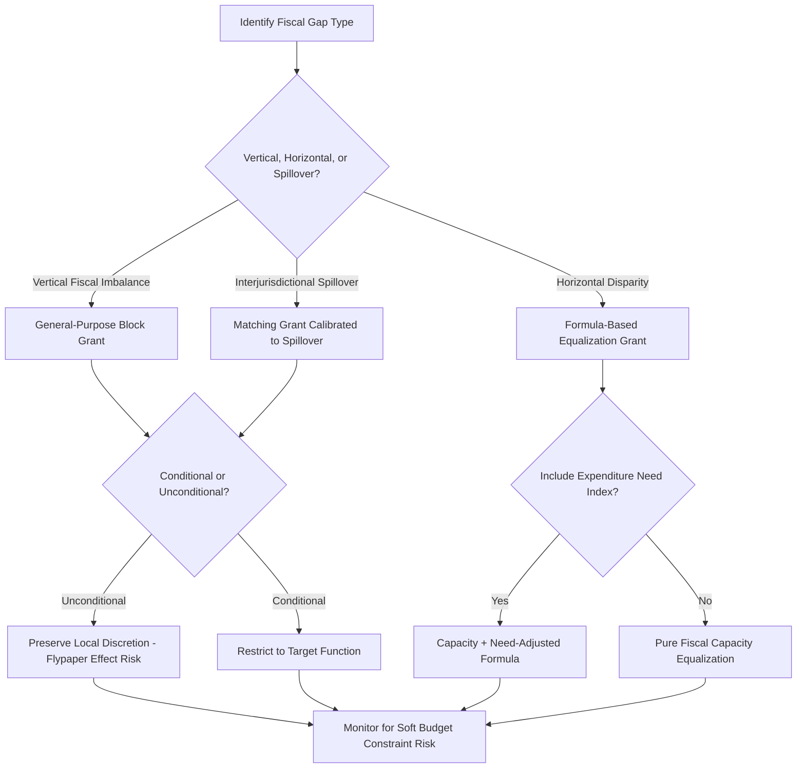

## Intergovernmental Grants and Transfers

### Definition and Core Concept

Intergovernmental grants and transfers are payments from one level of government to another (typically central-to-sub-national, though inter-municipal and state-to-local transfers also occur) designed to address structural mismatches inherent in decentralized fiscal systems: vertical fiscal imbalance (revenue-raising capacity misaligned with expenditure responsibilities), horizontal fiscal disparity (uneven fiscal capacity across jurisdictions at the same tier), and interjurisdictional externalities (spillovers requiring correction). Grant design is the primary policy instrument through which central governments influence sub-national fiscal behavior without directly overriding the functional assignment and local autonomy principles established under fiscal federalism theory.

### Rationale for Intergovernmental Transfers

**1. Correcting Vertical Fiscal Imbalance**

As established under the functional assignment problem, decentralized systems typically assign more expenditure responsibility to sub-national governments than revenue-raising capacity, since major efficient tax bases (income, VAT, corporate) are more administrable at the central level (per standard tax-assignment principles: mobile bases, redistributive bases, and bases requiring uniform national administration are best assigned centrally). This structural gap:

$$\text{VFI}_j = E_j - R_j$$

where $E_j$ is jurisdiction $j$'s assigned expenditure responsibility and $R_j$ is its own-source revenue capacity, must be closed through transfers if the assigned expenditure functions are to be actually financed.

**2. Correcting Horizontal Fiscal Disparity**

Even holding the vertical assignment fixed, jurisdictions at the same tier (e.g., states or municipalities) typically have unequal fiscal capacity (tax base per capita) and/or unequal expenditure needs (cost of providing a given service standard, driven by demographics, geography, or poverty rates). Equalization transfers address this horizontal dimension, aiming for comparable service levels across jurisdictions independent of local fiscal capacity — directly analogous to the equalization logic covered in school finance systems, but generalized across the full range of sub-national government functions rather than education specifically.

**3. Internalizing Interjurisdictional Spillovers**

As established under the Decentralization Theorem, when local provision generates benefits to non-resident jurisdictions, decentralized governments will under-provide relative to the social optimum since they do not internalize the spillover. **Matching grants** calibrated to the spillover magnitude are the standard Pigouvian correction mechanism.

**4. Achieving National Minimum Standards / Merit Good Objectives**

Central governments may wish to ensure minimum service levels for functions with national political salience or perceived merit-good status (basic education, primary healthcare, minimum infrastructure standards) even absent a strict externality or redistributive rationale, using conditional transfers as the implementation mechanism.

### Grant Typology: The Core Design Dimensions

**Dimension 1: Conditionality**

- **Unconditional (general-purpose) grants**: transferred funds can be spent at the recipient government's discretion across any function, preserving local budgetary autonomy and allowing local preference-matching consistent with Decentralization Theorem logic.
- **Conditional (categorical/earmarked) grants**: funds must be spent on a specified function or category (education, health, infrastructure), restricting local discretion in exchange for central assurance that funds serve specified national priorities.

**Dimension 2: Matching Structure**

- **Matching grants**: the central government contributes in proportion to the recipient's own spending on the function (e.g., a 1:1 or 50% match), effectively lowering the local price of the subsidized activity and stimulating additional local spending — the standard mechanism for spillover internalization, since matching directly changes the marginal incentive to provide the spillover-generating good.
- **Non-matching (block) grants**: a fixed lump-sum amount independent of the recipient's own spending level, which (under standard consumer-theory logic) operates purely through an income effect on the recipient government's budget rather than a price effect.

**Dimension 3: Open-Ended versus Closed-Ended (Capped)**

- **Open-ended matching grants**: the central government matches recipient spending without an upper limit, maximizing the price-effect stimulus but exposing the central budget to potentially large and less predictable total transfer costs.
- **Closed-ended (capped) matching grants**: matching applies only up to a specified ceiling, after which additional recipient spending receives no further match — balancing incentive effects against central fiscal predictability.

### Formal Analysis: Matching versus Block Grants

**The Median Voter / Representative Recipient Government Framework**

Model the recipient jurisdiction's government as maximizing a utility function over the local public good $G$ and a composite private/other-spending good $Y$, subject to a budget constraint. Pre-grant:

$$\max_{G,Y} U(G,Y) \quad \text{s.t.} \quad p_G \cdot G + Y = I$$

where $I$ is jurisdictional income/own-revenue and $p_G$ is the price (cost per unit) of the local public good.

**Block Grant Effect (Pure Income Effect)**

A block grant of size $g$ shifts the budget constraint outward in parallel:

$$p_G \cdot G + Y = I + g$$

Under standard assumptions, this increases consumption of both $G$ and $Y$ according to their income elasticities, with the increase in $G$ spending generally *less than* the full grant amount $g$ (since some portion is reallocated to $Y$, i.e., other spending or, in a more complete political-economy model, potentially tax relief).

**Matching Grant Effect (Price + Income Effect)**

A matching grant at rate $m$ (central government pays $m$ per unit of local spending on $G$) changes the effective price:

$$p_G(1-m) \cdot G + Y = I$$

This combines an income effect (recipient is effectively richer at any given $G$) with a substitution effect (lower relative price of $G$ induces further substitution toward $G$), theoretically generating a **larger stimulative effect on $G$-spending per dollar of central transfer** than an equivalent-cost block grant — the standard textbook prediction that matching grants are more effective than block grants at stimulating spending on the specifically subsidized function.

### The Flypaper Effect: A Central Empirical Anomaly

**Key Points**

The standard theoretical prediction described above implies that a block grant of size $g$ should be largely fungible with an equivalent increase in local private income — i.e., $g$ dollars transferred to the local government budget should have roughly the same stimulative effect on local public spending as $g$ dollars of increased local private-sector income (since in either case, local government budget constraints shift outward by the same amount, and standard theory implies the source of income should not matter to the spending allocation decision, a form of the fungibility-of-money principle).

Empirically, this prediction is **robustly violated**: block grants are consistently found to stimulate substantially *more* local public spending than an equivalent increase in local private income would predict — a phenomenon dubbed the "**flypaper effect**" (colloquially, "money sticks where it hits" — grant money tends to stay in the public sector budget rather than flowing through to tax relief or private income as basic theory would predict).

$$\frac{\partial G}{\partial g}\bigg|_{\text{grant}} > \frac{\partial G}{\partial I}\bigg|_{\text{private income}}$$

despite both being lump-sum, unconditional increases to the same aggregate budget constraint in the simplest theoretical framing.

**Proposed Explanations for the Flypaper Effect**

**[Inference — competing explanations, no fully settled consensus]**

1. **Fiscal illusion**: voters/median local taxpayers may not fully perceive the size of the grant or may misunderstand its fungibility with tax relief, allowing local officials discretion to retain grant funds in the public budget rather than passing them through as tax cuts, since voters do not effectively demand the pass-through.
2. **Bureaucratic/agenda-setting models**: local government officials (bureaucrats, agenda-setters) may have their own preferences for larger public budgets (budget-maximizing bureaucracy models, associated with Niskanen-style public choice theory) and exploit control over the budget-setting agenda to retain grant funds rather than passing them through, exploiting asymmetric information or agenda control relative to the median voter.
3. **Asymmetric treatment in political/accounting presentation**: grants may be more visibly and specifically earmarked (even if nominally unconditional) in ways that create political/administrative stickiness not present for generic private income growth.

**[Unverified]** The relative empirical support for these competing explanations remains actively debated in the public finance literature; the flypaper effect itself is one of the most robustly replicated empirical findings in the intergovernmental grants literature across many countries and time periods, but the underlying causal mechanism is less definitively established than the empirical regularity itself.

### Grant Design Decision Framework

| Objective | Recommended Grant Type | Rationale |
| --- | --- | --- |
| Correct vertical fiscal imbalance (general financing gap) | Unconditional block grant | Preserves local allocative autonomy per Decentralization Theorem logic |
| Correct horizontal fiscal disparity | Unconditional equalization grant (formula-based) | Targets fiscal capacity gap without dictating local spending priorities |
| Internalize positive spillover | Open or closed matching grant | Price-effect directly addresses the underprovision incentive problem |
| Ensure minimum national service standard | Conditional (categorical) grant, possibly with matching | Restricts discretion to guarantee spending reaches the targeted function |
| Support underdeveloped local capacity | Conditional grant with technical assistance/capacity-building components | Addresses implementation gap, not just financing gap |

### Equalization Transfer Formula Design

**Fiscal Capacity Equalization**

$$T_j = \max\left(0,\ \bar{R} - R_j\right) \times \text{Population}_j$$

where $\bar{R}$ is a reference (e.g., national average) revenue-raising capacity per capita and $R_j$ is jurisdiction $j$'s own capacity — directly parallel to the foundation-grant logic covered in school finance, generalized to the full local government budget rather than education specifically.

**Expenditure Need Equalization**

More sophisticated formulas incorporate **cost/need indices** reflecting that equal per-capita revenue does not imply equal capacity to meet service obligations if underlying costs or needs differ (e.g., a jurisdiction with a dispersed rural population faces higher per-capita service delivery costs than a dense urban jurisdiction; a jurisdiction with an older or poorer population may have higher per-capita health/social service needs):

$$T_j = (\bar{R} - R_j) \times N_j \times \text{Population}_j$$

where $N_j$ is a need/cost index for jurisdiction $j$ (often normalized to 1 at the national average), analogous to weighted student funding in school finance but applied to general local government transfers.

### Common Design Pitfalls and Political Economy Considerations

**Key Points**

- **Soft budget constraints**: If sub-national governments anticipate that fiscal shortfalls will be covered by ad hoc central bailout transfers (rather than facing hard budget constraints requiring genuine fiscal discipline), this can generate moral hazard — encouraging fiscally irresponsible sub-national behavior in anticipation of central rescue, a well-documented problem in several federal systems' historical experience with sub-national debt crises.
- **Grant formula manipulation/political targeting**: Empirical studies in various country contexts find that discretionary (non-formula-based) intergovernmental transfers are frequently correlated with political alignment between central and local governing parties or electoral competitiveness of a jurisdiction, rather than purely need/capacity-based criteria — a persistent political-economy critique of transfer systems lacking transparent, rules-based formula design.
- **Formula gaming**: If equalization formulas rely on locally-reported data (e.g., self-reported local revenue capacity or population figures) rather than independently verified metrics, jurisdictions may have incentive to misreport in ways that maximize transfer receipts, a standard information-asymmetry/incentive-compatibility problem in formula design.
- **Transfer volatility and predictability**: Transfers tied to volatile central revenue sources (e.g., natural resource revenue-sharing arrangements) can introduce fiscal instability for recipient sub-national governments, complicating multi-year budget planning — favoring formula designs with smoothing mechanisms or minimum guaranteed floors.

### Intergovernmental Transfer Design Flow

### Illustrative Diagram: Matching Grant vs Block Grant Budget Effect (svg_diagram)

<svg xmlns="http://www.w3.org/2000/svg" viewBox="0 0 540 380">
<text x="270" y="24" font-size="15" text-anchor="middle" font-family="sans-serif" font-weight="bold">Matching Grant vs Block Grant (svg_diagram)</text>
<line x1="60" y1="330" x2="500" y2="330" stroke="black" stroke-width="1.5" />
<line x1="60" y1="330" x2="60" y2="40" stroke="black" stroke-width="1.5" />
<text x="480" y="350" font-size="12" font-family="sans-serif">G (local public good)</text>
<text x="15" y="45" font-size="12" font-family="sans-serif">Y (other spending)</text>
<line x1="60" y1="300" x2="300" y2="60" stroke="#555" stroke-width="2" />
<text x="270" y="55" font-size="10" font-family="sans-serif" fill="#555">Original BC</text>
<line x1="60" y1="330" x2="360" y2="60" stroke="#1a6" stroke-width="2" stroke-dasharray="5,3" />
<text x="330" y="55" font-size="10" font-family="sans-serif" fill="#1a6">Block Grant BC (parallel shift)</text>
<line x1="60" y1="300" x2="460" y2="60" stroke="#c33" stroke-width="2" />
<text x="400" y="80" font-size="10" font-family="sans-serif" fill="#c33">Matching Grant BC (rotated, price effect)</text>
<circle cx="180" cy="200" r="4" fill="#555" />
<text x="150" y="190" font-size="9" font-family="sans-serif" fill="#555">Pre-grant choice</text>
<circle cx="230" cy="185" r="4" fill="#1a6" />
<text x="200" y="175" font-size="9" font-family="sans-serif" fill="#1a6">Block grant choice</text>
<circle cx="300" cy="155" r="4" fill="#c33" />
<text x="280" y="145" font-size="9" font-family="sans-serif" fill="#c33">Matching grant choice (larger G increase)</text>
</svg>

### Related Topics

- Assignment of Functions across Government Levels (linked chapter topic)
- Decentralization Theorem (linked chapter topic)
- Flypaper effect empirical literature and public choice explanations
- Soft budget constraints and sub-national fiscal discipline
- Tax assignment principles in federal systems
- School Finance Systems as an applied equalization-formula case (linked chapter topic)
- Fiscal illusion and voter information in local public finance
- Natural resource revenue-sharing and transfer volatility