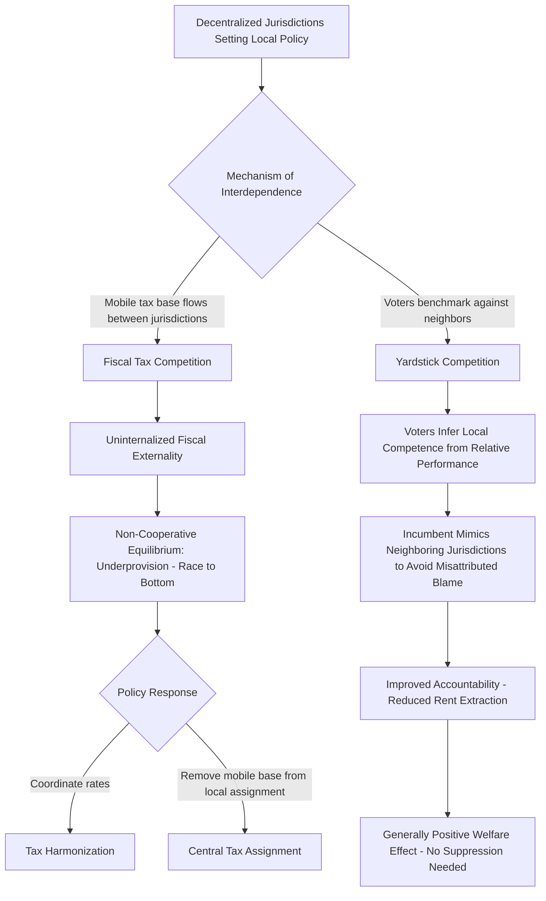

## Fiscal Competition and Yardstick Competition

### Definition and Core Concept

Fiscal competition and yardstick competition are two distinct mechanisms through which decentralized governments' policy choices become interdependent — each jurisdiction's fiscal decisions are influenced by observing or competing with other jurisdictions, rather than being set in isolation. Both phenomena generate **strategic interaction** among sub-national governments, but operate through different behavioral channels and carry sharply different normative implications:

- **Fiscal (tax) competition**: jurisdictions compete for **mobile economic resources** (capital, high-income residents, firms) by adjusting tax rates and public service provision, driven by the economic mobility of the tax base itself.
- **Yardstick competition**: voters use **neighboring jurisdictions' policy outcomes as a comparative benchmark** to evaluate their own government's performance, driven by informational/accountability mechanisms rather than resource mobility.

This distinction matters because fiscal competition is generally associated with potential efficiency *losses* (a "race to the bottom" in the standard model), while yardstick competition is generally associated with efficiency *gains* (improved accountability and reduced informational asymmetry between voters and local officials) — meaning "competition among governments" is not a unitary phenomenon with a single welfare implication, and the two mechanisms require separate theoretical treatment.

### Fiscal (Tax) Competition: Theoretical Framework

**The Basic Mechanism**

Consider $n$ jurisdictions competing for a fixed (or elastically supplied) stock of mobile capital. Each jurisdiction sets a capital tax rate $t_i$ to finance local public goods, but capital flows toward jurisdictions offering the highest after-tax return:

$$r_i(1 - t_i) = r_j(1-t_j) \quad \text{in equilibrium (capital mobility arbitrage condition)}$$

Because each jurisdiction's tax base is capital-mobility-sensitive, unilaterally raising $t_i$ above the levels set by competing jurisdictions drives capital outflow, shrinking jurisdiction $i$'s tax base — creating downward pressure on all jurisdictions' equilibrium tax rates relative to what would be chosen absent mobility.

**The Zodrow-Mieszkowski Underprovision Result**

The canonical formal result (Zodrow and Mieszkowski, 1986; related independently to Wilson's work) demonstrates that non-cooperative tax competition among jurisdictions for mobile capital leads to **inefficiently low tax rates and inefficiently low public good provision** relative to the social optimum, because each jurisdiction's tax-setting decision ignores the fiscal externality imposed on other jurisdictions:

$$\frac{\partial (\text{tax base}_j)}{\partial t_i} < 0 \quad \text{for } j \neq i$$

When jurisdiction $i$ raises $t_i$, capital flows to jurisdiction $j$, expanding $j$'s tax base — a positive fiscal externality on $j$ that jurisdiction $i$ does not internalize when setting its own rate. Since each jurisdiction under-weights this externality (it only cares about its own revenue/welfare, not the effect on competitors), the non-cooperative Nash equilibrium features **tax rates set too low and public goods under-provided relative to the cooperative (coordinated) optimum**.

$$MB_i(G_i) = MC_i + \underbrace{(\text{marginal cost of capital flight})}_{\text{additional term absent under immobile base}}$$

**Key Points**

- This is formally analogous to a classic prisoner's dilemma: all jurisdictions would be collectively better off coordinating on higher tax rates and correspondingly higher public good provision, but each has an individual incentive to undercut others, producing a Pareto-inferior non-cooperative equilibrium.
- The "race to the bottom" terminology captures this dynamic: competitive pressure drives tax rates progressively downward as jurisdictions respond to each other's rate-cutting, potentially converging toward inefficiently low public good provision economy-wide.

### Assumptions and Robustness of the Race-to-the-Bottom Result

**[Inference]** The strength of the tax competition underprovision result depends significantly on several assumptions frequently relaxed or debated in extensions of the basic model:

1. **Degree of capital/base mobility**: the result is strongest for perfectly mobile capital; with less-than-perfectly-mobile bases (due to adjustment costs, agglomeration economies, or imperfect information), the underprovision result attenuates.
2. **Benefit-tax linkage**: if local taxes are closely linked to benefits received by the mobile factor itself (a "benefit tax" framing, related to the Tiebout tradition), competition may not generate underprovision, since firms/capital are effectively paying for services they value, and competitive tax-setting can instead promote efficiency by disciplining wasteful local spending (this is sometimes termed the more optimistic "Tiebout competition" view, in contrast to the pessimistic Zodrow-Mieszkowski framing).
3. **Agglomeration economies**: New Economic Geography-influenced extensions to the tax competition literature show that when agglomeration forces (firms benefiting from proximity to other firms) are strong, jurisdictions with existing agglomeration advantages can sustain higher tax rates without triggering capital flight, since firms sacrifice agglomeration benefits by relocating — weakening the pure race-to-the-bottom prediction in already-agglomerated regions.
4. **Asymmetric jurisdiction size**: Larger jurisdictions with a larger share of the aggregate capital market may have some degree of Cournot-style market power in setting tax rates, generating equilibrium outcomes that deviate from the small-open-jurisdiction price-taking assumption of the basic model.

**[Unverified]** The empirical magnitude of tax-rate suppression attributable specifically to competitive dynamics (versus other factors driving tax policy convergence, such as ideological diffusion or common responses to shared economic shocks) is difficult to cleanly identify and remains debated across different empirical contexts and time periods studied in the literature.

### Policy Responses to Harmful Tax Competition

**Key Points**

- **Tax harmonization**: coordinating minimum tax rates or bases across jurisdictions (prominently pursued in the EU context for corporate taxation, and in the OECD-led global minimum corporate tax initiative) directly addresses the coordination-failure logic of the Zodrow-Mieszkowski model by removing jurisdictions' ability to undercut each other below an agreed floor.
- **Central government provision/financing of mobile-base-sensitive functions**: as implied by standard tax-assignment principles (see Assignment of Functions across Government Levels), assigning taxation of highly mobile bases to the central rather than sub-national level sidesteps the competition problem by construction, since a single national government does not face the same fiscal externality from a fully internal, immobile-relative-to-the-nation tax base.
- **Restricting or regulating targeted tax incentives**: some jurisdictions restrict sub-national governments' ability to offer discretionary firm-specific tax incentives (as opposed to general rate competition), aiming to reduce a particularly distortionary sub-category of tax competition sometimes termed "beggar-thy-neighbor" incentive competition.

### Yardstick Competition: Theoretical Framework

**The Informational Mechanism**

Yardstick competition, formalized principally by Besley and Case (1995) building on earlier industrial-organization yardstick-regulation concepts (Shleifer, 1985), models voters as facing an information asymmetry regarding their own local government's competence or effort: voters cannot directly observe whether high local taxes/poor service delivery reflect genuinely high costs/necessary spending, or simply local government inefficiency, rent-extraction, or incompetence.

**The Solution: Comparative Benchmarking**

Rational voters address this information problem by comparing their own jurisdiction's fiscal outcomes (tax rates, service quality) to **neighboring or otherwise comparable jurisdictions**, using the neighbor's outcome as an informative benchmark or "yardstick" for what is achievable under similar underlying cost conditions:

$$\text{Voter inference: high } t_i \text{ relative to comparable } t_j \Rightarrow \text{signal of local inefficiency/rent-extraction}$$

This generates an accountability mechanism: incumbent local officials who raise taxes or reduce services *relative to comparable neighboring jurisdictions* face a higher probability of being voted out, since voters interpret the relative deterioration as evidence of poor performance rather than exogenous cost pressure common to all jurisdictions.

**Strategic Implication for Incumbent Behavior**

Anticipating this voter inference mechanism, incumbent officials facing re-election have incentive to **mimic neighboring jurisdictions' fiscal policies** even when local conditions might otherwise justify divergence, since deviating from the "pack" (even for legitimate local reasons) risks being misinterpreted by voters as poor performance. This generates empirically observable **fiscal policy mimicking/spatial correlation** across neighboring jurisdictions' tax and spending decisions — a testable empirical signature distinguishing yardstick competition from pure coincidental common shocks.

### Distinguishing Yardstick Competition from Tax Competition Empirically

**Key Points**

Since both mechanisms predict spatially correlated fiscal policy across neighboring jurisdictions (jurisdictions' tax rates move together), a central empirical challenge in the literature is distinguishing which mechanism (if either, or both simultaneously) drives observed spatial correlation:

| Test/Evidence | Consistent with Tax Competition | Consistent with Yardstick Competition |
| --- | --- | --- |
| Mimicking stronger near elections | Not specifically predicted | Predicted — accountability pressure is election-cycle-dependent |
| Mimicking present even for immobile tax bases/services | Not predicted (requires mobile base) | Predicted (relies on informational comparison, not resource flows) |
| Term-limited incumbents (no re-election incentive) | Unaffected | Predicted to show weaker/no mimicking (no accountability pressure without re-election prospect) |
| Effect strength varies with voter information/media coverage | Not directly relevant | Predicted — better-informed voters should exhibit stronger yardstick effects |

**[Inference]** A substantial empirical literature (using variation including electoral cycle timing, incumbent term-limit status, and voter information proxies such as local media market structure) finds evidence more consistent with genuine yardstick/accountability mechanisms operating alongside, and empirically separable from, pure tax-base-mobility-driven competition — the finding that mimicking is strongest for term-eligible (not term-limited) incumbents facing re-election is frequently cited as particularly diagnostic evidence for the yardstick mechanism specifically, since pure tax competition for mobile capital would not be expected to vary with the incumbent's personal electoral status.

### Normative/Welfare Comparison

**[Inference]** This is the crucial policy-relevant distinction: fiscal competition's welfare implications are generally negative in the canonical model (inefficient underprovision via the uninternalized fiscal externality), while yardstick competition's welfare implications are generally positive (improved voter monitoring and reduced agency slack/rent-extraction by local officials, addressing a *political* market failure — asymmetric information between voters and elected officials — rather than an *economic* market failure). Policy interventions appropriate for addressing harmful tax competition (harmonization, centralizing mobile tax bases) would be counterproductive if mistakenly applied to suppress yardstick competition, since the latter serves a beneficial accountability function; correctly diagnosing which mechanism is empirically dominant in a given policy context therefore has direct and divergent policy design implications.

### Comparative Summary Table

| Dimension | Fiscal (Tax) Competition | Yardstick Competition |
| --- | --- | --- |
| Driving mechanism | Mobile tax base/capital flight | Voter information asymmetry |
| Requires resource mobility? | Yes, central to mechanism | No |
| Requires elections/accountability? | No | Yes, central to mechanism |
| Standard welfare implication | Negative (underprovision, race to bottom) | Positive (improved accountability) |
| Canonical model | Zodrow-Mieszkowski (1986) | Besley-Case (1995) |
| Policy response if problematic | Tax harmonization, central assignment of mobile bases | Generally not suppressed; may be reinforced via improved information disclosure |

### Fiscal and Yardstick Competition Mechanism Flow

### Illustrative Diagram: Tax Competition Race-to-the-Bottom (svg_diagram)

<svg xmlns="http://www.w3.org/2000/svg" viewBox="0 0 520 380">
<text x="260" y="24" font-size="15" text-anchor="middle" font-family="sans-serif" font-weight="bold">Non-Cooperative Tax Competition Equilibrium (svg_diagram)</text>
<line x1="60" y1="330" x2="480" y2="330" stroke="black" stroke-width="1.5" />
<line x1="60" y1="330" x2="60" y2="40" stroke="black" stroke-width="1.5" />
<text x="420" y="350" font-size="12" font-family="sans-serif">Jurisdiction i's Tax Rate (t_i)</text>
<text x="15" y="45" font-size="12" font-family="sans-serif">Jurisdiction j's Best Response</text>
<line x1="60" y1="290" x2="440" y2="100" stroke="#1a6" stroke-width="2" />
<text x="380" y="90" font-size="10" font-family="sans-serif" fill="#1a6">Best-response function (upward sloping - strategic complements)</text>
<circle cx="150" cy="255" r="5" fill="#c33" />
<text x="160" y="250" font-size="10" font-family="sans-serif" fill="#c33">Non-cooperative Nash equilibrium (low t)</text>
<circle cx="350" cy="140" r="5" fill="#1a6" />
<text x="290" y="125" font-size="10" font-family="sans-serif" fill="#1a6">Cooperative/coordinated optimum (higher t)</text>
<path d="M 150 255 L 320 155" stroke="black" stroke-dasharray="4,3" marker-end="url(#arrowY)" />
<text x="200" y="190" font-size="9" font-family="sans-serif">Efficiency gain from harmonization</text>
</svg>

### Related Topics

- Assignment of Functions across Government Levels (linked chapter topic)
- Zodrow-Mieszkowski model and formal tax competition theory
- Besley-Case yardstick competition and political agency models
- Tax harmonization and the OECD global minimum tax initiative
- Tiebout model and benefit-tax linkage in local finance
- New Economic Geography and agglomeration effects on tax competition
- Political agency theory and voter information asymmetry
- Intergovernmental Grants and Transfers (linked chapter topic)