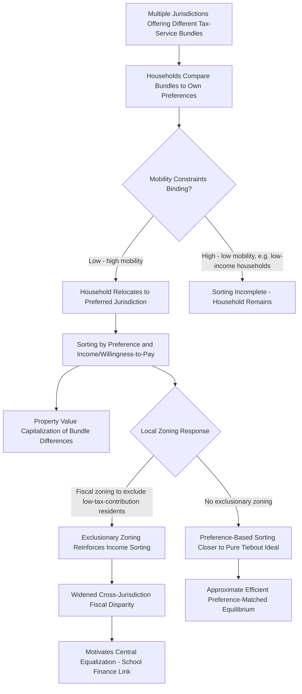

## Tiebout Sorting and Local Public Finance

### Definition and Core Concept

The Tiebout model, introduced by Charles Tiebout in his 1956 paper "A Pure Theory of Local Expenditures," proposes that household mobility across jurisdictions offering different tax-service bundles can generate an efficient, market-like allocation of local public goods — analogous to how consumer choice among differentiated products in a competitive private market generates efficient outcomes — without requiring central coordination or explicit preference revelation mechanisms (such as voting). Households effectively "vote with their feet," relocating to the jurisdiction whose tax rate and public service bundle most closely matches their preferences, and this sorting process is the mechanism by which local public goods provision can approximate efficiency despite the classic free-rider and preference-revelation problems that plague public goods provision generally.

### The Original Tiebout Framework

**Motivating Problem**

Paul Samuelson's (1954) classic treatment of public goods emphasized that, absent a market mechanism, there is no straightforward way to elicit individuals' true willingness-to-pay for public goods (since non-excludability creates free-rider incentives to understate demand). Tiebout's insight was that this problem, while real at the national level for pure public goods (like defense), may be substantially mitigated at the *local* level for goods with geographically bounded benefits, because households can reveal their preferences indirectly through **locational choice** rather than requiring direct preference elicitation.

**The Seven Idealized Assumptions**

Tiebout's original formulation relies on a set of strong idealizing assumptions, analogous in spirit to the perfect-competition assumptions underlying the First Welfare Theorem:

1. **Perfect mobility**: households can freely and costlessly relocate to whichever jurisdiction offers their preferred tax-service bundle.
2. **Full information**: households have complete knowledge of tax rates and service levels across all jurisdictions.
3. **Large number of jurisdictions**: sufficient jurisdictional variety exists to accommodate the full range of household preferences (analogous to product variety in a competitive market).
4. **No interjurisdictional employment constraints**: households can freely choose their jurisdiction of residence independent of employment location (i.e., no significant commuting-cost frictions tying residence to a fixed workplace).
5. **No spillovers between jurisdictions**: local public goods benefits are fully contained within jurisdictional boundaries.
6. **An optimal city size exists for each service bundle**: there is a well-defined jurisdiction size at which per-capita costs of providing a given service bundle are minimized (implying scale economies up to a point, then constant or increasing costs beyond it).
7. **Jurisdictions actively seek to attract an optimal population**: local governments behave as if seeking to reach the cost-minimizing population size for their chosen service bundle, analogous to firms in a competitive market seeking an efficient scale.

**Key Points**

Under this full set of idealized assumptions, the Tiebout model predicts an equilibrium in which households sort themselves into jurisdictions by preference for local public goods (and, since financing typically comes from local property or other taxes, by income/willingness-to-pay as well), with each jurisdiction converging toward its cost-minimizing population size — producing an outcome with efficiency properties formally analogous to the competitive equilibrium of a private-goods market.

### The Capitalization Mechanism

**Property Value Capitalization**

A central empirical implication and testable prediction of the Tiebout framework is that differences in local tax-service bundles become **capitalized into property values**: households bid up the price of housing in jurisdictions offering favorable tax-service combinations (low taxes relative to service quality) and bid down housing prices in jurisdictions with unfavorable combinations, since housing is the durable, immobile asset through which access to a specific jurisdiction's bundle is purchased.

$$P_{housing,j} = f(\text{Local Service Quality}_j, -\text{Local Tax Rate}_j, \text{Other Housing Characteristics})$$

**The Oates (1969) Capitalization Test**

William Oates's seminal empirical study tested this capitalization hypothesis using cross-municipality data on property values, tax rates, and school spending, finding evidence consistent with capitalization: holding other factors constant, higher local property taxes were associated with lower property values, while higher per-pupil school spending was associated with higher property values — widely regarded as foundational empirical support for the broader Tiebout framework, and a methodological template subsequently applied across many other jurisdictional and service contexts.

**[Inference]** Capitalization evidence is generally interpreted as supporting the notion that households do respond to and value local tax-service bundle differences in ways consistent with the Tiebout mechanism, though full capitalization (a one-for-one reflection of the present value of the tax-service differential in property prices) versus partial capitalization remains an empirically nuanced question, with estimated capitalization rates varying across studies and contexts rather than converging on a single universal magnitude.

### Efficiency Implications and Their Limits

**The Positive Case**

Under Tiebout's idealized conditions, the sorting equilibrium exhibits several efficiency-like properties: households achieve their preferred consumption bundle of local public goods (analogous to consumer surplus maximization in private markets), jurisdictions achieve cost-minimizing scale, and — crucially — this outcome emerges without requiring any central planner to elicit or aggregate preferences directly, since locational choice itself performs this preference-revelation function.

**Departures from the Idealized Model and Their Consequences**

**1. Imperfect Mobility**

**[Inference]** Real-world household mobility faces substantial frictions — relocation costs (financial, social, employment-related), housing market transaction costs, and information gaps regarding other jurisdictions' actual tax-service bundles — meaning the Tiebout sorting mechanism operates only partially and with meaningful lags relative to the idealized instantaneous, costless mobility assumption. Lower-income households, in particular, often face more binding mobility constraints (less capital for relocation, more location-dependent employment or social ties), which has significant implications for the equity properties of Tiebout sorting: if the wealthy can sort more freely than the poor, sorting may reinforce rather than neutrally allocate along income lines, with distributional consequences distinct from the pure efficiency story.

**2. Fiscal Zoning and Exclusionary Land-Use Regulation**

A substantial literature on the interaction between Tiebout sorting and local land-use regulation observes that jurisdictions with attractive tax-service bundles (particularly high-quality local schools financed by local property taxes) have strong fiscal incentive to use zoning regulations (minimum lot sizes, restrictions on multi-family housing) to **exclude lower-income households** who would be net fiscal drains (paying less in local property tax than they consume in service costs, particularly school costs relative to their tax contribution). This "fiscal zoning" or "exclusionary zoning" phenomenon represents a departure from Tiebout's pure preference-sorting story toward a more explicitly income/fiscal-capacity-sorting mechanism — a well-documented empirical pattern in many decentralized, locally-financed education systems (directly connecting to school finance system disparities), though the framing of this as an efficiency-supporting "homogeneity of demand" mechanism versus an equity-reducing "exclusion" mechanism reflects a genuine normative tension in the literature rather than a purely positive/descriptive dispute.

**3. Non-Optimal Jurisdiction Sizes and Scale Economy Violations**

If jurisdictions cannot freely adjust their boundaries or population (unlike Tiebout's assumption that jurisdictions actively seek an optimal size), existing political/administrative boundaries may be poorly matched to efficient service-delivery scale for various local public goods, undermining the scale-economy assumption underlying the model's efficiency claims.

**4. Interjurisdictional Spillovers**

As with the Decentralization Theorem generally, if local public goods generate spillovers across jurisdictional boundaries, the pure sorting mechanism does not internalize these externalities, and Tiebout equilibrium sorting alone does not guarantee an efficient outcome once spillovers are present — requiring the same corrective mechanisms (matching grants, regional cooperation, or central provision) discussed under fiscal federalism more broadly.

**5. Public Choice / Local Political Process Distortions**

**[Inference]** The Tiebout model implicitly assumes local governments passively and accurately supply whatever tax-service bundle attracts residents at minimum cost; in practice, local political processes (median-voter dynamics, local bureaucratic/interest-group influence, incumbent officials' own preferences) may generate local policy outcomes that diverge from the pure cost-minimizing, preference-matching ideal, introducing local public-choice frictions layered on top of the sorting mechanism itself.

### Tiebout Sorting and School Finance: A Direct Application

**[Inference]** The interaction between Tiebout sorting and locally-financed public education is one of the most extensively studied applications of the framework: because school quality is a major driver of household locational choice (heavily capitalized into property values per Oates-style evidence), and because traditional local property-tax-financed education systems tie school funding directly to local property wealth, Tiebout sorting and fiscal zoning together can generate a self-reinforcing dynamic — higher-income households sort into jurisdictions with better-funded schools (partly enabled by fiscal zoning that excludes lower-income households), further widening the local wealth gap that drives school-finance disparities discussed under school finance systems. This is frequently cited as a structural argument for state/central-level equalization intervention rather than relying purely on Tiebout-style local competition to deliver equitable educational outcomes.

### Empirical Testing Approaches

**Key Points**

Beyond the classic capitalization tests, subsequent empirical literature has tested Tiebout-consistent predictions through several additional approaches:

- **Migration/locational choice studies**: examining whether household relocation patterns are systematically correlated with local tax-service bundle characteristics, controlling for other locational determinants (employment, housing costs, amenities).
- **Community homogeneity tests**: testing whether Tiebout sorting produces increased within-jurisdiction homogeneity of preferences/demographics over time relative to a null hypothesis of random sorting, since the sorting mechanism predicts households with similar preferences for local public goods should cluster together.
- **Discrete choice / hedonic models**: more recent empirical work applies discrete-choice locational-choice models (adapting methods from industrial organization demand estimation) to more rigorously estimate household preferences for local public good bundles from observed sorting patterns, addressing some of the identification limitations of simpler capitalization regressions.

### Tiebout Model versus Decentralization Theorem: Complementary Roles

As established under the Decentralization Theorem, the two frameworks address related but distinct questions: Tiebout provides a *mechanism* (mobility-driven sorting) through which household preferences for local public goods might be revealed and jurisdictions populated accordingly, while Oates's theorem establishes the *welfare case* for allowing decentralized governments to act on heterogeneous local preferences (whether revealed through Tiebout sorting or through other means, such as direct local political processes reflecting a fixed, non-mobile population's preferences). A jurisdiction system can realize Decentralization Theorem welfare gains even with limited Tiebout mobility, so long as local governments otherwise accurately identify and act on local preferences — though in practice the two mechanisms are often discussed together as jointly supporting the case for decentralized local public goods provision.

### Tiebout Sorting Mechanism Flow

### Illustrative Diagram: Property Value Capitalization of Local Tax-Service Bundle (svg_diagram)

<svg xmlns="http://www.w3.org/2000/svg" viewBox="0 0 520 380">
<text x="260" y="24" font-size="15" text-anchor="middle" font-family="sans-serif" font-weight="bold">Capitalization of Tax-Service Bundle (svg_diagram)</text>
<line x1="60" y1="330" x2="480" y2="330" stroke="black" stroke-width="1.5" />
<line x1="60" y1="330" x2="60" y2="40" stroke="black" stroke-width="1.5" />
<text x="400" y="350" font-size="12" font-family="sans-serif">Local Service Quality (net of tax)</text>
<text x="15" y="45" font-size="12" font-family="sans-serif">Property Value</text>
<line x1="60" y1="300" x2="440" y2="80" stroke="#1a6" stroke-width="2.5" />
<text x="330" y="95" font-size="11" font-family="sans-serif" fill="#1a6">Capitalization relationship</text>
<circle cx="150" cy="255" r="5" fill="#c33" />
<text x="100" y="275" font-size="10" font-family="sans-serif" fill="#c33">Jurisdiction A: high tax, low service</text>
<circle cx="350" cy="130" r="5" fill="#555" />
<text x="280" y="115" font-size="10" font-family="sans-serif" fill="#555">Jurisdiction B: low tax, high service</text>

<text x="150" y="360" font-size="9" font-family="sans-serif">Households sort toward higher net-quality jurisdictions, bidding up property prices there</text>

</svg>

### Related Topics

- Decentralization Theorem and its relationship to Tiebout sorting (linked chapter topic)
- School Finance Systems and fiscal-zoning-driven disparities (linked chapter topic)
- Exclusionary zoning and land-use regulation economics
- Property value capitalization and hedonic pricing methodology
- Assignment of Functions across Government Levels (linked chapter topic)
- Median voter theorem and local public choice
- Residential mobility and locational discrete-choice modeling
- Fiscal Competition and Yardstick Competition (linked chapter topic)