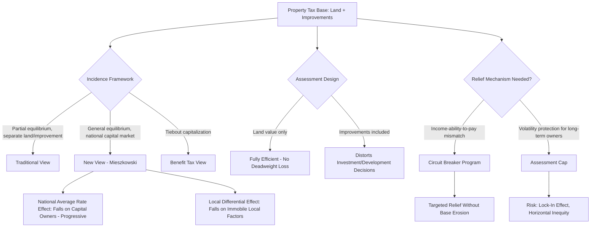

## Property Taxation and Local Government Finance

### Definition and Core Concept

The property tax — a recurring levy on the assessed value of real property (land and improvements) — is the dominant own-source revenue instrument for local governments across most decentralized fiscal systems, occupying a distinctive position in public finance theory precisely because it is one of the few major tax bases that is largely **immobile** (land cannot relocate in response to taxation, and structures are costly to relocate), making it uniquely well-suited to local assignment under standard tax-assignment principles even as it generates its own distinctive incidence, efficiency, and administrative challenges.

### Rationale for Local Assignment of the Property Tax

**Tax Assignment Theory Applied**

Standard normative tax-assignment principles (following Musgrave and the broader fiscal federalism literature) hold that taxes on **immobile bases** are best assigned to local governments, since immobility eliminates the fiscal externality/tax-competition problem that plagues local taxation of mobile bases (as established under fiscal and tax competition). Because land and, to a substantial extent, structures cannot relocate across jurisdictional boundaries in response to differential tax rates, local property taxation does not trigger the base-erosion race-to-the-bottom dynamic that would undermine local taxation of a genuinely mobile base like capital or high-income labor.

**The Benefit-Tax Linkage**

A complementary theoretical justification, closely connected to the Tiebout framework, frames the local property tax as an approximate **benefit tax**: property values capitalize the value of local public services (as established under Tiebout capitalization theory), so a tax on property value can be understood as, in effect, a tax on the capitalized value of the local services the property owner consumes/benefits from — creating a rough correspondence between tax payment and service benefit that is theoretically desirable on efficiency grounds (benefit taxation minimizes the excess burden associated with taxing an activity unrelated to the benefit received).

### Three Competing Views of Property Tax Incidence

**Key Points**

Public finance theory offers three principal, historically competing perspectives on who ultimately bears the economic burden of the property tax, each with different implications for equity and efficiency assessment:

**1. The Traditional (Partial Equilibrium) View**

Treats the property tax as two separable components: a tax on land (which, being in fixed supply, is borne entirely by landowners since land cannot "flee" the tax — the tax is fully capitalized into lower land values) and a tax on structures/improvements (treated as a tax on capital invested in a specific use, generally assumed to be at least partly passed forward to occupants/consumers via higher rents, similar to a general excise tax on a producible good).

**2. The "New View" (General Equilibrium, Mieszkowski 1972)**

Treats the property tax as fundamentally a **tax on capital** (structures represent capital investment), analyzed within a general equilibrium framework covering the entire national capital stock rather than a single local jurisdiction in isolation. Two components emerge:

- **Average national effect (the "profits tax" component)**: since capital is broadly mobile across the *entire national economy* (even if relatively immobile at the level of a single small local jurisdiction), a nationally-averaged property tax rate falls on capital owners generally, in proportion to their capital ownership — a progressive incidence result, since capital ownership is concentrated among higher-income households.
- **Excise/differential effect (local variation component)**: variation in property tax rates *across* jurisdictions (some jurisdictions taxing more heavily than the national average, others less) generates a local excise-tax-like effect, where capital flows away from higher-tax jurisdictions toward lower-tax jurisdictions until after-tax returns equalize, with this locally differential burden falling partly on immobile local factors (land, potentially local labor) in the higher-tax jurisdiction, and users of capital-intensive goods/services facing higher relative prices in high-tax jurisdictions.

$$\text{Total incidence} = \underbrace{\text{National average rate effect (falls on capital owners broadly - progressive)}}_{\text{"profits tax" component}} + \underbrace{\text{Local rate differential effect (falls on immobile local factors)}}_{\text{"excise tax" component}}$$

**3. The Benefit View (Tiebout-Capitalization Perspective)**

As introduced above, treats the property tax as an approximate user charge/benefit tax for local public services, in which case standard tax-incidence analysis (which typically concerns itself with the burden of a tax *not* matched by a corresponding benefit) does not directly apply in the same way — since the "burden" of the tax is, under this view, substantially offset by the value of services received, minimizing any genuine excess burden or distributional concern beyond the sorting effects covered under the Tiebout model.

**[Inference]** These three views are not necessarily mutually exclusive but rather emphasize different margins and time horizons; contemporary public finance treatments generally regard the "new view" as the most theoretically complete framework for aggregate incidence analysis, while acknowledging that the benefit-tax perspective has genuine explanatory power for the *local rate-differential* component specifically, particularly in well-functioning, Tiebout-sorted local government systems where service quality closely tracks tax payment.

### Property Tax Assessment and Administration

**The Assessment Process**

Property tax administration requires periodic valuation (assessment) of taxable property, typically conducted through:

- **Market/sales comparison approach**: valuing property based on recent comparable sales in the area.
- **Cost approach**: valuing property based on the cost to reconstruct improvements, adjusted for depreciation, plus land value.
- **Income approach**: valuing income-generating property (commercial, rental) based on capitalized expected income streams.

**Key Points**

- **Assessment ratio and effective tax rate**: the nominal statutory tax rate is applied to assessed value, which may be set at some fraction of full market value (the assessment ratio); the effective tax rate (tax liability divided by true market value) is the economically relevant burden measure, and can diverge substantially from the nominal statutory rate if assessment ratios vary across property classes or jurisdictions.
- **Assessment lag and reassessment cycles**: infrequent reassessment (common where administrative capacity is constrained, or where reassessment is politically unpopular due to visible tax increases) causes assessed values to diverge from current market values over time, generating both revenue erosion (in rising markets) and horizontal inequity (properties reassessed at different times or frequencies bear different effective tax burdens despite similar market values) — a well-documented phenomenon sometimes termed "assessment drift."
- **Fractional/differential assessment across property classes**: some systems apply different assessment ratios to different property classes (residential versus commercial versus agricultural), which is a policy choice with direct incidence and political-economy implications, effectively shifting relative tax burden across property-use categories independent of the nominal rate structure.

### Efficiency Considerations and Distortions

**Land versus Improvement Taxation**

A long-standing normative point in public finance (tracing to Henry George's single-tax proposals) holds that taxing **land value** alone is fully efficient (non-distortionary) since land supply is perfectly inelastic — a land value tax cannot be avoided by reducing the "quantity" of land supplied, meaning it generates no deadweight loss and is borne entirely by landowners at the moment of tax imposition (fully capitalized into lower land prices). By contrast, taxing **improvements/structures** does generate distortion, since it reduces the after-tax return to investing in construction/development, potentially discouraging property improvement, densification, and capital investment on taxed parcels.

**[Inference]** This distinction underlies the theoretical case for **split-rate property taxation** (taxing land value at a higher rate than improvement value, or a pure land value tax), which several jurisdictions have experimented with to varying degrees; the efficiency case is relatively well-established in pure theory, but practical implementation faces significant administrative challenges (separately and accurately assessing land value apart from improvement value is considerably more complex than assessing total property value as a single figure), which likely explains why pure land value taxation remains relatively rare in practice despite its favorable efficiency properties in the standard theoretical model.

### Property Tax Relief Mechanisms and Their Trade-offs

**Key Points**

- **Homestead exemptions**: reduce assessed value for owner-occupied primary residences, providing relief but narrowing the effective tax base and shifting relative burden toward non-exempt property (commercial, rental, non-primary-residence).
- **Circuit breaker programs**: provide tax relief calibrated to household income (property tax liability capped as a percentage of income), directly addressing the equity concern that property tax burden (based on property value) may not track well with current ability-to-pay, particularly for asset-rich, income-poor households such as retirees on fixed incomes living in appreciated homes.
- **Assessment caps/limits (e.g., Proposition 13-style reforms)**: limit the rate at which assessed value can increase year-over-year regardless of market appreciation, providing predictability and protection against sudden tax increases for long-term owners, but generating well-documented **lock-in effects** (owners reluctant to sell and forfeit their low assessed-value basis, reducing housing market mobility/turnover) and horizontal inequity (long-term owners and recent purchasers of similarly valued property bear very different effective tax burdens — a phenomenon extensively studied following California's Proposition 13).
- **Tax deferral programs**: allow eligible (often elderly or low-income) homeowners to defer property tax payment, with deferred amounts collected from the estate or upon sale, addressing liquidity constraints without permanently reducing local government revenue.

### Property Tax Revenue Stability and Local Budget Implications

**Key Points**

- Property tax revenue is generally considered more **stable/less cyclically volatile** than income or sales tax revenue, since assessed values (particularly under infrequent reassessment cycles) adjust with a lag relative to real-time economic/housing market fluctuations — a feature often cited as favorable for local government budget planning and predictability, though this same lag/stability property also means property tax revenue is slower to *recover* following a housing market downturn compared to more cyclically responsive tax bases.
- **Local government reliance on property tax as a share of own-source revenue** varies substantially across countries and sub-national systems, generally correlated with the broader degree of fiscal decentralization and the specific functional assignment of expenditure responsibilities (particularly education, per school finance systems) to the local tier.

### Property Taxation, Tiebout Sorting, and School Finance: Integrated View

**[Inference]** Property taxation sits at the intersection of several fiscal federalism themes covered elsewhere: its role as the primary local revenue instrument connects directly to the vertical/horizontal fiscal imbalance issues addressed by intergovernmental transfers, its capitalization properties are the empirical foundation of Tiebout sorting tests, and its use as the traditional financing mechanism for local education directly generates the fiscal capacity disparities that motivate school finance equalization reform — meaning property tax design choices (assessment methodology, relief mechanisms, rate-setting authority) have cascading implications across nearly every other fiscal federalism topic rather than being a narrowly self-contained local revenue question.

### Property Tax Incidence and Design Decision Framework

### Illustrative Diagram: Land Value Tax vs Improvement Tax Efficiency (svg_diagram)

<svg xmlns="http://www.w3.org/2000/svg" viewBox="0 0 540 380">
<text x="270" y="24" font-size="15" text-anchor="middle" font-family="sans-serif" font-weight="bold">Land Tax vs Improvement Tax Efficiency (svg_diagram)</text>

<text x="150" y="55" font-size="12" text-anchor="middle" font-family="sans-serif" font-weight="bold">Land Value Tax</text>

<line x1="60" y1="180" x2="260" y2="180" stroke="black" stroke-width="1.5" />

<line x1="60" y1="180" x2="60" y2="70" stroke="black" stroke-width="1.5" />

<line x1="150" y1="180" x2="150" y2="70" stroke="#1a6" stroke-width="2.5" />

<text x="160" y="90" font-size="10" font-family="sans-serif" fill="#1a6">Perfectly inelastic supply</text>

<text x="130" y="200" font-size="10" font-family="sans-serif">Land quantity fixed</text>

<text x="90" y="215" font-size="10" font-family="sans-serif" fill="#c33">Tax fully capitalized, no DWL</text>

<text x="410" y="55" font-size="12" text-anchor="middle" font-family="sans-serif" font-weight="bold">Improvement Tax</text>

<line x1="330" y1="180" x2="530" y2="180" stroke="black" stroke-width="1.5" />

<line x1="330" y1="180" x2="330" y2="70" stroke="black" stroke-width="1.5" />

<line x1="330" y1="160" x2="530" y2="90" stroke="#c33" stroke-width="2.5" />

<text x="420" y="85" font-size="10" font-family="sans-serif" fill="#c33">Elastic supply (investment responsive)</text>

<text x="370" y="200" font-size="10" font-family="sans-serif">Investment quantity variable</text>

<text x="360" y="215" font-size="10" font-family="sans-serif" fill="#c33">Tax discourages improvement, DWL present</text>

</svg>

### Related Topics

- Tiebout Sorting and Local Public Finance (linked chapter topic)
- School Finance Systems and property-tax-based funding disparities (linked chapter topic)
- Mieszkowski's "new view" of property tax incidence
- Henry George and land value taxation proposals
- Assignment of Functions across Government Levels and tax-assignment principles (linked chapter topic)
- Fiscal Competition and Yardstick Competition (linked chapter topic)
- Proposition 13 and assessment-limitation reform case studies
- Circuit breaker and homestead exemption program design