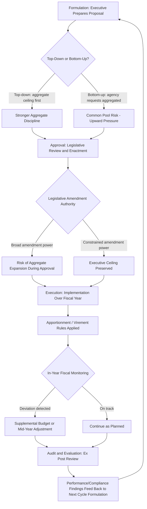

## The Government Budget Process

### Definition and Core Concept

The government budget process is the institutional sequence through which public revenue and expenditure decisions are formulated, authorized, executed, and reviewed. From a public economics perspective, the budget process is not a neutral administrative technicality but a set of institutional rules that materially shape fiscal outcomes — the sequencing of decisions, the allocation of agenda-setting power, and the rules governing amendment and enforcement all influence whether a political system produces fiscally disciplined or fiscally expansionary outcomes, independent of the underlying preferences of the electorate or legislators themselves. This is the core insight of the **budget institutions literature** in public economics, associated prominently with von Hagen, Alesina, and Perotti.

### The Four Canonical Stages of the Budget Cycle

**1. Formulation (Executive Preparation)**

The executive branch (finance ministry/department of budget and management, in consultation with line agencies) prepares a proposed budget, typically involving:

- **Revenue forecasting**: projecting expected tax and non-tax revenue under current law and proposed policy changes, usually based on macroeconomic forecasts (GDP growth, inflation, employment) fed into revenue-elasticity models.
- **Baseline/current-services estimation**: projecting the cost of continuing existing programs at current service levels before considering new policy proposals, providing a reference point against which proposed changes are measured.
- **Agency budget requests and executive review**: line agencies submit spending requests, which the central budget authority reviews, negotiates, and reconciles against fiscal targets and policy priorities, often through iterative "budget call" and ceiling-setting rounds.
- **Top-down versus bottom-up formulation**: **top-down** approaches set aggregate spending ceilings first (often derived from a medium-term fiscal framework) and allocate downward to agencies/sectors, generally associated in the literature with stronger aggregate fiscal discipline; **bottom-up** approaches aggregate individual agency requests first, which can generate upward pressure on the aggregate total absent strong central constraint — this formulation-sequencing choice is itself a budget-institution design variable with documented fiscal-outcome implications.

**2. Approval (Legislative Authorization)**

The formulated budget proposal is submitted to the legislature for review, amendment, and enactment into law. Key institutional variables at this stage include:

- **Amendment authority**: whether the legislature can freely amend the executive's proposal (increasing or reallocating spending) or is constrained to accept/reject or only reduce the executive's proposed figures — legislatures with broader amendment power face greater risk of aggregate spending expansion during this stage, absent offsetting institutional constraints.
- **Line-item versus lump-sum appropriation**: whether the legislature approves highly detailed, line-item-specific appropriations (constraining executive implementation discretion but potentially creating rigidity) or broader lump-sum/program-level appropriations (preserving executive flexibility but reducing legislative control over specific spending composition).
- **Reversionary/default outcome if no budget is passed**: the default rule that applies if the legislature fails to enact a budget by the start of the fiscal year (e.g., automatic continuation of the prior year's budget, a government shutdown, or executive authority to spend at some baseline level) significantly shapes bargaining incentives during the approval stage, since it determines each actor's fallback position if negotiations fail.

**3. Execution (Implementation)**

Once enacted, the budget is implemented by executive agencies over the fiscal year, involving:

- **Apportionment/allotment**: the practice of releasing appropriated funds to agencies in periodic tranches (monthly/quarterly) rather than as a single lump sum at the start of the fiscal year, providing the central budget authority with an ongoing tool to manage in-year fiscal developments (e.g., withholding releases if revenue underperforms projections).
- **Virement/reallocation authority**: rules governing whether and how agencies can shift funds between line items or programs during execution without seeking new legislative approval — greater virement flexibility aids adaptive implementation but can undermine the specificity of legislative appropriation intent.
- **In-year fiscal monitoring and reporting**: tracking actual revenue and expenditure against the approved budget throughout the fiscal year to detect and respond to emerging deviations (revenue shortfalls, expenditure overruns) before they compound into large end-of-year fiscal gaps.
- **Supplemental/mid-year budget adjustments**: formal processes for revising the approved budget mid-year in response to unanticipated developments (natural disasters, economic shocks, new legislative priorities), typically requiring some form of renewed legislative authorization.

**4. Audit and Evaluation (Ex Post Review)**

After the fiscal year concludes, independent audit institutions (supreme audit institutions, auditor-general offices, or equivalent) review actual expenditure and revenue outturns against the approved budget, assessing both **financial compliance** (were funds spent in accordance with appropriations and legal authority) and, in more developed evaluation frameworks, **performance/value-for-money** (did spending achieve its intended programmatic objectives). This stage closes the accountability loop and, in well-functioning systems, feeds lessons back into the next cycle's formulation stage.

### Budget Institutions and Fiscal Discipline: The Von Hagen-Alesina-Perotti Framework

**Key Points**

A substantial empirical and theoretical literature examines how the specific institutional design of the budget process (independent of the underlying political preferences of the actors involved) systematically affects fiscal outcomes, particularly deficit and debt levels. Two broad institutional archetypes are typically contrasted:

**Hierarchical/Centralized Budget Institutions**

Characterized by: strong finance-ministry authority relative to line ministries during formulation; binding, ex ante aggregate expenditure ceilings set before detailed allocation; limited legislative amendment authority (particularly limited ability to increase the aggregate total); and strong executive control over in-year execution (apportionment, virement restrictions). **[Inference]** The empirical literature associated with von Hagen and Alesina-Perotti generally finds hierarchical institutions are associated with smaller budget deficits and lower public debt accumulation, attributed to the reduced "common pool" resource problem (see below) inherent in more fragmented, less hierarchical processes.

**Collegial/Fragmented Budget Institutions**

Characterized by: more decentralized bargaining among line ministries or legislative committees with less binding ex ante aggregate constraint; broader legislative amendment authority; and more fragmented in-year execution authority spread across multiple actors. Associated in the literature with larger deficits, reflecting weaker mechanisms to internalize the aggregate fiscal cost of individually-negotiated spending increases.

### The Common Pool Resource Problem in Budgeting

**Formal Logic**

The theoretical foundation for the hierarchical-institutions-improve-discipline finding is the **common pool resource (fiscal commons) problem**: when multiple actors (line ministries, legislative committees, or coalition partners in a multi-party government) each internalize the full *benefit* of their own preferred spending program but only a fraction of the *cost* (since costs — taxation or debt — are shared across the entire general revenue pool/taxpayer base), each actor has incentive to seek a larger share of the common pool than would be collectively optimal, generating a general-fund analogue of the classic tragedy-of-the-commons overexploitation result.

$$\text{Actor } i \text{ perceives: } \frac{\partial \text{Benefit}_i}{\partial \text{Spending}_i} = \text{full}, \quad \frac{\partial \text{Cost to } i}{\partial \text{Spending}_i} = \frac{1}{n} \times \text{full cost}$$

where $n$ is the number of actors sharing the common revenue pool — the larger and more fragmented $n$ is (more coalition partners, more autonomous legislative committees, more powerful line ministries), the more severe the predicted overspending bias relative to the socially/fiscally optimal aggregate.

**Institutional Solutions**

Hierarchical budget institutions are theorized to mitigate the common pool problem by having a single actor (typically the finance minister or an equivalent central budget authority, sometimes formally termed a "fiscal entrepreneur" or "guardian" role in the literature) internalize the aggregate fiscal cost and impose binding constraints on individual actors' claims *before* detailed allocation decisions are negotiated — analogous to a Coasian solution imposing a single decision-maker's full internalization of costs and benefits to resolve what would otherwise be a dispersed-ownership externality problem.

### Fiscal Rules as a Complementary Institutional Mechanism

**Key Points**

Beyond process-design institutions, many systems supplement the budget process with explicit **fiscal rules** — numerical constraints on fiscal aggregates, typically embedded in law or constitution:

- **Balanced budget rules**: requiring the budget (or a specified sub-component) to balance over a fiscal year or business cycle.
- **Debt ceilings/limits**: capping total public debt as an absolute amount or as a ratio to GDP.
- **Expenditure rules**: capping the growth rate of aggregate or specific-category expenditure, often independent of revenue fluctuations (providing a more directly controllable policy lever than deficit-based rules, since expenditure is more directly under government control than revenue, which fluctuates with the business cycle).
- **Revenue rules**: earmarking or otherwise constraining the use of specific revenue windfalls (e.g., natural resource revenue stabilization funds).

**[Inference]** The design trade-off across these rule types generally involves balancing **simplicity and enforceability** (numerical rules are easier to monitor and enforce than more complex structural rules) against **flexibility to accommodate legitimate countercyclical fiscal policy** (rigid balanced-budget or debt-ceiling rules can be pro-cyclical, forcing spending cuts or tax increases during recessions precisely when countercyclical stimulus would be macroeconomically appropriate) — a tension frequently addressed through **structural or cyclically-adjusted balance rules** (targeting the balance that would prevail at potential/trend output, allowing automatic stabilizers and discretionary countercyclical policy to operate around the structural target) or explicit escape clauses for defined emergency circumstances.

### Medium-Term Expenditure Frameworks (MTEFs)

**[Inference]** Many public financial management reform programs (particularly in developing and middle-income country contexts, promoted extensively by international financial institutions) have introduced **Medium-Term Expenditure Frameworks** — multi-year (typically 3-5 year) rolling fiscal projections and expenditure ceilings that extend the budget planning horizon beyond the single fiscal year, intended to improve the credibility of medium-term fiscal commitments, better align annual budgets with longer-term policy and investment planning, and provide a more stable planning environment for line agencies and, at the sub-national level, for local government units receiving multi-year indicative transfer allocations. The empirical evidence on MTEF implementation effectiveness varies considerably by country context and the degree to which the medium-term ceilings are genuinely binding on annual budget formulation versus serving as a largely aspirational, non-binding planning document.

### Performance-Based and Program Budgeting

**Key Points**

- **Line-item/input-based budgeting**: the traditional approach, appropriating funds by input category (personnel, supplies, capital) — provides strong compliance control but limited insight into whether spending achieves intended outcomes.
- **Program budgeting**: organizes appropriations around programs/outputs rather than input categories, intended to better link resource allocation to policy objectives and facilitate performance evaluation.
- **Performance-based budgeting**: explicitly links funding levels (or at minimum, funding review/justification) to measured performance indicators or outcomes, aiming to strengthen the ex post evaluation stage's influence on subsequent formulation decisions.
- **[Inference]** Performance-based budgeting reforms face well-documented implementation challenges, including the difficulty of constructing meaningful, gameable-resistant performance metrics for many public services (particularly those with diffuse, long-term, or difficult-to-quantify outcomes), and the political-economy reality that funding decisions often remain substantially driven by non-performance considerations (political priorities, historical baseline/incremental budgeting norms) even where performance information is formally incorporated into the process.

### Local Government Budget Process Considerations

**[Inference]** In decentralized systems where local government units prepare and execute their own budgets (subject to varying degrees of central oversight, as covered under fiscal federalism), the same institutional-design principles apply at the sub-national level, with some distinctive additional considerations: local budget credibility is often more directly tied to the timeliness and predictability of intergovernmental transfer disbursements (since transfers frequently constitute a large share of local government revenue, per the vertical fiscal imbalance discussion), local administrative capacity constraints can affect the sophistication of local revenue forecasting and multi-year planning capability, and central government budget-execution rules (apportionment schedules for transfers, reporting/audit requirements tied to transfer receipt) effectively extend central budget-process discipline mechanisms into the local government budget cycle.

### The Budget Cycle Flow

### Illustrative Diagram: Common Pool Resource Problem in Budgeting (svg_diagram)

<svg xmlns="http://www.w3.org/2000/svg" viewBox="0 0 540 380">
<text x="270" y="24" font-size="15" text-anchor="middle" font-family="sans-serif" font-weight="bold">Common Pool Resource Problem (svg_diagram)</text>
<circle cx="270" cy="190" r="80" fill="none" stroke="#555" stroke-width="2" stroke-dasharray="4,3" />
<text x="270" y="190" font-size="11" text-anchor="middle" font-family="sans-serif">Shared General Revenue Pool</text>
<rect x="60" y="60" width="90" height="50" fill="#1a6" fill-opacity="0.2" stroke="#1a6" />
<text x="105" y="90" font-size="10" text-anchor="middle" font-family="sans-serif">Ministry A</text>
<line x1="150" y1="85" x2="220" y2="150" stroke="#1a6" stroke-width="2" />
<rect x="390" y="60" width="90" height="50" fill="#c33" fill-opacity="0.2" stroke="#c33" />
<text x="435" y="90" font-size="10" text-anchor="middle" font-family="sans-serif">Ministry B</text>
<line x1="390" y1="85" x2="320" y2="150" stroke="#c33" stroke-width="2" />
<rect x="60" y="270" width="90" height="50" fill="#e8a" fill-opacity="0.2" stroke="#e8a" />
<text x="105" y="300" font-size="10" text-anchor="middle" font-family="sans-serif">Committee C</text>
<line x1="150" y1="270" x2="220" y2="230" stroke="#e8a" stroke-width="2" />

<text x="150" y="345" font-size="10" font-family="sans-serif">Each actor claims full benefit, bears only 1/n of aggregate cost</text>

</svg>

### Related Topics

- Fiscal rules design (balanced budget rules, debt ceilings, expenditure rules)
- Common pool resource theory and its application to public finance
- Medium-Term Expenditure Frameworks in public financial management
- Performance-based budgeting and program evaluation methodology
- Deficits and Public Debt Sustainability (related chapter topic)
- Intergovernmental Grants and Transfers and local budget credibility (linked chapter topic)
- Supreme audit institutions and fiscal accountability mechanisms
- Political economy of legislative bargaining and coalition government budgeting