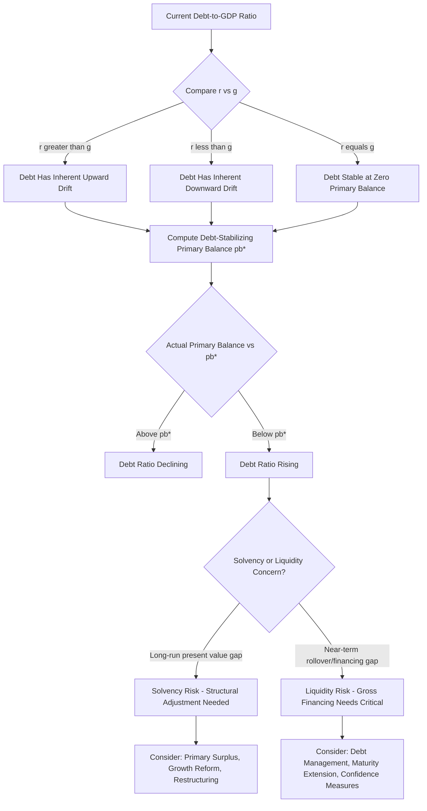

## Government Debt Dynamics and Sustainability

### Definition and Core Concept

Government debt sustainability analysis addresses whether a government's current and projected fiscal policy path is consistent with a stable or non-explosive trajectory of public debt relative to the size of the economy, and whether the government can continue to service its debt obligations without resorting to default, unsustainable monetization, or abrupt, disruptive fiscal adjustment. This is fundamentally a question about the **dynamic path** of debt over time, governed by the interaction of the primary fiscal balance, the interest rate on government debt, and the economy's growth rate — not simply a static assessment of the current debt stock.

### The Government Budget Constraint and Debt Accumulation Identity

**The Core Debt Dynamics Equation**

The government's period-by-period budget constraint links the change in debt to the fiscal balance:

$$D_t = D_{t-1}(1+i_t) - PB_t$$

where $D_t$ is the nominal debt stock at the end of period $t$, $i_t$ is the nominal interest rate on government debt, and $PB_t$ is the **primary balance** (revenue minus non-interest expenditure; a positive primary balance is a primary surplus). Rearranging and expressing as a ratio to GDP ($Y_t$) yields the canonical debt-dynamics equation:

$$\frac{D_t}{Y_t} = \frac{D_{t-1}}{Y_{t-1}} \times \frac{1+i_t}{1+g_t} - \frac{PB_t}{Y_t}$$

where $g_t$ is the nominal GDP growth rate. This can be further simplified (using a first-order approximation for small $i-g$) to the widely used form:

$$d_t \approx d_{t-1}(1 + r_t - g_t) - pb_t$$

where $d_t = D_t/Y_t$ is the debt-to-GDP ratio, $r_t$ is now expressed as the real interest rate, $g_t$ is real GDP growth, and $pb_t$ is the primary balance as a share of GDP.

### The Critical Role of the Interest Rate-Growth Differential (r − g)

**Key Points**

The single most important determinant of debt dynamics, holding the primary balance fixed, is the sign and magnitude of $(r - g)$, the gap between the effective interest rate on government debt and the economy's growth rate:

- **If $r > g$**: the debt ratio has an inherent tendency to rise over time even with a balanced primary budget ($pb_t = 0$), since existing debt compounds at a rate faster than the economy (and hence the tax base) grows — requiring the government to run a **primary surplus** merely to stabilize (not reduce) the debt ratio.
- **If $r < g$**: the debt ratio has an inherent tendency to *fall* over time even with a primary deficit of moderate size, since GDP growth outpaces the compounding of existing debt — the government can run a **primary deficit** up to some threshold and still see the debt ratio decline or stabilize, a condition sometimes informally described as the government "growing out of its debt."
- **If $r = g$**: the debt ratio is stable (constant) whenever the primary balance is exactly zero; any primary surplus reduces the ratio, any primary deficit increases it, in direct one-for-one correspondence with the deficit size.

**[Inference]** The empirical and policy salience of this $(r-g)$ relationship has grown substantially in recent macro-fiscal discourse, since many advanced economies experienced sustained periods where government borrowing costs were below nominal GDP growth rates, prompting reconsideration of previously conventional views about how quickly and how large a primary surplus is needed to maintain sustainable debt paths. **[Unverified]** However, $(r-g)$ is not a stable, permanently fixed parameter — it can and has shifted across different macroeconomic regimes (varying with monetary policy stance, global capital flows, and growth trends), meaning debt sustainability assessments conducted under a favorable $(r<g)$ assumption carry meaningful risk if that condition reverses, and prudent sustainability analysis typically examines outcomes under a range of $(r-g)$ scenarios rather than relying on a single point estimate.

### The Debt-Stabilizing Primary Balance

**Formal Derivation**

Setting $d_t = d_{t-1}$ (debt ratio constant) in the debt dynamics equation and solving for the required primary balance yields the **debt-stabilizing primary balance**:

$$pb^* = d_{t-1} \times \frac{r-g}{1+g}$$

This is a central practical tool in fiscal sustainability analysis: given a current debt ratio $d_{t-1}$ and assumptions about $(r-g)$, this formula directly computes the primary balance required merely to prevent the debt ratio from rising further (not to reduce it) — any primary balance below $pb^*$ implies a rising debt trajectory (holding $r$ and $g$ constant), any primary balance above $pb^*$ implies a falling trajectory.

**Example**

Consider a stylized illustration (illustrative parameters only, not drawn from any specific country's actual data): with a debt-to-GDP ratio of 80%, a real interest rate of 3%, and real GDP growth of 2%, the debt-stabilizing primary balance is approximately $0.80 \times (0.03 - 0.02)/1.02 \approx 0.78\%$ of GDP — meaning the government would need to run a primary surplus of roughly 0.78% of GDP merely to hold the debt ratio constant at 80%, with any smaller surplus (or any primary deficit) implying a rising debt-to-GDP trajectory over time under these assumed parameters.

### Debt Sustainability Analysis (DSA) Frameworks

**Standard DSA Methodology**

Institutional debt sustainability assessments (as conducted by international financial institutions and national fiscal authorities) typically involve:

1. **Baseline projection**: projecting the debt-to-GDP path forward under current policy and central macroeconomic assumptions (growth, interest rates, inflation, exchange rate for foreign-currency-denominated debt).
2. **Stress testing/scenario analysis**: examining debt-path outcomes under adverse shock scenarios (growth shocks, interest rate shocks, exchange rate depreciation for economies with significant foreign-currency debt, contingent liability realization such as state-owned enterprise or financial sector bailouts).
3. **Fan charts and probabilistic assessment**: some more sophisticated frameworks present a probability distribution of debt outcomes (rather than a single deterministic path) reflecting historical volatility in the underlying macroeconomic drivers, providing a richer picture of sustainability risk than a single baseline-plus-stress-scenario approach.
4. **Gross financing needs assessment**: examining not just the debt *stock* trajectory but near-term **gross financing needs** (the sum of the current fiscal deficit plus maturing debt requiring rollover), since a country can face an acute liquidity/rollover crisis even with a seemingly sustainable long-run debt stock trajectory, if a large volume of debt matures at an inopportune moment (e.g., during a period of market stress or loss of investor confidence).

### Distinguishing Solvency from Liquidity

**Key Points**

A crucial conceptual distinction in debt sustainability analysis:

- **Solvency**: whether the present discounted value of expected future primary surpluses is sufficient to cover the current debt stock — a longer-run, present-value-based concept, formally captured by the government's intertemporal budget constraint requiring debt to not grow faster than the discount rate indefinitely (a no-Ponzi-game condition).
- **Liquidity**: whether the government can meet its *near-term* financing needs (rolling over maturing debt, financing the current deficit) at manageable interest rates, even if it is fundamentally solvent in the longer-run present-value sense.

**[Inference]** This distinction matters significantly for crisis dynamics: a government that is arguably solvent in a long-run sense can nonetheless experience a self-fulfilling liquidity crisis if investors, for whatever reason (including pure coordination/confidence failures), become unwilling to roll over maturing debt at sustainable interest rates, forcing a sudden, sharp increase in borrowing costs that can itself push a marginally sustainable debt path into unsustainability — a dynamic explored extensively in the multiple-equilibria sovereign debt crisis literature, where investor expectations can be self-validating in either direction (a "good equilibrium" with low rates and sustained rollover, or a "bad equilibrium" with high rates and rollover crisis, both potentially consistent with the same underlying fundamentals).

### Fiscal Space and the Debt Limit Concept

**[Inference]** Related to solvency analysis, the concept of "fiscal space" attempts to characterize how much additional borrowing capacity a government has before approaching an effective debt limit — the point beyond which further debt accumulation becomes unsustainable or triggers a sharp increase in borrowing costs/rollover difficulty. Estimating this limit empirically is genuinely difficult and contested in the literature: unlike a household or firm facing a relatively well-defined creditworthiness assessment, sovereign debt limits depend on a complex, context-specific mix of institutional credibility, currency denomination of debt (own-currency versus foreign-currency debt carries meaningfully different risk profiles, since a government borrowing in its own currency retains greater capacity to inflate away real debt burdens, though this itself carries other economic costs), domestic versus foreign investor base composition, and broader macro-financial conditions — meaning any specific numerical debt-to-GDP "threshold" claimed to trigger sustainability problems should be treated with considerable caution rather than as a hard, universally applicable rule.

### Debt Reduction Strategies

**Key Points**

Where debt sustainability concerns require an active reduction strategy, the debt-dynamics equation implies several (non-mutually-exclusive) levers:

1. **Sustained primary surpluses**: the most direct fiscal-policy lever, requiring some combination of expenditure restraint and/or revenue increases sustained over multiple periods.
2. **Growth-enhancing structural reform**: raising $g$ relative to $r$ improves the debt dynamics for any given primary balance, motivating the argument that growth-enhancing public investment or structural reform can be debt-dynamics-improving even if debt-financed in the near term, provided the growth effect is sufficiently large relative to the financing cost — a claim requiring careful empirical substantiation given genuine uncertainty about the growth effects of specific policy interventions.
3. **Financial repression**: policies that reduce the effective interest rate on government debt below what a fully market-determined rate would be (regulatory requirements for domestic financial institutions to hold government debt, interest rate ceilings, capital controls limiting alternative investment options), historically used in various contexts to reduce $(r-g)$ and facilitate debt reduction, though at the cost of potential financial-sector distortion and reduced capital allocation efficiency.
4. **Unexpected inflation (for own-currency-denominated debt)**: since nominal debt obligations are fixed in currency terms, unanticipated inflation erodes the real value of outstanding debt, functioning as an implicit partial default on debt-holders — a strategy with well-documented costs (inflation's own distortionary effects, potential loss of monetary policy credibility, and the fact that markets tend to anticipate and price in inflation risk for governments perceived as likely to pursue this strategy, raising nominal borrowing costs in advance).
5. **Explicit default or restructuring**: direct renegotiation of debt terms (haircuts on principal, maturity extension, interest rate reduction) when the debt-dynamics equation implies no politically/economically feasible combination of the above levers can restore sustainability — carrying substantial reputational costs affecting future market access and borrowing costs, extensively studied in the sovereign debt restructuring literature.

### Debt Sustainability and the Budget Process

**[Inference]** Debt sustainability analysis connects directly to the budget-institutions and fiscal-rules discussion covered under the government budget process: the common-pool-resource dynamics that generate deficit bias in fragmented budget institutions directly translate into unfavorable primary-balance outcomes relative to the debt-stabilizing benchmark discussed here, meaning institutional budget-process reform and explicit fiscal rules (debt ceilings, structural balance rules) represent complementary policy levers to the direct fiscal-adjustment strategies enumerated above — addressing the political-economy *cause* of insufficient primary balances rather than only the *symptom* of an unsustainable debt trajectory.

### Debt Dynamics Decision Framework

### Illustrative Diagram: Debt Path Under Different r-g Scenarios (svg_diagram)

<svg xmlns="http://www.w3.org/2000/svg" viewBox="0 0 540 380">
<text x="270" y="24" font-size="15" text-anchor="middle" font-family="sans-serif" font-weight="bold">Debt-to-GDP Path Under Different (r-g) Scenarios (svg_diagram)</text>
<line x1="60" y1="330" x2="500" y2="330" stroke="black" stroke-width="1.5" />
<line x1="60" y1="330" x2="60" y2="40" stroke="black" stroke-width="1.5" />
<text x="450" y="350" font-size="12" font-family="sans-serif">Time</text>
<text x="15" y="45" font-size="12" font-family="sans-serif">Debt / GDP</text>
<line x1="60" y1="200" x2="500" y2="90" stroke="#c33" stroke-width="2.5" />
<text x="380" y="85" font-size="11" font-family="sans-serif" fill="#c33">r greater than g, pb below pb* (rising)</text>
<line x1="60" y1="200" x2="500" y2="200" stroke="#555" stroke-width="2.5" stroke-dasharray="5,3" />
<text x="400" y="192" font-size="11" font-family="sans-serif" fill="#555">pb = pb* (stable)</text>
<line x1="60" y1="200" x2="500" y2="280" stroke="#1a6" stroke-width="2.5" />
<text x="380" y="295" font-size="11" font-family="sans-serif" fill="#1a6">r less than g, moderate deficit (falling)</text>
<circle cx="60" cy="200" r="4" fill="black" />
<text x="30" y="215" font-size="10" font-family="sans-serif">d_0</text>
</svg>

### Related Topics

- The Government Budget Process and fiscal rules design (linked chapter topic)
- Debt sustainability analysis methodology (IMF/World Bank frameworks)
- Multiple-equilibria sovereign debt crisis models
- Ricardian equivalence and the intertemporal government budget constraint
- Sovereign debt restructuring and default literature
- Financial repression and debt reduction historical case studies
- Fiscal space estimation and debt limit uncertainty
- Automatic stabilizers and cyclically-adjusted fiscal balance measurement