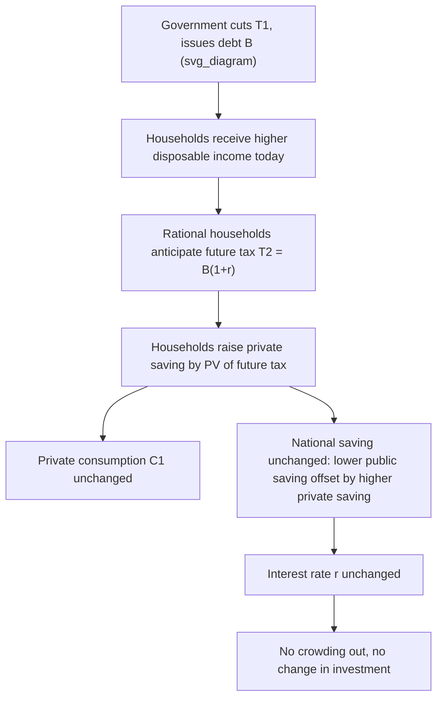

## Ricardian Equivalence

### Definition and Core Proposition

Ricardian Equivalence (RE) is the proposition that, under specific conditions, the method a government uses to finance its spending — current taxation versus debt issuance (deferred taxation) — has no effect on the real economy, including private consumption, national saving, interest rates, or aggregate demand. The theory holds that forward-looking, rational households recognize that government debt issued today implies higher future taxes of equivalent present value. Consequently, households increase private saving by exactly the amount of the tax cut (or debt-financed spending) to offset the anticipated future tax liability, leaving their planned lifetime consumption path unchanged.

The equivalence is between debt finance and tax finance: a $1 tax cut financed by government borrowing produces the same real outcomes as if the government had never cut taxes at all, because private agents "undo" the government's intertemporal reallocation through their own saving decisions.

### Historical Origins

- **David Ricardo (1820)**: In *Essay on the Funding System*, Ricardo first articulated the logical possibility that debt and tax financing could be equivalent, but he was skeptical that real households behave this way in practice, citing myopia and misperception of future liabilities.
- **Robert Barro (1974)**: In "Are Government Bonds Net Wealth?" (*Journal of Political Economy*), Barro revived and formalized the idea using an overlapping-generations framework with intergenerational altruism (operative bequests), giving rise to the modern term "Ricardian Equivalence" and the associated "Barro-Ricardo" proposition.

### The Formal Logic: Government Intertemporal Budget Constraint

Consider a two-period government budget constraint. In period 1, the government spends $G_1$ and collects taxes $T_1$, financing any shortfall with debt $B$:

$$G_1 = T_1 + B$$

In period 2, the government must repay principal and interest through taxes $T_2$:

$$T_2 = B(1+r)$$

Combining these gives the government's intertemporal budget constraint:

$$G_1 + \frac{G_2}{1+r} = T_1 + \frac{T_2}{1+r}$$

This states that the present value of government spending must equal the present value of tax revenue — the government cannot escape its budget constraint merely by shifting financing between debt and taxes; total spending still requires total future extraction of resources from the private sector.

### The Household Side: Permanent Income and Bequests

**Basic Overlapping Generations (Barro) Framework**

Barro's key insight extends the equivalence across generations. If a tax cut today implies a tax increase after the current generation dies, RE would seem to fail — the current generation could spend the windfall since they won't bear the future burden. Barro resolves this via **operative intergenerational altruism**: parents care about their children's utility and leave bequests. A parent facing a future tax liability that will fall on their children responds by increasing bequests (or reducing dissaving) by the present value of that liability, effectively making the family a single infinitely-lived decision-making unit.

**Household budget constraint under RE**

A representative household's lifetime budget constraint incorporates the government's constraint. If the household treats government bonds as **not net wealth** — because the future tax liability from the bonds exactly offsets their asset value — then a debt-financed tax cut leaves the present value of the household's lifetime resources unchanged:

$$C_1 + \frac{C_2}{1+r} = Y_1 - T_1 + \frac{Y_2 - T_2}{1+r}$$

Substituting the government's constraint shows that $(T_1, T_2)$ pairs satisfying the same present value leave the right-hand side unchanged regardless of the timing of $T_1$ versus $T_2$. Hence $C_1$ and $C_2$ are unaffected by the debt/tax mix, only by the present value of $G$.

### Diagram: The Ricardian Equivalence Mechanism

### Key Points

- **Timing irrelevance**: Only the present value of government spending matters for real allocations, not the timing of taxes used to finance it.
- **National saving invariance**: A fall in public saving (larger deficit) is exactly matched by a rise in private saving, leaving national saving $S_{national} = S_{private} + S_{public}$ constant.
- **No crowding out**: Because national saving is unchanged, there is no upward pressure on real interest rates and no crowding out of private investment — a sharp contrast with standard (non-Ricardian) deficit analysis.
- **Bonds are not net wealth**: This is the central and most-tested empirical claim — government bonds held by the public are offset one-for-one by the present value of future tax liabilities also held (implicitly) by the public.

### Required Assumptions for Ricardian Equivalence to Hold

Ricardian Equivalence is a knife-edge theoretical result that depends on a demanding set of conditions. Relaxing any one of these typically breaks strict equivalence:

1. **Perfect capital markets**: Households can borrow and lend freely at the same interest rate as the government, with no borrowing constraints or credit rationing.
2. **Rational expectations and full information**: Households correctly perceive the government's intertemporal budget constraint and anticipate future tax liabilities implied by current debt issuance.
3. **Infinite horizons or operative intergenerational altruism**: Either households live forever, or, in an OLG setting, altruistic bequest motives are operative (bequests are strictly positive) so that dynasties behave as a single infinitely-lived agent.
4. **Lump-sum taxation**: Taxes are non-distortionary (lump-sum), not distortionary taxes (e.g., labor income taxes) that alter relative prices and behavior depending on their timing.
5. **No uncertainty about future tax incidence**: Households know with certainty (or in expectation, correctly) who will bear the future tax burden and by how much.
6. **Fixed government spending path**: The path of $G$ is held constant; RE addresses only the debt-versus-tax financing margin, not changes in the level of spending.
7. **No population growth or productivity growth effects** that alter generational tax burden distribution in ways that break the altruistic link.
8. **No fiscal illusion**: Households do not misperceive or ignore future liabilities implied by current debt.

### Why Ricardian Equivalence May Fail: Empirical Departures

**Liquidity/borrowing constraints**

If a subset of households are **credit-constrained** (cannot borrow against future income), a debt-financed tax cut relaxes their constraint and increases current consumption, since they cannot otherwise smooth consumption by borrowing. This is one of the most cited real-world violations (Hubbard and Judd, 1986).

**Finite lifetimes without operative bequests**

If households lack altruistic bequest motives (or bequests are zero/corner solutions, e.g., pure life-cycle savers as in the Diamond OLG model), a tax cut today that shifts burden to future, unrelated generations represents a genuine wealth transfer to the current generation, boosting their consumption. This is the classic **Diamond (1965)** overlapping-generations critique.

**Distortionary taxation**

Real-world taxes (income, payroll, corporate) are distortionary, not lump-sum. The timing of distortionary taxes affects relative prices (e.g., the price of leisure vs. consumption across time), so tax-smoothing considerations (Barro's **tax-smoothing hypothesis**) become relevant independent of RE, and the debt/tax mix can have real efficiency effects.

**Uncertainty and myopia**

Households may not correctly anticipate future tax liabilities, discount them at a different rate than the government's borrowing rate, or exhibit bounded rationality/myopia — a critique Ricardo himself raised.

**Ricardo's own skepticism**

[Inference] Ricardo's original discussion suggested that even if the equivalence held in principle, taxpayers might behave "as if" a debt-financed war or expenditure cost less than an equivalent tax-financed one, due to failure to fully calculate the future burden — an early behavioral-economics-style objection embedded in his own essay.

### Empirical Evidence

Empirical testing of Ricardian Equivalence has produced mixed and contested results:

- **Kormendi (1983)** and early tests using aggregate consumption regressions found some support for RE, showing government bonds behaving as if they were not net wealth in consumption functions.
- **Feldstein (1982)** and others found evidence against strict RE, showing deficits are associated with reduced national saving, consistent with partial or non-Ricardian behavior.
- **Reagan tax cuts (1980s, U.S.)**: Widely cited as informal evidence against strict RE — private saving rates did not rise enough to offset the increased federal deficits, and national saving fell, though [Inference] this evidence is not universally interpreted as a clean rejection since many confounding macroeconomic factors were present concurrently.
- **Consensus view**: Most public finance economists today treat strict Ricardian Equivalence as a useful theoretical benchmark rather than an accurate empirical description, while acknowledging that **partial Ricardian effects** (some offsetting private saving response to deficits, just not 100%) are commonly found in empirical work. The degree of offset in the literature varies widely, roughly from near-zero to significant fractions, depending on specification, country, and time period. [Unverified: precise magnitude estimates vary substantially across studies and are sensitive to methodology.]

### Numerical Example

Suppose a government cuts current taxes by $100 billion, financed entirely by issuing one-year bonds at interest rate $r = 5\%$.

**Strict Ricardian household response:**

- Households anticipate a future tax increase of $100 \times (1.05) = \$105$ billion to repay principal and interest.
- Present value of the future tax liability: $\frac{105}{1.05} = \$100$ billion — exactly offsetting the current tax cut.
- Households save the entire $100 billion tax cut (e.g., by purchasing the newly issued government bonds), leaving consumption $C_1$ unchanged.
- Private saving rises by $100 billion; public saving falls by $100 billion; national saving is unchanged.

**Non-Ricardian (partial offset) household response:**

- Suppose only 40% of households are Ricardian (unconstrained, altruistic) and 60% are "rule-of-thumb" consumers who spend out of current disposable income (following Campbell and Mankiw, 1989).
- Of the $100 billion tax cut, $60 billion is consumed immediately and $40 billion is saved.
- National saving falls by $60 billion, interest rates face upward pressure, and some crowding out of investment may occur.

### Related Concept: Tax Smoothing

Distinct from but related to RE, **Barro's tax-smoothing hypothesis** argues that even without strict Ricardian Equivalence, optimal fiscal policy uses debt to smooth distortionary tax rates over time (keeping tax rates roughly constant relative to fluctuating spending needs, e.g., wartime spending), minimizing the deadweight loss from convex tax distortions. This gives debt issuance a normative role even in a world where RE does not fully hold in a wealth-effect sense.

### Ricardian Equivalence and Fiscal Policy Multipliers

The RE framework has direct implications for the government spending and tax multipliers used in macroeconomic policy analysis:

- Under strict RE, **tax-cut-financed** stimulus has **zero** effect on aggregate demand, since it is fully saved.
- Government **spending** multipliers under RE work through standard crowding-out/crowding-in channels tied to the marginal utility of government consumption relative to private consumption, not through the debt-versus-tax financing choice itself.
- This has been central to debates over the effectiveness of debt-financed fiscal stimulus (e.g., discussions surrounding the 2009 American Recovery and Reinvestment Act and various COVID-19 fiscal responses), where economists disagreed sharply on expected multiplier size partly due to differing views on the empirical relevance of RE. [Inference] The magnitude of real-world disagreement often reflects differing assumptions about the share of credit-constrained/rule-of-thumb consumers in the economy.

### Diagram: Ricardian vs. Non-Ricardian Consumption Response

<svg xmlns="http://www.w3.org/2000/svg" viewBox="0 0 760 420" font-family="Helvetica, Arial, sans-serif">
<text x="380" y="30" text-anchor="middle" font-size="18" font-weight="bold" fill="#1a1a1a">Consumption Response to a Debt-Financed Tax Cut (svg_diagram)</text>

<line x1="90" y1="360" x2="700" y2="360" stroke="#333" stroke-width="2" />
<line x1="90" y1="360" x2="90" y2="60" stroke="#333" stroke-width="2" />
<text x="400" y="400" text-anchor="middle" font-size="14" fill="#333">Time (Period 1 = tax cut, Period 2 = tax increase)</text>
<text x="40" y="210" text-anchor="middle" font-size="14" fill="#333" transform="rotate(-90 40 210)">Consumption Level</text>

<line x1="150" y1="220" x2="640" y2="220" stroke="#2166ac" stroke-width="3" stroke-dasharray="6,3" />
<text x="645" y="215" font-size="13" fill="#2166ac" font-weight="bold">Ricardian (C unchanged)</text>

<polyline points="150,220 250,150 420,150 500,280 640,220" fill="none" stroke="#b2182b" stroke-width="3" />
<text x="645" y="150" font-size="13" fill="#b2182b" font-weight="bold">Non-Ricardian</text>

<circle cx="250" cy="150" r="5" fill="#b2182b" />
<text x="250" y="130" text-anchor="middle" font-size="12" fill="#333">Tax cut: C1 rises</text>
<circle cx="500" cy="280" r="5" fill="#b2182b" />
<text x="500" y="305" text-anchor="middle" font-size="12" fill="#333">Tax hike: C2 falls</text>

<line x1="250" y1="360" x2="250" y2="355" stroke="#333" stroke-width="2" />
<text x="250" y="378" text-anchor="middle" font-size="12" fill="#333">Period 1</text>
<line x1="500" y1="360" x2="500" y2="355" stroke="#333" stroke-width="2" />
<text x="500" y="378" text-anchor="middle" font-size="12" fill="#333">Period 2</text>
</svg>

### Ricardian Equivalence in Open Economy and Growth Contexts

- **Open economies**: If debt is held partly by foreign investors, or if generations overlap with immigration/emigration, the simple closed-economy dynastic-altruism logic becomes more complex; [Inference] some models suggest RE is more likely to fail in small open economies where consumption-smoothing channels interact with international capital flows and exchange rate effects.
- **Growing economies**: With population and productivity growth, the "size" of future generations paying the tax differs from the current generation, which can weaken the exact bequest-driven offset unless bequest motives scale appropriately with family size and income growth.

### Related Debates in Public Economics

- **Deficits and generational accounting**: RE is often invoked (or rejected) in generational accounting exercises (Auerbach, Gokhale, and Kotlikoff) that attempt to measure the fiscal burden passed to future generations — the validity of these exercises' welfare implications partly hinges on whether RE-style offsetting behavior occurs.
- **Debt sustainability analysis**: Even if RE holds in the short run for a marginal debt/tax swap, it does not imply that debt levels are irrelevant for long-run solvency; the government's intertemporal budget constraint must still hold, and unsustainable debt paths raise separate default/inflation-risk concerns outside the RE framework.
- **Crowding out debates**: RE is frequently taught as the theoretical polar opposite of the "standard" (loanable funds) view in which deficits raise interest rates and crowd out investment — contrasting these two frameworks is a standard exam and policy-analysis exercise in public economics courses.

### Conclusion

Ricardian Equivalence is a foundational theoretical benchmark in public economics establishing that, under a strict set of assumptions (perfect capital markets, rational expectations, operative intergenerational altruism, lump-sum taxation), the financing mix between government debt and current taxation is irrelevant to real economic outcomes. While the assumptions underlying strict RE are widely viewed as unrealistic — due to borrowing constraints, non-altruistic finite-horizon households, and distortionary taxation — the framework remains essential for understanding the theoretical limits of fiscal policy effectiveness, structuring empirical debates on deficits and national saving, and providing the conceptual baseline against which real-world partial-offset behavior is measured.

### Related Topics

- Barro's Tax-Smoothing Hypothesis and optimal debt policy
- Overlapping Generations (OLG) Models (Diamond 1965 framework)
- Crowding Out and the Loanable Funds Market
- Generational Accounting (Auerbach-Gokhale-Kotlikoff methodology)
- Government Intertemporal Budget Constraint and Debt Sustainability
- Fiscal Multipliers under Credit-Constrained vs. Rule-of-Thumb Consumers
- Rational Expectations and Permanent Income Hypothesis (Friedman, Hall)
- Public Debt Dynamics and the Debt-to-GDP Ratio
- Distortionary vs. Lump-Sum Taxation
- Crowding-In Effects and Non-Keynesian Fiscal Contractions