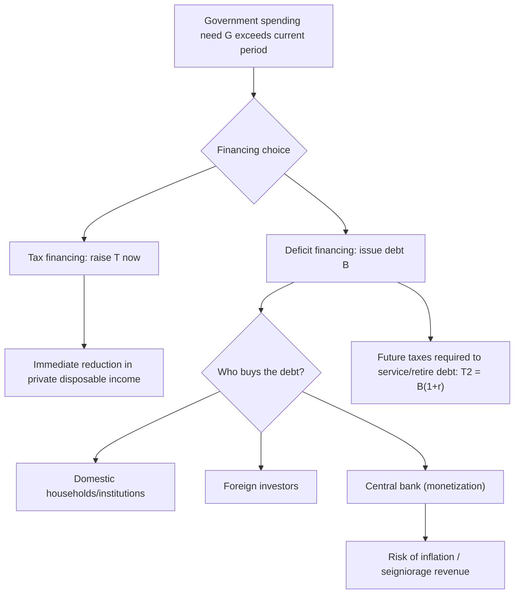

## Deficit Financing versus Tax Financing

### Definition and Core Distinction

Deficit financing and tax financing represent the two fundamental mechanisms by which a government funds its expenditures. **Tax financing** covers current government spending through contemporaneous tax collection, balancing the budget in the current period. **Deficit financing** covers current spending by borrowing (issuing government debt) when expenditures exceed tax revenue, deferring the resource extraction to future taxpayers who must service and eventually retire that debt. The choice between these two financing modes — and their macroeconomic, distributional, and intergenerational consequences — is a central question in public economics and fiscal policy design.

### The Government Budget Constraint

The government's period-by-period budget identity is:

$$G_t + rB_{t-1} = T_t + \Delta B_t$$

where $G_t$ is government spending, $r$ is the interest rate on outstanding debt, $B_{t-1}$ is debt inherited from the previous period, $T_t$ is tax revenue, and $\Delta B_t = B_t - B_{t-1}$ is new borrowing (the deficit, excluding interest, is $G_t - T_t$).

The **primary deficit** is $G_t - T_t$ (spending net of interest payments minus taxes). The **total (fiscal) deficit** includes interest obligations: $G_t + rB_{t-1} - T_t$.

The government's **intertemporal budget constraint**, obtained by iterating forward and imposing a no-Ponzi-game (transversality) condition, requires:

$$B_0 = \sum_{t=1}^{\infty} \frac{T_t - G_t}{(1+r)^t}$$

This states that initial debt must equal the present value of all future primary surpluses — the fundamental long-run constraint that links deficit financing today to tax financing (surpluses) in the future.

### Mechanisms of Each Financing Mode

**Tax financing**

- Direct extraction of resources from households/firms in the current period via income, consumption, payroll, corporate, or property taxes.
- Immediately reduces private disposable income and, absent full offsetting behavior, private consumption/saving.
- No accumulation of interest-bearing liabilities; government balance sheet remains stable.

**Deficit financing**

- Government issues debt instruments (Treasury bills, notes, bonds) purchased by domestic households, financial institutions, foreign investors, or the central bank (monetization).
- Defers the tax burden to the future; interest accrues on the outstanding principal, compounding the eventual tax requirement.
- Can also be **monetized** (financed via central bank money creation) rather than financed through bond sales to the public — a distinct third margin sometimes called seigniorage financing, discussed further below.

### Diagram: Government Financing Decision Tree

### Macroeconomic Effects: Two Competing Frameworks

**1. Standard (Neoclassical/Loanable Funds) View**

Deficit financing increases the demand for loanable funds without a corresponding increase in the supply of saving, since the deficit substitutes for private saving that would otherwise flow to investment. This is predicted to:

- Raise real interest rates
- **Crowd out** private investment
- Reduce the domestic capital stock in the long run
- Potentially raise the current account deficit if foreign capital inflows finance part of the borrowing (the "twin deficits" hypothesis)

**2. Ricardian Equivalence View**

Under the conditions discussed in the Ricardian Equivalence framework (rational, forward-looking, intergenerationally altruistic households facing lump-sum taxes), deficit financing and tax financing are **fully equivalent**: households save the tax cut in anticipation of future tax liabilities, national saving is unchanged, and there is no crowding out.

**3. Keynesian Short-Run View**

In the short run, especially when the economy operates below full employment or households are liquidity-constrained, deficit-financed tax cuts or spending increases raise aggregate demand through the standard multiplier process, since a meaningful share of the population consumes out of current disposable income rather than fully internalizing the government's future budget constraint.

### Key Points: Determinants of Which Model Applies

- **Slack in the economy**: Keynesian effects are stronger when there is significant unemployment/output gap; crowding out is stronger near full employment.
- **Share of credit-constrained households**: A higher proportion of rule-of-thumb/hand-to-mouth consumers weakens Ricardian offsetting and strengthens the short-run demand effect of deficit financing.
- **Openness of the economy**: In a small open economy with high capital mobility, deficit financing may draw in foreign saving rather than raising domestic interest rates, partially insulating domestic investment from crowding out but exposing the country to external debt and current account effects.
- **Monetary policy stance**: If the central bank accommodates fiscal expansion by keeping interest rates low (or a currency board/fixed exchange rate constrains monetary response), the crowding-out channel operates differently than under an independent, inflation-targeting central bank.
- **Type of tax used if tax-financed**: Distortionary taxes (versus lump-sum) impose deadweight loss immediately, whereas the deadweight loss of debt-financed spending is deferred and depends on future distortionary tax rates.

### Intergenerational and Distributional Considerations

**Tax financing** places the burden of government spending squarely on the current generation of taxpayers. **Deficit financing** shifts some or all of the burden to future generations who must pay higher taxes (or accept lower public services) to service and repay the debt — unless Ricardian bequest behavior neutralizes this shift.

- **Benefit-tax timing alignment**: A classical normative argument (the "benefit principle" applied intertemporally) holds that deficit financing is appropriate for spending on long-lived public capital (infrastructure, education investments) that yields benefits to future generations, since those future beneficiaries should also share in paying for it — the **pay-as-you-use** or **golden rule of public finance** logic. Conversely, tax financing is considered more appropriate for current consumption-type government spending that benefits only the present generation.
- **Golden Rule of public finance**: A fiscal rule under which governments may borrow only to finance capital expenditure (investment), while current expenditure must be tax-financed — historically used (e.g., in the UK's fiscal framework in the late 1990s–2000s) to formalize this intergenerational-equity logic.
- **Debt burden vs. debt benefit**: [Inference] Whether deficit financing actually harms future generations net of benefits received depends critically on what the borrowed funds are spent on — productive public investment can raise future income enough to offset the future tax burden, while debt-financed current consumption imposes a burden with no offsetting future benefit.

### Tax Smoothing: A Normative Framework for the Financing Choice

Robert Barro's **tax-smoothing hypothesis** (1979) provides a distinct efficiency-based rationale for the deficit/tax choice, independent of Ricardian Equivalence. Since the deadweight loss (excess burden) of distortionary taxation rises more than proportionally with the tax rate (approximately quadratically for many standard tax distortions), optimal fiscal policy:

$$\min \sum_{t} \frac{1}{(1+r)^t} DWL(\tau_t) \quad \text{subject to the government's intertemporal budget constraint}$$

implies that tax rates $\tau_t$ should be kept roughly **constant over time** rather than fluctuating with year-to-year spending needs. This means:

- **Temporary spending surges** (wars, pandemics, natural disasters) should be **deficit-financed**, spreading the tax increase over many future years to keep the marginal excess burden low in any single period.
- **Permanent increases in spending** should be **tax-financed** at a correspondingly higher permanent tax rate, since borrowing merely postpones an unavoidable permanent tax increase while adding interest costs.

### Formal Tax-Smoothing Illustration

Suppose the deadweight loss from taxation is convex, e.g., $DWL(\tau) = k\tau^2$ for some constant $k > 0$. If government spending is temporarily high in period 1 ($G_1$ high) and reverts to normal in period 2 ($G_2$ low), financing entirely via taxes in period 1 requires a very high $\tau_1$, generating a disproportionately large deadweight loss due to convexity. Smoothing the tax rate across both periods (financing part of $G_1$ with debt serviced by moderately higher $\tau_2$) reduces the **sum** of deadweight losses, even though total revenue collected (in present value) is unchanged. This is the same logic as consumption-smoothing applied to the "consumption" of distortion-free tax collection.

### Monetization as a Third Financing Margin

Governments (or more precisely, consolidated government plus central bank) can also finance deficits by having the central bank purchase government debt, effectively creating money — **seigniorage** financing.

$$\text{Seigniorage} = \frac{\Delta M}{P}$$

- This generates real resources for the government without directly taxing or issuing debt to the private sector, but:
  - It risks inflation if the money creation exceeds the growth in real money demand, effectively functioning as an **inflation tax** on money holders.
  - The **inflation tax** falls disproportionately on those holding cash and fixed nominal claims, often regressive in incidence.
  - Persistent, large-scale monetization of deficits is associated with historical hyperinflation episodes (e.g., Weimar Germany 1920s, Zimbabwe 2000s, various Latin American episodes in the 1980s). [Inference] The empirical threshold at which monetization becomes destabilizing depends heavily on the credibility of monetary institutions, existing inflation expectations, and the scale/persistence of financing needs, and is not a fixed universal number.

### Comparative Table: Tax Financing vs. Deficit Financing

| Dimension | Tax Financing | Deficit Financing |
| --- | --- | --- |
| Timing of burden | Current generation | Future generation(s), unless Ricardian offset |
| Interest cost | None | Accrues on outstanding principal |
| Short-run demand effect (non-Ricardian) | Contractionary (reduces disposable income) | Expansionary (raises current disposable income/spending) |
| Effect on national saving (standard view) | Neutral to positive | Reduces national saving, raises real interest rates |
| Effect on national saving (Ricardian view) | Neutral | Neutral (offset by private saving) |
| Appropriate use (tax-smoothing logic) | Permanent spending increases | Temporary/emergency spending surges |
| Risk of inflation | Low, direct | Low if bond-financed; high if monetized |
| Intergenerational equity concern | Minimal | Significant, unless spending is on long-lived public capital |

### Public Choice and Political Economy Considerations

- **Deficit bias**: Political economy models (e.g., Alesina and Tabellini, 1990; Persson and Svensson, 1989) suggest that incumbent governments facing uncertain future electoral outcomes, or coalition governments with competing spending priorities ("common pool" problems), have a systematic incentive to over-rely on deficit financing relative to the social optimum, since debt allows current policymakers to spend without imposing the full current tax cost, shifting the political and fiscal burden onto successor governments/future taxpayers.
- **Fiscal illusion**: Voters may systematically underestimate the true cost of government spending when financed by debt rather than visible current taxes, weakening the political discipline that would otherwise constrain spending — an empirical/behavioral critique related to but distinct from strict Ricardian Equivalence.
- **Fiscal rules as a response**: Many countries adopt balanced-budget rules, debt ceilings, or structural deficit targets (e.g., the EU's Stability and Growth Pact, Chile's structural balance rule, and various U.S. state balanced-budget requirements) explicitly to counteract this deficit bias.

### Numerical Example: Comparing Financing Costs

Suppose a government needs to fund $500 billion in emergency disaster relief spending. Compare two paths over a 10-year horizon at $r = 4\%$:

**Pure tax financing**: Raise $500 billion immediately via a one-time surtax. No interest cost, but a very large one-year distortion if taxes are distortionary (e.g., a spike in marginal income tax rates), generating disproportionately high deadweight loss due to convexity of $DWL(\tau)$.

**Deficit financing with amortization**: Issue $500 billion in 10-year bonds, repaid via a smaller, permanent tax increase sufficient to cover principal and interest. Using a standard amortization formula for equal annual payments $A$:

$$A = B \cdot \frac{r(1+r)^n}{(1+r)^n - 1} = 500 \times \frac{0.04(1.04)^{10}}{(1.04)^{10}-1} \approx \$61.6 \text{ billion per year}$$

Total nominal repayment over 10 years $\approx \$616$ billion, of which $\approx \$116$ billion is interest cost — the price of smoothing the tax distortion over time. [Inference] Whether this trade-off is welfare-improving depends on the convexity of the deadweight-loss function and the discount rate assumed, consistent with the tax-smoothing framework above.

### Sustainability Constraints on Deficit Financing

Even where deficit financing is preferable for smoothing or intergenerational-equity reasons, it is bounded by long-run **debt sustainability**. The debt-to-GDP ratio evolves approximately as:

$$b_t = b_{t-1} \cdot \frac{1+r}{1+g} - s_t$$

where $b_t$ is the debt-to-GDP ratio, $g$ is the GDP growth rate, and $s_t$ is the primary surplus-to-GDP ratio. If $r > g$ (the interest rate exceeds the growth rate), the debt ratio grows automatically unless offset by sufficiently large primary surpluses — meaning continuous deficit financing without eventual tax-financed surpluses is unsustainable, reinforcing that deficit financing is fundamentally a deferral, not an avoidance, of tax financing at the aggregate level.

### Conclusion

The choice between deficit financing and tax financing is not merely a technical accounting decision but reflects deeper judgments about intergenerational equity, macroeconomic conditions, the distortionary cost of taxation over time, and political-economy incentives. Standard crowding-out models and Ricardian Equivalence represent two theoretical poles describing the macroeconomic consequences of this choice, while Barro's tax-smoothing framework offers a normative efficiency rationale independent of either extreme: use deficit financing to smooth tax distortions across temporary spending shocks, and tax financing for permanent spending commitments, all constrained by the government's long-run intertemporal budget constraint and debt sustainability requirements.

### Related Topics

- Ricardian Equivalence and the Barro-Ricardo Neutrality Proposition
- Tax Smoothing and Optimal Debt Policy (Barro 1979)
- Crowding Out and the Loanable Funds Market
- Debt Sustainability Analysis and the $r > g$ Condition
- Golden Rule of Public Finance (Capital vs. Current Expenditure)
- Seigniorage, Monetization of Deficits, and the Inflation Tax
- Twin Deficits Hypothesis (Fiscal and Current Account Deficits)
- Political Economy of Deficit Bias (Common Pool Problem)
- Fiscal Rules and Balanced-Budget Requirements
- Generational Accounting and Intergenerational Fiscal Incidence