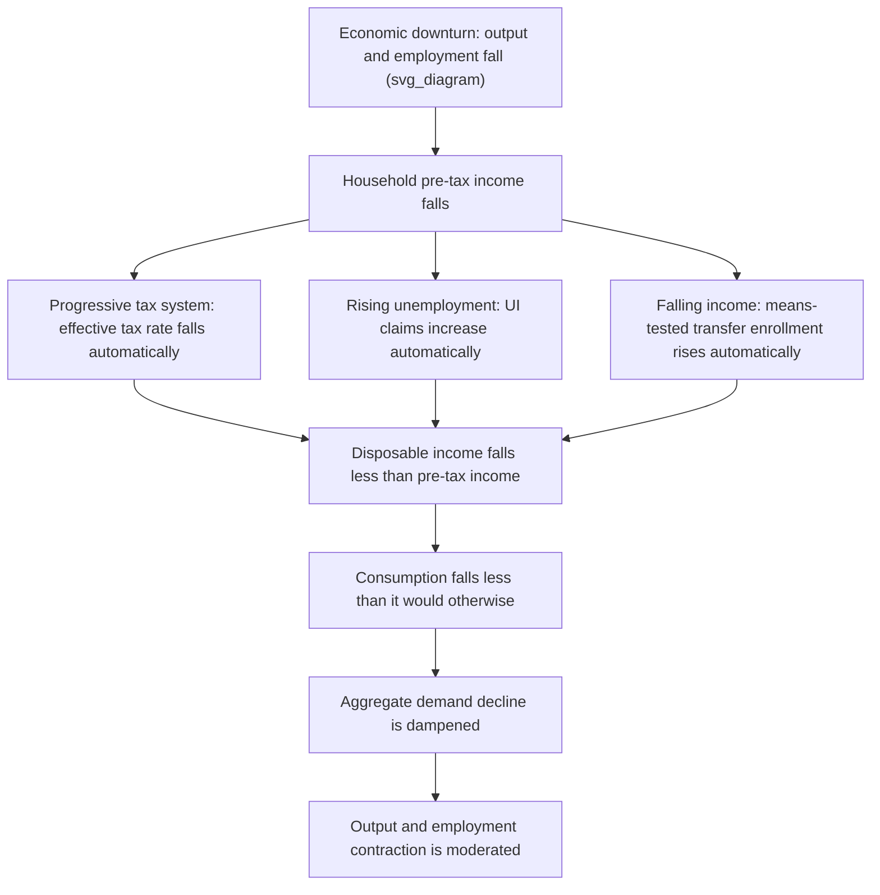

## Automatic Stabilizers and Countercyclical Fiscal Policy

### Definition and Core Concept

**Automatic stabilizers** are features of the tax-and-transfer system that automatically dampen fluctuations in aggregate demand and output over the business cycle without requiring new legislative action. They operate mechanically: tax revenues fall and transfer payments rise during downturns (cushioning the decline in disposable income and consumption), while tax revenues rise and transfers fall during expansions (moderating overheating), all through the built-in structure of existing law.

**Countercyclical fiscal policy** is the broader category encompassing both automatic stabilizers and **discretionary** fiscal actions (new legislation, such as stimulus packages or emergency spending bills) deliberately designed to lean against the business cycle. Automatic stabilizers are a subset of countercyclical policy distinguished by requiring no new policy action — they are "built-in" by design.

### Key Points: Why Automatic Stabilizers Matter

- **Speed**: They respond instantaneously and continuously as economic conditions change, avoiding the recognition, decision, and implementation lags that plague discretionary policy.
- **No political friction**: They do not require legislative approval, avoiding gridlock, negotiation delays, or the risk that stimulus arrives after the recession has already ended.
- **Symmetry**: Well-designed automatic stabilizers work in both directions — dampening booms as well as cushioning recessions — unlike much discretionary policy, which is politically easier to deploy in downturns than to withdraw in booms.
- **Reduced volatility**: By smoothing disposable income and consumption over the cycle, they reduce the amplitude of output fluctuations, improving welfare under standard consumption-smoothing assumptions.

### Primary Mechanisms of Automatic Stabilization

**1. Progressive Income Taxation**

Because marginal tax rates rise with income under a progressive tax schedule, tax revenue falls more than proportionally to income during a downturn (as taxpayers fall into lower brackets and take-home pay contracts less than pre-tax income) and rises more than proportionally during an expansion. This creates automatic countercyclical variation in disposable income relative to pre-tax income.

**2. Unemployment Insurance (UI)**

UI benefits automatically increase in aggregate as more workers become eligible and file claims during a downturn, injecting income directly to those with typically high marginal propensity to consume (MPC), and contract automatically as employment recovers.

**3. Means-Tested Transfer Programs**

Programs such as SNAP (food stamps), TANF, and Medicaid in the U.S. context automatically expand enrollment as household incomes fall below eligibility thresholds during recessions, and contract as incomes recover — functioning as an automatic income floor.

**4. Corporate Tax Receipts**

Corporate profits are highly cyclical, and since corporate tax liability is a function of profits, corporate tax revenue falls sharply in recessions (sometimes more than proportionally due to loss carryforwards and reduced profitability) and rises sharply in expansions.

**5. Social Insurance Program Automatic Adjustments**

Programs with formula-driven benefit adjustments (e.g., automatic COLA adjustments interacting with cyclical conditions, or countercyclical eligibility expansions embedded in law) provide additional automatic smoothing, though these are less purely "automatic" than UI or progressive taxation.

### Diagram: Automatic Stabilizer Transmission Mechanism

### Formal Measurement: The Automatic Stabilization Coefficient

Economists quantify the strength of automatic stabilizers using the **fiscal stabilization coefficient**, roughly defined as the fraction of an exogenous shock to pre-tax/pre-transfer income that is absorbed by the automatic response of taxes and transfers:

$$\alpha = 1 - \frac{\Delta YD}{\Delta Y}$$

where $\Delta Y$ is the change in pre-tax, pre-transfer (market) income and $\Delta YD$ is the resulting change in disposable income. A coefficient $\alpha$ closer to 1 indicates strong automatic stabilization (most of the income shock is absorbed by the tax-transfer system); $\alpha = 0$ indicates no automatic buffering.

**Empirical estimates** [Unverified: magnitudes vary by country, methodology, and time period] generally find that automatic stabilizers offset a meaningful share (often cited in the range of roughly 25–40% for many advanced economies, higher in countries with more generous social insurance systems such as much of continental Europe) of an initial income shock, though estimates differ substantially by study and country given differing tax progressivity and social insurance generosity.

### The Cyclically Adjusted (Structural) Budget Balance

To separate the automatic, cycle-driven component of the fiscal balance from deliberate discretionary policy choices, economists and institutions (IMF, OECD, CBO) construct the **cyclically adjusted budget balance (CAB)**, also called the **structural balance**:

$$CAB = B_{actual} - \varepsilon \cdot (Y - Y^*)$$

where $B_{actual}$ is the actual fiscal balance, $Y$ is actual output, $Y^*$ is potential (trend) output, and $\varepsilon$ is the elasticity of the budget balance with respect to the output gap (capturing how much of the deficit is automatically caused by output being below/above potential, versus how much reflects genuinely discretionary policy choices).

- If actual output $Y$ falls below potential $Y^*$ (a negative output gap), automatic stabilizers **mechanically** widen the observed deficit even if the government makes no new policy decisions. The CAB strips this cyclical component out, revealing the "structural" deficit that would exist at potential output.
- **Policy application**: This concept underlies fiscal rules in many jurisdictions — the EU's Stability and Growth Pact and various national fiscal rules (e.g., Germany's "debt brake"/Schuldenbremse, Switzerland's debt brake, Chile's structural balance rule) target the structural or cyclically adjusted balance rather than the headline (unadjusted) deficit, precisely to avoid forcing pro-cyclical tightening during recessions when automatic stabilizers are (correctly) widening the observed deficit.

### Automatic Stabilizers versus Discretionary Fiscal Policy

| Dimension | Automatic Stabilizers | Discretionary Fiscal Policy |
| --- | --- | --- |
| Implementation lag | None — built into existing law | Recognition, decision, and implementation lags |
| Political feasibility | High — no new legislation needed | Variable — subject to legislative gridlock |
| Symmetry (works in booms too) | Generally yes | Often asymmetric (easier to expand than contract) |
| Targeting precision | Broad, formula-based | Can be precisely targeted to specific needs/sectors |
| Size adjustability | Fixed by existing program design/parameters | Can be scaled to match shock magnitude |
| Timeliness | Immediate | Often arrives with a lag, sometimes after recovery begins |
| Examples | Progressive income tax, UI, SNAP | Stimulus checks, infrastructure bills, temporary tax rebates |

### Fiscal Policy Lags: Why Automatic Stabilizers Are Valued

Discretionary countercyclical policy faces well-documented implementation lags that automatic stabilizers avoid:

1. **Recognition lag**: Time required to identify that a downturn is occurring (often several months given data revision cycles).
2. **Decision lag**: Time required for legislative deliberation, negotiation, and passage of a fiscal response.
3. **Implementation lag**: Time required to disburse funds once legislation passes (e.g., infrastructure spending often has long project lead times).
4. **Impact lag**: Time required for fiscal actions to work through the economy and affect output/employment (transmission lag, related to but distinct from implementation).

[Inference] Because automatic stabilizers act contemporaneously with the shock (there is no recognition or decision lag, since the mechanism is triggered directly by realized income/employment changes), they are often considered more reliably timed than discretionary measures, even though their magnitude may be smaller for a given shock.

### Multiplier Effects and Marginal Propensity to Consume

The effectiveness of automatic stabilizers in dampening output fluctuations depends on the **marginal propensity to consume (MPC)** of the households receiving the automatic transfer or tax relief. Programs targeted at liquidity-constrained, lower-income households (UI, SNAP, refundable tax credits) tend to have higher fiscal multipliers than broad-based tax relief to higher-income households, because constrained households spend a larger share of any income change immediately rather than smoothing it via saving/borrowing.

A simplified Keynesian multiplier incorporating automatic stabilizers:

$$k = \frac{1}{1 - MPC(1-t) + m}$$

where $t$ is the effective marginal tax rate (capturing the automatic stabilization effect of progressive taxation) and $m$ is the marginal propensity to import. A higher $t$ **reduces** the multiplier $k$ — this is precisely the stabilizing mechanism: automatic tax progressivity dampens the size of the induced consumption response to any initial shock, reducing output volatility, though it also mechanically reduces the multiplier effect of any given discretionary stimulus.

### Design Considerations and Cross-Country Variation

- **Generosity and coverage of social insurance**: Countries with more generous, broadly covered unemployment insurance and social assistance systems (much of continental and northern Europe) tend to exhibit stronger automatic stabilization than countries with less generous, more restrictive systems, all else equal.
- **Tax system progressivity**: More steeply progressive income tax schedules generate larger automatic swings in effective tax burden relative to income changes.
- **Program design (duration, eligibility, replacement rates)**: The specific parameters of UI (benefit duration, replacement rate, eligibility criteria) directly determine the strength of this particular stabilizer; extended-benefit provisions that automatically trigger during high-unemployment periods (as in some U.S. state UI systems with extended benefits triggers) further strengthen automatic countercyclicality.
- **Federal/subnational fiscal structure**: In federations, subnational governments often face balanced-budget requirements that prevent them from running countercyclical deficits, meaning automatic stabilization is frequently concentrated at the national/federal level (relevant to U.S. state vs. federal fiscal behavior, and to debates over EU fiscal architecture given limited centralized fiscal capacity relative to member states).

### Debates and Limitations

**Efficiency versus stabilization trade-off**

[Inference] Some automatic stabilizer mechanisms, particularly high marginal tax rates or generous, long-duration UI benefits, may generate labor-supply or job-search disincentive effects that trade off against their stabilization benefits — a classic equity/efficiency and incentive-based critique explored extensively in optimal unemployment insurance design literature (e.g., Baily-Chetty framework balancing consumption-smoothing benefits against moral hazard costs).

**Insufficient magnitude during severe recessions**

Automatic stabilizers alone are often judged insufficient to fully offset large negative shocks (e.g., the 2008–09 Global Financial Crisis, the COVID-19 shock), motivating large-scale discretionary fiscal responses (American Recovery and Reinvestment Act 2009; CARES Act and subsequent COVID relief legislation 2020–21) to supplement automatic mechanisms.

**Pro-cyclical fiscal policy risk**

In some contexts — particularly emerging markets with limited access to countercyclical borrowing, or countries bound by rigid balanced-budget rules — governments may be forced into **pro-cyclical** fiscal tightening during downturns (cutting spending/raising taxes precisely when automatic stabilizers would otherwise be widening the deficit), which can exacerbate rather than dampen the cycle. This has been a recurring theme in discussions of fiscal constraints in the Eurozone periphery during the 2010–2013 sovereign debt crisis.

**Measurement uncertainty in real time**

Estimating the output gap $(Y - Y^*)$ used in cyclically adjusted balance calculations is subject to substantial real-time measurement error and frequent ex-post revision, which [Inference] can complicate the practical implementation of structural-balance-based fiscal rules, since policymakers may be uncertain in real time how much of an observed deficit is cyclical versus structural.

### Numerical Illustration

Suppose an economy experiences a shock reducing aggregate pre-tax income by $1,000 per affected household. Under a stylized tax-transfer system:

- Effective marginal tax rate $t = 30\%$: pre-tax income loss of $1,000 reduces tax liability by $300, so disposable income falls by only $700 before any transfer response.
- Newly unemployed workers receive UI replacing 50% of lost wages: for affected unemployed households, an additional $350 (50% of the remaining $700 pre-transfer loss, illustratively) is offset.
- Combined automatic stabilization absorbs roughly 65% of the initial income shock for affected households in this stylized example, leaving disposable income falling by only about $350 of the original $1,000 pre-tax/pre-transfer loss — illustrating the stabilization coefficient concept in numerical terms. [Inference] This is a simplified illustrative calculation; actual absorption rates depend on the specific tax schedule, UI replacement rate and duration, and household-specific eligibility.

### Automatic Stabilizers, Fiscal Rules, and the CAB in Practice

Institutions such as the IMF and OECD routinely publish structural balance estimates to assess whether a country's fiscal stance is expansionary or contractionary once cyclical effects are stripped out. A country running a large headline deficit during a recession may, once cyclically adjusted, show a roughly balanced or even improving structural position — indicating that the deficit is primarily attributable to automatic stabilizers rather than discretionary loosening, an important distinction for assessing fiscal sustainability and the appropriateness of the observed deficit path.

### Conclusion

Automatic stabilizers — progressive taxation, unemployment insurance, and means-tested transfers chief among them — provide a built-in, lag-free countercyclical buffer against business cycle fluctuations, smoothing disposable income and consumption without requiring new legislative action. While generally more timely and politically robust than discretionary fiscal policy, their stabilizing power is bounded by program design parameters and is often insufficient alone to counter severe recessions, necessitating complementary discretionary measures. The cyclically adjusted budget balance provides the standard analytical tool for separating automatic, cycle-driven deficits from deliberate discretionary fiscal choices, underpinning modern structural-balance-based fiscal rules designed to avoid forcing pro-cyclical austerity during downturns.

### Related Topics

- Fiscal Multipliers and Marginal Propensity to Consume
- Cyclically Adjusted (Structural) Budget Balance Methodology
- Optimal Unemployment Insurance Design (Baily-Chetty Framework)
- Fiscal Rules: Debt Brakes, Structural Balance Targets, Balanced-Budget Requirements
- Discretionary Fiscal Policy and Implementation Lags
- Pro-Cyclical vs. Countercyclical Fiscal Policy in Emerging Markets
- Ricardian Equivalence and Deficit Financing versus Tax Financing
- Tax Progressivity and Effective Marginal Tax Rates
- Federal Fiscal Federalism and Subnational Balanced-Budget Constraints
- Great Recession and COVID-19 Fiscal Policy Responses (Comparative Case Studies)